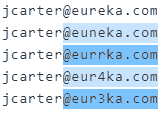
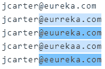

# 保护您的公司免受 CEO 欺诈的快速简单的方法

> 原文：<https://dev.to/techspence/quick-and-easy-ways-to-protect-your-company-from-ceo-fraud-2al8>

在这篇博客文章中(最初出现在我的网站上:[https://www . Spencer alessi . com/Quick-And-Easy-Ways-To-Protect-Your-Company From-CEO-Fraud](https://www.spenceralessi.com/Quick-And-Easy-Ways-To-Protect-Your-Company-From-CEO-Fraud))我将分享一个快速简单的技巧，你可以用它来保护你的公司免受两种不同类型的 CEO 欺诈。

我在这篇博文中详述的技术并不是检测这些电子邮件的唯一方法。这只是很多方法中的一种。还有。请知道这篇博文中没有什么是新的或突破性的。我不提出任何新奇的技术。在安全领域，有时检测和防范只是一些简单而繁琐的任务。这是其中一种情况。

通过使用一些正则表达式知识来了解攻击者试图做什么，您可以减少大量的 CEO 欺诈电子邮件。我希望您能从中获得一些价值，或者它能促使您以稍微不同的方式思考您的网络钓鱼检测。

**什么是 CEO 欺诈？什么是相似/拼写错误的域名？**

CEO 欺诈是一种网络钓鱼电子邮件技术，攻击者以您的会计或账单经理、CFO、HR 或其他高管为目标。攻击者将使用您的 CEO 的名字以及与您的公司相似的相似或拼写错误的电子邮件地址，以欺骗您的账单经理汇款或说服您的人力资源经理发送 W2。使用这种策略的电子邮件通常具有某种财务或员工税务记录动机。相似或拼写错误的域名是不言自明的。攻击者将试图使用看起来与您公司的域相似的域。有时这可能非常棘手！

现在，在开始之前要解决的第一件事是确保您有适当的欺骗保护措施。如果一个攻击者可以欺骗你公司的域名，这将使你的用户很难发现。所以先这么做。然后转移到这个技巧上。

# CEO 诈骗手法 1:长相相似/拼错的域名

我希望你在这里关注的是**域**,@符号之后的所有内容。在这篇博文中，我虚构的 CEO 的名字是杰克·卡特，公司邮箱是尤里卡。]com。

如果你是《syfy》的粉丝，你会知道在同名剧集中，杰克·卡特是一个名叫尤里卡(Eureka)的小镇的古怪且麻烦不断的治安官。我喜欢那个节目。这是关于一个天才的小镇，他们总是制造麻烦，炸毁东西或对小镇造成其他形式的破坏。

攻击者希望的是，你的账单经理或人力资源代表没有注意发件人的信息，看到了与首席执行官的名字相匹配的名字，浏览了一下相似/拼写错误的域名，然后继续查看电子邮件的正文。攻击者指望你的同事只是懒惰。鼓励你的用户保持警惕和警惕！

好的，这里有一个例子来说明我所说的:

```
a) Jack Carter <jcarter@eureka.com>

b) Jack Carter <jcarter@euneka.com> 
```

你能看出这两者之间的区别吗？哪个是真正的杰克·卡特？

答案是**一个**。

**相似/拼写错误的域名检测**

检测这些电子邮件的一种方法是使用正则表达式将发件人地址与 CEO 的实际电子邮件地址进行比较。

这里有一些正则表达式，可用于检测使用字母和字符替换的相似或拼写错误的域名。

*蓝色高亮文本=文本匹配正则表达式*

**字母替换**

```
@e(?:[^u]reka|u[^r]eka|ur[^e]ka|ure[^k]a|urek[^a]|eurk[^a])\.com 
```

**检测**

[](https://res.cloudinary.com/practicaldev/image/fetch/s--hr500KfM--/c_limit%2Cf_auto%2Cfl_progressive%2Cq_auto%2Cw_880/https://www.spenceralessi.com/assets/img/lettersubfake.png)

玩这个正则表达式:[https://regex101.com/r/tPVqPG/1/](https://regex101.com/r/tPVqPG/1/)

**字符替换**

```
@e(?!ureka\.com).?u.?r.?e.?k.?a\.com 
```

**检测**

[](https://res.cloudinary.com/practicaldev/image/fetch/s--Tnri_cA_--/c_limit%2Cf_auto%2Cfl_progressive%2Cq_auto%2Cw_880/https://www.spenceralessi.com/assets/img/charactersubfake.png)

玩这个正则表达式:[https://regex101.com/r/nv7uIT/1](https://regex101.com/r/nv7uIT/1)

# CEO 诈骗手法二:用你的 CEO 的名字搭配一个随机的域名

正如本节的标题所暗示的，我见过攻击者使用另一种技术。他们会使用你的 CEO 的名字，或者是他们名字的变体加上一个随机的域名。

我希望你在这里关注的是发送者姓名，即@符号之前的所有内容。同样，在这篇博文中，我虚构的 CEO 的名字是杰克·卡特，公司邮箱是尤里卡。]com。

我会在这里重复我的话，因为它太重要了..攻击者希望你的计费经理或人力资源代表没有注意到发件人的信息，看到了与首席执行官姓名相匹配的姓名，并继续发送到电子邮件正文中。攻击者指望你的同事只是懒惰。鼓励你的用户保持警惕和警惕！

好的，这里有一个例子来说明我所说的:

```
a) Jack Carter <whizbank@bankerceo.com>

b) Jack Carter <jcarter@eureka.com> 
```

你能看出这两者之间的区别吗？哪个是真正的杰克·卡特？

答案是 **b** 。

**用随机域名检测 CEO 的名字**

就像技巧 1 一样，检测这些邮件的一种方法是，这次，使用正则表达式将发件人姓名与你的 CEO 的真实姓名进行比较。

这里有一些正则表达式，可以用来检测使用字符替换的名字。

*绿色高亮文本=匹配一组正则表达式的文本*

**字符替换**

```
[jJ][aA][cC][kK]\s[cC][aA][rR][tT][eE][rR]
[jJ][aA][cC][kK]\s[aA-zZ]\s[cC][aA][rR][tT][eE][rR]
[jJ][aA][cC][kK]\s[aA-zZ][.]\s[cC][aA][rR][tT][eE][rR] 
```

您也可以将这些用|字符组合成一个正则表达式，用()包装

```
([jJ][aA][cC][kK]\s[cC][aA][rR][tT][eE][rR]|[jJ][aA][cC][kK]\s[aA-zZ]\s[cC][aA][rR][tT][eE][rR]|[jJ][aA][cC][kK]\s[aA-zZ][.]\s[cC][aA][rR][tT][eE][rR]) 
```

**检测**

[](https://res.cloudinary.com/practicaldev/image/fetch/s--edFFKDRL--/c_limit%2Cf_auto%2Cfl_progressive%2Cq_auto%2Cw_880/https://www.spenceralessi.com/assets/img/charactersubfake-ceoname.png)

玩这个正则表达式:[https://regex101.com/r/u1VvHb/1](https://regex101.com/r/u1VvHb/1)

**现在创建您的电子邮件过滤规则**

一旦你有一些正则表达式弄清楚了，现在你可以去你的电子邮件网关或任何你用来过滤电子邮件的规则，并创建一个规则，使用这些正则表达式来检测和处理这些电子邮件。我很乐意包括如何在不同平台上做到这一点的例子，但在这一点上，我只是没有访问各种平台。

* * *

关于这个话题，我目前就知道这么多。我真心希望有人，也许是一两个人能从中发现价值。如果你确实从中获得了价值，请分享它，如果我的想法激发了你自己的想法，或者如果你想继续这场对话，请在 Twitter 上联系我 [@techspence](https://twitter.com/techspence) ，我很乐意联系你！