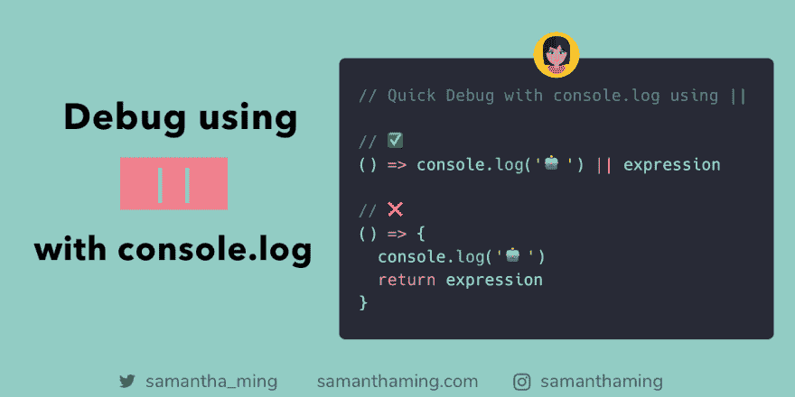

# 使用|| with console.log 进行快速调试

> 原文：<https://dev.to/samanthaming/quick-debug-using-with-console-log-59lo>

[](https://res.cloudinary.com/practicaldev/image/fetch/s--YxG8bPgy--/c_limit%2Cf_auto%2Cfl_progressive%2Cq_auto%2Cw_880/https://thepracticaldev.s3.amazonaws.com/i/hwzd7nibcdgon9r6jg6z.png)

用 console.log 调试 1 行箭头函数总是很痛苦，为什么？b/c 我们需要先把它转换成多行。不再有了！在你的表情前用`||`就好了。它输出你的`console.log`和表达式👍

清理工作轻而易举！没有更多的混乱重新转换回 1 行。把你的`console.log`拿掉就行了。你完了😆

```
// ✅
() => console.log('🤖') || expression

// ❌
() => {
  console.log('🤖')
  return expression
} 
```

## 举例

让我们看一个简单的例子来说明这是如何工作的:

```
const numbers = [1,2,3];

numbers.map(number => number * 2);

// ✅ Debug quickly by prepending with `||`
numbers.map(number => console.log(number) || number * 2);

// ❌ No need to expand it to multi line
numbers.map(number =>  {
  console.log(number);
  return number * 2;
}); 
```

## `||`如何工作？

我们经常认为`||`操作符只在条件语句中使用。然而，你也可以把它想象成一个**选择器操作符**。它总是计算两个表达式中的一个。

因为`console.log`总是返回`undefined`，这是一个 falsy 值。将始终计算第二个表达式👍

要了解更多关于`||`操作符的信息，请点击这里查看我之前的帖子

## 社区输入

### 使用逗号运算符

*[@phenax5](https://twitter.com/phenax5/status/1112212663793303552) :* 也可以用逗号运算符。用逗号分隔两个表达式，它将执行第一个表达式，然后执行第二个表达式，并返回第二个表达式。

```
a => (console.log(a), a + 5); 
```

让我把这个例子分解一下，这样两个表达式在哪里就很清楚了:

```
a => (
  console.log(a),
  a + 5
) 
```

**⚠️注意你的逗号位置**

但要确保你不会这么做。当我第一次看到他的例子时，我犯了那个错误。你不想把表达式放在`console.log`里面。如果你这样做，你的函数不会返回任何东西，也不会计算任何东西。因此，破坏了你的功能。所以要小心你的逗号 T2 的位置😅

```
a => (
  console.log(a, a + 5),
) 
```

### 使用`||`配合打字稿

如果您正在使用 TypeScript，这取决于您如何设置它。使用这种调试技术可能会给你一个错误，并阻止你的代码编译。在这种情况下，您可以使用`ts-ignore`来抑制错误。

在这种情况下使用`ts-ignore`应该没什么大不了的，因为`console.log`只是在你调试的时候暂时存在。一旦你做了，你一定要删除它。

```
// @ts-ignore: Unreachable code error
() => console.log('🤖') || expression 
```

*感谢:[@ stramel 89](https://twitter.com/stramel89/status/1112113174042546179)T3】*

## 资源

*   [MDN Web Docs: Console.log()](https://developer.mozilla.org/en-US/docs/Web/API/Console/log)
*   [MDN Web Docs:逻辑 OR ||](https://developer.mozilla.org/en-US/docs/Web/JavaScript/Reference/Operators/Logical_Operators#Logical_OR_())
*   [JavaScript 中设置默认值的 3 种方法](https://www.samanthaming.com/tidbits/52-3-ways-to-set-default-value)

* * *

**感谢阅读❤**
问好！[insta gram](https://www.instagram.com/samanthaming/)|[Twitter](https://twitter.com/samantha_ming)|[脸书](https://www.facebook.com/hisamanthaming) | [媒体](https://medium.com/@samanthaming) | [博客](https://www.samanthaming.com/blog)