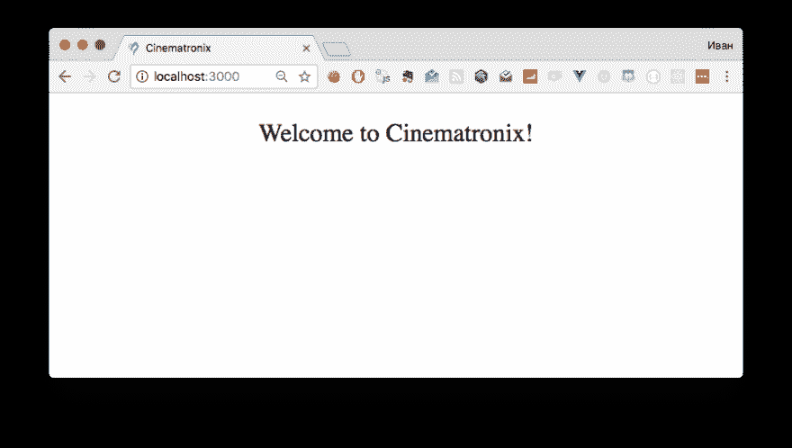

# Rails 5 & Vue.js:如何停止担忧，热爱前端

> 原文：<https://dev.to/mkdev/rails-5-vue-js-how-to-stop-worrying-and-love-the-frontend-3he2>

时代变了，真有趣。有时你开始做一些你一直拒绝做的事情，并认为没有什么能让你这样做。现在你甚至喜欢这样做。

对我个人来说，很长一段时间都不清楚前端到底是什么，把它和后端集成在一起就像一个魔术。Node 出现的时候，用 JS 写后端成为一种趋势。Angular 出现的时候，开发者就开始用它搭配任何东西，任何东西。然后是 React，Flux/Redux，但这整个前端宣传仍然没有通过我。原因如下。每次我试图抓住这个新的起义世界，我都被选项、工具、新的流行程序、文件的排列等等折磨着。新框架出现的时候，它已经过时了，或者整个概念都是错误的。这里没有一致的！我就是不能把时间花在我不太可能用到的东西上。

为什么我们很多人如此热爱 Rails？因为铁路！有许多方法可以完成同样的任务，但是从所有的方法中，你会得到一个可靠的和开发者认可的方法。没有人让你用这种特殊的方式去做，但如果是这样，它会跳出框框工作。不幸的是，在 JS 世界里，情况并非如此。至少目前是这样。

在我的工作中，我不得不同时使用 Rails 和 Angular，由于良好的初始架构，项目支持和开发都很顺利。但是这个项目是基于 Rails 资产管道的，这样的决定受到了许多新开发人员的质疑。

在上次 Railsclub 会议上，在扎克·布里格斯的演讲之后，我们花了整整一个小时讨论他们如何解决一些前端问题，这对每个人来说都是一种痛苦，新的时代需要新的措施。演讲是关于 Vue.js 的，鼓励“再给 js 一次机会”。嗯，扎克说服了我，我决定再给 JS 一次机会。

### Vue 是什么？

Vue.js 是一个框架，它在 Laravel(Rails 的 php 克隆版)中开箱即用，因而广受欢迎。JQuery 在某个时候被集成到 Rails 中，然后对于 Laravel，他们开始使用 Vue。也许这就是为什么它现在并不真正流行，尽管它似乎越来越受欢迎。

其中一个优势是，当页面呈现/重新呈现引擎完成时，React 引擎的作者帮助开发人员完成了这项工作。因此 Vue 不仅满足了牛逼的 React，而且在速度和性能上都超过了它。

但最重要的事实是(这也是我给 JS 一个机会的主要原因)，它提供了一个迭代集成。迭代集成允许你一点一点地改变你的前端。如果你想给页面增加一点互动，你可以在一个特定的地方只使用一个 Vue 应用。如果你需要使用一些组件，交易，这里和那里一点点，没有必要在你所有的项目中使用 SPA。你在不同的地方需要很多前端吗？只需做单独的 micro-vue 应用程序，每个控制器一个，因为无论如何你的后端和控制器都使用你分配的相同资源。如果你想要 SPA，请自便，这是允许与 SPA 通信的 Vue 资源，这是 Flux-architecture 的 Vuex。摇滚起来。

### rails/webpacker

我不知道你是否期待 Rails 5.1 的发布，但我是期待的，至少因为我们被承诺为前端工作提供最好的工具。gem Webpacker 解决了很多关于如何将前端集成到 Rails 应用程序中的问题。所有这些文件安排，默认配置，批处理管理器和你通常手动做的一切。

宝石当然需要一些抛光，但这是等待已久的重要一步。另外，你已经可以测试它了。别说了，我们走吧！

### 编码时间到了！

我的愿望是写一系列关于 Vue+Rails 的文章。嘿，不要让它们消失！例如，我将使用一个应用程序来预订电影票。一个空的应用程序将足以结束今天关于如何对前端进行基本设置的主题。那我们开始吧。

```
$ rails new cinematronix 
```

Enter fullscreen mode Exit fullscreen mode

#### 设置

首先，让我们添加所有必要的宝石。你需要一个 Webpack 来做所有的前端工作，还需要一个工头来一次启动几个流程(后面会有更多的介绍)。

```
# Gemfile
gem 'webpacker'
gem 'foreman' 
```

Enter fullscreen mode Exit fullscreen mode

```
$ bundle install 
```

Enter fullscreen mode Exit fullscreen mode

安装完 gems 后，Rails 中有更多的命令可供我们使用。

```
$ bin/rails webpacker:install
$ bin/rails webpacker:install:vue
$ bin/yarn install 
```

Enter fullscreen mode Exit fullscreen mode

第一个命令创建前端设置。你知道吗？我甚至不想解释这里发生了什么，因为这对开始并不重要。一些温暖的记忆在我脑海中唤起，从我刚开始使用 Rails 和做项目的时候，对一切是如何工作的没有理解。

第二个生成模板、设置并实际安装 Vue.js，所有这些都在一行代码中完成。

第三个将安装所有必需的 npm 包，它们在根文件夹的 package.json 中定义。

#### 检视应用程式

设置完成后，app 目录中会有一个 javascript 文件夹。是的，前端现在不是某种资产或什么，而是更高层次的本质。我对默认代码做了一点修改，但它非常接近您在这里看到的代码。正如您所看到的，您原本有一个几乎为空的 application.js。

事情是这样的，Webpacker 允许我们创建一些包。我敢肯定，当你的项目中有几个前端应用程序时，这是非常方便的。但是对于今天的目标来说，仅仅将这段代码复制到 application.js 并删除所有的“Hello”就足够了。

```
// app/javascript/packs/application.js

import Vue from 'vue'
import App from '../components/app.vue'

document.addEventListener('DOMContentLoaded', () => {
  document.body.appendChild(document.createElement('app'))
  const app = new Vue({
    el: 'app',
    template: '<App/>',
    components: { App }
  })

  console.log(app)
}) 
```

Enter fullscreen mode Exit fullscreen mode

我将告诉你这部分做什么:它等待 DOM 树加载，然后开始初始化 vue-app。它就像 jQuery，ready()一样工作，但是没有 jQuery。

我还改变了什么？app.vue. Vue 的路径是一个组件框架，所以手册里建议把它的组件放到同名的子文件夹里(我也完全同意)。

碰巧的是，我无法避免 App.vue 组件。但在这里，我只是在组件的每个部分添加了一些缩进。这只是为了方便起见，所以你可以将每个标签折叠在你最喜欢的崇高中，这样它们就不会打扰你了。

```
// app/javascript/components/app.vue

<template>
  <div id='app'>
    <p>{{ message }}</p>
  </div> </template> 
<script>
  export default {
    data: function () {
      return {
        message: "Welcome to Cinematronix!"
      }
    }
  }
</script> 
<style scoped>
  p {
    font-size: 2em;
    text-align: center;
  }
</style> 
```

Enter fullscreen mode Exit fullscreen mode

这就是基本 Vue 组件的样子。它由模板、附加到这个特定模板的一些逻辑和样式组成。Vue.js 实际上有一个完美的手册，在那里所有的东西都用简单的术语解释。所以你随时可以在没有我帮助的情况下进行一些自我教育。

#### 后端

好吧！现在，我们需要向用户提供完全相同的应用程序。所以我们把`javascript_pack_tag`加到布局里。这是一个来自 Webpacker 的新助手，它从`app/javascript/packs`文件夹中取出指定的文件，然后使用入口点内的路径创建一个应用程序。

```
# app/views/layouts/application.html.erb
<!DOCTYPE html>
<html>
  <head>
    Cinematronix
    <%= csrf_meta_tags %>

    <%= stylesheet_link_tag 'application', media: 'all' %>
    <%= javascript_pack_tag 'application' %>
  </head>

  <body>
    <%= yield %>
  </body>
</html> 
```

Enter fullscreen mode Exit fullscreen mode

但是我们甚至没有一个默认的控制器来恢复前面提到的布局。因此，让我们运行几个熟悉的命令。

```
$ bin/rails g controller Landing index 
```

Enter fullscreen mode Exit fullscreen mode

```
# config/routes.rb
root to: 'landing#index' 
```

Enter fullscreen mode Exit fullscreen mode

而最后要做的就是把我们 Vue 在 app/views/landing/index . html . erb 里的东西全部删除，清理干净！

#### 3..2..一..开始了。

现在不会很久了。我已经提到过，我们使用 Foreman 在一个终端启动几个流程。当然，我们可以在一个选项卡中启动 Rails-server，在另一个选项卡中启动前端汇编程序，但是这太不方便了！顺便说一下，Webpacker 配备了特殊的 webpack-dev-server，它可以动态编译应用程序，并将其直接加载到(你的耳朵)浏览器中。

```
# Procfile
backend: bin/rails s -p 3000
frontend: bin/webpack-dev-server 
```

Enter fullscreen mode Exit fullscreen mode

但是这里有一个棘手的问题。资产正在从另一台主机下载，默认情况下是 localhost:8080。这意味着我们需要取消对开发环境的特殊设置的注释。

```
# config/environments/development.rb
Rails.application.configure do
  # Make javascript_pack_tag load assets from webpack-dev-server.
  config.x.webpacker[:dev_server_host] = 'http://localhost:8080'
  ...
end 
```

Enter fullscreen mode Exit fullscreen mode

最后，让我们来运行它吧！

```
$ foreman start 
```

Enter fullscreen mode Exit fullscreen mode

下面是您应该在浏览器中看到的结果:

[](https://res.cloudinary.com/practicaldev/image/fetch/s--my65uFKr--/c_limit%2Cf_auto%2Cfl_progressive%2Cq_auto%2Cw_880/https://habrastorage.org/files/f2d/840/513/f2d8405137574184be645a551b90f7cf.png)

### 后记

那么最终结果是什么呢？“你好，世界”vue 应用程序，只需一些简单的步骤就可以连接到轨道上。没有头痛，没有 npm 安装，没有时髦的纱线，没有 package.json 的手工编写，没有 transpilers 及其正确版本的添加，没有 ES5/ES6 的掌握。

事实上，当你刚开始的时候，你不应该知道这些。但这并不意味着我不鼓励你变得有能力。我完全赞成起薪应该低一点的想法。如果尝试一下对你来说很难，那就试试吧。

### 来源

*   Github 上的差异——与默认使用 Rails new 的 app 相比，增加了什么
*   [rails/webpacker](https://github.com/rails/webpacker)
*   vista . js 指南
*   扎克·布里格斯，Youtube

* * *

*这是[一篇由](https://mkdev.me/en/posts/rails-5-vue-js-how-to-stop-worrying-and-love-the-frontend)[伊万·沙马托夫](https://mkdev.me/en/mentors/IvanShamatov)撰写的mkdev 文章。你可以聘请伊万做你的私人 RoR 导师。*