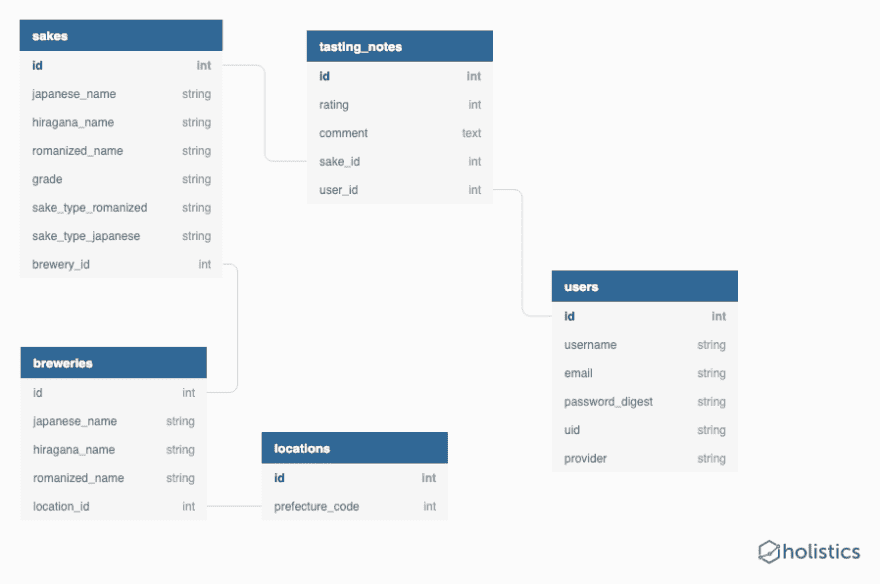

# 熨斗铁路投资组合项目- Ochoko 1.0 -清酒数据库和品尝笔记管理器

> 原文：<https://dev.to/morinoko/rails-portfolio-project---ochoko-10---sake-database-and-tasting-note-manager-17mh>

# 概念

这是我熨斗课程的第三个项目，:D。我从一款名为 [Vivino](https://www.vivino.com/) 的葡萄酒应用程序中获得了 Ochoko 的灵感，这款应用程序允许你查找葡萄酒，并对你喝过的葡萄酒进行评级和跟踪。Ochoko 是类似的东西，但为了日本的缘故。

生活在日本，有很多美味的清酒可以喝，我想找到一种方法来记录我的品尝笔记。有一些日语应用程序，但不是我想要的，所有东西都是日语的。另一方面，英文数据库不完整，并且当我需要时没有日文数据(例如日文的清酒和啤酒厂的名称)。除了记录你自己品尝笔记的方法之外，Ochoko 还致力于成为一个面向双语者的日本清酒综合数据库。

它当然远非完美，因为在这一点上我仍然有许多事情无法实现，但我会继续改进它，因为我学到了更多！

# 型号

Ochoko 是用 Ruby on Rails 构建的，遵循基本的 MVC 模式。

共有五种型号:`User`、`TastingNote`、`Sake`、`Brewery`、`Location`，通过以下关系连接:

*   一个`User`有许多`TastingNotes`和许多`Sakes`到`TastingNotes`
*   一个`TastingNote`属于一个`User`又属于一个`Sake`
*   一个`Sake`属于一个`Brewery`，有很多个`TastingNotes`
*   一个`Brewery`有多个`Sakes`，属于一个`Location`
*   一个`Location`有很多个`Breweries`

[](https://res.cloudinary.com/practicaldev/image/fetch/s--18h4b4SL--/c_limit%2Cf_auto%2Cfl_progressive%2Cq_auto%2Cw_880/https://thepracticaldev.s3.amazonaws.com/i/ilx9nax7qisit7yav42g.png)

# 为 v.1.0 的基本功能

*   英语和日语本地化
*   用用户名和密码或脸书注册的选项
*   为方便起见，添加、更新和删除个人品尝笔记

# 验证

我使用基本的 ActiveRecord 验证来要求输入清酒/啤酒厂名称、用户电子邮件、密码等。

我还想确保酿酒厂不会重复，但我想象着不同地点的酿酒厂有相同名称的可能性。只要酿酒厂位于不同的位置，就允许重名，我使用了`location_id` :
的作用域

```
validates :japanese_name,
           uniqueness: { scope: :location_id,
                         message: "is already registered for the selected location." } 
```

Enter fullscreen mode Exit fullscreen mode

## 妥协

我很难决定如何处理双语问题。我希望清酒和啤酒厂的信息可以用英语和日语两种语言提供，但是我希望将一种清酒作为一个实体保存在数据库中，而不是有重复的英语和日语版本。我决定为姓名(日语名和英语名等)创建两个数据库列。).这样做的缺点是，我必须决定是否需要两种语言，或者如果有人不懂日语，是否可以只输入英文名字。如果只有一种语言存在，那么对于说另一种语言的人来说，它会怎样出现呢？目前，我决定保留两种语言的必修课(抱歉，非双语者！)，但我认为可能有更好的解决方案。

# 新学到的东西

## 发送带 link_to 的参数以预填表格

Ochoko 允许用户在应用程序中为任何注册的清酒添加品尝记录。在 Vivino 应用程序中，用户可以对酒瓶拍照，应用程序会自动计算出你有什么酒，并调出评级表。嗯，我还不能完全编码这样的东西，所以用户必须自己手动添加品尝笔记。

在 Ochoko 的品尝记录表格中，清酒是通过下拉列表选择的。这个列表可能会有数百个条目，很难找到正确的清酒。一种解决方案是让用户搜索清酒，然后直接从清酒的展示页面添加品尝笔记。然而，简单地添加一个链接到一个新的品酒记录表单只会带来一个完全空白的表单，迫使用户从列表中找到清酒。设置实例变量不会起作用，因为这样的数据不会在 HTTP 请求之间持续。

有没有什么方法可以将数据发送到表单页面，并用正确的名称预先填充表单？

是啊！一项研究显示，Rails 的`link_to`助手允许您将参数发送到下一个页面，如下所示:

```
<%= link_to "Add Tasting Note", new_tasting_note_path(sake_id: @sake.id) %> 
```

Enter fullscreen mode Exit fullscreen mode

这将创建一个附加了查询字符串的链接:

```
<a href="/tasting_notes/new?sake_id=2">Add Tasting Note</a> 
```

Enter fullscreen mode Exit fullscreen mode

`sake_id`现在在 params 散列中作为`params[:sake_id]`可用。

这本身不会在表单中预先填充任何内容，所以您需要修改控制器来检查 param 是否存在。在我的例子中，我修改了我的`TastingNotesController` :
中的`new`动作

```
def new
  @tasting_note = TastingNote.new

  if params[:sake_id]
    @tasting_note.sake_id = params[:sake_id]
  end
end 
```

Enter fullscreen mode Exit fullscreen mode

如果设置了`sake_id`参数，该清酒将在品酒记录表中预先选择。

## 利用局部保持局部干燥

设置局部变量来使用局部变量允许您在任何控制器视图中使用局部变量，而无需复制代码。

例如，我有一个 simple partial，它以紧凑的形式显示特定原因的细节。它位于`app/views/sakes/_details.html.erb`。起初，它是这样编码的，用于显示页面(为了清楚起见，省略了一些元素):

```
# app/views/sakes/_details.html.erb

<div class="sake-details">
  <span class="grade"><%= @sake.localized_grade %></span>
  <span class="location"><%= @sake.localized_location %></span>

  <% if I18n.locale == :en %>
      <span class="japanese-name"><%= @sake.japanese_name + @sake.sake_type_japanese %></span>
  <% end %>
</div> 
```

Enter fullscreen mode Exit fullscreen mode

它是用以下代码在显示页面上呈现的:

```
# app/views/sakes/show.html.erb

<%= render partial: 'details' %> 
```

Enter fullscreen mode Exit fullscreen mode

如果只是用于显示页面，其中的`@sake`是由控制器中的`@sake = Sake.find_by(id: params[:id]`设置的，那么这样做很好。后来，我意识到我想在其他页面上也使用完全相同的 erb，比如一个啤酒厂页面，它列出了某个特定啤酒厂所有可用的清酒。

尝试这样做，代码会中断:

```
# app/views/breweries/show.html.erb

<% @brewery.sakes.each do |sake| %>
  <%= render partial: 'sakes/_details' %>

  # more code...
<% end %> 
```

Enter fullscreen mode Exit fullscreen mode

这段代码之所以中断，是因为 brewery 页面正在通过`@breweries.sakes`设置清酒变量，其中每种清酒都被分配给`each`块中的`sake`。

这个问题可以通过使用局部变量很容易地解决，而不必在 brewery 页面上使用另一个局部变量。首先，我重构了部分变量，去掉了`@sake`实例变量，将其重命名为更通用的`sake`:

```
# app/views/sakes/_details.html.erb

<div class="sake-details">
  <span class="grade"><%= sake.localized_grade %></span>
  <span class="location"><%= sake.localized_location %></span>

  <% if I18n.locale == :en %>
      <span class="japanese-name"><%= sake.japanese_name + @sake.sake_type_japanese %></span>
  <% end %>
</div> 
```

Enter fullscreen mode Exit fullscreen mode

现在，正确的 sake 变量可以通过带有`locals`选项的分部传递。所以，为了显示页面，它将被渲染成这样:

```
# app/views/sakes/show.html.erb

<%= render partial: 'details', locals: { sake: @sake } %> 
```

Enter fullscreen mode Exit fullscreen mode

而对于啤酒厂页面，就像这样:

```
# app/views/breweries/show.html.erb

<% @brewery.sakes.each do |sake| %>
  <%= render partial: 'sakes/details', locals: { sake: sake } %>
<% end %> 
```

Enter fullscreen mode Exit fullscreen mode

我甚至可以在品尝笔记页面上使用它，它还显示清酒的详细信息:

```
# app/views/tasting_notes/show.html.erb

<%= render partial: 'sakes/details', locals: { sake: @tasting_note.sake } %> 
```

Enter fullscreen mode Exit fullscreen mode

## 经验教训:通过验证或数据检查来防范坏数据！

为了方便起见，我遇到了一些错误，我没有使用验证来要求某些字段，比如`grade`。有一次，一种新的清酒被保存了下来，而没有在表格上填写分数。这导致了 sake show 页面中断，因为我试图用`<%= @sake.grade %>`吐出变量，但没有检查它是否存在。

注意:要么通过非必填字段检查变量输入的存在，要么使用 ActiveRecord 验证来要求它，例如`validates :grade, presence: true`！

# 未来的 Todos

*   允许上传照片(仍然不知道如何在 Rails 中上传照片，也不知道照片是如何存储的)
*   向数据库中添加更多清酒和啤酒厂数据(目前只有长野啤酒厂可用)
*   清酒和酿酒厂搜索
*   自动完成的形式选择清酒或啤酒厂时，添加新的
*   某种“翻译”功能，可以帮助管理日文/英文的清酒和啤酒厂名称，以便所有用户都可以参与翻译(例如，如果您想添加一个新的清酒或啤酒厂，但不知道如何键入日文名称)
*   更有趣的设计

# 代号&演示

你可以在 [Github](https://github.com/morinoko/ochoko) 上查看这个项目，或者在 [Heroku](https://ochoko.herokuapp.com/en/) 上观看演示。

# 资源

*   [FontAwesome](https://fontawesome.com/) 方便的免费图标
*   [jp _ premise gem](https://github.com/chocoby/jp_prefecture/blob/master/README_EN.md)一套完整的日本所有都道府县的翻译
*   用于演示主机的 Heroku