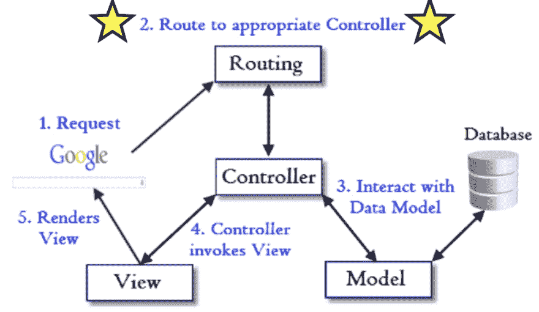

# 铁路路线是我的新闺蜜

> 原文：<https://dev.to/mollynem/rails-routes-my-new-bff-k3a>

上周，我在熨斗学校完成了我的第二个项目。手头的任务是使用 Ruby on Rails 创建一个应用程序，并通过 [Heroku](https://www.heroku.com/) 进行部署。在设计应用程序的整个过程中，我和我的团队一直通过终端使用“rails routes”命令来检查应用程序中每个文件的路径。在这个项目之前，我很少使用这个命令，但是直到我自己创建了一个应用程序，我才知道这个工具到底有多有用。这篇文章的目的是帮助其他开发人员学习何时调用这个命令，如何解释消息，以及描述这个内置工具的价值。

#### 何时使用“铁路路线”

应用程序中的路线将充当 URI 和控制器文件之间的桥梁。当用户键入地址时，路由将检查请求并寻找相应的控制器。在编写应用程序时，你总是可以选择硬编码路径，但是调用‘rails routes’将为你提供路径助手。我推荐使用这些助手，因为它们是动态的，可以提高代码的可读性，并且是一种比字符串插值更自然的编写 URL 的方式。

<figure> 

<figcaption>MVC 项目工作流程</figcaption>

</figure>

在尝试完成以下任务时，我最常使用“rails routes”命令:

创建链接

*   在整个应用程序中，有从一个页面到另一个页面的链接，我从来没有完全确定这些页面的路径是什么。通过调用 rails routes，我能够快速总结可用的路径，它们通向哪里，以及它们在我的程序中的正确语法。

嵌套路线

*   因为我们使用的是 Heroku free 计划，我们没有自己的域名，所以我们决定将所有的路由都放在“/brain”(我们应用程序的名称)后面。重要的是，我们保持干净和清晰的 URI 路径，以维护我们的用户体验。这是我第一次嵌套路线，虽然这很有挑战性，但如果不坚持调用“铁路路线”，我是不可能做到的。下面是这个项目的嵌套路线的截图-乍一看对我来说不是很直观。通过调用 rails routes，我可以立即在终端中查看我们的路线，验证它们是否正确，还可以实时进行更改，并查看终端中路线的更新。

<figure> 

<figcaption>嵌套路线不太直观</figcaption>

</figure>

#### 解释终端输出

输出将显示程序中所有可用的路线。如上所述，这些被列为 route helper 方法，因此您不必将路径硬编码到项目中。路由助手还提供了提供直观路径名的好处，这样当您或其他人阅读代码时，他们就可以有根据地猜测链接将把他们引向何处。

<figure> 

<figcaption>运行铁轨后示例输出路线</figcaption>

</figure>

第 1 列——前缀:
这些是 helper 方法的前缀——在代码中使用时，您会希望在方法的末尾添加 _path。看看这些有多直观！

第 2 列——动词:
列出了 HTTP 动词——程序正在做什么，并对应于一个 CRUD 动作。

第 3 列- URI 模式:
这一列列出了路线的路径。告诉您从用户的角度来看 URI 将会是什么样子，并且还会注明需要什么类型的参数(例如:user_id，post_id)。

第 4 列-控制器#动作:
列出指定的控制器和相应的动作。控制器将列在标签的左边，动作(它在控制器中的位置)列在标签的右边。

#### 结论——一个无价的命令

总的来说，“rails routes”被证明是一个非常有价值的工具，它帮助演示了我写的代码如何在 URI 翻译。我可以很容易地想象我的程序是如何在 MVC 架构中导航的。它还减少了我的错误，因为我能够快速引用正确的路径，而不是猜测它们。我给初学者的建议是记住运行“rails routes”的力量——经常使用它来确保适当的应用程序结构，并从用户的角度检查你的 URIs。

[路由图像](http://backend.turing.io/module2/lessons/archive/advanced_routing_rails)