# 完全初学者的随机森林

> 原文：<https://dev.to/vzhou842/random-forests-for-complete-beginners-4odd>

在我看来，大多数机器学习教程对初学者不够友好。

上个月，我为完全初学者 写了一篇[神经网络简介**。这篇文章将采用同样的策略，也就是说**假设没有机器学习的先验知识**。我们将学习什么是随机森林，以及它们是如何从头开始工作的。**](https://victorzhou.com/blog/intro-to-neural-networks/)

准备好了吗？让我们开始吧。

## 1。决策树🌲

随机森林🌲🌲🌲实际上只是一堆决策树🌲捆绑在一起(哦💡这就是为什么它被称为*森林*。在进入森林之前，我们需要谈论树木。

请看下面的数据集:

[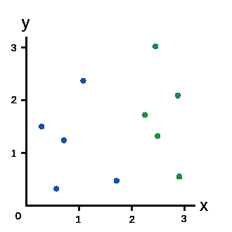](https://res.cloudinary.com/practicaldev/image/fetch/s--k3ZlJ9Rm--/c_limit%2Cf_auto%2Cfl_progressive%2Cq_auto%2Cw_880/https://victorzhou.com/media/random-forest-post/dataset.svg) 

<figcaption>数据集</figcaption>

如果我告诉你有一个 x 坐标为 1 的新点，你认为它会是什么颜色？

蓝色，对吗？

你刚刚在脑子里评估了一个决策树:

[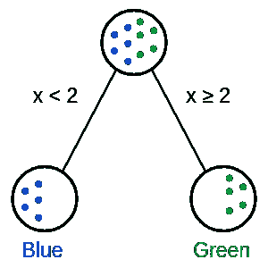](https://res.cloudinary.com/practicaldev/image/fetch/s--sk0wx5oN--/c_limit%2Cf_auto%2Cfl_progressive%2Cq_auto%2Cw_880/https://victorzhou.com/media/random-forest-post/decision-tree.svg)

这是一个简单的决策树，有一个**决策节点**，由**测试** x < 2。如果测试通过(x < 2)，我们选择左边的**分支**并选择蓝色。如果测试失败(x ≥ 2)，我们选择右边的**分支**并选择绿色。

[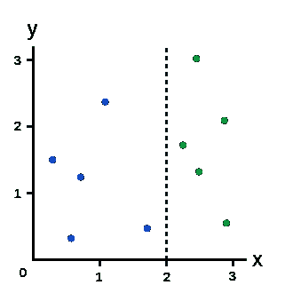](https://res.cloudinary.com/practicaldev/image/fetch/s--TEzddabv--/c_limit%2Cf_auto%2Cfl_progressive%2Cq_auto%2Cw_880/https://victorzhou.com/media/random-forest-post/dataset-split.svg) 

<figcaption>数据集，在 x=2 处拆分</figcaption>

决策树经常被用来回答这类问题:给定一个标有的**数据集，我们应该如何**对**新样本进行分类？**

> **标记**:我们的数据集被*标记为*，因为每个点都有一个**类**(颜色):蓝色或绿色。
> 
> **分类**:对*分类*一个新的数据点就是给它分配一个类(颜色)。

这里的数据集现在有 3 个类，而不是 2 个:

 

<figcaption>数据集 v2</figcaption>

我们的旧决策树不再那么管用了。给定一个新点(x，y)，

*   如果 x≥2，我们仍然可以理直气壮地将其归类为绿色。
*   如果 x<2，我们不能马上把它归类为蓝色——它也可能是红色。

我们需要向我们的决策树添加另一个**决策节点**:

[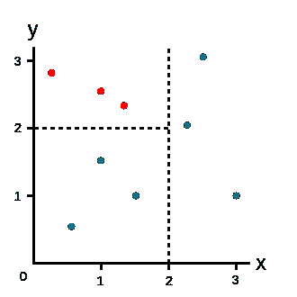](https://res.cloudinary.com/practicaldev/image/fetch/s--eLSbXvH0--/c_limit%2Cf_auto%2Cfl_progressive%2Cq_auto%2Cw_880/https://victorzhou.com/media/random-forest-post/dataset2-split.svg)

很简单，对吧？这是决策树背后的基本思想。

## 2。训练决策树

让我们开始训练决策树吧！我们将再次使用 3 类数据集:

 

<figcaption>数据集 v2</figcaption>

### 2.1 训练一棵决策树:根节点

我们的第一个任务是确定我们的树中的根决策节点。它将测试哪个特性(x 或 y ),测试阈值是多少？例如，我们之前的树中的根节点使用了 x 特性，测试阈值为 2:

[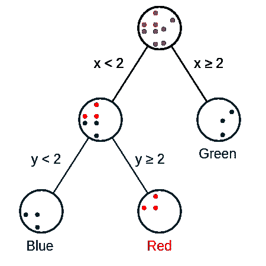](https://res.cloudinary.com/practicaldev/image/fetch/s--99ECw0um--/c_limit%2Cf_auto%2Cfl_progressive%2Cq_auto%2Cw_880/https://victorzhou.com/media/random-forest-post/decision-tree2-root.svg)

直觉上，我们想要一个做出“好”分割的决策节点，其中“好”可以粗略地定义为尽可能多地分离不同类的**。上面的根节点做了一个“好”的分割:*所有的*果岭在右边，*没有*果岭在左边。**

因此，我们现在的目标是选择一个根节点，给我们一个可能的“最佳”分割。但是我们如何量化拆分有多好呢？很复杂。我[写了一整篇博文，讲述了一种使用基尼系数的方法。 **←我建议在你继续之前现在就阅读它**——我们将在这篇文章的后面用到这些概念。](https://victorzhou.com/blog/gini-impurity/)

* * *

欢迎回来！

> 希望你只是读了[我的基尼不洁贴](https://victorzhou.com/blog/gini-impurity/)。如果你没有，这里有一个很短的 TL；博士:我们可以用基尼系数来计算任何分割的基尼系数**和**。**更好的分割有更高的基尼系数**。

回到确定我们根决策节点的问题。既然我们已经有了评估拆分的方法，我们要做的就是找到可能的最佳拆分！为了简单起见，我们将**尝试每一个可能的分割**，并使用最好的分割(基尼系数最高的分割)。**这不是找到最佳分割**的最快方法，但却是最容易理解的。

尝试每一次分裂意味着尝试

*   每个特征(x 或 y)。
*   所有“唯一”阈值。我们只需要尝试产生不同分裂的阈值。

例如，如果我们想使用 x 坐标，我们可以选择以下阈值:

[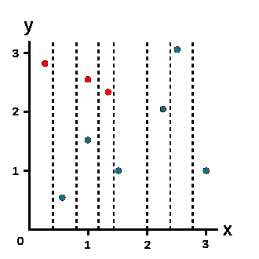](https://res.cloudinary.com/practicaldev/image/fetch/s--9jz3AEEv--/c_limit%2Cf_auto%2Cfl_progressive%2Cq_auto%2Cw_880/https://victorzhou.com/media/random-forest-post/dataset2-thresholds-x.svg) 

<figcaption>x 阈值</figcaption>

让我们对 x=0.4 的分割做一个基尼系数计算的例子。

首先，我们计算整个数据集的基尼系数:

[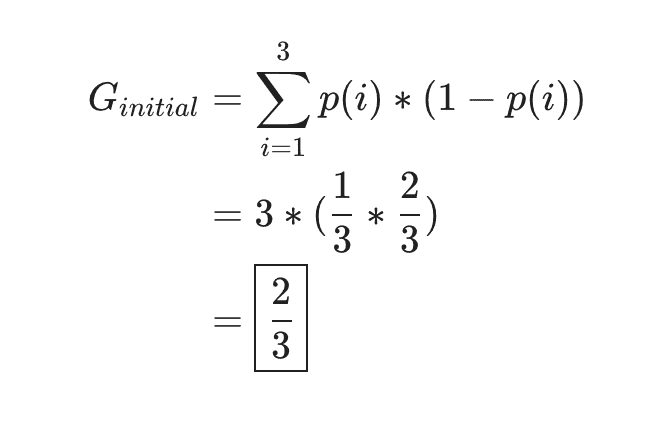](https://res.cloudinary.com/practicaldev/image/fetch/s--uL4Q-SSs--/c_limit%2Cf_auto%2Cfl_progressive%2Cq_auto%2Cw_880/https://thepracticaldev.s3.amazonaws.com/i/yavkzt1pfq6xrd3c3etf.png)

然后，我们计算两个分支的基尼系数:

[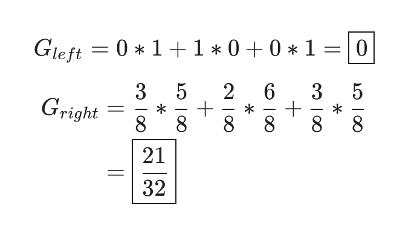](https://res.cloudinary.com/practicaldev/image/fetch/s--LD-ADTYZ--/c_limit%2Cf_auto%2Cfl_progressive%2Cq_auto%2Cw_880/https://thepracticaldev.s3.amazonaws.com/i/pibzd5vzmvuzcjcbkuno.png)

最后，我们通过从原始杂质中减去加权分支杂质来计算基尼系数:

[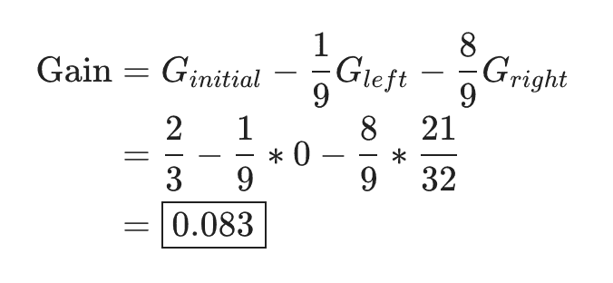](https://res.cloudinary.com/practicaldev/image/fetch/s--byCvHbSX--/c_limit%2Cf_auto%2Cfl_progressive%2Cq_auto%2Cw_880/https://thepracticaldev.s3.amazonaws.com/i/arwvak8l6qeo57svtrs6.png)

> 对刚刚发生的事感到困惑？我告诉过你你应该读一下[我的基尼不洁贴](https://victorzhou.com/blog/gini-impurity/)。它可以解释所有这些基尼系数。

我们可以用同样的方法计算每一种可能分割的基尼系数:

[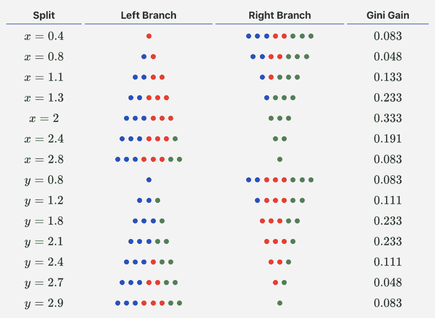](https://res.cloudinary.com/practicaldev/image/fetch/s--1_1dH6Kh--/c_limit%2Cf_auto%2Cfl_progressive%2Cq_auto%2Cw_880/https://thepracticaldev.s3.amazonaws.com/i/jnq4bevt5jflhihuzjdo.png)

[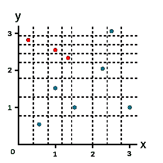](https://res.cloudinary.com/practicaldev/image/fetch/s--RZZRI7fn--/c_limit%2Cf_auto%2Cfl_progressive%2Cq_auto%2Cw_880/https://victorzhou.com/media/random-forest-post/dataset2-thresholds.svg) 

<figcaption>所有门槛</figcaption>

在尝试了 x 和 y 的所有阈值后，我们发现 x=2 的分割具有最高的 Gini 增益，因此我们将使我们的根决策节点使用阈值为 2 的 x 特征。这是我们目前掌握的情况:

[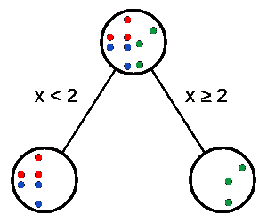](https://res.cloudinary.com/practicaldev/image/fetch/s--5RLQu8kU--/c_limit%2Cf_auto%2Cfl_progressive%2Cq_auto%2Cw_880/https://victorzhou.com/media/random-forest-post/decision-tree2-build1.svg)

不断进步！

### 2.2:训练决策树:第二个节点

是时候做出我们的第二个决定了。我们(任意)去左支吧。**我们现在只使用将采取左分支**的数据点(即满足 x < 2 的数据点)，特别是 3 个蓝色和 3 个红色。

为了构建我们的第二个决策节点，**我们只是做同样的事情！**我们对现有的 6 个数据点尝试了每一种可能的分割，并意识到 y=2 是最佳分割。我们把它变成一个决策节点，现在有了这个:

[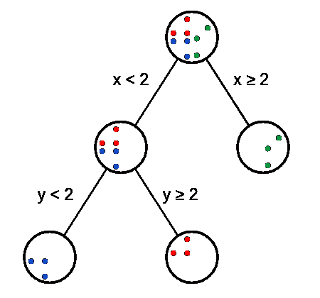](https://res.cloudinary.com/practicaldev/image/fetch/s--CwLpq9Wv--/c_limit%2Cf_auto%2Cfl_progressive%2Cq_auto%2Cw_880/https://victorzhou.com/media/random-forest-post/decision-tree2-build2.svg)

我们的决策树差不多完成了…

### 2.3 训练一个决策树:何时停止？

让我们继续下去，试着做第三个决策节点。这次我们将使用根节点的右分支。该分支中唯一的数据点是 3 个果岭。

同样，我们尝试了所有可能的分裂，但他们都

*   都一样好。
*   基尼系数为 0(基尼系数已经是 0，不能再低了)。

在这里添加一个决策节点是没有意义的，因为这样做不会改进我们的决策树。因此，我们将使这个节点成为一个**叶节点**，并给它贴上绿色标签。这意味着**我们将到达这个节点的任何数据点归类为绿色**。

如果我们继续剩下的两个节点，同样的事情会发生:我们将左下方的节点作为蓝叶节点，将右下方的节点作为红叶节点。这给我们带来了最后的结果:

一旦我们的决策树中所有可能的分支都以叶节点结束，我们就完成了。我们已经训练了一个决策树！

## 3。随机森林🌲🌳🌲🌳🌲

我们终于准备好讨论随机森林了。记得我之前说的吗？

> 随机森林实际上只是捆绑在一起的一堆决策树。

这是真的，但有点简单化了。

### 3.1 装袋

考虑以下算法，在给定 n 个点的数据集的情况下训练一束决策树:

1.  样本，**替换**，数据集的 n 个训练样本。
2.  在 n 个样本上训练决策树。
3.  对于某些测试，重复测试次数

为了使用 t 树的模型进行预测，我们聚集来自各个决策树的预测，并且

*   如果我们的树产生了类别标签(比如颜色)，就采取**多数投票**。
*   如果我们的树产生数值(例如预测温度、价格等)，则取平均值。

这种技术叫做**装袋**，或[T3】b 装袋**聚集**再聚集](https://en.wikipedia.org/wiki/Bootstrap_aggregating)。我们进行的替换抽样被称为 [bootstrap](https://en.wikipedia.org/wiki/Bootstrapping_(statistics)) 样本。

[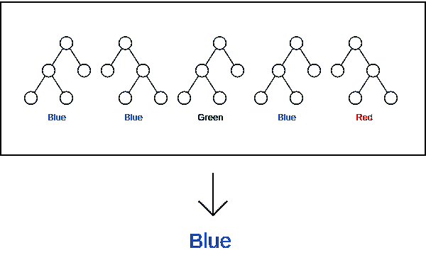](https://res.cloudinary.com/practicaldev/image/fetch/s--_s24-vEK--/c_limit%2Cf_auto%2Cfl_progressive%2Cq_auto%2Cw_880/https://victorzhou.com/media/random-forest-post/random-forest.svg)T3】袋装决策树预测颜色

袋装决策树非常接近随机森林——它们只是缺少了一样东西…

### 3.2 装袋→随机森林

袋装决策树只有一个参数:t，树的数量。

随机森林还有第二个参数，控制在寻找最佳分割点时要尝试多少特性。本教程中的简单数据集只有两个特征(x 和 y)，但大多数数据集都有更多的特征(数百或数千)。

假设我们有一个包含 p 个要素的数据集。不是每次我们做一个新的决策节点都尝试所有的特性，我们**只是尝试特性**的一个子集。我们这样做主要是为了注入随机性，让每棵树都更加独特，**减少了树与树之间的相关性**，从而提高了森林的整体性能。这种技术有时被称为**特征装袋**。

## 4。现在怎么办？

这是一个初学者对随机森林的介绍！快速回顾一下我们的工作:

*   介绍了**决策树**，随机森林的构建模块。
*   学习了如何通过迭代进行可能的最佳分割来训练决策树。
*   定义[基尼系数](https://victorzhou.com/blog/gini-impurity/)，这是一个用来量化收入差距有多“好”的指标。
*   我看到了一个随机森林=一堆决策树。
*   了解 **bagging** 如何结合多棵树的预测。
*   了解到**特征装袋**是装袋决策树和随机森林的区别。

你可以在这里做一些事情:

*   在真实数据集上试验 scikit-learn 的[决策树分类器](https://scikit-learn.org/stable/modules/generated/sklearn.tree.DecisionTreeClassifier.html)和 [RandomForestClassifier](https://scikit-learn.org/stable/modules/generated/sklearn.ensemble.RandomForestClassifier.html) 类。
*   尝试从头开始编写一个简单的决策树或随机森林实现。我很乐意给予指导或代码审查！只需[发微博给我](https://twitter.com/victorczhou)或者[发邮件给我](mailto:vzhou842@gmail.com)。
*   阅读关于[梯度增强决策树](https://en.wikipedia.org/wiki/Gradient_boosting#Gradient_tree_boosting)的文章，并使用 [XGBoost](https://xgboost.readthedocs.io/en/latest/) 这个强大的梯度增强库。
*   阅读关于随机森林的扩展[ext tree](https://en.wikipedia.org/wiki/Random_forest#ExtraTrees)，或者玩 scikit-learn 的[ext tree classifier](https://scikit-learn.org/stable/modules/generated/sklearn.ensemble.ExtraTreesClassifier.html)类。

本教程到此结束。我喜欢[写关于机器学习的](/tag/machine-learning)(但也有其他话题)，所以如果你想得到新帖子的通知，请 **[订阅](http://eepurl.com/gf8JCX)。**

感谢阅读！