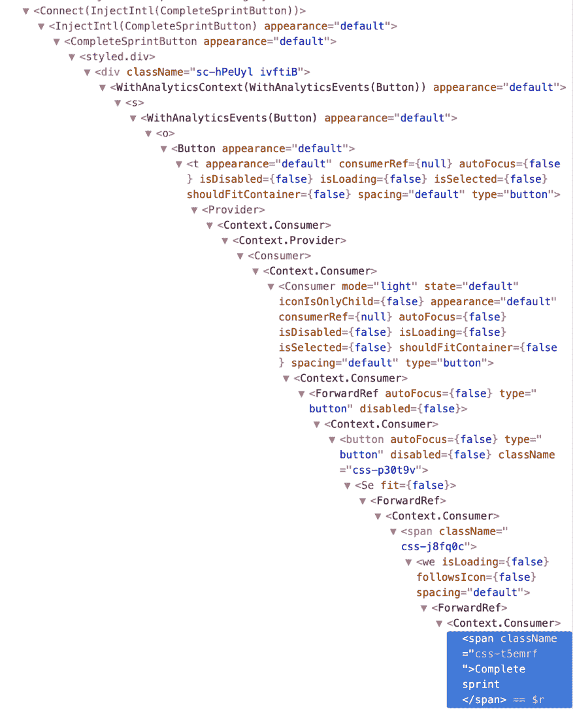

# 反应浅层快照

> 原文：<https://dev.to/thekashey/reach-shallow-snapshot-506>

正如我的一个朋友曾经说过的，每个笑话中都有一个笑话。*内心的笑话*。

这是相当深刻的哲学观察，这意味着基本上-你可以从一个笑话衍生出另一个，使第一个更有趣。你可能会发现无穷无尽的思考和细微差别，让一个小笑话成为现实。

这是我的笑话:

> Mark Dalgleish[@ markdalgleish](https://dev.to/markdalgleish)俏皮话快照配浅层渲染。2019 年 3 月 23 日上午 01:11[](https://twitter.com/intent/tweet?in_reply_to=1109261285881835521)[](https://twitter.com/intent/retweet?tweet_id=1109261285881835521)122[](https://twitter.com/intent/like?tweet_id=1109261285881835521)592

听起来不好笑吗？所以让我们在这个笑话中找到一个真正的笑话，就像它所说的那样——让我们创建一个肤浅的快照！:)

```
import React from 'react';
import Link from 'react-router';
import Section from './section';

// const Section = ({children}) => <section><SomeStuff/>{children}</section>

describe('Mark-testing', () => {
  it('should match snapshot', () => {
    expect(shallow(<Section><Link>click me</Link></Section>)).toMatchSnapshot());    
  });
}); 
```

我们刚刚做了什么？我们测试了一个`skeleton`，说来话长*拍了*，结果会是....

```
<section>
  <SomeStuff />
  <Link to=\\"#\\">
    click me
  </Link> </section> 
```

> 我们什么也没测试。

这是*所期望的*。这就是浅层渲染的工作原理，这是一个特性，而不是一个错误。一个理由[为什么我总是用浅渲染](https://hackernoon.com/why-i-always-use-shallow-rendering-a3a50da60942)。

但是...你说得对——那绝对没用😢

> Mark Dalgleish[@ markdalgleish](https://dev.to/markdalgleish)[@ gunar](https://twitter.com/gunar)浅层渲染基本上是对组件的自动嘲讽。
> 
> 以我的经验来看，如果你嘲讽一切，很有可能是无用的测试。23:41PM-2019 年 3 月 23 日[](https://twitter.com/intent/tweet?in_reply_to=1109601176268369920)[](https://twitter.com/intent/retweet?tweet_id=1109601176268369920)0[](https://twitter.com/intent/like?tweet_id=1109601176268369920)0

所以- `shallow`无助于发现内心的玩笑。那就`mount`吧！

```
describe('Mark-mount-testing', () => {
  it('should match snapshot', () => {
    expect(mount(<Section><Link>click me</Link></Section>)).toMatchSnapshot());    
  });
}); 
```

接下来会发生什么？😉`Error: Uncaught [Error: Invariant failed: You should not use <Link> outside a <Router>]`

所以让我们把所有东西都打包成路由器，然后重新运行。现在我们的快照是:

```
<StaticRouter>
  <Router history={{...}} staticContext={{...}}>
    <Section>
      <section>
        <SomeStuff>
          <div>
            Lorem Ipsum is simply dummy text of the printing and typesetting industry. Lorem Ipsum has been the industry&#39;s standard dummy text ever since the 1500s, when an unknown printer took a galley of type and scrambled it to make a type specimen book.
          </div>
        </SomeStuff>
        <Link to=\\"#\\">
          <a onClick={[Function: onClick]} href=\\"/\\">
            click me
          </a>
        </Link>
      </section>
    </Section>
  </Router> </StaticRouter> 
```

你知道——这比以前好得多，但同时也比我预期的多一点——T2。

以我个人的经验，对于 StyledComponets，更多的组件和更深的组件，快照可能会很大，除了噪音之外什么也不能提供。奥特垃圾！

# 我们能找到介于两者之间的东西吗？

[React 测试方法](https://reactjs.org/docs/testing-recipes.html)给出了一些让快照测试更好的提示:

> 做出更具体的断言通常比使用快照更好。这种类型的测试包括实现细节，因此它们很容易被破坏，并且团队可能对快照破坏不敏感。有选择地模仿一些子组件可以帮助减少快照的大小，并保持它们对代码审查的可读性。
> 
> 到`mocking`时，他们假设`jest.mock`，但是我已经为你准备了另一个解决方案——模仿**组件**，而不是**模块**。

是的，切一块蛋糕。让我们用一个**有限分量**的想法，我已经在这里深入解释过了:

[](/thekashey) [## 有限战争

### 安东·科尔祖诺夫 1 月 1 日 196 分钟阅读

#react #testing #javascript](/thekashey/infinite-war-995)

```
import React from 'react';
import Link from 'react-router';
import { createElement, remock } from 'react-remock';
import Section from './section';

describe('Mark-finite-mount-testing', () => {
  it('should match snapshot', () => {
    remock.push();

    // replace Link by another component
    remock.mock(Link, (_, props) => createElement('router-link', props));

    expect(shallow(<Section><Link>click me</Link></Section>)).toMatchSnapshot());   
    remock.pop(); 
  });
}); 
```

在这里，我们只是**模仿了**的一个`Link`组件，去掉了对`Router`的依赖，其余的保持不变。更新的快照是:

```
<Section>
  <section>
    <SomeStuff>
      <div>
        Lorem Ipsum is simply dummy text of the printing and typesetting industry. Lorem Ipsum has been the industry&#39;s standard dummy text ever since the 1500s, when an unknown printer took a galley of type and scrambled it to make a type specimen book.
      </div>
    </SomeStuff>
    <router-link to="#">
      click me
    </router-link>
  </section> </Section> 
```

干净完好。只是没有一些分支，我们**剪掉了**，让你的快照更浅，但不像用真实的`shallow`那样浅🤯

你可能会嘲笑任何提供`variable`的东西，像我一样，或者`name`，或者`regexp`。根据需要削减或替换(我们保留了一个`Link`的孩子)。

一个很好的例子是一个 **FancyButton** ，它实际上是 2 个`<ThemeProviders>`、几个`<StyledComponents>`和几个`HOCs`的组合。

这是给你的一个组件

[](https://res.cloudinary.com/practicaldev/image/fetch/s---BagpePN--/c_limit%2Cf_auto%2Cfl_progressive%2Cq_auto%2Cw_880/https://thepracticaldev.s3.amazonaws.com/i/48r1bz6j450d10kekf4l.png)

使用 remock，您可以让它成为快照的一个组件。

#### PS

Jest 语法中提供了示例，而快照是使用`mocha` + `chai-jest-snapshot`
生成的

```
const wrapper = mount(<Section><Link to="#">click me</Link></Section>);
expect(wrapper.debug()).to.matchSnapshot();
// ^ yes, wrapper.debug() ^ produces the best code, 
// while `.html()` or `.render` or hides some details(props) 
// you might wanna use, or generates a single line of code, 
// you will not able to review/merge. 
```

> 所以，你不会相信，但是有限的分量和[的反应——remock](https://github.com/theKashey/react-remock)可以让*的浅快照*成为一个东西。如果你用一个`mount`...那是个笑话:)

> <video loop="" controls=""><source src="https://video.twimg.com/tweet_video/D4YvmCoU8AAwARD.mp4" type="video/mp4"></video>Mark Dalgleish[@ markdalgleish](https://dev.to/markdalgleish)[@ pie6k](https://twitter.com/pie6k)21:54PM-2019 年 4 月 17 日[](https://twitter.com/intent/tweet?in_reply_to=1118633897460240385)

评出作者的最佳模因。我喜欢这个。

> PS:另一个——也有一个关于依赖嘲讽的笑话...对于像[更严格的](https://github.com/stricter/stricter)这种事情来说是一种乐趣！