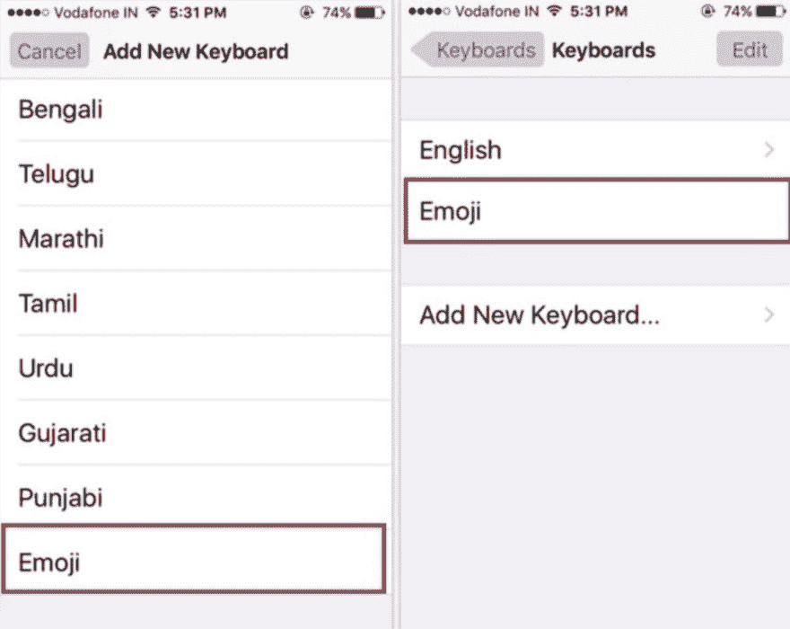

# 反应本机导航及其注意事项

> 原文：<https://dev.to/sudolabs_io/react-native-navigation-and-its-caveats-1249>

所以你踏上了创建一个`react-native`应用程序的旅程，你觉得自己拥有了超能力。你创建你的组件，设计它们的样式，进行 API 调用，就像你在网上一样，你几乎是在阳光下行走。

但是当你想要实现导航时，你周围的世界开始崩溃。您尝试了 React Native 中预打包的导航，但它不是跨平台一致的。然后，您发现了一个 JavaScript 解决方案，但是对于大多数应用程序来说，它的性能是次优的。您需要一个使用本地导航定义的解决方案。然后你发现了 Wix 的`react-native-navigation`(从现在开始是 RNN ),你得救了，因为它有你需要的一切。

这是一个本机解决方案，拥有出色的性能，在后台使用本机事件，并且真正意义上是跨平台的。

不幸的是，它有一些奇怪的问题，你又一次迷路了。但是不要放弃希望！与其这样，不如让我们浏览一下断点，记下一些关于如何处理/解决这些奇怪问题的笔记。

## `v1` VS `v2`

Wix 的工作人员正在非常努力地为我们所有人提供一个原生的跨平台解决方案，以便在 React 原生应用程序中导航——这是对他们维护库的巨大赞誉。也就是说，文档有点粗糙，有时很难找到您想要的东西。

快速浏览一下 RNN 的生态系统就会发现，目前有两个版本的图书馆被维护着——旧的`v1`和“全新的】T1。

两个版本之间的差异很小，尽管有一种[方式](https://github.com/wix-playground/react-native-navigation-v1-v2-adapter)将 v1 迁移到 v2，但最好在开始新项目之前下定决心。

问题是，您应该为新的 React 原生项目使用哪一个？

快速回答是:`v2`。

长的答案是，这两个版本仍然在积极维护，但`v2`在开发过程中有优先权。虽然有一些功能还没有在`v2`中实现，但是团队非常积极地让它成为过去。此外，Wix 的官方建议是在你的项目中使用`v2`,因此，在这种情况下，我们应该坚持作者所说的。

## 书库

这是你可能会在任何使用导航的应用程序中使用的东西。关于栈实际上是什么的一个普遍共识可能是，它是以某种方式相关的屏幕的集合，因此，可以从*导航到*以及从导航到*。然而，这并不能直接解释堆栈在 RNN 应用程序中的工作方式。*

在我看来，这只是一个命名的问题。`stack`在 RNN 只是代表一个任意的屏幕，你可以用它来导航到任何其他任意的屏幕。不要试图在这里的定义名称中寻找任何更深层次的含义。

在和 RNN 应用程序中定义堆栈的方式如下:

```
stack: {
  children: [{
    component: {
      name: 'screen.Home'
    }
  }]
} 
```

如果`Home`屏幕以此定义注册，您可以从`Home`屏幕使用`Navigation.push()`(和所有其他导航事件)到**任何**其他注册屏幕。为了让这些转换工作，它们不必在同一个`stack: {}`中定义。当我开始使用 RNN 时，这对我来说是一个问题，因为它的命名对我来说没有什么意义。我希望你从我的错误中吸取教训，从现在开始用`stack`的定义正确导航。

这里还有一点需要注意的是——我见过一些人在`stacks`中定义他们所有的屏幕，以确保他们能够在需要时从这些屏幕中导航。我个人不会这样做，因为如果你在`stack`中定义一个屏幕，它自然会在本机端给你这样定义的屏幕增加一些开销代码，这不是最佳的。你最好注意你的屏幕的定义，只定义你将通过`Navigation`事件导航的屏幕。这是 RNN 的意愿。

## 在 Redux(或任何其他提供者)中包装注册的组件

你能把 RNN 和 Redux 结合使用吗？是的，你可以。但是你必须做一些准备工作来使它成为可能。如果你进行快速的谷歌搜索，你可能会发现很多不同的方法，但只有一种官方方法，那就是通过 RNN 自己的 API。你唯一需要做的就是使用

```
Navigation.registerComponentWithRedux() 
```

注册您的组件。这个函数只接受三个参数，第一个是您想要注册的组件，第二个是`Provider` ( `import { Provider } from react-redux`)，第三个是您的自定义 redux 存储。最后，你应该有这样的东西:

```
Navigation.registerComponentWithRedux('screen.Home', () => Root, Provider, store) 
```

为什么就此打住呢？尽管该方法被称为`registerComponentWithRedux`，但它实际做的是，用您作为第二个参数提供的组件包装所有已定义的组件。因此，这是用你需要的任何东西来包装你的组件的理想位置，比如一个`ThemeProvider`，或者，例如，如果你在你的应用程序中使用这些的话，React 的`Contexts`。

这不仅是用任何包装器包装你的应用程序的理想地方，而且可能是你能这样做的唯一地方之一。你可能会问为什么？当你在应用程序中初始化 RNN 时，你可能已经知道了。RNN 的工作方式是，为了优化的目的，它提前预注册你所有的屏幕。这是一件好事，但这也不可避免地意味着，你的应用程序的入口点从声明性的(就是这样，嗯哼，我们喜欢，嗯哼)变成了命令性的。

如果我们对代码库(布局等等)使用声明性定义，React 会更喜欢它。但是如果你在你的应用中使用 RNN，你的应用的根组件就不可能这么做。这是我对这个库的主要不满，但这是另一个话题，至少有一种方法可以包装你的顶级组件，尽管不是最用户友好的。

### `componentId`与它讲和使用`React.Context`

正如在第一篇文章中提到的，这个库有两个版本。让我们假设您使用的是首选的`v2`。该库 API 的主要变化之一是出现了`componentId`——任何 RNN 注册组件的唯一标识符。你必须在任何时候使用它来执行`Navigation`事件(例如`.push()`、`.pop()`)，并且在 RNN 应用的初始化步骤中注册的每个根组件都会收到它作为道具。这一事实可能会被证明是有问题的，原因如下。

假设您想要为您的应用程序创建一个可重用的组件，该组件需要执行导航事件作为其功能的一部分。您可以将其定义为路由堆栈的一部分，但从功能的角度来看，这并没有什么意义。这不是应用程序显示的特定屏幕，而是可以重用的任意组件。这种方法可能会带来一些问题，比如组件范围内不必要的代码重复和复杂的定义。

这在一个例子中得到了更好的展示。让我们创建一个组件，作为一个具有许多选项的选择屏幕来显示输入，当点击时，它会显示一个单独的屏幕，在一个表中显示该输入的所有可能值。其中一个组件，我们称之为`ListSelect`:

[](https://res.cloudinary.com/practicaldev/image/fetch/s--KBRLLVf4--/c_limit%2Cf_auto%2Cfl_progressive%2Cq_auto%2Cw_880/https://thepracticaldev.s3.amazonaws.com/i/q8jhalqu69ecoc6xlaj5.png)

因为当用户与该组件交互时，您需要从当前显示的屏幕导航，所以您需要为我们的`ListSelect`组件中的`Navigation`事件准备好已安装屏幕的`componentId`。如果`ListSelect`组件直接用在有`componentId`的屏幕上，那就不成问题了。你只需要将它作为道具传递给组件，然后在组件内部接收它并执行事件，就像这样:

```
const navigateToSelectScreen = ({ rootComponentId }) => {
  Navigate.push(rootComponentId, {
    component: 'screen.ListSelect'
  })
}

const ListSelect = ({ rootComponentId }) => (
  <View>
    <TouchableOpacity onPress={() => { navigateToSelectScreen({ rootComponentId }) }}>
      <Text>
        Select a value
      </Text>
    </TouchableOpacity>
  </View>
) 
```

但是如果你广泛地使用它，并且厌倦了做`<ListSelect rootComponentId={componentId} />`该怎么办呢？或者更糟糕的是，如果组件在层次结构中嵌套得更深，您需要对其进行三层甚至更多层的支撑钻取，该怎么办？一定有更好的解决办法。输入`Provider`。

在上一节中，我们讨论了如何用定制的提供者包装我们的根组件。我们在这里可以做的是用一个上下文提供者来包装我们的顶级组件，这个上下文提供者存储了`componentId`属性，然后我们可以在`Consumer`中访问该属性，以便在应用程序中的任何地方使用，并沿着层次结构树向下。上下文是提取这种特定于 UI 的数据并使其在层次结构中可访问的好方法，但是您可以使用任何其他全局状态管理库，例如 Redux 或 Flux，结果相同。

让我们回到我们的例子，并跟踪我们需要做的步骤，以确保我们可以在任何地方没有麻烦地使用组件。首先，我们从堆栈中的组件内部定义我们将要导航到的屏幕，就像这样:

```
Navigation.registerComponentWithRedux('screen.ListSelect', () => ListSelect, Provider, store) 
```

我们需要做的下一件事是创建一个上下文，它将跟踪我们当前可见的`componentId`，让我们称它为`NavigationComponentIdProvider`(咄)。它看起来会像这样:

```
class NavigationComponentIdProvider extends React.Component {
  state = { navigationComponentId: '' }
  componentDidMount() {
    this.navigationEventsListener =
      Navigation.events().registerComponentDidAppearListener(({ componentId }) => {
        this.setState({
          navigationComponentId: componentId
        })
      })
  }
  componentWillUnmount() {
    if (this.navigationEventsListener) {
      this.navigationEventsListener.remove()
    }
  }
} 
```

在`componentDidMount`中，我们设置了一个监听器，它在导航事件改变活动组件时更新状态。RNN 有一个有用的监听器，使用提供的

```
 Navigation.events().registerComponentDidAppearListener() 
```

调用时接收`componentId`的方法。然后我们简单地用这些信息更新状态。不要忘记移除`componentWillUnmount`中的监听器。

我们通过完成 render 方法来完成它，该方法呈现用上下文的提供者包装的`children`。这应该是我们新创建的上下文的最终结果，它知道在任何给定时间当前显示的`componentId`。

```
class NavigationComponentIdProvider extends React.Component {
  state = { navigationComponentId: '' }
  componentDidMount() {
    this.navigationEventsListener =
      Navigation.events().registerComponentDidAppearListener(({ componentId }) => {
        this.setState({
          navigationComponentId: componentId
        })
      })
  }
  componentWillUnmount() {
    if (this.navigationEventsListener) {
      this.navigationEventsListener.remove()
    }
  }
  render() {
    const { children } = this.props
    const { navigationComponentId } = this.state
    return (
      <NavigationComponentIdContext.Provider value={navigationComponentId}>
        {children}
      </NavigationComponentIdContext.Provider>
    )
  }
}

const NavigationComponentIdConsumer = NavigationComponentIdContext.Consumer

export { NavigationComponentIdConsumer, NavigationComponentIdProvider } 
```

下一步是更新我们包装所有顶级组件的全局`Provider`，以包含`NavigationComponentIdProvider`。

我们的`Provider`应该是这样的:

```
const Provider = ({ children, store }) => (
  <ReduxProvider store={store}>
    <ThemeProvider theme={theme}>
      <AnyOtherProviderThatYouMightBeUsing>
        <NavigationComponentIdProvider>
          {children}
        </NavigationComponentIdProvider>
      </AnyOtherProviderThatYouMightBeUsing>
    </ThemeProvider>
  </ReduxProvider>
) 
```

如果你已经跟随教程到这一步，你现在可以`import { NavigationComponentIdConsumer }'`并在你的应用程序的任何地方获得显示屏幕的`componentId`。

为了使整个过程更加简单和清晰，我们可以创建一个高阶组件(HOC ),用`NavigationComponentIdConsumer`包装组件。这是一个非常简单的抽象，它将帮助我们保持结果代码更加整洁。

特设可能是这样的:

```
import { NavigationComponentIdConsumer } from './NavigationComponentIdContext'

const withNavigationComponentIdContext = Comp => props => (
  <NavigationComponentIdConsumer>
    {componentId => <Comp componentId={componentId} {...props} />}
  </NavigationComponentIdConsumer>
)

export default withNavigationComponentIdContext 
```

我们做的最后一件事是将我们的`ListSelect`组件的导出包装在`withNavigationComponentIdContext`中，就像这样。

```
ListSelect.js
...

export default withNavigationComponentIdContext(ListSelect) 
```

组件现在可以从它的 props 访问`componentId`，我们不需要手动传递它。

最棒的是，你可以在你的应用程序中的任何地方使用这个 HOC，所以如果你不想的话，你不必再担心`componentId`了。如果您处于这样一种情况，层次结构中处于较低级别的组件需要制作一个`Navigation`事件，不要手动钻取`componentId`，只需将它包装在`withNavigationComponentIdContext`中并放入道具中。

这种用法的另一个好例子是创建一个模态组件。尽管如果模态在你的应用中非常具体，从语义的角度来看，将它们定义为单独的屏幕可能更有意义。

## 外卖

我还想到了一些 RNN 特有的问题。但是大多数都是特定版本的(RNN 几乎每天都在更新！).这可能是一个好主意，让他们去，不要试图解决他们，因为他们肯定会在不久的将来得到解决。这篇文章应该作为一篇快速的文章，提供 RNN 常见问题的解决方案，这些问题可能不会改变，因为它们与库的 API 相关联。

除此之外，如果你还有其他问题，我绝对可以推荐`react-native-navigation`的不和谐[社区](https://discord.gg/hnc8nq)。那里的人很有帮助，以前救过我很多次。感谢阅读！

* * *

*首发于[sudo labs . io](https://sudolabs.io/blog/react-native-navigation-and-its-caveats/)T3】*