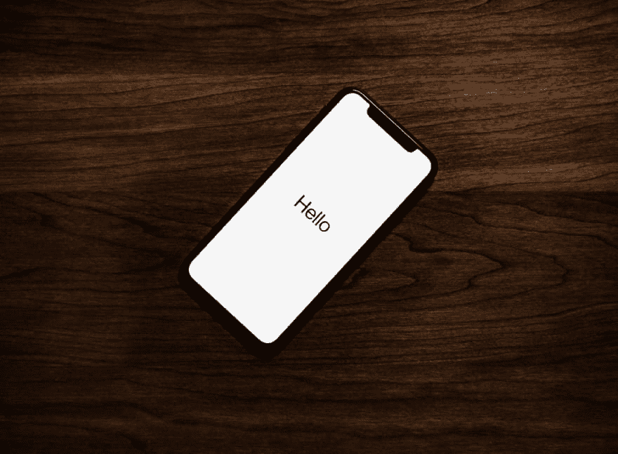

# 反应本地 OAuth

> 原文：<https://dev.to/mattchewone/react-native-oauth-27ph>

[](https://res.cloudinary.com/practicaldev/image/fetch/s--zzpVnUOv--/c_limit%2Cf_auto%2Cfl_progressive%2Cq_auto%2Cw_880/https://cdn-images-1.medium.com/max/1024/1%2AdY8bMNoFO3dYrkXUXjfnRw.jpeg)

我只是想从我对 React 或 React Native 几乎没有经验开始，所以我正在做的事情可能还有待改进，但我想学习，必须从某个地方开始。

我决定从 React Native 中获取 OAuth 工作流开始。我将从一个 Mac OSX 用户的角度，针对一个 iOS 目标来运行这个。

### 入门

从哪里开始比遵循入门指南更好，我最初遵循 Expo 流程，因为这是默认显示的流程。但是我很快了解到，使用 OAuth，您需要为 Auth 流安装一些本机依赖项。

最初创建应用程序相当简单，安装 CLI NPM install-g react-native-CLI，然后创建 react-native init MyAwesomeAuthApp 项目。

### 添加授权

#### 安装

对于 Auth，我将使用 [React Native App Auth](https://github.com/FormidableLabs/react-native-app-auth) 包，它允许 OAuth 2.0 和 OpenID 连接提供者。

通过以下方式安装并链接原生包:

```
npm i react-native-app-auth
react-native link react-native-app-auth 
```

链接部分是向 ios 和 andriod 版本添加原生依赖项的部分。我选择使用 Carthage 步骤来添加依赖项，因为 Cocoa pods 无法正确安装依赖项。首先，导航到 iOS 文件夹，用以下内容创建一个 cart file:

```
github "openid/AppAuth-iOS" "master" 
```

您需要安装 carthage，您可以使用 brew 安装 carthage。一旦安装并创建了 Cartfile，您就可以运行 Carthage update-platform iOS 来安装软件包。

完成后，您需要复制位于 ios/Carthage/Build/iOS 中的 AppAuth.framework，并将其添加到 Xcode 中的框架中。最后，在构建阶段中设置一个复制文件阶段，选择框架作为目的地，添加 AppAuth.framework，并确保检查复制选项上的代码签名。

#### Xcode 设置

我们现在需要在 Xcode 中打开 ios 项目来完成设置。在 ios 文件夹中，如果运行 open MyAuthApp.xcodeproj，应该会打开 Xcode。

项目打开后，展开显示项目名称(在我的例子中为 MyAuthApp)的文件夹，您应该会看到一个名为 AppDelegate.h 的文件，您可以用以下内容替换它的内容: