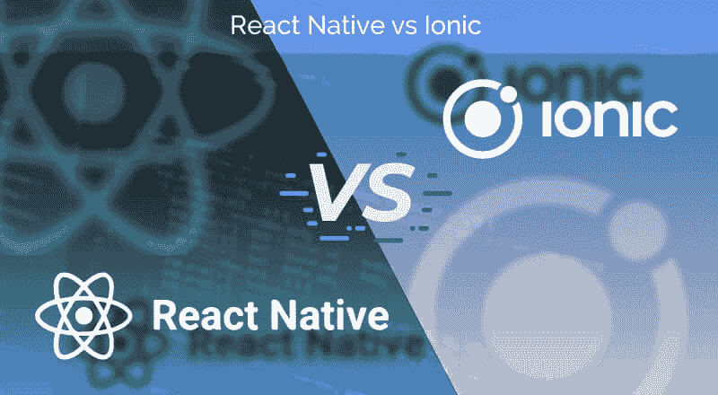

# 反应自然与离子:详细比较，选择更好的一个

> 原文：<https://dev.to/dedicateddevs/react-native-vs-ionic-detailed-comparison-to-choose-the-better-one-28nc>

大量的移动应用程序开发平台和技术正在定期推出，以满足应用程序开发行业不断变化的需求。以前，移动应用程序的开发过程包括简单的元素，如功能、设计和应用程序开发成本。

然而现在，这个过程主要依赖于用于定制移动应用开发的框架**。许多应用程序开发人员都被一个问题所困扰，即哪一个框架才是实现他们目标的正确框架。React Native 和 Ionic framework 之间的著名争论已经持续了很长时间。
在本文中，我们将讨论这些流行的框架，并对它们进行比较，以帮助您理解它们的差异。我们还会考虑一些方面，比如特性，以及使用这些框架的利弊。在我们开始之前，让我们简单地提醒自己什么是本地和混合应用。**

 **## 本地和混合应用

本地应用程序是根据操作系统的指导原则使用所需语言开发的移动应用程序。举个例子，当你在 Android 上用 Java 写代码或者在 iOS 上用 Swift 或者 Objective-C，那么这个应用就是一个原生 app。

因为原生应用程序是明确为操作系统而构建的，所以速度更快。原生移动应用也能提供顶级的用户体验。React 原生框架用于创建原生应用。

另一方面，混合应用是通过 WebView 固定在原生移动应用中的网站。它们是使用可以在不同平台上运行的 CSS、JavaScript 和 HTML 等 web 技术开发的。

这些应用看起来像本地应用，但具有网站的特征。混合应用程序利用 Cordova 和 PhoneGap 工具来访问 iOS、Android 等平台上的功能。Ionic 框架用于开发混合移动应用。

## 离子框架

Ionic 框架是五年前由一家名为 Drifty.co 的网络和移动开发公司推出的，用于开发混合移动应用。这个开源平台使用 CSS、HTML5 和 JavaScript 等 web 技术以及 Cordova 或 PhoneGap 等平台来开发具有类似原生功能的混合应用程序。

**特性**

它用于开发具有有用 UI 功能的混合应用程序
Cordova 或 PhoneGap 层 Ionic 框架
该框架适用于 WebView (Android)和 UIWebView (iOS)

**离子框架的优点**

该框架是开源和免费的
。使用 Ionic 构建的应用只需一次性部署即可
部署(在 iOS、Windows 和 Android 中)
它具有快速的开发周期
该框架易于学习，并提供了一个熟悉的开发环境
Ionic 应用主要专注于 UI 开发

**缺点**

它要求 WebView 提供本机功能
要访问设备的硬件功能，您需要使用 Apache Cordova 插件
Ionic 框架的性能存在滞后问题

## 反应本机框架

React Native 是脸书为特定操作系统开发应用程序的跨平台平台产品。这个基于 JavaScript 技术的平台允许移动应用开发者使用单一代码库来创建应用。

[**美国顶级应用开发者**](https://dedicateddevelopers.com/mobile-application-development/) 可以在 React Native 的帮助下轻松回收其他 Android 或 iOS 应用中使用的代码。这个框架使用 React 和 JavaScript 来构建
优秀的原生应用。一个活跃的开发者社区支持这个框架。

> **阅读博客- [React Native App 开发省了不少](https://dedicateddevelopers.com/blog/react-native-app-development-saves-a-lot/)**

**特性**

使用 React Native 可以更快地开发应用程序
美国顶级应用程序开发人员社区可以帮助立即解决 React Native 的任何问题
该框架可以跨平台使用，因为它独立于 Android 或 iOS 平台

**优点**

该框架可以处理重大项目，因为它稳定可靠
开发 Android、Windows 或 iOS 应用程序的完整代码可重用性
通过有效的代码结构不断改进该框架

**缺点**

需要遵守限制和许可规则
不需要定制模块
需要本地开发技能

## 反应型天然和离子型骨架的比较

**技术/语言堆栈**

这些框架基于不同的技术栈方法。React Native 采用“学习一个，到处跑”的方法，而 Ionic 采用 web 技术来开发混合应用程序。

美国顶级应用开发者利用 React Native 在平台的限制和指导下开发原生应用。该框架使用 UI 原生组件来帮助移动应用开发公司为用户提供无缝的应用。

另一方面，Ionic 框架使用最少的代码库来开发应用程序，并使用 Angular 来平滑和加速这个过程。一个有角度知识的移动应用程序开发公司可以方便地构建用户友好的应用程序。

**性能**

在性能方面，React Native 是一个用于大型项目的更稳定的框架。这个框架产生了成绩优异的应用程序。另一方面，Ionic 框架为与原生应用功能无关的项目提供了更快的应用开发环境。

当涉及本机代码时，Ionic 框架可能会有性能滞后。使用 Ionic 框架的 [**移动应用程序开发公司**](https://dedicateddevelopers.com/mobile-application-development/) 必须下载不同的插件来访问原生功能。

**插件和社区**

React Native 背后的社区支持非常强大——这个框架也有不同的插件可用。React 本地社区总是互相帮助解决他们可能遇到的任何问题。

有一个成熟的社区支持 Ionic 框架并解决任何问题。然而，这个框架缺少大量的插件来获得原生特性——只有 PhoneGap 和 Cordova 插件在使用。这意味着使用这些框架的移动应用程序开发公司可以加入这些社区进行无缝应用程序开发。

**支持的平台**

这两个跨平台支持 iOS 和 Android。此外，Windows 通用平台支持 Ionic 2。这意味着一家拥有 Ionic 2 的网络和移动开发公司可以为 Windows 手机开发移动应用。

**设计**

一家 [**网络和移动开发公司**](https://dedicateddevelopers.com) 必须利用一个预先开发的组件来设计使用 Ionic 框架的应用程序。React Native framework 中没有设计组件，这使得它对于关注应用设计的人来说不是一个好的选择。

## 包扎

没有人能告诉你这些框架中哪一个更好，因为有不同的因素供你在做决定前考虑。在选择最佳框架时，平台、团队规模、成本等因素起着巨大的作用。根据应用程序的用途，选择要使用的框架是一项相对简单的任务。

## 标签:

移动应用程序开发公司，美国顶级应用程序开发商，网络和移动开发公司**