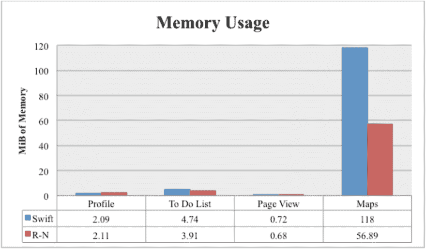

# 反应本地与本地开发:性能实验

> 原文：<https://dev.to/colinsimpson/react-native-vs-native-development-performance-experiment-3j1e>

这篇文章旨在比较 React Native 和其他形式的原生开发，并研究它们之间的差异。这个实验展示了两种不同编程语言 Swift 和 React Native 的内存使用情况(见图)。该实验的目的是发现哪种编码语言的内存效率更高，测试是使用外观和功能完全相同的应用程序进行的。

在应用程序的前三个视图中，两种编码语言之间的差异是用户察觉不到的最小百分比。然而，当移动到高内存需求的地图视图时，很明显 React-Native 比 Swift 少使用 61MB 内存，从而使 Swift 相形见绌。

如图所示，React-Native 在高要求进程的内存使用方面表现得比 Swift 更好。测试以公平的方式进行，提供了重复的结果，平均值显示在图中的条形图上。这是一个令人惊讶的发现，因为它表明 JavaScript 等广泛使用的编程语言可以用于开发高效的移动设备应用程序，其性能甚至超过本地编码语言。

**React Native 的缺点**

虽然 React Native 对它有很多好处，但是这个框架也不是没有缺点。该框架包含明显的缺陷，可能会使 React Native 对一些开发人员来说难以使用。首先，目前只有少量的文档可用于框架，其中大部分是由脸书通过框架的发布说明提供的。

React Native 的另一个问题是，该工具总是在适应和更改新版本，这意味着它是一个高维护性的框架。开发人员必须确保他们能够知道如何使用所需的 React Native 的当前版本。许多公司，比如圣地亚哥的[app development](https://www.bluekiteapps.com/)让他们的开发者了解最新的版本。

当编写 React 本机应用程序时，它并不总是真正跨平台的，因为同一个应用程序不能同时利用本机功能和作为独立的 web 应用程序。React 也有一个陡峭的学习曲线，它的结构和编写不同于普通的 HTML 和 JavaScript web 应用程序。这种学习曲线可能会阻碍应用程序的生产。

由于 React Native 能够利用本机组件和功能，为了最大限度地发挥其潜力，开发人员必须预先了解该平台上的本机开发。然而，致力于开发应用程序的开发人员能够克服这些缺点。