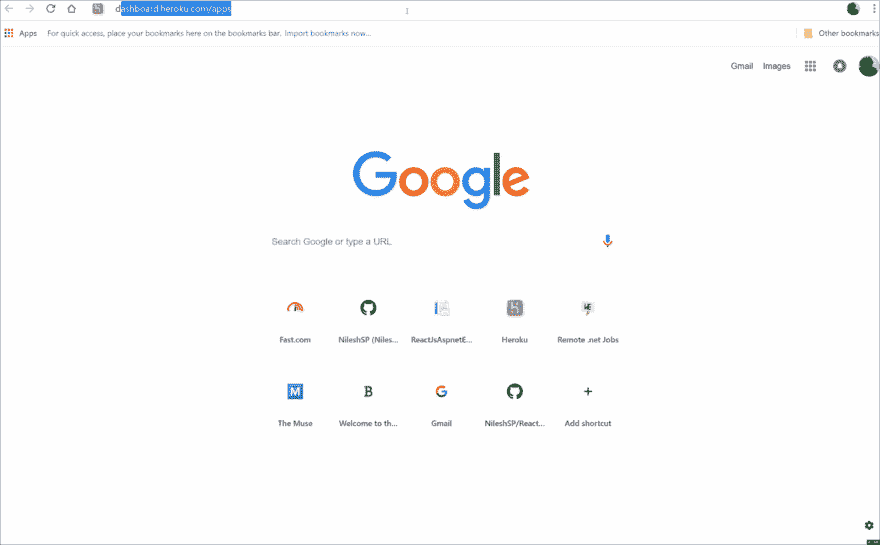
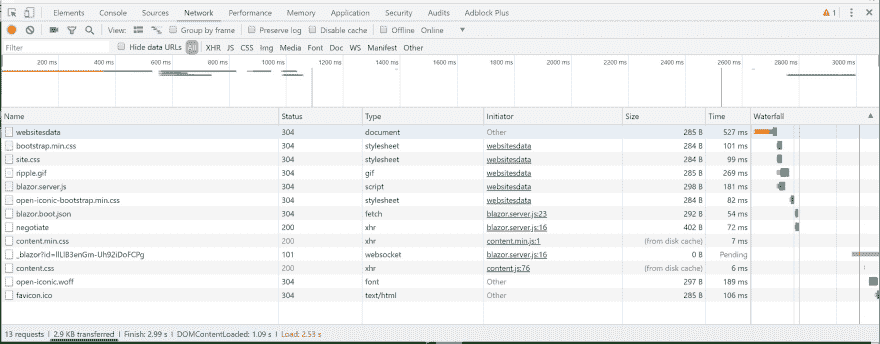

# 实时服务器端使用 html、css 和服务器语言呈现 web 应用程序，无需编写任何 JavaScript 代码

> 原文：<https://dev.to/nileshsp/real-time-server-side-rendered-web-applications-using-html-css--server-language-without-writing-a-single-line-of-javascript-4no1>

现在已经是 2019 年了，技术发展到目前为止，当谈到网络应用程序时，有许多选择可以尝试不同的组合。作为一个全栈开发人员，在过去的十年中，我不得不从事多种技术结合的项目。当谈到实时功能时，首先想到的总是 web 套接字的 javascript 实现。在几年前推出 webassembly 标准后，微软在近一年前推出了名为[Blazor.net](https://blazor.net)(仍在实验中)[的框架](https://blogs.msdn.microsoft.com/webdev/2018/02/06/blazor-experimental-project/?ranMID=24542&ranEAID=je6NUbpObpQ&ranSiteID=je6NUbpObpQ-mo17T_cKvNZQ1Y5AZc7rKg&epi=je6NUbpObpQ-mo17T_cKvNZQ1Y5AZc7rKg&irgwc=1&OCID=AID681541_aff_7593_1243925&tduid=(ir__9xciw9kee9kfr1202j3ttrvko32xhpb031pfjc1u00)(7593)(1243925)(je6NUbpObpQ-mo17T_cKvNZQ1Y5AZc7rKg)()&irclickid=_9xciw9kee9kfr1202j3ttrvko32xhpb031pfjc1u00)，主要允许使用服务器语言和 html(也有 javascript interop 选项)创建 web 应用程序，这些应用程序可以在浏览器中通过 WebAssembly 运行。看完视频后

[https://www.youtube.com/embed/GI_9g9lZpik](https://www.youtube.com/embed/GI_9g9lZpik)

去年年底，我们使用 Blazor 的服务器端模板 ( [创建新项目时的一个选项](https://blazor.net/docs/get-started.html))尝试了演示项目

## [NileshSP](https://github.com/NileshSP)/[dotnetefrazorcompssr](https://github.com/NileshSP/dotnetefrazorcompssr)

### Blazor/Razor 组件服务器端呈现的 web 应用程序

<article class="markdown-body entry-content p-5" itemprop="text">

# 内置通过浏览器访问 SSR(服务器端渲染)的 Blazor/Razor 组件。Net Core(2.1)使用实体框架代码优先连接内存/MS-Sql db

项目展示了 Blazor/Razor 组件前端 UI(使用 C#)在服务器(SSR)上呈现，使用来自内存/sql 数据库的数据。Net 核心服务，实体框架代码优先于数据库模式

整个项目使用 SignalR(框架的一部分，不需要显式实现)在客户端和服务器之间进行通信，以呈现 HTML(构建在服务器上)和面向 C#的 UI

[现场演示链接——https://dotnetefrazorcompssr.herokuapp.com/](https://dotnetefrazorcompssr.herokuapp.com/)

# 项目运行的步骤

先决条件:

> 1.  [.网芯 2.1 SDK](https://www.microsoft.com/net/download/dotnet-core/2.1)
> 2.  [Visual Studio code](https://code.visualstudio.com/) or recommended- [editon version 15.9.1](https://visualstudio.microsoft.com/vs/community/) or higher in the visual studio community.

在本地将当前存储库克隆为`git clone https://github.com/NileshSP/dotnetefrazorcompssr.git`

步骤:使用 Visual Studio 社区版编辑器

> 1.  Open the download library.
> 2.  The solution file (DotnetEFRazorCompSSR.sln) under the root folder of, according to …
> 
> 所示的状态等待项目就绪

</article>

[View on GitHub](https://github.com/NileshSP/dotnetefrazorcompssr)

with working [demo link](https://dotnetefrazorcompssr.herokuapp.com/websitesdata) as

 [ Live app 链接](https://dotnetefrazorcompssr.herokuapp.com/websitesdata) -通过使用 docker 将 app 作为容器托管，在 heroku 上可用

大部分显示元素的渲染代码，比如过滤器、数据表和持续更新当前服务器时间选项都在一个 T2 文件中，除了需要的 c#、css 和 T4 html 之外，没有任何 javascript

关于实时功能，

*   *当前服务器时间*正在使用计时器以 1000 毫秒的间隔从服务器不断更新
*   每一行的表数据以 100 毫秒的间隔可用(类似于流的功能，其中每当关联的数据实体与新项目一起被添加时，它被流传输并在浏览器中对客户端可用)

最好的部分是下载到客户端浏览器的大小非常少，在这种情况下，它总共是 2.9KB

这让我想到用新的方法创建实时应用程序，这种方法只需要很少的代码就可以使用多种语言或技术

让我知道你们的想法&谢谢你们的来访！