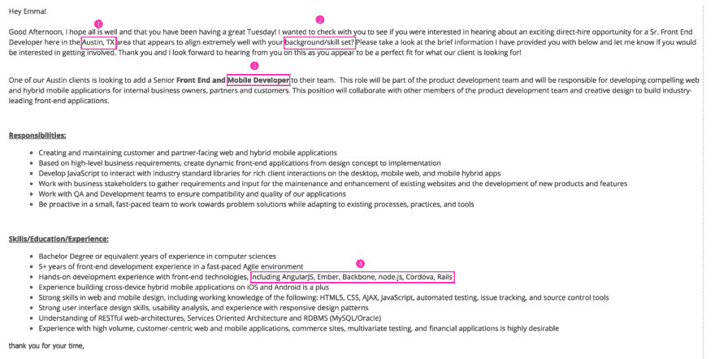
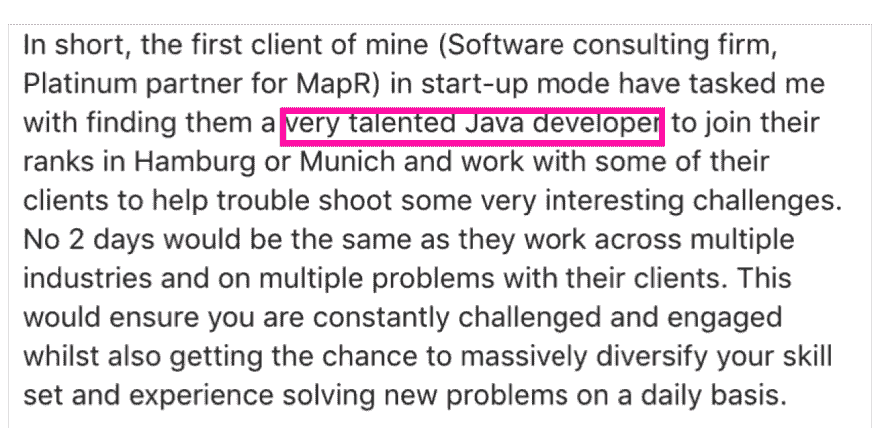

# 你的技术招聘邮件失败的原因

> 原文：<https://dev.to/emmabostian/reasons-why-your-technical-recruiting-emails-are-failing-1nf8>

招聘人员的工作很困难。你的任务是为一个你可能并不完全熟悉的职位招聘最好的技术人员。压力很大。但不幸的是，你可能正在实施搬起石头砸自己脚的招聘策略。

作为一个每周都会收到大量招聘邮件的人，我列出了我最讨厌的事情和避免这些事情的建议。让我们开始吧！

# 案例分析 1:冗长&含糊不清

我的个人邮箱收到了很多类似这样的邮件。招聘人员会先说一两句漂亮的话，祝我有个愉快的一天，然后就直接进入这个职位。虽然我很欣赏这种情绪，但通常前两句话是招聘人员花时间为我定制的电子邮件的唯一方面。这是一面巨大的红旗。

让我们来看一下我主要关心的一些问题。

### 1。这份工作在德克萨斯州的奥斯汀

我收到了许多德克萨斯州奥斯汀地区的求职信息。乍一看，这似乎没什么大不了的。除了一件小事…我 10 个月前搬出了德克萨斯州的奥斯汀，卖掉了所有的东西，搬到了德国。

许多通过 LinkedIn 联系我的招聘人员可以快速轻松地核实这些信息。

这份工作在德克萨斯州，这一事实向我表明，招聘人员进行了简单的关键字搜索，以将这一角色与我的个人资料相匹配，甚至没有试图进行肤浅的调查，以确定这份工作是否真的适合。

**招聘提示:**如果你想招聘人才，对照算法给出的名单，交叉检查候选人在 LinkedIn 或个人投资组合上的现实职业情况。该算法目前通常不正确和/或不相关。

### 2。标点符号&语法是关键

对于许多招聘人员来说，英语不是他们的第一语言，我能理解这一事实。我不是来批评句子结构或措辞的。

话虽如此，你还是想让我相信这个角色很棒！那么，你为什么告诉我这份工作“……似乎与你的背景/技能非常匹配？”是还是不是？

招聘提示:让同事校对工作申请，在陈述时要自信。在这里添加一个问号，虽然可能是无意的，但让我相信这个角色并不像你让它出现的那样拼凑，不幸的是，我看到这种情况发生了很多次。

### 3。我不是，也从来不是一个移动开发者

如果招聘人员告诉我一份工作非常适合我，然后继续描述我一生中从未涉足的技能或角色，我就看完了这份工作描述。

这是算法身份危机的又一个案例。我甚至没有上过移动开发课程，所以不，先生，我不适合移动开发的角色。

招聘提示:快速浏览一下候选人的个人资料，看看他们的兴趣和/或技能是否符合你声称“最适合他们”的工作角色一些候选人可能希望承担一个全新的角色，但如果他们的个人资料中没有列出任何关于这个角色的内容，那么很可能这个角色不适合他们。

### 4。不切实际的期望

我们又一次遇到了不切实际的期望。因此，工作描述通常需要大量全栈框架和技术的实践经验。特别是这一个，需要有三种不同前端框架的经验。别这样。

在我的个人资料中，我几乎没有列出过 Ember、Backbone、Cordova 或 Rails。那么我真的是一个“完美的合适人选”吗？

**招聘提示:**是的，精通所有框架的候选人更佳，但完全不切实际。相反，寻找一个对 JavaScript 和/或 1-2 个框架有深刻了解的候选人。具有持续学习能力的候选人也是首选。但是，你不能指望开发人员对这许多不同的技术有深刻的实践经验。

### 全局性问题&达成共识

乍一看，这封邮件太长了，我无法阅读。通常我甚至不会处理这么长的邮件。给我们做决定所需的相关信息，去掉所有的废话。

这封邮件，尤其是责任，是如此的难以置信的模糊，以至于我不得不反复阅读，试图弄清楚它们。

招聘提示:不要用时髦的词语和填充语言来编造职位描述。保持简单和真实。实际上，为候选人量身定制一封电子邮件也没什么坏处；付出额外的努力会对招聘大有帮助。

# 案例分析二:完全错误的角色

### 我不是后端开发者

我不知道为什么招聘人员似乎认为我会对后端角色感兴趣。我在大学期间使用 Java，但在我的职业生涯中很少用它编码。如果招聘人员花五分钟浏览我的个人资料，他们就会知道这一点。

**招聘提示:**如果你是在搜索后端候选人，不要挖走前端开发人员。这些领域本质上是不同的，99.9%的时候你不会找到一个愿意交换立场的前端开发人员。

你也许能找到全栈开发者，但一般来说一个有实践经验的前端开发者是不会感兴趣的。

仅仅因为有人在他们的 LinkedIn 上列出了 PHP 或 Java 并不意味着它是相关的。花点时间看看他们在过去五年中担任了什么角色。这将是一个非常清晰的指标，表明他们希望向何处发展。

# 案例研究 3:你是最合适的人选，但是你还认识其他人吗？

### 但是我真的完美吗？

如果你只是花了整个谈话告诉我，我是一个角色的完美人选，而在收到我不幸不感兴趣的信息时，你问我是否知道有人可能感兴趣，这破坏了你的可信度。

招聘小贴士:永远不要向你声称非常适合这个职位的候选人问这个问题。相反，让他们来找你。

如果我知道有人在寻找这样的职位，而你是一个很棒的招聘者，我会很乐意提供这些信息。

相反，如果你试图向我示好，就好像我是地球上最后一个开发人员一样，只是转过身来问我是否知道任何人适合这个角色，我会立即停止与你的谈话。

如果开发人员心中有人选，就让他们带着信息来找你。

* * *

# 结论

我同情技术招聘人员。这是一个残酷的行业，我当然不能做。但是通过实施我上面列出的建议，你会很快找到你渴望的顶尖人才。

我喜欢和优秀的招聘人员一起工作，在我的职业生涯中我遇到过好几个这样的人——我甚至记得他们的名字！所以不要急于求成，而是要直接、自信、直截了当。付出额外的努力来确保这些候选人真的很适合。加入一些个人风格，向候选人展示他们不仅仅是名单上的另一个名字，你会发现更有价值的候选人。