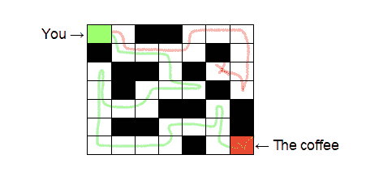
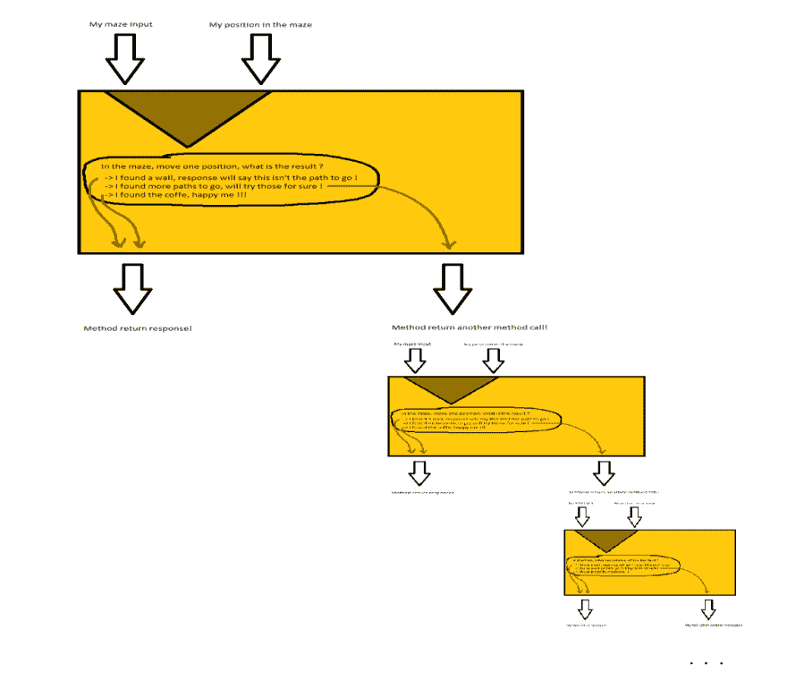
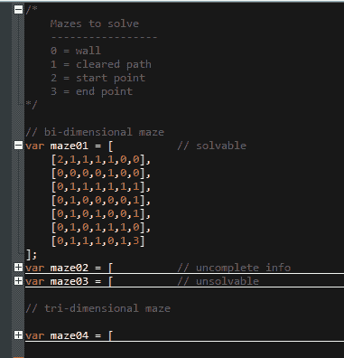
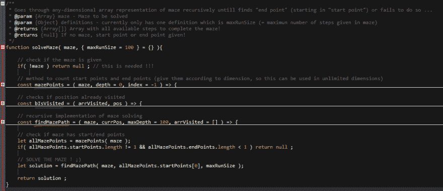

# 递归方法

> 原文：<https://dev.to/killants/reccursive-methods-229b>

# 简介

你好，我的主要目标还是分享知识和代码。请随意给出任何类型的反馈，并以任何您认为更好的方式改进我的代码。

这次我将增加一些关于递归方法的解释，而不仅仅是代码本身。

# 递归方法

递归方法是这样一种方法，它可以在某个时候调用自己，以便将问题简化为一个简单的结果，然后方法本身可以返回该结果作为响应。

当试图在不同的问题上实现时，开始时可能会有点混乱，但是一旦习惯了，使用这种解决问题的方法会更加合理。

没有任何进一步的延迟，让我们直接进入递归！

就像我学到的所有东西一样，当给出例子时，我总是学得更好，所以这里是我的问题的例子，我们将用递归来解决它(这里没有代码)。

## 问题:

你是一个在工作中昏昏欲睡的程序员，你需要给自己弄一杯好咖啡！但是你工作的办公室一片混乱，令人困惑！

你的目标是拿到咖啡，但是怎么拿到呢？好吧，即使这个“迷宫”很简单，我的第一个方法也是“尝试一下”！
于是，我挑了一个方向开始走，每次遇到障碍就改变方向。

有些决定可能是“坏的”,因为我让自己陷入了无路可退的境地，但我知道在我的下一次尝试中，如果我不再走那条路，我会变得更好！走红色道路这个“坏”决定最终给了我解决方案！

现在，我想用递归方法解决我的问题，让我告诉你方法是非常相似的！

我的递归方法应该接收一个输入，对它做一些事情，然后返回结果。

让我们假设如下:

所以，我的递归方法接受迷宫和我的当前位置作为输入。

在我的方法中，我做了三个可能的动作之一:
1-我发现了一堵墙，哪儿也去不了，所以我返回“success”为假，这样我的链式递归调用就收到了这个信息，知道这不是要走的路；
2-我发现了更多的路径要遵循，将通过将我的位置改变到该路径的下一个位置来遵循它们，并返回方法本身被调用的结果；
3-我找到了咖啡，非常类似于第一个响应，我将返回“成功”为真，所以链式递归调用知道这是要走的路；

这里是递归实现的地方，每次我知道有一条路径可循，我就像在那条路径上一样调用方法本身！如果迷宫是可解的，返回的结果将最终为真！

现在，让我们看看这个想法的一些代码:

[点击此处链接至要点代码！！！](https://gist.github.com/killants/e296b85e28cf47a85039e33d46d9cec4)

你能在这个要点中找到什么？我做了一个简单的递归函数来设置这个例子。

我给出了一个我在方法测试中使用的已经构建好的“迷宫”:

递归方法本身:

用绿色下划线标出的是我做的一个方法(也是递归的),它检索迷宫的所有起点和所有可能的终点！

紫色下划线的方法仅验证给定数组中是否已经有对象“pos ”,这用于避免递归方法在已有方法的相同点上来回移动。

橙色下划线的是递归迷宫求解器方法，只是想指出在我们的递归方法中定义一些“刹车”是很重要的(“刹车”=当达到一个极限时跳出递归的一些断点，以避免无限的方法调用)。

在我的实现中，我接收所有的迷宫点(起点和终点)，并从唯一的起点开始，直到到达任何终点，这是我的第一个解。我还改变了我构建的原始方法，以呈现给你们，所以它可以处理无限维，在这种情况下，一维代表一个轴。

我不会重复我的代码，但是我可以回答任何关于它的问题。我给它加了注释，这样更容易理解。

希望你们觉得它有用，无论如何都可以随意使用它，并对它进行改进。