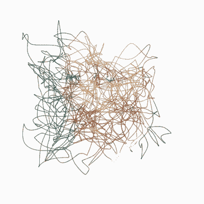
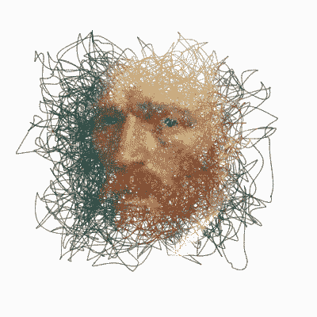
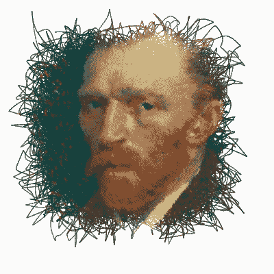
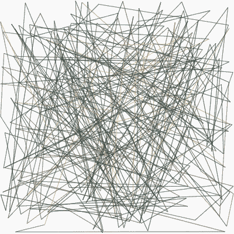
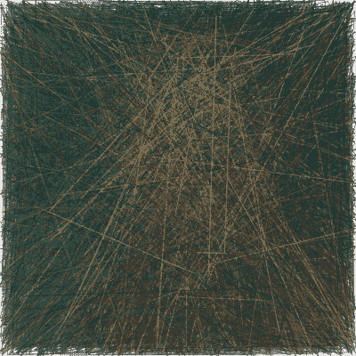
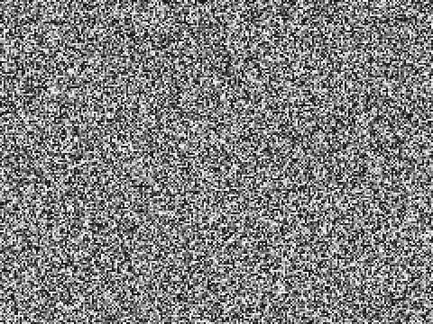
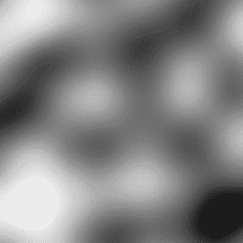
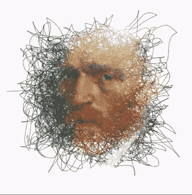

# 使用 p5.js 用生成艺术重新创作绘画

> 原文：<https://dev.to/unography/recreating-paintings-with-generative-art-using-p5-js-1e46>

*一串随机的、弯弯曲曲的线条被绘制成一幅梵高的肖像。*

上述方法使用了两个概念- **随机游走**，和**柏林噪声**。

想象你走在一条空旷的路上，今天是假日，你拥有世界上所有的时间。每 10 秒钟，你抛一枚硬币。正面，你向前一步。反面，是退步。这就是随机漫步的本质——由一系列随机步骤定义的路径。

现在不是一条空路，假设它是一个迷宫，在那里你可以选择向左和向右走一步，以及向前和向后的方向。现在你拿起两枚硬币，根据它们的翻转情况决定一步的方向，例如，如果是正面和反面，你可以向前走一步，向左走一步，以此类推。

这类似于上面的算法所做的。在两点之间画出线条——从一个初始点`(x1, y1)`开始，目的点`(x2, y2)`是根据某种随机性选择的。在下一次迭代中，初始点现在变成了过去的`(x2, y2)`，整个事情再次重复。

为了得到颜色，我们在这里取目标点的 rgb 值`(x2, y2)`。我们也可以采用初始像素值，但是由于点之间的距离很大，而且很多时候是从背景开始的，所以采用目标像素值更有意义。纯属个人喜好。

现在我们到了随机性部分。

几乎所有的编程语言和库都有一个 *random()* 函数。我们可以用它来得到一个随机的方向，并相应地画出线条，但问题是，我们得到的结果也是随机的。

 

有趣的效果，但不完全是我们想要的。

我们希望我们的线条是随机的，但也希望它们有某种模式，这样最终的结果就不会那么混乱。

输入**柏林噪音**。

由 Ken Perlin 发明，这是一种以随机方式获得分数的方法，但也遵循一定的模式。

这就是随机噪声的样子——在调用一个随机函数并绘制它们之后获取的连续点。

这就是柏林噪声的样子——在调用 2D·柏林噪声函数并绘制它们之后获取的连续点。

两种情况下的点都是随机的，然而在第二张图片中，它们有一种视觉美感。

在 p5.js 中，简单地调用`noise()`而不是`random()`给出了这种类型的模式，这就是我们用来获得半随机目的地点的模式。

如果你厌倦了只看梵高的作品——代码被部署在这里，每次你刷新页面，你都会得到一幅新的、随机的画！

~[https://unographymag.com/void](https://unographymag.com/void)

*查看一些资源！:*

1.  [丹尼尔·希夫曼随机漫步](https://www.youtube.com/watch?v=l__fEY1xanY&)
2.  [丹尼尔·希夫曼介绍柏林噪声](https://www.youtube.com/watch?v=Qf4dIN99e2w)