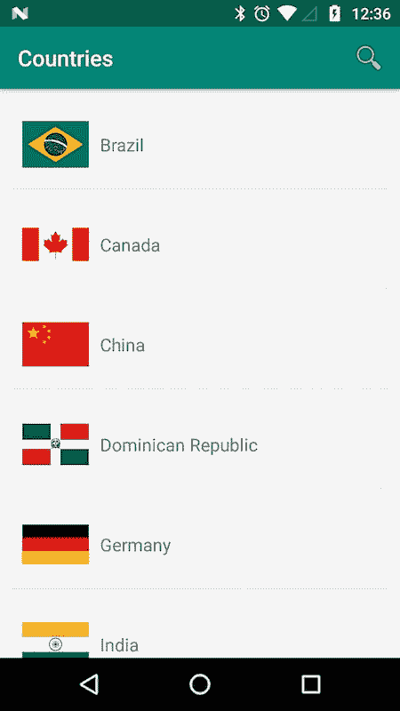

# Recyclerview 基础知识(第 2 部分):适配器和视图保持器

> 原文：<https://dev.to/raulmonteroc/recyclerview-basics-part-2-adapters-and-viewholder-36ek>

[](https://res.cloudinary.com/practicaldev/image/fetch/s--_6z1D426--/c_limit%2Cf_auto%2Cfl_progressive%2Cq_auto%2Cw_880/https://raulmonteroc.com/wp-content/uploads/2019/01/recyclerview-basics-part-2.png)

欢迎回来！在介绍了什么是 recyclerview 之后，是时候开始深入研究细节了。

这一次，我们将讨论适配器和视图持有者对象，以及它们如何协同工作。在这一点上，我们知道它们是什么，它们扮演什么角色，现在是时候将这些知识付诸实践了。

如果这对你来说没有太大的意义，或者这是你的第一篇文章，花几分钟读一下[recycler view](https://raulmonteroc.com/?p=785)的介绍，然后再回来。

## 第一步:明确我们的任务。

完成任何事情的第一步是有一个明确的目标和一系列的步骤和任务来帮助我们达到目标。在这种情况下，我们的目标是了解适配器和视图持有者，为了实现这一点，我们将使用一个示例项目，这个简单的项目可以说明适配器和视图持有者的主要用法，而不必太担心其他细节。

这个 android 应用程序将列出所有国家的名称和国旗，所有来这里阅读至少一次的人。当我们完成后，我们应该有类似下图的东西

[](https://res.cloudinary.com/practicaldev/image/fetch/s--qLDQzGTx--/c_limit%2Cf_auto%2Cfl_progressive%2Cq_auto%2Cw_880/https://raulmonteroc.com/wp-content/uploads/2019/01/recylerview-basics-main-screen.jpg)

## 第二步:添加 UI 和资源。

现在有了一个明确的目标，下一步是添加用户将与之交互的视觉资源，在本例中，是旗帜图像和元素的布局(稍后将详细介绍)。

### 添加旗帜图片

现在，我们只是将图像导入到我们的项目中，以便能够在创建 UI 时使用它们(在后面的步骤中)。

要获取图像，只需进入[这里](https://github.com/RaulMonteroC/countryflags/tree/master/app/src/main/res)，将所有可绘制的文件夹复制到项目的 **res** 文件夹中，然后等待项目同步。

### 创建 UI

recyclerview 有三个用于向用户显示数据的组件:

*   包含它的片段或活动中的**recycle view 标签**。
*   描述如何显示 recyclerview 的每个单独元素的**布局**。
*   描述元素在 recyclerview 中如何排列的 **LayoutManager** 。

我们首先开始定义 recyclerview 标记。在我们的例子中，我们只需要编辑 activity_main.xml 布局文件，删除除根容器之外的所有内容，然后添加 recyclerview 标记，确保它占用所有可用空间，如下所示:

```
<?xml version="1.0" encoding="utf-8"?>
<LinearLayout xmlns:android="http://schemas.android.com/apk/res/android" 
              xmlns:tools="http://schemas.android.com/tools" 
              android:layout_width="match_parent" 
              android:layout_height="match_parent" 
              tools:context=".MainActivity" 
              android:orientation="vertical"/> 

    <android.support.v7.widget.RecyclerView 
            android:id="@+id/countryRecyclerView" 
            android:layout_width="match_parent" 
            android:layout_height="match_parent" 
            tools:listitem="@layout/country_item" /> 

<LinearLayout/> 
```

有了这个设置，我们可以继续每个元素的布局。定义布局非常简单，与我们之前所做的类似，我们在布局文件夹中创建一个新的 xml 布局文件，将其命名为 **country_item.xml** ，并以与处理活动或片段相同的方式定义其内容。

在我们的例子中，为了简单起见，我们只在左侧有旗帜图像，在右侧有文本，还有一个视图作为每个元素的行分隔符。下面是代码:

```
<android.support.constraint.ConstraintLayout
        xmlns:android="http://schemas.android.com/apk/res/android"
        xmlns:tools="http://schemas.android.com/tools"
        xmlns:app="http://schemas.android.com/apk/res-auto"
        android:layout_width="match_parent"
        android:layout_height="@dimen/country_item_size">
    <ImageView
            android:id="@+id/countryFlag"
            android:layout_width="@dimen/flag_size"
            android:layout_height="match_parent"
            app:layout_constraintStart_toStartOf="parent"
            tools:srcCompat="@drawable/dominican_republic"
            android:padding="@dimen/normal_padding"
            android:contentDescription="@string/country_flag_description"/>
    <TextView
            android:id="@+id/countryName"
            android:layout_width="wrap_content"
            android:layout_height="wrap_content"
            app:layout_constraintStart_toEndOf="@id/countryFlag"
            app:layout_constraintTop_toTopOf="parent"
            app:layout_constraintBottom_toBottomOf="parent"
            tools:text="Dominican Republic"
            android:textSize="@dimen/normal_text_size"/>
    <View
            android:layout_width="match_parent"
            android:layout_height="1dp"
            android:background="@color/country_element_separator"
            app:layout_constraintBottom_toBottomOf="parent"/>
</android.support.constraint.ConstraintLayout> 
```

这里需要注意一些事情:

*   我使用 ConstraintLayout 是因为我发现用这种方式描述布局更容易(也更有效)，这不是唯一的方法，你可以使用 LinearLayout 甚至 GridLayout。
*   我使用@dimen/key 和@color/key 来防止使用硬编码的大小和颜色值。这就像@strings/key 和 strings.xml 文件一样。
*   我避免在 height 属性上使用 match_parent，以防止单个元素占用所有屏幕空间。在本例中，我使用了一个特定的值，但是如果对您有意义的话，也可以使用 wrap_content。
*   我使用 tools 名称空间来定义仅对预览器可见的值，比如国家的名称和图像。

版面管理器呢？在这种情况下，我们将使用 LinearLayoutManager 对象，它将布局组织成一个元素列表，其中每一行占据所有可用的宽度，我们在最后一步中设置它。

## 第三步:实现适配器和视图持有者类

有了手头的所有资源，我们现在可以专注于将数据获取到 recyclerview。我们用适配器和视图持有者对象来做这件事。

如果你还记得[的上一篇文章](https://raulmonteroc.com/?p=785)的话，适配器对象负责从模型中获取数据，处理数据，并使用 ViewHolder 对象将数据发送到 recyclerview，作为将数据绑定(显示)到 UI 的一种方式，因为它们是来自每一行元素的 kotlin/java 端的表示。

也就是说，是时候创建我们的适配器类并让数据通过了。第一步是创建 adapter 和 viewholder 类，每个类都继承自它们对应的超类

*   适配器类继承自`Adapter<VH extends RecyclerView.ViewHolder>`
*   视图持有者类继承自`RecyclerView.ViewHolder`

然后，我们必须实现从基本适配器类继承的方法，每个方法都有不同的用途:

*   **OnCreateViewHolder:** 返回每行的视图持有者(来自 kotlin/java 代码的表示)
*   **GetItemCount:** 返回元素的总数
*   **OnBindViewHolder:** 将数据从模型绑定到 UI

当我们把所有这些加起来时，我们得到了两个类的框架代码，如下:

```
package com.raulmonteroc.countryflags
import android.support.v7.widget.RecyclerView
import android.view.LayoutInflater
import android.view.View
import android.view.ViewGroup
import android.widget.ImageView
import android.widget.TextView
import com.raulmonteroc.countryflags.CountryAdapter.FlagViewHolder

class CountryAdapter : RecyclerView.Adapter<FlagViewHolder>() {

    override fun onCreateViewHolder(p0: ViewGroup, p1: Int): FlagViewHolder {
    }

    override fun getItemCount(): Int {
    }

    override fun onBindViewHolder(p0: FlagViewHolder, p1: Int) {
    }

    class FlagViewHolder(itemView: View) : RecyclerView.ViewHolder(itemView)
} 
```

现在，是时候实现所有的方法了:

*   对于 **onCreateViewHolder** ，我们只需要返回一个视图持有者对象，由于视图持有者构造函数需要一个视图，我们只需扩展我们之前为行创建的 XML 布局，并将该视图实例传递给新视图持有者的构造函数。
*   对于 **getItemCount** ，我们将向适配器的构造函数传递一个元素集合来保存所有元素，并使用该集合的大小来返回所涉及的元素数量。
*   对于* *onBindViewHolder，** 我们将在 ViewHolder 对象上创建一个 bind 方法，从布局(我们在实现的第一个方法中传递的布局)中获取元素，并为传递的模型对象赋值，就像我们对任何活动或片段所做的那样。

我知道如果没有代码，这可能有点抽象，所以这里是具有上述所有功能的完整适配器代码。

```
package com.raulmonteroc.countryflags
import android.support.v7.widget.RecyclerView
import android.view.LayoutInflater
import android.view.View
import android.view.ViewGroup
import android.widget.ImageView
import android.widget.TextView
import com.raulmonteroc.countryflags.CountryAdapter.FlagViewHolder

class CountryAdapter(private val countries: List<Country>) : RecyclerView.Adapter<FlagViewHolder>() {

    override fun onCreateViewHolder(parent: ViewGroup, viewType: Int): FlagViewHolder {
        val layoutInflater = LayoutInflater.from(parent.context)
        val view = layoutInflater.inflate(R.layout.country_item, parent,false)
        return FlagViewHolder(view)
    }

    override fun getItemCount() = countries.size

    override fun onBindViewHolder(viewHolder: FlagViewHolder, position: Int) = viewHolder.bind(countries[position])

    class FlagViewHolder(itemView: View) : RecyclerView.ViewHolder(itemView) {

        private val name:TextView = itemView.findViewById(R.id.countryName)
        private val flag:ImageView = itemView.findViewById(R.id.countryFlag)

        fun bind(country : Country) {
            name.text = country.name
            flag.setImageResource(country.flagImageResource)
        }
    }
} 
```

## 第四步:将 recyclerview 连接到 activity。

现在我们已经让所有部分都工作了，剩下的就是把它们连接在一起，更具体地说，让适配器、recyclerview 和 activity 像一个微调的管弦乐队一样工作。

我们通过设置一些 recyclerview 属性并确保从 onCreate 方法调用它们来实现，步骤如下:

1.  使用 findViewById 获取 recyclerview 的实例
2.  将布局管理器设置为 LinearLayoutManager，以将 Recylerview 呈现为项目列表
3.  设置适配器属性

```
package com.raulmonteroc.countryflags
import android.support.v7.app.AppCompatActivity
import android.os.Bundle
import android.support.v7.widget.LinearLayoutManager
import android.support.v7.widget.RecyclerView

class MainActivity : AppCompatActivity() {
    lateinit var countryRecyclerView: RecyclerView

    override fun onCreate(savedInstanceState: Bundle?) {
        super.onCreate(savedInstanceState)
        setContentView(R.layout.activity_main)
        setupRecyclerView()
    }

    private fun setupRecyclerView() {
        countryRecyclerView = findViewById(R.id.countryRecyclerView)
        countryRecyclerView.layoutManager = LinearLayoutManager(this)
        countryRecyclerView.adapter = CountryAdapter(CountrySeed().seed())       
    }
} 
```

您可以注意到在初始化适配器时传递了一个 **seed()** 方法，这只是为了提供 recyclerview 将要显示的数据。

下面是代码

```
package com.raulmonteroc.countryflags
class CountrySeed {

    fun seed(): List<Country> {
        val countries = listOf<Country>(
            Country("Brazil", R.drawable.brazil),
            Country("Canada", R.drawable.canada),
            Country("China", R.drawable.china),
            Country("Dominican Republic", R.drawable.dominican_republic),
            Country("Germany", R.drawable.germany),
            Country("India", R.drawable.india),
            Country("Netherlands", R.drawable.netherlands),
            Country("norway", R.drawable.norway),
            Country("Peru", R.drawable.peru),
            Country("Philippines", R.drawable.philipines),
            Country("Poland", R.drawable.poland),
            Country("Romania", R.drawable.romania),
            Country("South Africa", R.drawable.south_africa),
            Country("Spain", R.drawable.spain),
            Country("Sweden", R.drawable.sweden),
            Country("United Kingdom", R.drawable.united_kingdom),
            Country("United States", R.drawable.united_states)
        )
        countries.sortedBy { it.name }
        return countries
    }
} 
```

## 接下来

现在我们有了一个工作的 recyclerview，有了数据和元素的自定义布局，而且只需要一点努力，这很棒，对吗？。

在我们的 recycle view 系列中，我们将更新这个项目，使 recycle view 能够响应触摸手势，如拖动和滑动

到时候见！