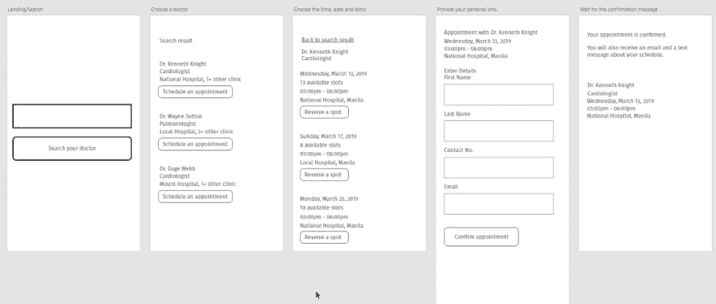
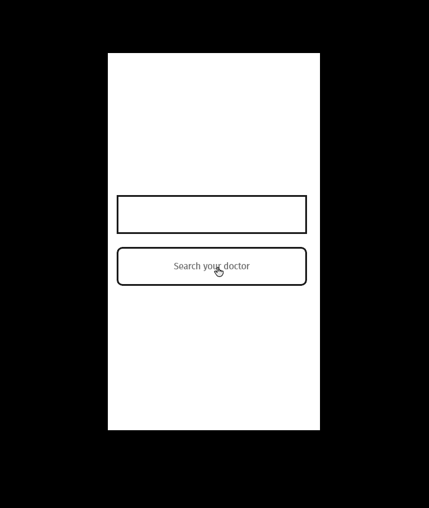
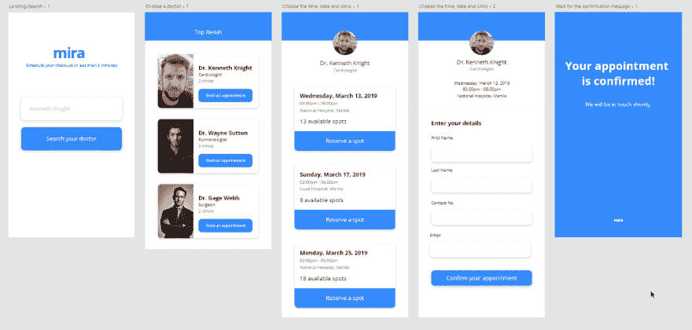
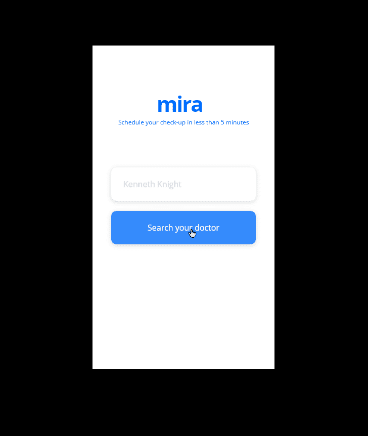

# 重新设计患者与医生预约的体验——UX 案例研究

> 原文：<https://dev.to/juniusfree1/redesigning-the-patients-experience-of-scheduling-an-appointment-with-a-doctor---a-ux-case-study-1mb0>

*最初发表于[Medium.com](https://medium.com/@juniusfree/redesigning-the-patients-experience-of-scheduling-an-appointment-with-a-doctor-a-ux-case-study-aaf00492b2f7)T3】*

### 简介

在我的父母开始生病后，我的任务之一就是预约医生。

安排与医生的预约是非常令人沮丧的，有很多问题和矛盾。这就是为什么我选择这个问题作为我的第一个 UX 学习项目。

对于这个项目，我设定了以下要求:

*   我只会在 1-2 天内完成
*   可交付成果是一个移动 web 应用程序的基本原型

* * *

### 理解问题

#### 待完成的工作—

我首先澄清了谁是用户，以及他们试图完成的工作。

根据我以前的经验，我考虑了两种类型的用户:

*   第一个是医生的秘书
*   另一组是病人(或他们的看护者)

在这个项目中，由于时间限制，我只关注病人。

> 工作被定义为用户“雇佣”产品或服务的原因。例如，我们“租”一辆车从 A 点到 b 点，我们“租”一把牙刷来清洁牙齿。

为了得到病人的工作，我问病人为什么给他们医生的秘书打电话。对这些有不同的看法。我可以专注于“从医生那里得到建议”这个更大的目标。我还可以看看“安排与医生的预约”这一具体目标，这是向“获得医生的建议”这一目标迈出的一步。我选择专注于预约的目标。

在设计过程中，我意识到这项工作有两种可能的环境。第一种情况是，患者正在寻找新的医生。第二种情况是当患者想要进行后续检查时。

由于时间限制，我只关注第二种情况。

这是我关注的最后一份工作声明:

> 患者希望与他们的医生预约他们的后续检查。

#### 工作步骤—

为了获得更多的细节，我还捕捉了患者可能尝试完成工作的步骤。

> 捕捉“工作步骤”的目标是发现我可以增加或提高价值的所有点的完整视图。

为此，我首先关注用户所依赖的当前平台和解决方案。

为了在今天完成工作，病人打电话给秘书预约。在此之前，他们可能试图从旧处方中检索电话号码。他们也可能在打电话之前试图回忆医生的时间表。

从这个观点出发，我抓住了这些步骤，并使它变得没有解决方案。使这些步骤无解决方案将帮助我理解用户的目标，并生成不同的特性。

如上所述，患者今天做的一个步骤是给秘书打电话。问病人为什么这样做，我可以得到几个重要的工作步骤。其中之一是确定如何获得预约。一些诊所根据先来先服务的原则安排病人。其他人更喜欢病人去诊所预约。

基于这个过程，我捕捉到了患者可能会感到沮丧的步骤:

*   确定如何与医生预约
*   确定医生的门诊时间
*   检查可用的时间和日期
*   根据我喜欢的时间和日期设置日程
*   确认与医生的预约
*   如果医生的时间表有变化，请及时通知
*   重新安排我的约会

有了作业和作业步骤的详细列表，我现在可以用更少的猜测来生成特征。

* * *

### 生成溶液

#### 产生想法:平台—

由于我在这个项目中的目标之一是创建一个数字产品，我唯一的选择是创建一个移动 web 应用程序。

#### 产生想法:特性——

接下来，我为将包含在 web 应用程序中的功能产生了一些想法。

我用上面的“工作步骤”作为起点。

我还研究了当前平台在成本、效率和结果方面是如何失败的。在此基础上，我确定我可以改进的方向。

我还使用创造力触发器来生成特征。

 
我如何生成特征的例子

利用这个过程，我想出了这个基本的功能集。我根据我将创建的用户流对其进行了组织:

**第一步:登陆页面/搜索医生**

*   它应该有一个搜索功能
*   它应该有一个如何向医生预约的清晰流程

**第二步:选择医生**

*   它应该允许病人找到并选择医生

**第三步:选择时间、日期和诊所**

*   它应该为用户提供几个日期和时间选项
*   它应该有一个医生诊所位置的列表
*   它应该有医生的最新门诊时间
*   它应该有一个时间和日期的列表，在接下来的 2 周内可用的地点

**第四步:提供你的个人信息**

*   它应该得到最少的关于病人的信息

**第五步:等待确认邮件**

*   它应该向患者发送电子邮件和/或文本消息

#### 创造原型——

在创建原型的过程中，我首先决定了我将在每个页面上包含的内容。我为每个页面添加基本的交互。

 
初始内容

 
初始交互原型

在规划了内容之后，我创建了一个基本的布局并改进了 UI。

 
最终原型

 
最终原型与交互

* * *

### 个人见解

进行我的第一次 UX 挑战并不容易，但也是值得的。有很多东西需要学习，比如研究、交互设计、原型工具等等。

* * *

### 下一步

由于时间和资源有限，我想在下一次 UX 挑战赛中做以下事情:

*   采访几个用户来验证问题并测试解决方案
*   改进用户界面和品牌
*   了解其他用户的“工作”。在这种情况下，我也应该理解秘书们的“工作”。

* * *

https://twitter.com/juniusfree🇵🇭