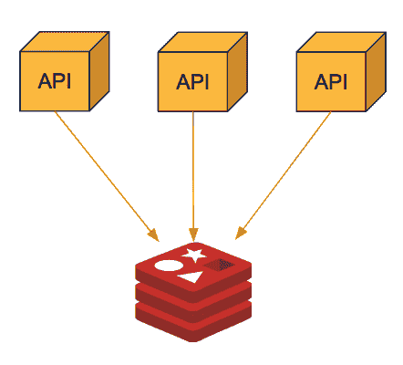
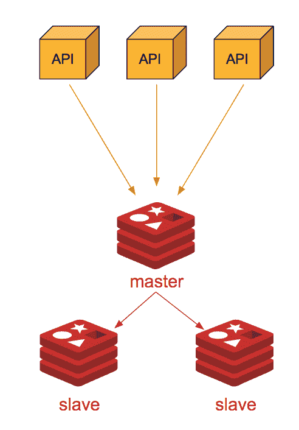
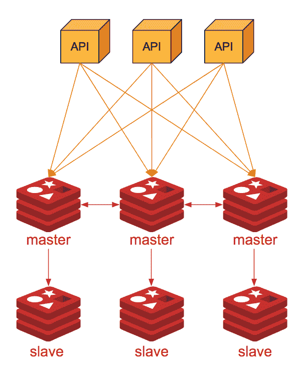

# Redis:复制，第 1 部分-概述。复制与分片。哨兵 vs 集群。Redis 拓扑。

> 原文：<https://dev.to/setevoy/redis-replication-part-1-an-overview-replication-vs-sharding-sentinel-vs-cluster-redis-topology-3ao9>

 最初，我计划写一篇小文章，举例说明如何创建 Redis 复制，但随着我读到越来越多的细节，我想描述得越来越多，所以最终我把这篇文章分成了两部分。

在这篇文章中，我们将简要介绍 Redis 数据分布类型和拓扑示例之间的差异。

在短期内，但链接到详细的文件和其他有用的职位在其他资源。

[在第二部分](https://rtfm.co.ua/en/redis-replication-part-2-master-slave-replication-and-redis-sentinel/)中–几个如何配置简单复制和 Redis Sentinel 复制的例子。

[第三部分](https://rtfm.co.ua/en/redis-replication-part-3-redis-py-and-work-with-redis-sentinel-from-python/)—`redis-py`用 Redis 复制和 Sentinel 库举例。

### 再复制 vs 沙丁

Redis 支持两种数据共享类型*复制*(也称为*镜像*，一种数据复制)，和*分片*(也称为*分区*，一种数据分段)。在这种情况下，Redis 集群可以同时使用这两种方法。

#### 复制

是一个数据复制集群中的所有 Redis 节点，它允许向一个或多个从节点发出请求，并在其中一些节点关闭时保持数据持久性，从而提供高可用性。

使用这种方法——*读*请求会更快。

参见[复制](https://redis.io/topics/replication)和 [Redis 集群主从模式](https://redis.io/topics/cluster-tutorial#redis-cluster-master-slave-model)。

#### 分片

通过数据分段，所有数据将被分割成几个部分，这将提高每个节点的性能，因为它将只存储部分数据，而不是服务于所有请求。

使用这种方法——*写*请求会更快。

参见[分区:如何在多个 Redis 实例中分割数据](https://redis.io/topics/partitioning)和 [Redis 集群数据分片](https://redis.io/topics/cluster-tutorial#redis-cluster-data-sharding)。

### 再发哨兵 vs 再发集群

#### 重复哨兵

被添加到 Redis v.2.4 中，基本上是一个主服务器和从服务器的监控服务。

此外，还可以发送通知，在主服务器关闭时自动切换主服务器和从服务器角色，等等。

可能适合用于没有完全集群的裸主从复制(见下文)。

它作为一个专用的守护程序，在*哨兵*模式下使用`sentinel`二进制或`redis-server`。

如果主服务器关闭，将执行节点重新配置–将从剩余的从服务器中选择新的主服务器。

要求至少有三个 Sentinel 实例具有新主选举的法定人数，并决定是否有一个 Redis 节点关闭

#### 再组团

添加到 Redis v.3.0 中，代表了一个完整的用于分段、复制及其节点管理的集群解决方案。

将执行数据同步、复制，管理节点访问持久性(如果某些节点将关闭)。

Redis 集群中的 Sentinel 用法没有意义，因为集群会自己做所有的事情。

参见[再说哨兵&再说群集—什么？](https://fnordig.de/2015/06/01/redis-sentinel-and-redis-cluster/)和[重复哨兵文件](https://redis.io/topics/sentinel)。

### 重定向拓扑结构

#### 一个重定向实例

最简单也是最经典的例子。

运行和配置简单。

受限于主机的资源 CPU 和内存。

在这种情况下，Redis 实例将停止运行–所有依赖的服务都将中断，并且没有任何可用性或容错机制。

#### 主从复制

一个主设备连接了多种类型的从设备。

数据将在此主服务器上更新，然后主服务器将这些更改推送到其副本服务器。

奴隶只能与主人交谈，不能与其他奴隶交流，但仍然可以拥有自己的奴隶

从节点是只读节点——除非没有明确配置，否则不能在那里执行任何数据更改(见本文第二部分[)。](https://rtfm.co.ua/en/redis-replication-part-2-master-slave-replication-and-redis-sentinel/)

如果任何节点出现故障，所有数据仍可用于客户端，因为数据在所有节点上复制。

配置简单，但是*写*操作受到主机资源的限制。

如果主服务器关闭，您必须手动重新配置从服务器，并将其中一个从服务器更改为主服务器角色。

此外，客户端需要知道它们必须使用哪个来进行写操作。

#### 重复哨兵

上面已经描述过了，但这里还要说几句。

与 Redis 复制类似，Sentinel 有一个主实例，它在决定 Redis 主实例的选举时具有优先权。

即，在一个 Redis 主机和两个从机的情况下，如果 Sentinel 主机在运行 Redis 主机的同一台主机上工作，并且该主机将关闭，则 Sentinel 将选择 Sentinel 的新主机实例，这两个 Sentinel 实例需要决定哪个 Redis 从机将成为新的 Redis 主机。

在此期间——一个哨兵的主人将在这样的选举中更有分量。

请记住，并不是每个 Redis 客户端都能与 Sentinel 一起工作，所有客户端都可以在这里找到[>>>](https://redis.io/clients)。

#### 再组团

最强大的解决方案是 Redis 集群。

有几个主实例，每个实例可以有一个以上(最多 1000 个)从实例。

将负责数据分片、复制、同步和故障转移操作。

必须至少有 6 个 Redis 节点–3 个用于主节点，3 个用于从节点。

可以将客户端请求重定向到必要的主或从主机，但客户端必须能够使用 Redis 集群。

### 相关链接

*   [复兴会](https://redis.io/community)
*   再复制
*   [重读集群教程](https://redis.io/topics/cluster-tutorial#redis-cluster-master-slave-model)
*   [重定向群集规范](https://redis.io/topics/cluster-spec)
*   [引申到再创簇沙丁](https://scalegrid.io/blog/intro-to-redis-cluster-sharding-advantages-limitations-deploying-and-client-connections/)
*   [如何从源设置 Redis 集群](https://howto.lintel.in/install-redis-cluster/)
*   [再复制 vs 沙丁](https://www.morpheusdata.com/blog/2015-03-14-redis-replication-vs-sharding)
*   [重定向群集与重定向复制](https://itschr.is/redis-cluster-vs-redis-replication/)
*   [重复哨兵&重复群集–什么？](https://fnordig.de/2015/06/01/redis-sentinel-and-redis-cluster/)
*   [您需要什么 Redis 部署？](https://blog.octo.com/en/what-redis-deployment-do-you-need/)

### 类似的帖子

*   <small>03/29/2019</small> [Redis:复制，第 2 部分-主从复制，Redis Sentinel](https://rtfm.co.ua/en/redis-replication-part-2-master-slave-replication-and-redis-sentinel/) <small>(0)</small>
*   <small>2018 年 8 月 5 日</small> [【日:儿基会、儿基会、儿基会、](https://rtfm.co.ua/redis-ustanovka-zapusk-primery/)<small>【0】</small>
*   <small>03/14/2019</small> [什么是:YAML——其概况、基本数据类型、YAML vs JSON、PyYAML](https://dev.to/setevoy/what-is-yaml--its-overview-basic-data-types-yaml-vs-json-and-pyyaml-4n1p) <small>(0)</small>