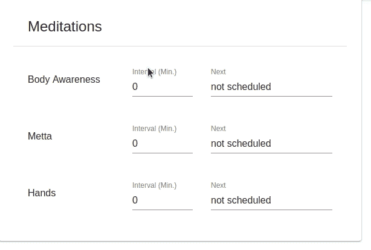

# 重构示例:反应组件

> 原文：<https://dev.to/joecannatti/refactoring-example-react--component-1kfl>

这篇文章是一个快速的例子，讲述了如何重构一个 React 组件，将业务逻辑排除在视图层之外。

我目前正在开发的产品的一个组成部分是微型冥想提醒。这个组件允许用户设置他们想要做 3 种不同类型冥想的时间间隔。

[](https://res.cloudinary.com/practicaldev/image/fetch/s--sppOfq-r--/c_limit%2Cf_auto%2Cfl_progressive%2Cq_66%2Cw_880/https://zafulabs.files.wordpress.com/2018/12/meditation-ui.gif%3Fw%3D614)

一旦设置好间隔，一个文本框会显示用户还有多长时间可以做冥想。当计时器达到 0 时，会显示浏览器通知，并且计时器会重置。

该组件功能齐全，但是所有关于计时器如何工作的逻辑都直接嵌入在 React 组件对象中。这不是一个很好的设计，因为它很难孤立地测试任何功能。因此，我目前只有一个测试。该测试驱动 DOM 中 Interval 字段的变化，并断言下一个字段更新。

我们将使用 TDD 来重构这个组件，使计时器逻辑不再直接存在于组件中，这样我们就可以拥有一个健康的、可测试的接口。

这是我们开始的代码和测试。

```
class MeditationListItem extends Component {  
  constructor(props) {
    super(props);
    this.state = {interval: 0, nextIn: "not scheduled"}
  }

  componentDidMount() {
    this.timerLoopID = setInterval(this.timerLoop.bind(this), 100);
  }

  componentWillUnmount() {
    clearInterval(this.timerLoopID);
  }

  intervalUpdated(event) {
    const interval = event.target.value;
    this.setUpTimerForInterval(interval);
    this.calculateNextIn();
  }

  setUpTimerForInterval(interval) {
    const nextAt = moment().add(interval, 'minutes');
    this.setState({ interval: interval, nextAt: nextAt });
  }

  calculateNextIn() {
    if (this.state.nextAt) {
      this.setState({nextIn: this.state.nextAt.from(moment()) });
    }
  }

  timerExpired() {
    showNotification(this.props.name);
    this.setUpTimerForInterval(this.state.interval);
  }

  timerLoop() {
    if (this.state.nextAt) {
      if (this.state.nextAt < moment()) {
        this.timerExpired()
      }
      else {
        this.calculateNextIn();
      }
    }
  }

  render() {
    return (
      <ListItem>
        <ListItemText primary={this.props.name} />
        <TextField
          label="Interval (Min.)"
          margin="normal"
          type="number"
          defaultValue='0'
          onChange={this.intervalUpdated.bind(this)}
          className="interval-field"
        />
        <TextField
          label="Next"
          value={this.state.nextIn}
          margin="normal"
          className="next-in"
          InputProps={{
            readOnly: true,
          }}
        />
      </ListItem>
    )
  }
}

export default MeditationListItem 
```

当我想到重构时，我首先想到的是，我们想要从 React 组件中移除的东西是计时器逻辑。所以，我将创建一个名为`MeditationTimer`的类，并使用单元测试来驱动其接口的开发。

我们知道`MeditationTimer`类需要知道冥想的名字和我们希望它开始的间隔，所以让我们从
开始

```
class MeditationTimer {
  constructor(name, interval) {
    this.name = name;
    this.interval = interval;
  }
}

export default MeditationTimer 
```

并通过测试驱动它

```
it('can be instantiated with name and interval', () => {
  const meditationTimer = new MeditationTimer('test', 5);
  expect(meditationTimer.name).toEqual('test');
  expect(meditationTimer.interval).toEqual(5);
}); 
```

这个新班级还需要什么？

除了标记之外，React 组件中几乎所有的东西都在这里了！

接下来我要移动的是`nextAt`和`nextIn`的计算

这些是组成组件状态的关键值。

我将在一个名为`timerState()`
的函数中完成

```
class MeditationTimer {
  constructor(name, interval) {
    this.name = name;
    this.interval = interval;
    this.nextAt = moment().add(this.interval, 'minutes');
  }

  timerState() {
    return {
      nextIn: this.nextAt.from(moment()),
      nextAt: this.nextAt,
      interval: this.interval
    };
  }
}

 describe('timerState()', () => {
  let startingMoment;
  let meditationTimer;

  beforeEach(() => {
    startingMoment = moment();
    meditationTimer = new MeditationTimer('test', 5);
  });

  it('sets nextAt on initialization', () => {
    expect(meditationTimer.timerState().nextAt.isAfter(startingMoment)).toEqual(true);
  });

  it('sets interval on initialization', () => {
    expect(meditationTimer.timerState().interval).toEqual(5);
  });

  it('calculates nextIn when called', () => {
    expect(meditationTimer.timerState().nextIn).toEqual("in 5 minutes");
  });
}); 
```

看起来不错。

接下来是定时器循环本身

我会用这样的测试把它推出来

```
class MeditationTimer {
  constructor(name, interval, callback) {
    this.name = name;
    this.interval = interval;
    this.callback = callback;
    this.setNextAt();
    this.notify = showNotification;
  }

  start() {
    return this.timerLoopID = setInterval(this.timerLoop.bind(this), 100);
  }

  stop() {
    return clearInterval(this.timerLoopID);
  }

  setInterval(interval) {
    this.interval = interval;
    this.setNextAt();
    this.callback(this.timerState());
  }

  timerState() {
    return {
      nextIn: this.nextAt.from(moment()),
      nextAt: this.nextAt,
      interval: this.interval
    };
  }

  private

  setNextAt() {
    this.nextAt = moment().add(this.interval, 'minutes');
  }

  timerExpired() {
    this.notify(this.name);
    this.setNextAt();
  }

  timerLoop() {
    if (this.interval > 0) {
      if (this.nextAt < moment()) {
        this.timerExpired();
      }
      this.callback(this.timerState());
    }
  }
}

export default MeditationTimer;

const mockCallback = jest.fn();

beforeEach(() => {
  startingMoment = moment();
  meditationTimer = new MeditationTimer('test', 5, mockCallback);
});

describe('setInterval', () => {
  it('updates interval and calculates nextAt', () => {
    const originalNextAt = meditationTimer.timerState().nextAt;

    meditationTimer.setInterval(6);
    expect(meditationTimer.interval).toEqual(6);
    expect(meditationTimer.timerState().nextAt.isAfter(originalNextAt)).toEqual(true);
  });
});

describe('timerLoop', () => {
  describe('when interval is 0', () => {
    it('is a no op', () => {
      meditationTimer = new MeditationTimer('test', 0, mockCallback);
      meditationTimer.timerExpired = jest.fn();
      meditationTimer.callback = jest.fn();
      meditationTimer.timerLoop();
      expect(meditationTimer.timerExpired).not.toHaveBeenCalled();
      expect(meditationTimer.callback).not.toHaveBeenCalled();
    });
  });

  describe('when interval is 1', () => {
    it('calls the callback', () => {
      meditationTimer = new MeditationTimer('test', 1, mockCallback);
      meditationTimer.callback = jest.fn();
      meditationTimer.timerLoop();
      expect(meditationTimer.callback).toHaveBeenCalled();
    })
  });

  describe('when timer is expired', () => {
    it('resets the timer', () => {
      meditationTimer = new MeditationTimer('test', 1, mockCallback);
      meditationTimer.nextAt = moment().subtract(1, 'day');
      meditationTimer.notify = jest.fn();
      const originalNextAt = meditationTimer.timerState().nextAt;
      meditationTimer.timerLoop();
      expect(meditationTimer.timerState().nextAt).not.toEqual(originalNextAt);
    })
  });
});

describe('start and stop', () => {
  it('starts and clears a js interval', () => {
    const timerId = meditationTimer.start();
    expect(timerId).not.toBeNaN();
    meditationTimer.stop();
  });
}); 
```

现在，我们有 100%的测试覆盖率。

[](https://res.cloudinary.com/practicaldev/image/fetch/s---Qk_-Dbn--/c_limit%2Cf_auto%2Cfl_progressive%2Cq_auto%2Cw_880/https://s3.us-west-2.amazonaws.com/secure.notion-static.com/a34f9413-f487-4950-b00c-b1a85d7a1a4b/Untitled.png%3FAWSAccessKeyId%3DASIAT73L2G45FFNARAXS%26Expires%3D1545334478%26Signature%3DK9CcQH4uNCTlo66wJ9631cxJyiA%253D%26x-amz-security-token%3DFQoGZXIvYXdzEEMaDJV8Ucu4HK2bUGi5HiK3A2LXiictDrUFGo6aBWZXCyMXcn4354Gn0etRxpd2nrmHStMgk1xacNvRb9qv1dNOtZeKGEKpc811cX%252Foev7Z9kbkGY5oTAee9ciUsGtGUHHwb5b5G1bJyeXyTzqN5BdvNzwBRzy5lCzdzDQv94ojBWBzQv3r0y2lWR9wD1dtCB5PAOFy0FmJ%252BAbfJDn35%252Fmk8IQXSuUZ20O7wyp5fp0tw8NNoZitDxjeuaatgkN4TM1tSI%252B7MROHCozoO1QXw4WsiKfIyeCEklYvh5FrUf2iSJx0DvkgYb8Hbos1kSw%252Bi0mUgIRCWPxwxlxl7ppgnxj%252F5r3LenqikW5icc4xhGSLgl6YdEPoGAK6tHN2mMo69DHEBZOBWBYxYCmbkNaI4XUiC12yJNPV3ofzMdRYPErGxZy9SRP3md6JX96rjCwBHAfgMNdC2p3wL8URcSo9eslTjzNdJYwOQdJ2B5AFMQsIrOeS3lbDpEZFVWckD%252BOcaWoG0bdgkkYGlVwvzaiZrOOeJCOwvnCpkFjLz6YXJ7Onp4J%252FC42mbUa253XY74cXt1TaXIDfLeO4tZBi22FaxUAJY3CGJ%252FUJW3Ao4%252Fzp4AU%253D)

我们的 React 组件不包含任何视图应该包含的内容！

```
class MeditationListItem extends Component {

  constructor(props) {
    super(props);
    this.state = {interval: 0, nextIn: "not scheduled"}
    this.timer = new MeditationTimer(this.props.name, 0, this.timerStateUpdated.bind(this));
  }

  componentDidMount() {
    this.timer.start();
  }

  componentWillUnmount() {
    this.timer.stop();
  }

  intervalUpdated(event) {
    this.timer.setInterval(event.target.value);
  }

  timerStateUpdated(timerState) {
    this.setState(timerState);
  }

  render() {
    return (
      <ListItem>
        <ListItemText primary={this.props.name} />
        <TextField
          label="Interval (Min.)"
          margin="normal"
          type="number"
          defaultValue='0'
          onChange={this.intervalUpdated.bind(this)}
          className="interval-field"
        />
        <TextField
          label="Next"
          value={this.state.nextIn}
          margin="normal"
          className="next-in"
          InputProps={{
            readOnly: true,
          }}
        />
      </ListItem>
    )
  }
}

export default MeditationListItem 
```