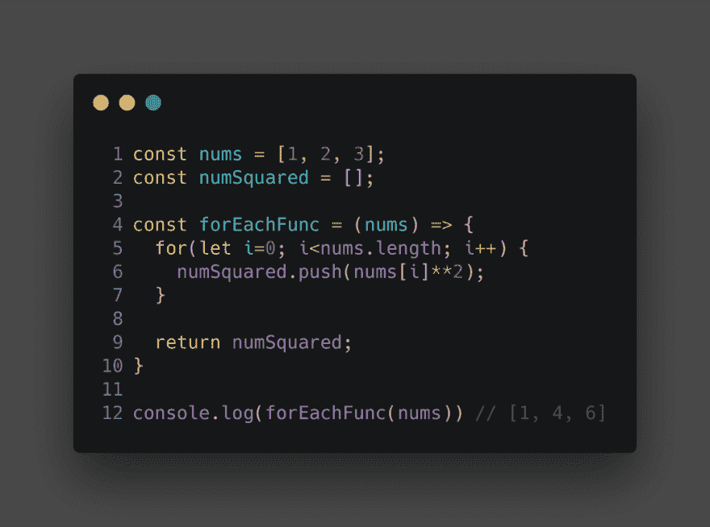
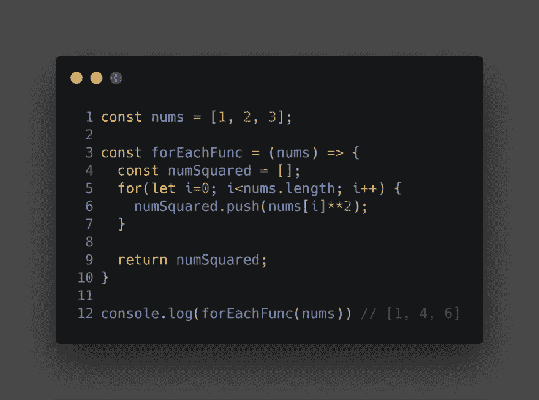
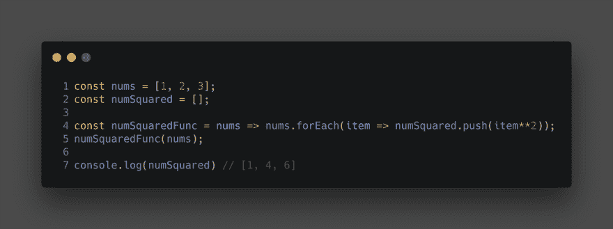
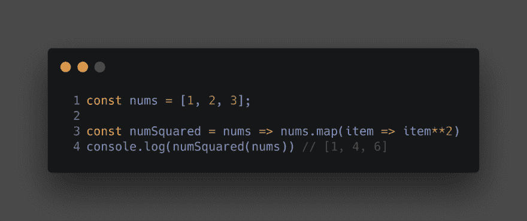

# JavaScript 中的重构函数

> 原文：<https://dev.to/zeyadetman/refactoring-functions-kje>

# 重构功能

## 纯函数 Vs 不纯函数

你好，在这篇文章中我将解释 JavaScript 中纯函数和不纯函数的区别，以及如何从不纯函数转换为纯函数。

让我们从例子开始。

### 不纯函数

在第一个代码片段中，如果你再次调用函数`forEachFunc`，你会得到不同的结果，每次调用都是如此。不纯的函数不仅仅依赖于它的自变量，它还可能从函数本身之外发生变化，这被称为“副作用”。

#### 副作用

副作用不限于突变，它可能包括网络(HTTP 调用、数据库调用、用户输入，...等等)。您可以在上一篇文章的参考资料中了解更多关于 JavaScripts 相关的不纯函数的副作用。

### 纯函数

在第二段代码中，无论何时调用该函数，都会得到相同的结果，因为它只依赖于它的参数。

### 纯净还是不纯净？

这要视情况而定，但是如果你的情况有两种选择，你必须使用纯函数，在纯函数中你不必寻找可能改变你的函数结果的另一个变量(避免副作用)，容易追踪，更清晰，更可读。

## forEach Vs Map，哪个更好？

好吧，看情况。例如，如果你想改变一个现有的列表，`forEach`会更好，但是根据 [MDN forEach](https://developer.mozilla.org/en-US/docs/Web/JavaScript/Reference/Global_Objects/Map/forEach) 的解释，这将被认为是一个副作用:

> forEach()对每个数组元素执行一次回调函数；与 map()或 reduce()不同，它总是返回未定义的值，并且不可链接。典型的用例是在链的末端执行副作用。

如果您想改变数据或从另一个数组创建一个新数组，可能会更好。它更快，副作用更少，可读性更强。

在下面的例子中，最好使用`map()`而不是`forEach()`

如果我们用`map()`来写

## 关闭

最后，我不是 JavaScript 或函数式编程的专家，但我觉得我有话要说。所以我就放下一些资源多看。在 twitter 上关注我。

[最初发表在我的博客上](https://zeyadetman.github.io/technical/2019/02/14/refactoring-functions.html)

感谢你的阅读，我希望这对你有希望！

进一步阅读...

*   [理解 Javascript 突变和纯函数](https://blog.bitsrc.io/understanding-javascript-mutation-and-pure-functions-7231cc2180d3)
*   [通过比较纯 JavaScript 函数和不纯 JavaScript 函数来识别副作用](https://egghead.io/lessons/javascript-identify-side-effects-by-comparing-pure-and-impure-javascript-functions-342b2167)
*   [掌握 JavaScript 面试:什么是函数式编程？](https://medium.com/javascript-scene/master-the-javascript-interview-what-is-functional-programming-7f218c68b3a0)
*   [纯函数与不纯函数](https://toddmotto.com/pure-versus-impure-functions)
*   [大部分-足够-指南书，第三章:具有纯粹功能的纯粹快乐](https://drboolean.gitbooks.io/mostly-adequate-guide-old/content/ch3.html)
*   JavaScript:什么是纯函数，为什么要使用它们？
*   [Javascript 与函数式编程— Pt。3:纯函数](https://hackernoon.com/javascript-and-functional-programming-pt-3-pure-functions-d572bb52e21c)
*   [Map.prototype.forEach()](https://developer.mozilla.org/en-US/docs/Web/JavaScript/Reference/Global_Objects/Map/forEach)
*   [JavaScript — Map 与 ForEach](https://codeburst.io/javascript-map-vs-foreach-f38111822c0f)