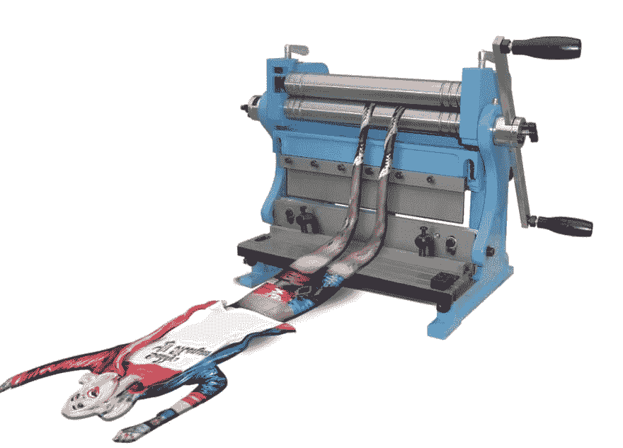

# 重塑 ruby 展平方法

> 原文：<https://dev.to/prosper/reinventing-ruby-flatten-method-4lpc>

[](https://res.cloudinary.com/practicaldev/image/fetch/s--ZPmFAg_C--/c_limit%2Cf_auto%2Cfl_progressive%2Cq_auto%2Cw_880/https://raw.githubusercontent.com/OPARA-PROSPER/Technical-Articles/master/git-backend/img/flatten.jpeg%3Ftoken%3DAHGMCDH5R2WYFKEEAQ7Y6RC447BZC)

### 简介

我通过解决来自[exercisem](https://exercism.io)的挑战练习积极地开始重新学习 ruby，我认为我应该写下我发现有点困难并克服的挑战。你可以在 exercsim 上查看[我的简介](https://exercism.io/profiles/OPARA-PROSPER)来了解我的进步。

### 问题陈述

Ruby Array flatten 方法接受任何深度嵌套的数组(多维)，并使用[递归](https://www.geeksforgeeks.org/recursion/)返回一个非嵌套数组。例如(在您的终端中打开 IRB[Interactive Ruby]并运行):

```
[1,[[3,4,6],3,7],5,1,[1,2,3],5].flatten
# => [1, 3, 4, 6, 3, 7, 5, 1, 1, 2, 3, 5] 
```

这个挑战练习要求我编写方法的个人实现，而不使用方法。

### 我的实现

我解决这个问题的算法是这样的:

*   用`flatten`类方法创建一个`FlattenArray`类
*   class 方法接受单个数组参数`arr`
*   创建一个 emepty 数组`flattened`来保存新数组的元素。
*   循环遍历数组参数`arr`
*   将每个元素推入`flattened`
*   递归地将深度嵌套的数组推入`flattened`
*   返回一维`flattened`数组

Ruby 中的类是通过使用关键字`class`、关键字`meaningful class name`和关键字`end`创建的。

```
class FlattenArray
end 
```

根据我的算法，这个类有一个类方法`flattened`，并且接受一个参数。在 Ruby 中，`self`关键字用于创建类方法(类方法是属于创建它的类的方法，而不是类的实例(对象))。

```
class FlattenArray
  def self.flatten(array)
  end
end 
```

接下来的步骤包括:

*   创建`flattened`数组
*   循环通过`arr`参数
*   将`arr`元素推入`flattened`数组

对于数组参数的循环，我们将利用`each`迭代器(这将循环遍历数组中的所有元素，并允许您操作代码块中的元素，并且它还会返回原始的[枚举器](https://ruby-doc.org/core-2.2.0/Enumerator.html)，而不会对其进行变更)。使用`<<`或`.push`方法将`arr`的元素推入`flattened`数组是可能的，但我会坚持使用`<<`(个人偏好)。

```
class FlattenArray
  def self.flatten(arr)
    flattened = []
    arr.each do |element|
      flattened << element
    end
  end
end 
```

下一步是在`flatten`方法内部添加一个调用(这称为递归),以避免在多维数组参数的情况下出现不必要的嵌套迭代。

```
class FlattenArray
  def self.flatten(arr)
    flattened = []
    arr.each do |element|
      if element.is_a? Array
        flattened.concat(flatten(element))
      else
        flattened << element
      end
    end
    flattened
  end
end 
```

我最初的挑战是使用`<<`推入扁平数组，这实际上将一个数组对象推入`flattened`。另一方面，使用`.concat`方法**将迭代中的每个元素追加到`flattened`中，而不是推送一个数组对象。手动测试以检查该实现是否有效**

```
print FlattenArray::flatten [1,2,3,[[3,4],6,6]] 
```

> 在 ruby 和正确的 ruby 语法中，省略方法调用中的括号是允许的。另外，我个人喜欢调用不带括号的函数:)

### 测试

我喜欢在[练习](https://exercism.io)上学习的另一个特点是，你可以使用测试驱动开发(TDD)方法来解决练习，我必须说这真的很酷。用 ruby 编写测试套件要求您已经安装了`minitest` gem，您可以使用`gem install`命令安装 minitest:

```
$ gem install minitest 
```

在与 flatten.rb(我们 flatten 实现代码的文件)相同的目录下创建一个`flatten_test.rb`文件，在新创建的文件中需要 *minitest* gem，需要 *flatten.rb* (使用`require_relative`)并复制以下测试套件:

```
require 'minitest/autorun'
require 'minitest/pride'
require_relative 'flatten_array'

# Common test data version: 1.2.0 0290376
class FlattenArrayTest < Minitest::Test
  def test_no_nesting
    # skip
    flat_array = FlattenArray.flatten([0, 1, 2])
    assert_equal [0, 1, 2], flat_array
  end

  def test_flattens_array_with_just_integers_present
    # skip
    flat_array = FlattenArray.flatten([1, [2, 3, 4, 5, 6, 7], 8])
    assert_equal [1, 2, 3, 4, 5, 6, 7, 8], flat_array
  end

  def test_5_level_nesting
    # skip
    flat_array = FlattenArray.flatten([0, 2, [[2, 3], 8, 100, 4, [[[50]]]], -2])
    assert_equal [0, 2, 2, 3, 8, 100, 4, 50, -2], flat_array
  end

  def test_6_level_nesting
    # skip
    flat_array = FlattenArray.flatten([1, [2, [[3]], [4, [[5]]], 6, 7], 8])
    assert_equal [1, 2, 3, 4, 5, 6, 7, 8], flat_array
  end 
```

确保在每个测试中取消对`skip`关键字的注释，以使测试代码能够运行，并避免**跳过**那个测试用例。现在，您可以在终端中运行以下命令:

```
$ ruby flatten_test.rb 
```

要了解更多关于用 ruby 编写测试的内容，请阅读[TDD 简介](http://tutorials.jumpstartlab.com/topics/testing/intro-to-tdd.html#intro-to-tdd)

### 总结起来

对于学习你选择的任何编程语言来说，exercisem 都是一个非常棒的工具，而且在开发你的解决方案时还可以得到指导。Exercism 导师不会把鱼交给你，而是给你鱼钩，告诉你鱼的坐标，这完全让钓鱼变得有趣，以研究为导向并且快速。

如果你从头到尾关注了代码实现，你一定会发现 Ruby 编程语言有多棒，语法有多灵活， [Ruby](https://ruby-doc.org/) 是我非常喜欢编写的一种语言，它有一个令人惊叹的[生态系统](http://ruby-forum.com/)