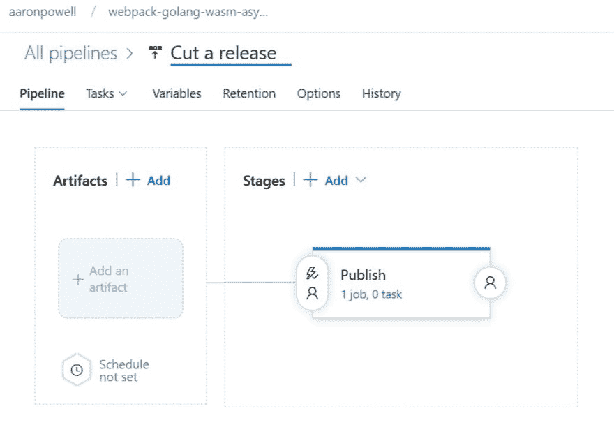
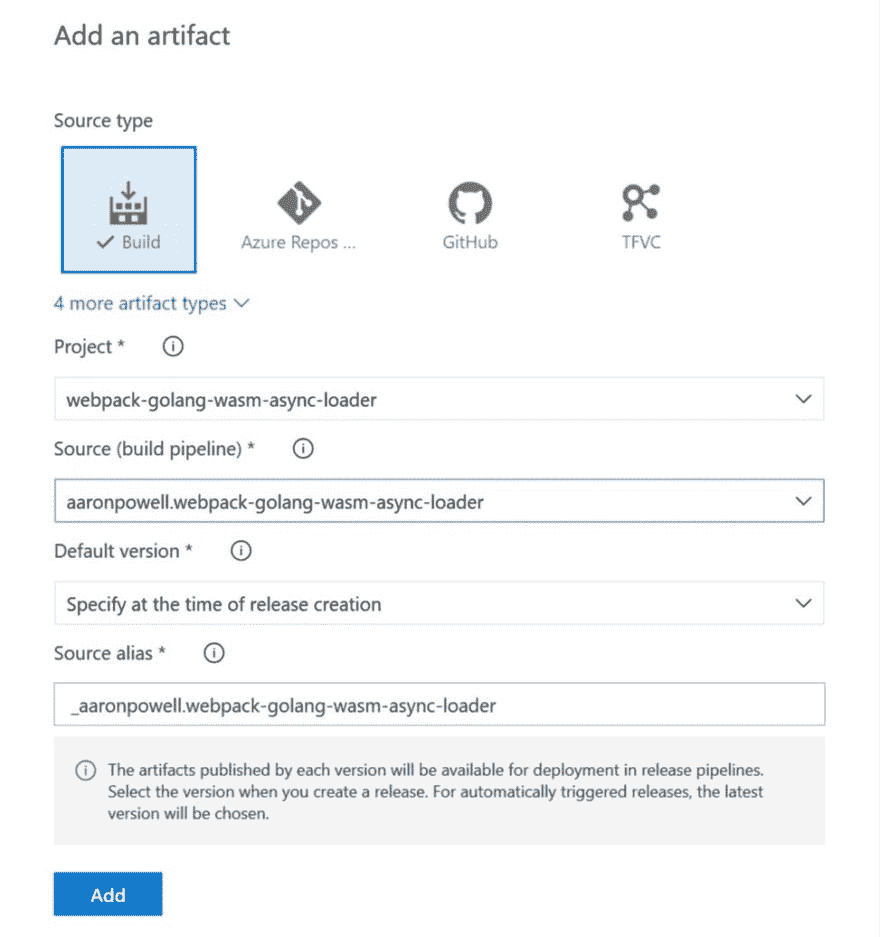
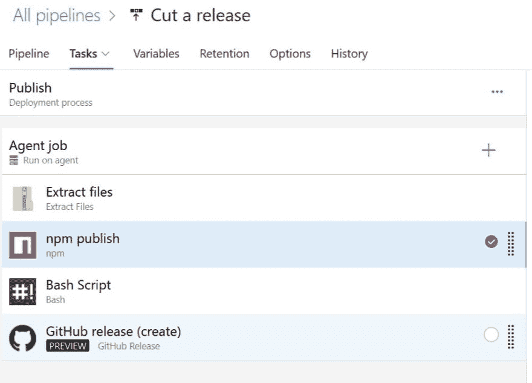

# 从 Azure DevOps 释放到 npm

> 原文：<https://dev.to/azure/releasing-to-npm-from-azure-devops-3505>

在我最近的一篇关于[用 Go](https://www.aaron-powell.com/posts/2019-02-08-golang-wasm-5-compiling-with-webpack/) 创建 webpack 加载器来生成 WebAssembly 的文章中，我决定在构建加载器时能够轻松地将它发布给 npm。

为了做到这一点，我决定使用 Azure DevOps，因为它可以很好地将构建阶段和发布阶段分开。此外，很多人不知道 Azure DevOps 管道对开源项目是免费的，所以我们可以为我们的项目利用这一点小小的好处。

## 创建一个构建

您需要做的第一步是创建一个构建定义。我们将通过安装 [Azure Pipelines GitHub 应用程序](https://github.com/marketplace/azure-pipelines)(如果您还没有安装它)并为我们的 GitHub 库激活它来实现。

当链接它们时，我们将授权 Azure DevOps 访问我们的 GitHub 信息，并使用 Node.js 模板定义作为基础创建一个管道，但我们将在保存之前对其进行一些定制。

Node.js 模板是这样的:

```
trigger:
- master

pool:
    vmImage: 'Ubuntu-16.04'

steps:
- task: NodeTool@0
    inputs:
    versionSpec: '10.x'
    displayName: 'Install  Node.js'

- script: |
    npm install
    npm run build
    displayName: 'npm install and build' 
```

Enter fullscreen mode Exit fullscreen mode

据说这个构建是在`master`分支上触发的，所以 PR 不会触发这个(我们总是可以为 PR 触发一个不同的构建)。接下来，它告诉我们构建代理将在 Linux 托管代理的`pool`中，特别是 Ubuntu 16.04 是将被使用的发行版。

现在我们进入代理将运行的任务，首先是安装您请求的 Node.js 版本的任务。它将默认为最新的 LTS，但如果你想做版本锁定或任何事情，你可以调整它，只需改变`versionSpec`属性。最后，我们运行一个`script`任务，该任务将在代理的外壳中执行一个脚本(在本例中，是一个 Linux 脚本，但如果它是一个 Windows 代理，它也是一个 Windows 脚本)，该脚本运行`npm install`和`npm run build`。这里假设你已经有了一个名为`build`的 *npm 脚本*，它将完成构建，所以如果你愿意的话，你可以调整它。事实上，你可以做任何你需要的改变，但是这对于大多数情况来说很简单。此外，根据您对任务角色的偏好，您可以将`install`和`build`步骤拆分成单独的任务，这样可以更容易地调试失败，而不必读取日志。

如果你选择`Save and Run`，它会在你的 GitHub 仓库中创建一个`azure-pipelines.yaml`文件，要么直接在`master`中，要么在 PR 所在的分支中，所以选择你喜欢的方法，然后我们的构建就会开始，应该会成功完成。

那么我们如何发布一些东西呢？

## 获取工件进行发布

我们的构建将在一个代理上运行，生成我们想要生成的东西(在我的例子中，将 TypeScript 转换为 JavaScript ),但这些东西只存在于那个代理上，当代理完成时，它们就被销毁了。嗯，现在这不是很有用，是吗，我们希望那里的东西推送到 npm。

为此，我们将编辑我们的`azure-pipelines.yaml`文件。首先让我们生成一个可以发布的 npm 包:

```
- script: |
    npm pack
    displayName: 'Package for npm release' 
```

Enter fullscreen mode Exit fullscreen mode

同样，我们使用`script`任务来完成这项工作，我们运行`npm pack`命令，该命令为我们生成一个`tgz`文件，该文件可以被发送到 npm 包存储库(或任何其他您想要的存储库)。但是为什么我们要生成一个包而不发布呢？原因是我们想将我们管道的**构建**阶段从**发布**阶段中分离出来，这样持续集成然后持续交付。从我们的构建步骤中发布有点混淆了什么对什么负责。此外，通过在构建中生成`tgz`文件，我们可以说这是将要发布的内容，并且不能更改，因此，如果我们有一个临时 npm 存储库，我们可以将其推送到那里，就像我们可以为应用程序创建临时站点一样。最终，它使得发布的工件更加不可变。

我们现在已经生成了一个`tgz`文件，接下来我们需要将它作为工件附加到构建中。一个工件是一个构建的输出，它可以从其他地方获得，可以是一个链接的构建，一个发布，或者只是手动查看构建结果。

```
- task: CopyFiles@2
    inputs:
    sourceFolder: '$(Build.SourcesDirectory)'
    contents: '*.tgz' 
    targetFolder: $(Build.ArtifactStagingDirectory)/npm
    displayName: 'Copy  npm  package'

- task: CopyFiles@2
    inputs:
    sourceFolder: '$(Build.SourcesDirectory)'
    contents: 'package.json' 
    targetFolder: $(Build.ArtifactStagingDirectory)/npm
    displayName: 'Copy  package.json'

- task: PublishBuildArtifacts@1
    inputs:
    pathtoPublish: '$(Build.ArtifactStagingDirectory)/npm'
    artifactName: npm
    displayName: 'Publish  npm  artifact' 
```

Enter fullscreen mode Exit fullscreen mode

使用[复制文件](https://docs.microsoft.com/en-us/azure/devops/pipelines/tasks/utility/copy-files?view=azure-devops&tabs=yaml&WT.mc_id=devto-blog-aapowell)任务，我们可以获得文件(我们的`tgz`和`package.json`)并将它们复制到由变量`$(Build.ArtifactStagingDirectory)`定义的*工件暂存位置*。这是代理拥有的一个特殊目录，打算作为工件发布。一旦这些文件在正确的位置，我们使用 [Publish Artifacts](https://docs.microsoft.com/en-us/azure/devops/pipelines/tasks/utility/publish-build-artifacts?view=azure-devops&WT.mc_id=devto-blog-aapowell) 任务来告诉我们构建文件夹中的文件将在`npm`的一个名为 Artifacts 的*中。这个名称很重要，因为我们将在将来使用它来访问它们，所以要使它符合逻辑。我还将避免在工件的名称中使用空格，这样当您尝试使用它们时就不必进行转义。*

我还将复制发行说明以及我们从 TypeScript 编译器生成的 JavaScript 文件，因为这些文件对调试很有用。

当一切都结束后，我们的构建定义现在看起来像是[这个](https://github.com/aaronpowell/webpack-golang-wasm-async-loader/blob/master/azure-pipelines.yml)，你可以在这里看到它的运行历史[。](https://dev.azure.com/aaronpowell/webpack-golang-wasm-async-loader/_build?definitionId=16)

## 创建发布

我们的构建通过了，我们得到了工件输出，是时候发布到 npm 了。

目前，创建发布管道的唯一方法是使用 Azure Pipeline 中的设计器，没有 YAML 导出，但好在我们有一个简单的发布管道！

在 Azure DevOps 门户中，我们将创建一个新的发布，使用**空作业**模板，并将我们的发布阶段命名为*发布*。

[](https://res.cloudinary.com/practicaldev/image/fetch/s--fonsU_d2--/c_limit%2Cf_auto%2Cfl_progressive%2Cq_auto%2Cw_880/https://www.aaron-powell.cimg/npm-azd/blank-release.jpg)

现在我们需要定义我们的发布将经历哪些阶段。一个阶段可以代表一个环境，所以如果你要发布到 UAT，然后是预生产，最后是生产，你应该在构建中把它们都规划出来。您还可以定义每个阶段的关卡，是否有阶段发布的批准者，等等。但所有这些都超出了我们在这里所需要的，我们只有一个阶段，那就是发布到 npm。查看[文档，了解关于阶段](https://docs.microsoft.com/en-us/azure/devops/pipelines/release/environments?view=azure-devops&WT.mc_id=devto-blog-aapowell)的更多信息。

方便的是，Azure DevOps 提供了一个`npm`任务，其中定义了一些常用命令，包括我们想要的任务`publish`！指定名为`npm`的链接工件的路径(我们在上面命名了它)，并选择发布到一个**外部 npm 注册表**(我们使用它是因为 Azure DevOps 可以充当 npm 注册表)。

如果您之前没有这样做，您需要创建一个到 npm 注册中心的[服务连接](https://docs.microsoft.com/en-us/azure/devops/pipelines/library/service-endpoints?view=azure-devops&WT.mc_id=devto-blog-aapowell#sep-npm)，使用**新建**按钮并输入`[https://registry.npmjs.org](https://registry.npmjs.org)`作为源和令牌，您可以从 npm 网站在您的配置文件下生成该令牌。

现在你会认为我们已经准备好了，对吗？嗯……是的，你的确发布到 npm，但是你发布的是一个包，其中*包含*你的`tgz`，而不是你的`tgz`。你看，`publish`命令能够获取`tgz`并将其发布到 npm，但是在 Azure DevOps 任务中有一个[错误，这意味着它无法工作。所以不幸的是，我们需要一个变通办法😦。](https://github.com/Microsoft/azure-pipelines-tasks/issues/4958)

幸运的是，解决方法非常简单，我们需要解压`tgz`文件，并对其内容使用发布任务。我们用 Extract Files 任务来完成这个任务，指定`*.tgz`作为我们要提取的内容(因为我们不知道文件名),并给 if 一个新文件夹。我用了`$(System.DefaultWorkingDirectory)/npm-publish`。现在我们可以更新我们的发布命令，不使用工件目录，而是使用解压缩的目录，在我的例子中是`$(System.DefaultWorkingDirectory)/npm-publish/package`。

随着我们的阶段完成，是时候将它链接到构建定义了。我们通过添加一个工件，选择我们创建的构建管道并保留默认值来实现。

[](https://res.cloudinary.com/practicaldev/image/fetch/s--2K1MUAWh--/c_limit%2Cf_auto%2Cfl_progressive%2Cq_auto%2Cw_880/https://www.aaron-powell.cimg/npm-azd/adding-artifact.jpg)

*注意:我将**默认版本**保留为**在发布创建**时指定的版本，因为它给了构件的构建控制权。对于这种情况，它不会产生很大的差异，但在更复杂的设置中会很有用。*

因为我们希望每次构建完成时发布一个版本，所以我们将点击工件上的闪电(⚡)并启用持续部署触发器。没有这个我们需要手动触发释放。如果你有某些不应该被释放的分支(例如:`gh-pages`)，那么你也可以在这里为它们添加一个过滤器。

救，跑，嘣！推送至`master`时 npm 发生释放。请记住，您必须更新您的`package.json`以获得新的版本号，否则它将无法发布到 npm，因为您无法发布现有的版本。

## 添加徽章

您最不想做的事情就是在您的自述文件中添加一个徽章来展示令人敬畏的管道工作。我们可以从右上角的“构建->菜单”中选择“状态徽章”，然后像这样做一些降价:

```
[](https://dev.azure.com/aaronpowell/webpack-golang-wasm-async-loader/_build/latest?definitionId=16&branchName=master) 
```

Enter fullscreen mode Exit fullscreen mode

看起来是这样的:

[](https://dev.azure.com/aaronpowell/webpack-golang-wasm-async-loader/_build/latest?definitionId=16&branchName=master)

### 定制标签

我最近才发现，你可以为 Azure Pipelines 徽章定制标签中的文本。为此，向图像`label=<something cool>`添加一个查询字符串。它甚至可以支持表情符号😉！

```
[](https://dev.azure.com/aaronpowell/webpack-golang-wasm-async-loader/
_build/latest?definitionId=16&branchName=master) 
```

Enter fullscreen mode Exit fullscreen mode

[](https://dev.azure.com/aaronpowell/webpack-golang-wasm-async-loader/_build/latest?definitionId=16&branchName=master)

## 奖励回合，发布到 GitHub

向 npm 发布是好的，但是如果我们也想向 GitHub 发布，正确标记提交，并确保任何只想获得原始文件的人都可以获得它们，该怎么办？

我们也可以用 Azure DevOps 做到这一点！

首先，我们需要获取我们发布的版本号，这样我们就可以在 GitHub 上对它进行适当的标记。我将使用 Bash 任务(因为我知道我使用的是 Linux 代理)，并运行一个内联脚本:

```
v=`node -p "const p = require('./package.json'); p.version;"`
echo "##vso[task.setvariable variable=packageVersion]$v" 
```

Enter fullscreen mode Exit fullscreen mode

我正在运行一个小的内联 Node.js 脚本，以从我们作为工件附加的`package.json`文件中获取版本号(所以我将工作目录设置为`$(System.DefaultWorkingDirectory)/aaronpowell.webpack-golang-wasm-async-loader/npm`)，或者，您可以从解压缩的`tgz`文件中获取版本号(但是我在意识到我必须这么做之前就开始这么做了😛).接下来，我们使用`echo`创建一个名为`packageVersion`的 Azure DevOps 变量。

然后，我们将使用 GitHub Release 任务(在撰写本文时它处于预览状态)来生成我们的版本。

我选择我要发布的 GitHub 帐户和发布到的库(两个显示都在下拉列表中可用)，我们将使用**创建**进行操作(毕竟这是一个新的发布版本)**目标**是`$(Build.SourceVersion)`，因为这是构建被触发的提交的 SHA，并且我们想要标记，使用我们的变量`$(packageVersion)`作为标记，标记源为**用户指定的标记**，然后将资产设置为我们想要发布的工件(我发布了【T2 我还选择添加发布说明，我将它写入 git repo 中一个名为`ReleaseNotes.md`的文件中，并作为工件发布。

现在，当我们创建一个发布时，它不仅会发送到 npm，还会作为一个发布发送到 GitHub，标记提交并链接发布中包含的提交。点击查看[。](https://dev.azure.com/aaronpowell/webpack-golang-wasm-async-loader/_release?definitionId=1)

[](https://res.cloudinary.com/practicaldev/image/fetch/s--ICo2efkG--/c_limit%2Cf_auto%2Cfl_progressive%2Cq_auto%2Cw_880/https://www.aaron-powell.cimg/npm-azd/complete-pipeline-steps.jpg)

## 结论

这就是我们如何从 Azure DevOps 自动构建和发布 npm 和 GitHub 版本的包。这真的很简单！

## 发表对 2FA 的评论

我的同事 [Tierney Cyren](https://twitter.com/bitandbang) 指出，如果你在 npm 中使用 [2FA on Publish](https://docs.npmjs.com/requiring-2fa-for-package-publishing-and-settings-modification) 的话，上述方法将不起作用。一种可能的解决方法是在发行版上设置一个手动入口，在运行发行版并在发布时将其作为 CLI 标志传递之前，您必须将 OTP 代码作为一个变量输入。否则，在你的发布中会有一个错误[，比如这个](https://dev.azure.com/aaronpowell/webpack-golang-wasm-async-loader/_releaseProgress?_a=release-environment-logs&releaseId=17&environmentId=17)。