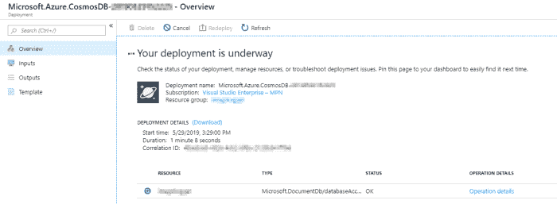
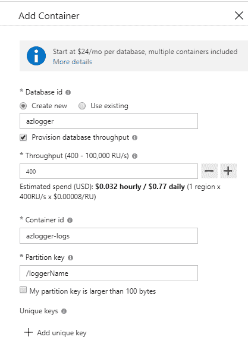
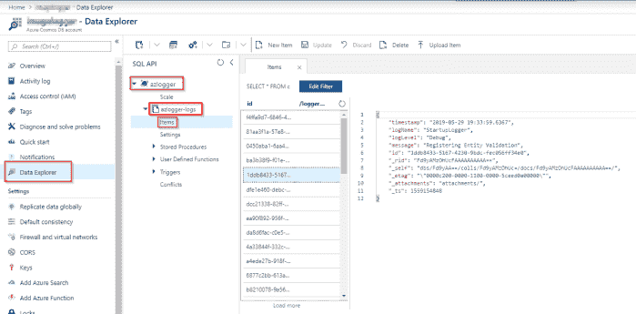

# 使用 Azure 函数进行远程 NLOG 日志记录(第二部分)——将数据持久化到 Azure Cosmos DB 中。

> 原文：<https://dev.to/yerac/remote-nlog-logging-with-azure-functions-part-two-persisting-data-into-azure-cosmos-db-4od3>

免责声明:这个博客对我来说更像是一个“心理笔记”。我不是这方面的专家，Cosmos DB 对我来说还是新的(几个小时前)。如果我完全没有抓住要点，请写信给我🙂

[上次](https://dev.to/wabbbit/remote-nlog-logging-with-azure-functions-part-one-ko-temp-slug-3060401)，我连接了一个非常基本的 C# Azure 函数来接受来自 NLOG web 服务目标的请求。这一次，我将尝试将传入的日志信息持久化(插入)到 Azure Cosmos 数据库容器中，直接从 VS 代码中的 Azure 函数开始。

## 设置 Cosmos DB、数据库和容器。

首先，我将在 Azure 门户上创建一个新的 Cosmos DB，方法是从资源面板中选择“Azure Cosmos DB ”,然后选择“新建”。

在此页面上，我需要指定:

*   订阅:您的 Azure 订阅将在下创建此。
*   资源组:您应该已经有了一个与您之前创建的 Azure 函数相匹配的资源组。
*   实例详细信息
    *   帐户名:这将作为 URL 的前缀，即**布拉**documents.azure.com
    *   API:对于这个例子，我将使用 Core(SQL ),这样我就可以创建一个文档数据库并使用 SQL 语法进行查询。
*   地点:选择离你最近的地点。
*   其他选项:其他选项如地理冗余等可以暂时禁用。

选择“审查和创建”，然后在下一个屏幕上选择“创建”，前提是您对输入内容感到满意。

[](https://res.cloudinary.com/practicaldev/image/fetch/s--9X_K9-Fd--/c_limit%2Cf_auto%2Cfl_progressive%2Cq_auto%2Cw_880/https://i2.wp.com/yer.ac/blog/wp-content/uploads/2019/05/image-12.png%3Ffit%3D700%252C257)

当它可以使用时，将切换到“您的部署已经完成”。不会超过几分钟。

点击“转到资源”，或者通过资源管理器导航到新的 Cosmos DB，将会为这个数据库加载一个快速启动窗口。然而，首先我们需要一个“容器”。选择我们刚刚创建的 Azure Cosmos DB 帐户，我们需要选择“添加容器”。

[](https://res.cloudinary.com/practicaldev/image/fetch/s--TqhfqfgW--/c_limit%2Cf_auto%2Cfl_progressive%2Cq_auto%2Cw_880/https://i0.wp.com/yer.ac/blog/wp-content/uploads/2019/05/image-13.png%3Fw%3D840)

这里我们有一些输入:

*   数据库 ID。我没有数据库，所以需要创建一个。如果您已经有一个，请在此指定名称。
*   吞吐量:400 RU(请求单位/秒)对于我的基本测试和操作来说应该足够了。
*   容器 ID:我指定了一个容器 ID，它位于新的/现有的数据库中。 **azlogger** 是我想要所有日志相关数据的地方，还有一个容器 **azlogger-logs** 来存放我将要存储的日志。
*   分区键:我使用“loggerName”作为我的分区键。见这个[视频](https://azure.microsoft.com/en-us/resources/videos/azure-documentdb-elastic-scale-partitioning/)了解信息，但本质上我相信这是为了管理分区，如果数据超过限制，所以分区可以分组(？)正确(~10GB？).**老实说，如果没有读更多的书，我不能 100%确定。**我刚去了一个推荐的销售订单岗位。

## 更新 Azure 函数以连接 Cosmos DB

我们首先需要在这个项目中使用 CosmosDB 包，因此在终端中运行:

`dotnet add package Microsoft.Azure.WebJobs.Extensions.CosmosDB`

现在我需要设置解决方案，以便它可以使用 Cosmos DB。

在`local.settings.json`中，我添加了我的连接字符串:

```
{ "IsEncrypted": false, "Values": { "AzureWebJobsStorage": "", "FUNCTIONS\_WORKER\_RUNTIME": "dotnet", "MyCosmosDBConnection": "\<conn string\>" } } 
```

Enter fullscreen mode Exit fullscreen mode

其中连接字符串值来自您的 Cosmos 仪表板，在“Keys”->“Primary connection string”下

现在我需要一个 C#模型来绑定。我用必需的字段创建了一个简单的 LogDetail 类。注意，我在字段上使用了 JsonProperty 项。我阅读了关于注释除 ID 之外的所有内容的要求的相互矛盾的博客帖子，但是我发现暂时保留它没有什么坏处。

```
public class LogDetail{ [JsonProperty("id")] public string Id { get; set; } [JsonProperty("timestamp")] public string Timestamp; [JsonProperty("logName")] public string LogName; [JsonProperty("logLevel")] public string LogLevel; [JsonProperty("message")] public string Message; } 
```

Enter fullscreen mode Exit fullscreen mode

现在是更新主方法/函数的时候了！这对我来说实际上是最难的部分(部分原因是缺乏这项技术的经验)，文档有点混乱、误导，并且通常针对特定的场景。

我不确定*对*有多正确，但是我最终改变了我的 main 方法，使它变成:

```
public static class Log { [FunctionName("Log")] public static **void** AcceptLogRequest( [HttpTrigger(AuthorizationLevel.Anonymous, "get", "post", Route = "Log")] HttpRequest req, **[CosmosDB( databaseName: "azlogger", collectionName: "azlogger-logs", ConnectionStringSetting = "MyCosmosDBConnection", Id = "{sys.randguid}", PartitionKey ="/loggerName" )] out** LogDetail logDetail, ILogger log) { log.LogInformation("HTTP trigger fired for log entry."); string timestamp = req.Form["timestamp"]; string loggerName = req.Form["loggerName"]; string loggerLevel = req.Form["loggerLevel"]; string message = req.Form["message"]; var res = $"{timestamp} | {loggerName} | {loggerLevel.ToUpper()} | {message}"; log.LogInformation(res); logDetail = new LogDetail(); logDetail.Timestamp = timestamp; logDetail.LogLevel = loggerLevel; logDetail.LogName = loggerName; logDetail.Message = message; } } 
```

Enter fullscreen mode Exit fullscreen mode

主要变化是:

*   使其成为将数据保存到 CosmosDb 的同步 void 方法，这在微软文档[这里](https://docs.microsoft.com/en-us/azure/azure-functions/functions-bindings-cosmosdb-v2)中被推荐。可能是错误的，但它的工作，并符合他们的文件。
*   将`LogDetail logdetail`更改为`out LogDetail logDetail`
*   添加 Cosmos DB 注释(见下文)

CosmosDB 注释有以下选项:

*   **databaseName** :这是上一步建立的数据库的主数据库名。
*   **集合名称**:这是上一步设置的 _ **容器** _ 名称
*   **ConnectionStringSetting** :上一步放在`local.settings.json`里面的 app 设置名。
*   **id** :记录的 id 条目。为此我使用了一个内置的系统参数 **`{sys.randguid}`**
*   **分区键**:我在之前的设置步骤中指定的分区键。

现在，如果我调试(或部署)这个 Azure 函数，并让我的应用程序插入一堆 NLOG 条目，它现在应该会在一个 Cosmos DB 容器中创建一些条目。

要查看结果，我可以在 Azure 门户上进入 Cosmos DB 并选择“数据浏览器”。从这里开始，可以扩展数据库和容器以显示容器中的“项目”——在我的例子中，是 NLOG 条目的负载。

[](https://res.cloudinary.com/practicaldev/image/fetch/s--Ncy0n1at--/c_limit%2Cf_auto%2Cfl_progressive%2Cq_auto%2Cw_880/https://i1.wp.com/yer.ac/blog/wp-content/uploads/2019/05/image-15.png%3Ffit%3D700%252C345)

## 结论

现在还为时过早，但是使用最新的工具部署一个新的 Azure 功能是非常容易的，唯一真正的困难似乎是在 Azure 中确定合适的文档(从我的经验来看一直都是这样！)

下一步将是研究计时器上的 Azure 函数触发器，以产生 MI 报告，或者基于时间/动作的触发器，以将捕获的事件转发给适当的人。

使用 Azure 函数的远程 NLOG 日志(第二部分)——将数据持久化到 Azure Cosmos DB 中。最早出现在 [yer.ac |一个开发者的冒险，等等。](http://yer.ac/blog)。