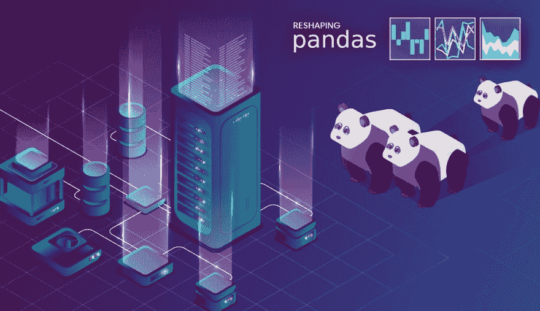
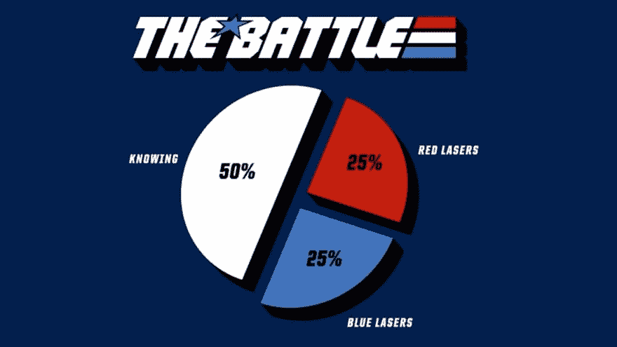
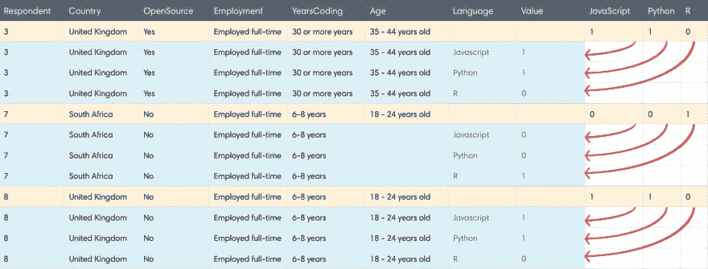
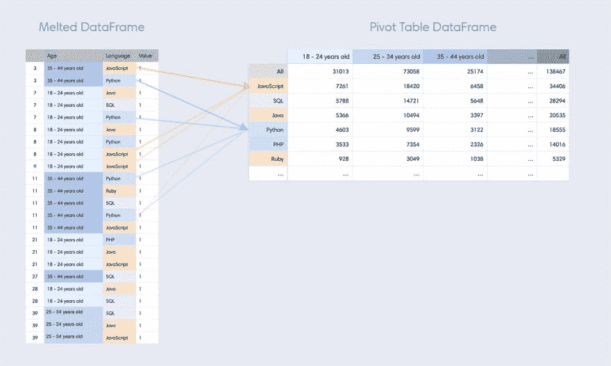

# 重塑熊猫数据框架

> 原文：<https://dev.to/hackersandslackers/reshaping-pandas-dataframes-5a3a>

[](https://res.cloudinary.com/practicaldev/image/fetch/s--qaUhwoJz--/c_limit%2Cf_auto%2Cfl_progressive%2Cq_auto%2Cw_880/https://hackersandslackers.com/conteimg/2019/05/reshapingpandas.jpg)

夏天即将来临，每个人似乎都在问同一个问题:“我的数据看起来怎么样...身材走样？”无论你是科学家还是工程师，数据图像变形都会导致严重的负面想法，让你对我们的数据产生怀疑。

关于在“微观”级别上修改数据帧，比如列操作，已经说得很多了。但是一次修改整个数据帧怎么样呢？当考虑 Numpy 在普通数学中的作用时，熊猫数据框架与我们在高中预习 calc 时学习的矩阵有很多相似之处就不足为奇了；也就是说，他们喜欢一下子被改变。当将基本数学函数应用于多个数据帧(如`df1 + df2`、`df1 / df2`等)时，很容易看到这一点。

除了破坏数学的武器之外，还有很多方法可以对整个数据表进行操作。我们这样做可能有很多原因，比如为数据可视化准备数据，或者揭示隐藏在其中的秘密。这听起来比实际困难。以这种方式修改数据出奇地容易，并且我们将涉及的大多数术语对于典型的电子表格爱好者来说听起来都很熟悉。挑战在于知道*何时*使用这些操作，并且仅仅知道它们的存在就涵盖了大量的跑腿工作。我很幸运地从我的人生导师那里学到了这一课:GI Joe。

[](https://res.cloudinary.com/practicaldev/image/fetch/s--d55S_D8Q--/c_limit%2Cf_auto%2Cfl_progressive%2Cq_auto%2Cw_880/https://hackersandslackers.com/conteimg/2019/05/gijoe.jpg) 

<figcaption>明知是战斗的 50%。</figcaption>

我将使用 [StackOverflow 的 2018 年开发者调查结果](https://www.kaggle.com/stackoverflow/stack-overflow-2018-developer-survey)来演示这些操作。我已经做了一些初步的数据处理，把你从枯燥的东西中拯救出来。以下是一些数据:

| 被告 | 国家 | 开源 | 雇用 | 希望五年 | 年份编码 | 货币符号 | 薪水 | 框架使用 | 年龄 | Bash/Shell | C | C++ | 占线小时 | 去 | Java 语言(一种计算机语言，尤用于创建网站) | Java Script 语言 | 目标-C | 服务器端编程语言（Professional Hypertext Preprocessor 的缩写） | 计算机编程语言 | 稀有 | 红宝石 | 锈 | 结构化查询语言 | 斯卡拉 | 迅速发生的 | 以打字打的文件 |
| --- | --- | --- | --- | --- | --- | --- | --- | --- | --- | --- | --- | --- | --- | --- | --- | --- | --- | --- | --- | --- | --- | --- | --- | --- | --- | --- |
| three | 联合王国 | 是 | 全职受雇 | 从事与我现在不同或更专业的技术工作 | 30 年或更久 | 增益带宽乘积（Gain-Bandwidth Product 的缩写） | Fifty-one thousand | 姜戈 | 35 - 44 岁 | one | Zero | Zero | Zero | Zero | Zero | one | Zero | Zero | one | Zero | Zero | Zero | Zero | Zero | Zero | Zero |
| seven | 南非 | 不 | 全职受雇 | 从事与我现在不同或更专业的技术工作 | 6 至 8 年 | 金 | Two hundred and sixty thousand |  | 18 - 24 岁 | one | one | one | Zero | Zero | one | Zero | Zero | Zero | Zero | one | Zero | Zero | one | Zero | Zero | Zero |
| eight | 联合王国 | 不 | 全职受雇 | 从事与我现在不同或更专业的技术工作 | 6 至 8 年 | 增益带宽乘积（Gain-Bandwidth Product 的缩写） | Thirty thousand | 有棱角；节点. js | 18 - 24 岁 | Zero | Zero | Zero | Zero | Zero | one | one | Zero | Zero | one | Zero | Zero | Zero | Zero | Zero | Zero | one |
| nine | 美国 | 是 | 全职受雇 | 作为我自己公司的创始人或联合创始人工作 | 9 至 11 岁 | 美元 | One hundred and twenty thousand | Node.js 反应 | 18 - 24 岁 | Zero | Zero | Zero | Zero | Zero | Zero | one | Zero | Zero | Zero | Zero | Zero | Zero | Zero | Zero | Zero | Zero |
| Eleven | 美国 | 是 | 全职受雇 | 做着同样的工作 | 30 年或更久 | 美元 | Two hundred and fifty thousand | HadoopNode.js 做出反应；火花 | 35 - 44 岁 | one | Zero | Zero | one | one | Zero | one | Zero | Zero | one | Zero | one | Zero | one | Zero | Zero | Zero |
| Twenty-one | 荷兰 | 不 | 全职受雇 | 从事与软件开发完全无关的职业 | 0-2 岁 | 欧元 | Zero |  | 18 - 24 岁 | Zero | Zero | Zero | Zero | Zero | one | one | Zero | one | Zero | Zero | Zero | Zero | Zero | Zero | Zero | Zero |
| Twenty-seven | 瑞典 | 不 | 全职受雇 | 从事与我现在不同或更专业的技术工作 | 6 至 8 年 | SEK | Thirty-two thousand | 。网络核心 | 35 - 44 岁 | one | Zero | Zero | Zero | Zero | Zero | Zero | Zero | Zero | Zero | Zero | Zero | Zero | one | Zero | Zero | Zero |
| Thirty-three | 澳大利亚 | 是 | 全职受雇 | 从事与我现在不同或更专业的技术工作 | 15 至 17 岁 | 澳元 | One hundred and twenty thousand | 有棱角；节点. js | 35 - 44 岁 | Zero | one | one | Zero | one | Zero | Zero | Zero | Zero | one | Zero | Zero | Zero | one | Zero | one | Zero |
| Thirty-seven | 联合王国 | 不 | 全职受雇 | 担任产品经理或项目经理 | 9 至 11 岁 | 增益带宽乘积（Gain-Bandwidth Product 的缩写） | Twenty-five | 。网络核心 | 25 - 34 岁 | Zero | Zero | Zero | Zero | Zero | Zero | one | Zero | one | Zero | Zero | Zero | Zero | one | Zero | Zero | Zero |
| Thirty-eight | 美国 | 不 | 全职受雇 | 从事与软件开发完全无关的职业 | 18 至 20 年 | 美元 | Seventy-five thousand |  | 45 - 54 岁 | one | Zero | Zero | Zero | Zero | Zero | one | Zero | one | Zero | Zero | Zero | Zero | one | Zero | Zero | Zero |

```
<class 'pandas.core.frame.DataFrame'>
Int64Index: 49236 entries, 1 to 89965
Data columns (total 27 columns):
Respondent 49236 non-null int64
Country 49236 non-null object
OpenSource 49236 non-null object
Employment 49066 non-null object
HopeFiveYears 48248 non-null object
YearsCoding 49220 non-null object
CurrencySymbol 48795 non-null object
Salary 48990 non-null float64
FrameworkWorkedWith 34461 non-null object
Age 47277 non-null object
Bash/Shell 49236 non-null uint8
C 49236 non-null uint8
C++ 49236 non-null uint8
Erlang 49236 non-null uint8
Go 49236 non-null uint8
Java 49236 non-null uint8
JavaScript 49236 non-null uint8
...
dtypes: float64(1), int64(1), object(8), uint8(17)
memory usage: 6.2+ MB 
```

## 分组依据

您可能已经熟悉了适度的`groupby()`方法，它允许我们对数据执行聚合函数。`groupby()`对于深入了解我们的数据或得出有意义的结论至关重要。

让我们看看我们的数据是如何分布的。让我们看看参加 StackOverflow 面试的人的大致年龄范围。首先，我将把我们的数据框架缩减为两列:

```
groupedDF = stackoverflowDF.filter(items=['Country',
                                          'Age']) # Remove columns
groupedDF = groupedDF.groupby(['Age']).count() # Perform Aggregate
print(groupedDF) 
```

我们使用`count()`来指定聚合类型。在这种情况下，`count()`将给出每个值在我们的数据集中出现的次数:

```
 Country
Age
18 - 24 years old 9840
25 - 34 years old 25117
35 - 44 years old 8847
45 - 54 years old 2340
55 - 64 years old 593
65 years or older 73
Under 18 years old 467 
```

太酷了，看起来我们当中有很多人都超过了 25 岁！去他妈的那些年轻人。

为什么我们的值存储在 county 列下(`Country = 25117`到底是什么意思)？当我们按**计数**进行聚合时，未分组的列的值会被我们分组的列的计数所替换...这很令人困惑。如果我们在执行`groupby()`、*之前保留所有列，那么所有*列都将包含这些相同的值。那不是很有用。

只是为了好玩，让我们在此基础上找出每个年龄组的平均工资:

```
groupedDF = stackoverflowDF.filter(items=['Salary',
                                  'Age',
                                  'CurrencySymbol']) # Remove columns
groupedDF = groupedDF.loc[groupedDF['CurrencySymbol'] == 'USD']
groupedDF = groupedDF.groupby(['Age']).median() # Get median salary by age 
groupedDF.sort_values(by=['Salary'],
                      inplace=True,
                      ascending=False) # Sort descending
print(groupedDF) 
```

```
 Salary
Age
45 - 54 years old 120000.0
55 - 64 years old 120000.0
35 - 44 years old 110000.0
65 years or older 99000.0
25 - 34 years old 83000.0
18 - 24 years old 50000.0
Under 18 years old 0.0 
```

## 融化

我不知道你之前是否注意到了，但是我们的数据集有点奇怪。现有的每种编程语言都有一列，这使得我们的表特别长。谁会做这种事？(我做了，为了演示 tbh)。向下滚动，看看下面(抱歉中等读者):

| 被告 | 国家 | 开源 | 雇用 | 希望五年 | 年份编码 | 货币符号 | 薪水 | 框架使用 | 年龄 | Bash/Shell | C | C++ | 占线小时 | 去 | Java 语言(一种计算机语言，尤用于创建网站) | Java Script 语言 | 目标-C | 服务器端编程语言（Professional Hypertext Preprocessor 的缩写） | 计算机编程语言 | 稀有 | 红宝石 | 锈 | 结构化查询语言 | 斯卡拉 | 迅速发生的 | 以打字打的文件 |
| --- | --- | --- | --- | --- | --- | --- | --- | --- | --- | --- | --- | --- | --- | --- | --- | --- | --- | --- | --- | --- | --- | --- | --- | --- | --- | --- |
| three | 联合王国 | 是 | 全职受雇 | 从事与我现在不同或更专业的技术工作 | 30 年或更久 | 增益带宽乘积（Gain-Bandwidth Product 的缩写） | Fifty-one thousand | 姜戈 | 35 - 44 岁 | one | Zero | Zero | Zero | Zero | Zero | one | Zero | Zero | one | Zero | Zero | Zero | Zero | Zero | Zero | Zero |
| seven | 南非 | 不 | 全职受雇 | 从事与我现在不同或更专业的技术工作 | 6 至 8 年 | 金 | Two hundred and sixty thousand |  | 18 - 24 岁 | one | one | one | Zero | Zero | one | Zero | Zero | Zero | Zero | one | Zero | Zero | one | Zero | Zero | Zero |
| eight | 联合王国 | 不 | 全职受雇 | 从事与我现在不同或更专业的技术工作 | 6 至 8 年 | 增益带宽乘积（Gain-Bandwidth Product 的缩写） | Thirty thousand | 有棱角；节点. js | 18 - 24 岁 | Zero | Zero | Zero | Zero | Zero | one | one | Zero | Zero | one | Zero | Zero | Zero | Zero | Zero | Zero | one |
| nine | 美国 | 是 | 全职受雇 | 作为我自己公司的创始人或联合创始人工作 | 9 至 11 岁 | 美元 | One hundred and twenty thousand | Node.js 反应 | 18 - 24 岁 | Zero | Zero | Zero | Zero | Zero | Zero | one | Zero | Zero | Zero | Zero | Zero | Zero | Zero | Zero | Zero | Zero |
| Eleven | 美国 | 是 | 全职受雇 | 做着同样的工作 | 30 年或更久 | 美元 | Two hundred and fifty thousand | HadoopNode.js 做出反应；火花 | 35 - 44 岁 | one | Zero | Zero | one | one | Zero | one | Zero | Zero | one | Zero | one | Zero | one | Zero | Zero | Zero |

那是一派胡言！处理像这样分开的数据的一个好方法是使用 Pandas 的`melt()`。简而言之，`melt()`将多个列中的值压缩成一列。在这个过程中，我们的数据帧的每一行都将被复制，复制的次数等于我们“融化”的列数。视觉传达更容易:

[](https://res.cloudinary.com/practicaldev/image/fetch/s--2uUo8C4A--/c_limit%2Cf_auto%2Cfl_progressive%2Cq_auto%2Cw_880/https://hackersandslackers.com/conteimg/2019/05/pandas_melt2-1.jpg) 

<figcaption>直观再现熊猫的‘融化’。</figcaption>

在上面的例子中，我们对 3 行(黄色)和 3 列(JavaScript、Python、R)的样本大小使用了`melt()`。每个融化的列名被移到一个名为**语言**的新列下。对于我们融合的每一列，现有的一行被复制以适应将数据塞入到一列中，并且我们的数据帧变得更长。我们在上面的例子中融合了 3 列，因此每个原始行被复制了 3 次(新行显示为蓝色)。我们的 3 行样本变成了总共 9 行，我们的 3 个熔化的列消失了。让我们来看看它的实际应用:

```
meltDF = pd.melt(stackoverflowDF,
                 id_vars=['Respondent',
                          'Country',
                          'OpenSource',
                          'Employment',
                          'HopeFiveYears',
                          'YearsCoding',
                          'CurrencySymbol',
                          'Salary'],
                  value_vars=['JavaScript',
                              'Python',
                              'Go',
                              'Java',
                              'Objective-C',
                              'Swift',
                              'R',
                              'Ruby',
                              'Rust',
                              'SQL',
                              'Scala',
                              'PHP'],
                  var_name='Language') 
```

**id_vars** 是我们保持不变的将要融进去的柱子。 **value_vars** 是我们想要融化的列。最后，我们将新的合并值列命名为 **var_name** 。下面是我们运行这个命令后`.info()`的样子:

```
<class 'pandas.core.frame.DataFrame'>
RangeIndex: 590832 entries, 0 to 590831
Data columns (total 10 columns):
Respondent 590832 non-null int64

Country 590832 non-null object
OpenSource 590832 non-null object
Employment 588792 non-null object
HopeFiveYears 578976 non-null object
YearsCoding 590640 non-null object
CurrencySymbol 585540 non-null object
Salary 587880 non-null float64
Language 590832 non-null object
value 590832 non-null int64
dtypes: float64(1), int64(2), object(7)
memory usage: 45.1+ MB 
```

这样的视觉效果是宽数据帧变得非常非常长(我们的内存使用从 6.2mb 变成了 45.1mb！).这为什么有用？首先，如果发明了一种新的编程语言会发生什么？如果这种情况经常发生，最好不要将它们分成列。更重要的是，这种格式对于绘制数据图表(就像我们在[的《Seaborn 教程](https://dev.to/hackersandslackers/plotting-data-with-seaborn-and-pandas-38eh-temp-slug-2706428)中看到的)或创建数据透视表等任务来说是必不可少的。

### 加成:融化+分组

随着数据的融合，使用`groupby()`提取信息变得更加容易。我们来搞清楚最常见的编程语言！为此，我将采用我们的数据框架并进行以下调整:

*   删除多余的列。
*   删除语言值为 0 的行。
*   执行`sum()`聚合。

```
meltDF.drop(columns=['Respondent', 'Salary'], inplace=True)
meltDF = meltDF.loc[meltDF['value'] == 1]
meltDF = meltDF.groupby(['Language']).sum()
meltDF.sort_values(by=['value'],
                   inplace=True,
                   ascending=False)
print(meltDF.head(10)) 
```

```
Language
JavaScript 35736
SQL 29382
Java 21451
Python 19182
PHP 14644
Ruby 5512
Swift 4037
Go 3817
Objective-C 3536
R 3036 
```

## 透视表

数据透视表允许我们查看两个维度上的集合。在我们上面执行的聚合中，我们发现了编程语言的总体流行程度(一维聚合)。为了想象一个二维集合是什么样子，我们将扩展这个例子，把编程语言的总数分成第二维:按年龄组的受欢迎程度。

[](https://res.cloudinary.com/practicaldev/image/fetch/s--GzgYyfeJ--/c_limit%2Cf_auto%2Cfl_progressive%2Cq_auto%2Cw_880/https://hackersandslackers.com/conteimg/2019/05/pivot.jpg) 

<figcaption>可视化一张透视表</figcaption>

左边是我们简化的数据框架，缩减为三列:年龄、语言和价值(我还显示了回答者 ID 列以供参考)。当我们创建数据透视表时，我们获取这两列中的一列的值，并将它们声明为新表中的列(注意左边的 **Age** 中的值如何变成右边的列)。当我们这样做的时候，**语言**列就变成了 Pandas 所说的数据透视表的‘id’(按行标识)。

我们的数据透视表只包含我们在融合数据帧中使用的一次值( *JavaScript* 在左边出现多次，但在右边出现一次)。每当我们创建一个数据透视表时，我们都要聚合两列中的值，并以二维方式将它们分开。**数据透视表**和 **[普通透视表](https://pandas.pydata.org/pandas-docs/stable/reference/api/pandas.DataFrame.pivot.html)** 的区别在于，数据透视表总是执行聚合功能，而普通透视表则不执行。

我们的数据透视表现在按年龄范围显示语言受欢迎程度。这可以给我们一些有趣的见解，比如 Java 在 25 岁以下的孩子中比 Python 更受欢迎(有人需要纠正这些孩子)。

以下是我们在熊猫身上的做法:

```
pivotTableDF = stackoverflowDF.filter(items=['Age',
                                             'Language',
                                             'value'])
pivotTableDF = pd.pivot_table(stackoverflowDF,
                              index='Language',
                              columns='Age',
                              values='value',
                              aggfunc=np.sum,
                              margins=True)
pivotTableDF.sort_values(by=['All'],
                         inplace=True,
                         ascending=False)
print(pivotTableDF) 
```

我们需要创建一个数据透视表(注意这是一个 Pandas 函数，而不是 DataFrame 方法)。我们传递的第一件事是我们想要旋转的数据框架。然后是关键字参数:

*   **index** :决定使用哪一列作为数据透视表的行标签。
*   **columns** :原始列，它包含将在我们的数据透视表中构成新列的值。
*   **值**:将填充索引行与列的横截面的数据。
*   **aggfunc** :对我们将要显示的值执行的聚合类型。*计数*会给出发生的次数，*表示*会取平均值，*中值*会...好了，你懂了(出于我自己的好奇，我用中位数生成了一些关于工资分布的信息...试试看)。
*   **margins** :创建一列总计(名为“All”)。

## 转置

这是一个关于我的生活如何被颠覆的故事。如果你碰巧是一个刚刚被转置的数据帧，你就会这么说。

转置一个数据帧只需翻转一个表格，这样行就变成了列，反之亦然。这里有一个可怕的想法:让我们在原始数据上试试！：

```
stackoverflowDF = stackoverflowDF.filter(items=['Respondent',
                                                'Country',
                                                'OpenSource',
                                                'Employment',
                                                'HopeFiveYears',
                                                'YearsCoding',
                                                'CurrencySymbol',
                                                'Salary',
                                                'Age'])
stackoverflowDF = stackoverflowDF.transpose() 
```

转置一个数据帧就像`df.transpose()`一样简单。结果正是我们所期望的:

| 字段 1 | Zero | one | Two | three | four |
| --- | --- | --- | --- | --- | --- |
| 被告 | three | seven | eight | nine | Eleven |
| 国家 | 联合王国 | 南非 | 联合王国 | 美国 | 美国 |
| 开源 | 是 | 不 | 不 | 是 | 是 |
| 雇用 | 全职受雇 | 全职受雇 | 全职受雇 | 全职受雇 | 全职受雇 |
| 希望五年 | 从事与我现在不同或更专业的技术工作 | 从事与我现在不同或更专业的技术工作 | 从事与我现在不同或更专业的技术工作 | 作为我自己公司的创始人或联合创始人工作 | 做着同样的工作 |
| 年份编码 | 30 年或更久 | 6 至 8 年 | 6 至 8 年 | 9 至 11 岁 | 30 年或更久 |
| 货币符号 | 增益带宽乘积（Gain-Bandwidth Product 的缩写） | 金 | 增益带宽乘积（Gain-Bandwidth Product 的缩写） | 美元 | 美元 |
| 薪水 | Fifty-one thousand | Two hundred and sixty thousand | Thirty thousand | One hundred and twenty thousand | Two hundred and fifty thousand |
| 年龄 | 35 - 44 岁 | 18 - 24 岁 | 18 - 24 岁 | 18 - 24 岁 | 35 - 44 岁 |

当然，这些只是前 5 列。我们数据帧的实际形状现在是`[9 rows x 49236 columns]`。诚然，这不是最好的例子。

## 堆叠和拆分

你在网上遇到过移动友好的响应表吗？在移动设备上查看表格数据时，一些网站以紧凑的“堆叠”格式显示数据，这非常适合水平空间有限的屏幕。这是我能描述`stack()`功能的最佳方式，但是你自己看吧:

```
stackoverflowDF = stackoverflowDF.stack()
print(stackoverflowDF) 
```

```
0 Respondent 3
   Country United Kingdom
   OpenSource Yes
   Employment Employed full-time
   HopeFiveYears Working in a different or more specialized tec...
   YearsCoding 30 or more years
   CurrencySymbol GBP

   Salary 51000
   Age 35 - 44 years old
1 Respondent 7
   Country South Africa
   OpenSource No
   Employment Employed full-time
   HopeFiveYears Working in a different or more specialized tec...
   YearsCoding 6-8 years
   CurrencySymbol ZAR
   Salary 260000
   Age 18 - 24 years old
2 Respondent 8
   Country United Kingdom
   OpenSource No
   Employment Employed full-time
   HopeFiveYears Working in a different or more specialized tec...
   YearsCoding 6-8 years
   CurrencySymbol GBP
   Salary 30000
   Age 18 - 24 years old
3 Respondent 9
   Country United States
   OpenSource Yes
   Employment Employed full-time
   HopeFiveYears Working as a founder or co-founder of my own c...
   YearsCoding 9-11 years
   CurrencySymbol USD
   Salary 120000
   Age 18 - 24 years old
... 
```

我们的数据现在根据我们的索引“堆叠”起来。明白我的意思吗？堆叠[也支持多个索引](https://pandas.pydata.org/pandas-docs/stable/reference/api/pandas.DataFrame.stack.html)，可以使用**级别**关键字参数传递。

要撤销堆栈，只需使用`df.unstack()`。

不管怎样，我肯定你渴望去海滩炫耀你的碎数据。我会让你去做的。你应得的。