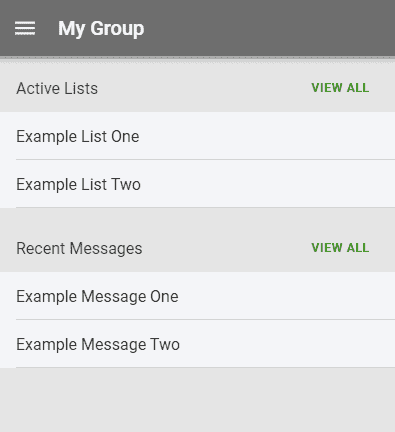
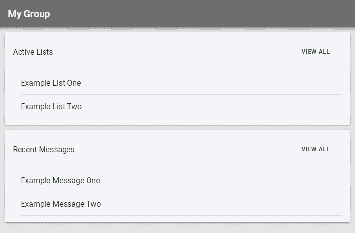

# 从屏幕尺寸进行响应组件渲染

> 原文：<https://dev.to/gopherrdiggs/responsive-component-rendering-from-screen-size-3813>

# 问题

我非常熟悉响应式设计的一般理念，但在构建我的 web 应用程序时，我希望*有更多的控制权*，而不仅仅是选择要应用的不同风格，并根据用户当前的屏幕大小决定某些组件是应该水平放置*还是垂直放置*。**

 *我希望能够呈现完全不同的 UI 结构。

以下是这篇文章的内容:

小屏幕上的相同“页面”组件...

[](https://res.cloudinary.com/practicaldev/image/fetch/s--oEyCh0Tu--/c_limit%2Cf_auto%2Cfl_progressive%2Cq_auto%2Cw_880/https://thepracticaldev.s3.amazonaws.com/i/cu2hb1le14kykm8gi3fe.png)

...在更大的屏幕上...

[](https://res.cloudinary.com/practicaldev/image/fetch/s--ab2WljuF--/c_limit%2Cf_auto%2Cfl_progressive%2Cq_auto%2Cw_880/https://thepracticaldev.s3.amazonaws.com/i/dpq6n55z0mr6tu299yb0.png)

我相信有些人知道如何使用 CSS 来进行这种剧烈的改变，但对我来说，设计页面布局要容易得多，因为我会考虑它们在不同屏幕尺寸上的显示方式，这通常会包括完全不同的 UI 组件。

因此...怎么做呢？

## 输入 StencilJS 和 Web 组件

[](https://i.giphy.com/media/7K1OQmbCnKAa4/giphy.gif)

模板，对我来说，是一扇门的开启。我还是有时候会走进门框，但是门*是*开着的。

[](https://i.giphy.com/media/FIx0no49Dnih2/giphy.gif)

好吧，奇怪的比喻...一句话:我觉得现在 Stencil 出现了，我可以用 web 组件解决更多的挑战。

如果你不熟悉模板，你应该熟悉。[看看吧](https://stenciljs.com)

对于这个挑战，我决定使用 JavaScript Web API 提供的`window.matchMedia()`来接收屏幕尺寸改变时的事件，并将其封装到一个 Web 组件中，以便放入我的项目中。使用我的新组件，我可以根据我预先确定的屏幕大小断点监听定制的`sizeChanged`事件，并围绕这些事件定义定制的呈现逻辑。

# ~~我的解决方案~~

好了，我将在本文的其余部分切入正题，只展示代码。

### 我的`viewport-size-publisher` web 组件:

```
import { Component, Event, EventEmitter, Method, Prop } from "@stencil/core";

@Component({
  tag: 'viewport-size-publisher'
})
export class ViewportSizePublisher {

  @Event() sizeChanged: EventEmitter;

  @Prop() sizes: Object[] = [];

  private sizesList;

  componentWillLoad() {

    if (!this.sizes || this.sizes.length < 1) {

      // Default sizes, if none are provided as a Prop
      this.sizesList = [
        { name: 'xs', minWidth: '0', maxWidth: '319' },
        { name: 'sm', minWidth: '320', maxWidth: '511' },
        { name: 'md', minWidth: '512', maxWidth: '991' },
        { name: 'lg', minWidth: '992', maxWidth: '1199' },
        { name: 'xl', minWidth: '1200', maxWidth: '9999' }
      ];
    }
    else {

      this.sizesList = [...this.sizes];
    }
  }

  componentDidLoad() {

    // Add listeners for all sizes provided
    for (let i = 0; i < this.sizesList.length; i++) {

      window.matchMedia(`(min-width: ${this.sizesList[i].minWidth}px) 
                          and (max-width: ${this.sizesList[i].maxWidth}px)`)
        .addEventListener("change", this.handleMatchMediaChange.bind(this));
    }
  }

  componentDidUnload() {

    // Remove listeners for all sizes provided
    for (let i = 0; i < this.sizesList.length; i++) {

      window.matchMedia(`(min-width: ${this.sizesList[i].minWidth}px) 
                          and (max-width: ${this.sizesList[i].maxWidth}px)`)
        .removeEventListener("change", this.handleMatchMediaChange.bind(this));
    }
  }

  @Method()
  async getCurrentSize() {

    // Iterate over all given sizes and see which one matches
    for (let i = 0; i < this.sizesList.length; i++) {

      if (window.matchMedia(`(min-width: ${this.sizesList[i].minWidth}px) 
          and (max-width: ${this.sizesList[i].maxWidth}px)`).matches) {

        return this.sizesList[i].name;
      }
    }
  }

  handleMatchMediaChange(q) {

    if (q.matches) {

      // Find the name of the matching size and emit an event
      for (let i = 0; i < this.sizesList.length; i++) {

        if (q.media.indexOf(`min-width: ${this.sizesList[i].minWidth}px`) > -1) {

          this.sizeChanged.emit({ size: this.sizesList[i].name });
        }
      }
    }
  }

  render() {
    return [];
  }
} 
```

在这个组件中，我接受不同屏幕尺寸或断点的尺寸定义和自定义名称。当组件加载时，我为那些屏幕大小生成的所有媒体查询添加事件侦听器。当组件卸载时，我删除那些事件监听器。

还有一个`@Method()`定义，允许其他组件在第一次加载时获得当前的屏幕尺寸。

随着屏幕尺寸的变化，我`emit`了一个名为`sizeChanged`的自定义事件。

### 我的 web 组件在我的`app-root.tsx`组件中的用法:

```
<viewport-size-publisher sizes={[
          { name: ViewportSize.ExtraSmall, minWidth: '0', maxWidth: '319' },
          { name: ViewportSize.Small, minWidth: '320', maxWidth: '511' },
          { name: ViewportSize.Medium, minWidth: '512', maxWidth: '991' },
          { name: ViewportSize.Large, minWidth: '992', maxWidth: '1199' },
          { name: ViewportSize.ExtraLarge, minWidth: '1200', maxWidth: '9999' }
        ]} /> 
```

在这里，你会注意到我使用了一个`enum`来定义和标准化不同的屏幕尺寸名称，并且我将它传递到我的新组件中。

### 页面组件中响应逻辑的实现

```
import { Component, Prop, State, Listen } from "@stencil/core";
import { ViewportSize} from "../../../interfaces/interfaces";

@Component({
  tag: 'group-home-page'
})
export class GroupHomePage {
  ...
  @State() viewportSize: ViewportSize;

  async componentWillLoad() {
    ...
    // Get current viewport size, set this.viewportSize accordingly.
    let viewportSizePubElem = document.querySelector('viewport-size-publisher');
    this.viewportSize = await viewportSizePubElem.getCurrentSize();
  }

  @Listen('document:sizeChanged')
  handleViewportSizeChange(event: any) {
    ...
    this.viewportSize = event.detail.size;
  }

  renderForSmallerSizes() {
    return [
      ...
      //<ion-list> components without surrounding <ion-card>
      ...
    ];
  }

  renderForLargerSizes() {
    return [
      ...
      //<ion-list> components with surrounding <ion-card>
      ...
    ];
  }

  renderBasedOnSize() {

    switch (this.viewportSize) {
      case ViewportSize.ExtraSmall:
      case ViewportSize.Small:
      case ViewportSize.Medium: {
        return this.renderForSmallerSizes();
      }
      case ViewportSize.Large:
      case ViewportSize.ExtraLarge: {
        return this.renderForLargerSizes();
      }
    }
  }

  render() {
    return [
      <ion-header>
        <ion-toolbar color='secondary'>
          <ion-buttons slot='start'>
            <ion-menu-button></ion-menu-button>
          </ion-buttons>
          <ion-title>{ this.group ? this.group.name : '...' }</ion-title>
        </ion-toolbar>
      </ion-header>,
      <ion-content>

        {this.renderBasedOnSize()}

      </ion-content>
    ];
  }
} 
```

让我们更深入地分析一下这个文件中的内容。

`@State() viewportSize: ViewportSize;`

任何时候修改这个状态变量，都会导致组件重新呈现。

当页面组件加载时，我用当前大小设置状态变量，这是通过执行`getCurrentSize`方法得到的:

`this.viewportSize = await viewportSizeElem.getCurrentSize();`

此后，我用一个侦听器来修饰一个函数，以处理对屏幕大小的任何更改，并更新我的状态变量:

`@Listen('document:sizeChanged')`

当组件呈现或重新呈现时，一系列函数返回我想要的不同屏幕尺寸的 UI 组件结构。

虽然我将几种不同的屏幕尺寸组合成两个主要结构，但我可以很容易地为`Small`和`ExtraSmall`创建不同的`render...`功能。

# 结论

你对这种方法有什么想法？你是如何在你的项目中做类似的事情的？*