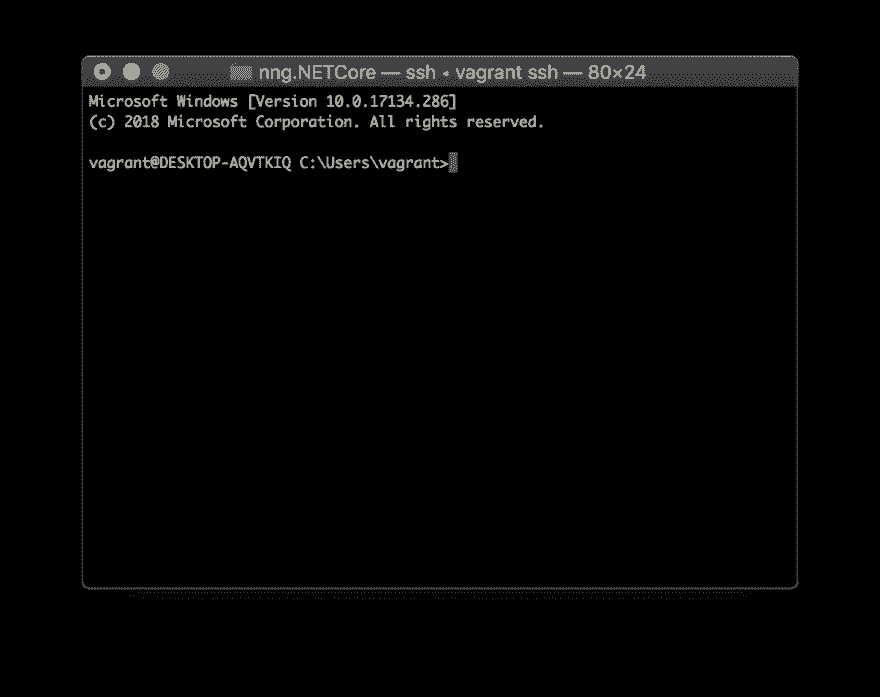

# 可重复使用的 Windows 虚拟机

> 原文：<https://dev.to/jeikabu/reusable-windows-vms-with-vagrant-2h5c>

我们需要在各种版本的 Windows 上测试我们的软件:7、10、10 LTSB(“物联网企业”)。到目前为止，我们一直使用通过[Jenkins](https://jenkins.io/)节点/代理标签公开的手动配置的物理机。这在最初很容易实现，但一直存在问题:

*   可伸缩性:在发布之前可能成为瓶颈的一组静态机器
*   快速失败/可调试:必须等待 PR 通过构建管道渗透，以发现某些不工作的地方，然后使节点离线进行调试
*   可再现性:手动配置容易出错，人们会改变环境，等等。

我们最近在 AppVeyor 和 T2 的成功激励我们去寻找更有活力的东西。这是我们用[流浪者](https://www.vagrantup.com/)迁移到 Windows 虚拟机所做的一些初步工作。

## Windows 虚拟机

[vagger 的 Windows 访客虚拟机文档](https://www.vagrantup.com/docs/boxes/base.html#windows-boxes)相当不错。

我们正在评估 Windows 10 企业版 LTSC(该操作系统以前称为 Windows 10“物联网企业”/LTSB)，它可以与 Windows 10 企业版 1809/RS5 相媲美。我们已经将它安装到一个名为`win10_ltsc_2019`的[虚拟机箱](https://www.virtualbox.org/)虚拟机上。

### WinRM

流浪者使用 [Windows 远程管理](https://docs.microsoft.com/en-us/windows/desktop/WinRM/portal)来管理 Windows 虚拟机。

在虚拟机内部，确保当前网络连接是“私有”的，否则 WinRM 配置将失败:

```
Get-NetConnectionProfile  # Get "Name" value from output  Set-NetConnectionProfile  -Name  "NAME FROM ABOVE"  -NetworkCategory  Private 
```

Enter fullscreen mode Exit fullscreen mode

WinRM 配置的问题将在以后表现为类似于`vagrant resume`的命令挂起:

```
default: WinRM transport: negotiate 
```

Enter fullscreen mode Exit fullscreen mode

在我们的例子中，我们在一个域中，连接最终会重命名自己。一旦发生这种情况，我们需要再次将类别设置为“私有”。

### RDP/宋承宪

[启用远程桌面](https://docs.microsoft.com/en-us/windows-server/remote/remote-desktop-services/clients/remote-desktop-allow-access)让`vagrant rdp`工作。

为了让`vagrant ssh`工作，必须安装 OpenSSH 服务器:

*   Windows 10 RS3/1709 及更高版本，它是一个[可选组件](https://blogs.msdn.microsoft.com/powershell/2017/12/15/using-the-openssh-beta-in-windows-10-fall-creators-update-and-windows-server-1709/)
*   对于包括 Windows 10 LTSB 2016 (RS1)在内的早期版本，[https://github.com/PowerShell/Win32-OpenSSH/releases](https://github.com/PowerShell/Win32-OpenSSH/releases)

在任一情况下，您还需要:

*   [将流浪公钥](https://www.vagrantup.com/docs/boxes/base.html#default-user-settings)添加到`~/.ssh/authorized_keys`(见[此 SO](https://stackoverflow.com/questions/16212816/setting-up-openssh-for-windows-using-public-key-authentication)
*   让 sshd 自动启动:`sc config sshd start= auto`

## 拳击

在这一点上，PowerShell 专家可能会直接进入配置阶段。与 AppVeyor 合作，我们从 [Chocolatey](https://chocolatey.org/) 那里获得了一些利益，但是我们的 shell-fu 远远不足以实现 Windows 的完全自动化。

在本练习中，我们将手动安装软件。一旦我们按照自己的喜好构建了一个环境，我们希望保留它，以便将来作为开发环境、构建节点等重用。

可以说最常见的 Windows 组件是 Visual Studio，它有多种安装选择:

*   [完整的 Visual Studio](https://visualstudio.microsoft.com/downloads/)
*   [“build tools”](https://visualstudio.microsoft.com/downloads/#build-tools-for-visual-studio-2017)(VS 的精简版)
*   [Visual Studio 容器](https://docs.microsoft.com/en-us/visualstudio/install/build-tools-container?view=vs-2017)

一旦你的软件被安装，使用虚拟机作为一个流动的“盒子”是简单明了的。在[虚拟盒子](https://www.virtualbox.org/)的情况下，我们[将 VM](https://www.vagrantup.com/docs/virtualbox/boxes.html#packaging-the-box) 打包，以备后用:

```
# Save the base image somewhere
vagrant package --base win10_ltsc_2019 --output /shared_folder/win10_ltsc_2019.box

# Elsewhere...
# Remove the box if it already exists
vagrant box remove win10_ltsc_2019
# Add the saved base image to list of available "boxes"
vagrant box add --name win10_ltsc_2019 /shared_folder/win10_ltsc_2019.box 
```

Enter fullscreen mode Exit fullscreen mode

请记住，这些都不是很快，因为它涉及 5-15GB 的虚拟机映像(取决于 Windows 的版本和您安装的数量)。这应该用于相对“静态”的配置；我不想每天甚至每周都搞砸它。对于经常变化的东西(比如你的软件)，有“共享文件夹”。

## 流浪档案

准备好我们的虚拟机映像后，我们需要一个`Vagrantfile`来启动它:

```
Vagrant.configure("2") do |config|
    config.vm.box = "win10_ltsc_2019"
    config.vm.guest = :windows
    config.vm.communicator = "winrm"
    # 3389 RDP
    config.vm.network "forwarded_port", guest: 3389, host: 3389
end 
```

Enter fullscreen mode Exit fullscreen mode

运行`vagrant up` :

```
==> default: Forwarding ports...
    default: 3389 (guest) => 3389 (host) (adapter 1)
    default: 5985 (guest) => 55985 (host) (adapter 1)
    default: 5986 (guest) => 55986 (host) (adapter 1)
    default: 22 (guest) => 2222 (host) (adapter 1)
==> default: Mounting shared folders...
    default: /vagrant => /Users/XXX/nng.NETCore 
```

Enter fullscreen mode Exit fullscreen mode

注意最后一行。主机上的项目目录(`/Users/XXX/nng.NETCore`)可作为“共享文件夹”供虚拟机访问。

港口`3389`是 RDP，所以`vagrant rdp`有效。我补充了一个[对栈溢出的回答](https://stackoverflow.com/questions/28906432/vagrant-rdp-windows2012r2-how-do-i-rdp-into-my-vagrant-box)关于这个:

```
$ vagrant rdp
==> default: Detecting RDP info...
    default: Address: 127.0.0.1:3389
    default: Username: vagrant 
```

Enter fullscreen mode Exit fullscreen mode

同样，`vagrant ssh` :

[](https://res.cloudinary.com/practicaldev/image/fetch/s--XeDpr11I--/c_limit%2Cf_auto%2Cfl_progressive%2Cq_auto%2Cw_880/https://rendered-obsolete.github.io/assets/vagrant_ssh_win10.png)

## 接下来

这给了我们一个良好的开端，实现了我们的一些目标:

*   按需 Windows 环境
*   可在开发人员的工作站和构建/测试中重现

但是，在完全迁移之前，我们仍然需要一些改进:

*   通用自动化
    *   以前的项目有安装/运行我们的软件的 PowerShell 脚本，我们应该跟踪或重写
*   整合到詹金斯管道
*   准备金提取
    *   说实话，环境是相当静态的，所以维护只读的虚拟机映像就足够了
    *   这个 repo 有整洁的脚本和用于 Windows 和 Docker 的浮动文件