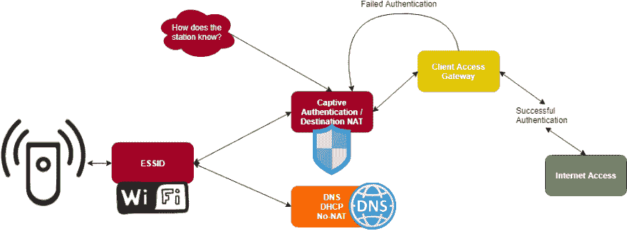
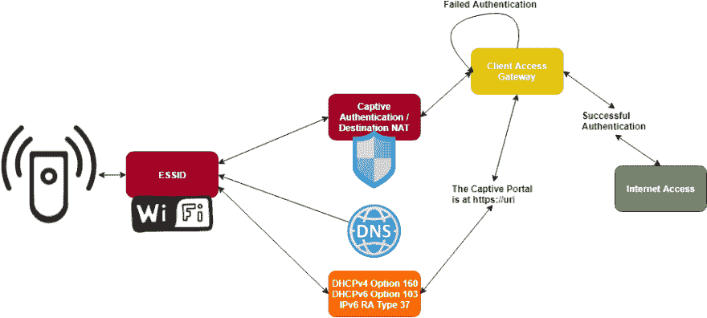

# RFC 7710

> 原文：<https://dev.to/ngschmidt/rfc-7710-39l1>

# 豢养门户吸。

任何公共接入网络都需要它们，但是随着 HTTPS 的广泛采用，用户很难找到在哪里获得访问权限的提示。

## 强制网络门户如何工作

在大多数实际应用中，客户端站位于一个网络中，在执行身份验证之前，不允许该站生成所有流量。

## 问题

任何可扩展的、设计良好的、易于使用的客户平台都需要某种方式来通知用户他们为什么被阻止，以及如何正确连接。

Aruba，Palo Alto 采用的最常见的方法，大多数防火墙平台会对未经验证的访客流量实施目的地 NAT 策略，转换每个可能的目的地地址- >您的客户端访问网关。这种方法仍然要求允许 DNS 通过，除非您为 DNS 实现一个单独的规则(以及相应的无 NAT 策略)。

作为一个副作用，这种实现会使您的客户端访问网关看起来好像在模仿用户访问的每个站点——几乎所有的客户端 web 浏览器都会以这种方式中止任何看起来不安全的连接。唯一的解决方法是让客户站浏览一个类似 HTTP 网站的[http://neverssl.com/](http://neverssl.com/)。作为安慰，一些网络设备试图自动访问强制网络门户检测 URL，如苹果的 http://captive.apple.com/hotspot-detect.html 的[，但这些实现因终端设备而异，并不总是可靠的。](http://captive.apple.com/hotspot-detect.html)

## Enter RFC 7710

这并不是一个不常见的问题，因为大多数现代企业、会议和活动都需要大量使用这种特定的网络类型。由于上面提到的可用性问题，大多数惯例和其他平台通常只提供 WPA2-PSK，并保持原样。

IETF 没有忽视大多数人在大规模访客可用性方面遇到的困难，并提出了一个互联网标准来通知客户端站点存在强制网络门户:

[https://tools.ietf.org/html/rfc7710](https://tools.ietf.org/html/rfc7710)

简而言之，IETF 建议客户端工作站在连接到新网络时使用的网络发现协议将为这种情况下的通知提供最有效的路径，并为 DHCPv4、DHCPv6 和 IPv6 路由器通告指定选项:

*   DHCPv4 选项 160
*   DHCPv6 选项 103
*   RA 37 型

如果客户机支持这个 RFC，这就完全消除了对 MiTM 的需要。它还允许您对客户端访问网关进行身份验证，否则很容易受到欺骗:

在所有这些情况下，实现应该非常简单——您只需输入强制网络门户服务器的 URI，就大功告成了！