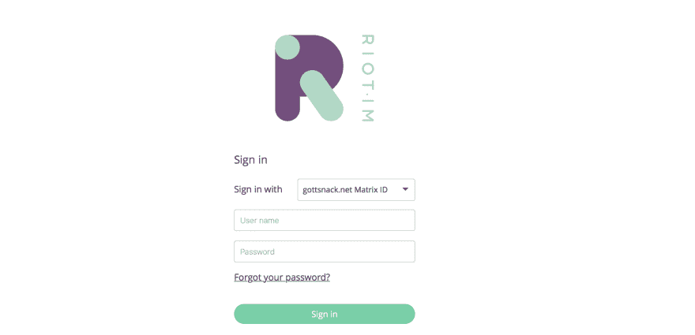

# 具有 Docker 和 Traefik 的 Matrix 元素(Riot) web

> 原文：<https://dev.to/joenas/riot-web-for-matrix--with-docker-and-traefik-50il>

[](https://res.cloudinary.com/practicaldev/image/fetch/s--VDtSQORW--/c_limit%2Cf_auto%2Cfl_progressive%2Cq_auto%2Cw_880/https://jonnev.se/conteimg/2019/01/Screenshot-2019-01-12-at-19.08.52.png)

所以 [Element](https://element.io/) ~~Riot~~ 是我更喜欢使用的 Matrix 的“光滑”网络客户端，至少在不使用桌面客户端时是这样。我之前给[写过一篇关于如何建立你自己的主服务器的指南](https://dev.to/joenas/matrix-homeserver-with-docker-5dfn)，现在我想分享一下我是如何部署我的元素实例的。

## 先决条件

一如既往，本指南假设您对 Linux 有一定的了解，并且您有一台安装了这些服务的服务器:

*   [码头工人](https://docs.docker.com/engine/installation/linux/docker-ce/ubuntu/)
*   [坞站-复合](https://docs.docker.com/compose/install/)
*   [Traefik](https://dev.to/joenas/traefik-with-docker-and-lets-encrypt-35if)
*   一个**域**来托管您的元素*

⚠️域需要**不同于你的主服务器域**。在这里阅读更多。使用子域*应该是*好的，也就是说，如果你的主服务器在`example.com`你可以使用`element.example.com`。

如果您不想使用 Traefik，您可以使用任何其他反向代理将流量转发到 docker 容器。确保将 SSL/TLS 添加到代理中，例如让我们加密！

*如果你正在建立一个新的 VPS，请随意使用我在数字海洋的[推荐链接](https://m.do.co/c/37d221e6802a)，为你的服务器获得 10 美元*😊

## 设置

我们将为元素创建一个目录和一些支持文件。

```
mkdir -p /opt/element 

# If you had to use sudo above, set the permissions to your user to make life easier
sudo chmod -R $USER:$USER -R /opt/element

mkdir /opt/element/config
mkdir /opt/element/versions
touch /opt/element/docker-compose.yml 
```

Enter fullscreen mode Exit fullscreen mode

### 码头工-堆肥，带有 Traefik

先说我们的`docker-compose`。向下滚动一点，查看不使用 Traefik 的示例。

```
nano /opt/element/docker-compose.yml

version: '2'

services:
  web:
    image: nginx:1.12-alpine
    container_name: element
    restart: unless-stopped
    networks:
      - web
    labels:
      - "traefik.enable=true"
      - "traefik.frontend.rule=Host:element.example.com"
      - "traefik.port=80"
      - "traefik.docker.network=web"
    volumes:
      - ./element-web:/usr/share/nginx/html/
      - ./config/config.json:/usr/share/nginx/html/config.json

networks:
  web:
    external: true 
```

Enter fullscreen mode Exit fullscreen mode

☝️ **记住用**替换`traefik.frontend.rule`中的`element.example.com`，如果需要可以更改外部`network`的名称。

### No Traefik

如果使用另一个反向代理，请使用或修改此选项。

```
version: '2'

services:
  web:
    image: nginx:1.12-alpine
    container_name: element
    restart: unless-stopped
    ports:
      - "127.0.0.1:8080:80"
    volumes:
      - ./element-web:/usr/share/nginx/html/
      - ./config/config.json:/usr/share/nginx/html/config.json 
```

Enter fullscreen mode Exit fullscreen mode

## 取最新的元素版本

现在我们获取最新元素发布的 tarball，提取它并把它放在`versions`文件夹中。然后，我们创建符号链接，以便能够以一种简单的方式更新版本。

```
wget -qO- https://github.com/vector-im/element-web/releases/download/v0.17.8/riot-v0.17.8.tar.gz | tar xvz -C /opt/element/versions
ln -s /opt/element/versions/riot-v0.17.8 /opt/element/element-web 
```

Enter fullscreen mode Exit fullscreen mode

☝️:请务必查看[版本](https://github.com/vector-im/element-web/releases)页面，如果有更新的版本，请相应地更新上面的命令！

## 配置

复制[样本配置](https://github.com/vector-im/element-web/blob/master/config.sample.json)并根据您的需要进行编辑。

```
cp element-web/riot-v0.17.8/config.sample.json /opt/element/config/config.json
nano /opt/element/config/config.json 
```

Enter fullscreen mode Exit fullscreen mode

我只改变了这些值:

```
{
    "default_hs_url": "https://matrix.example.com",
    "brand": "Custom Brand",
    "roomDirectory": {
        "servers": [
            "matrix.example.com",
            "matrix.org"
        ]
    }
} 
```

Enter fullscreen mode Exit fullscreen mode

## 跑吧！

我们准备好了。运行`docker-compose up -d`，你应该能够访问你的域名并登录😃

## 更新

要更新到新元素版本，请检查“发布”页面，通过修改这些命令获取新版本。然后链接新版本，停止并再次启动您的容器。

```
wget -qO- https://github.com/vector-im/element-web/releases/download/v0.17.8/VERSION.tar.gz | tar xvz -C /opt/element/versions
docker-compose stop
rm element-web
ln -s /opt/element/versions/VERSION /opt/element/element-web
docker-compose up -d 
```

Enter fullscreen mode Exit fullscreen mode