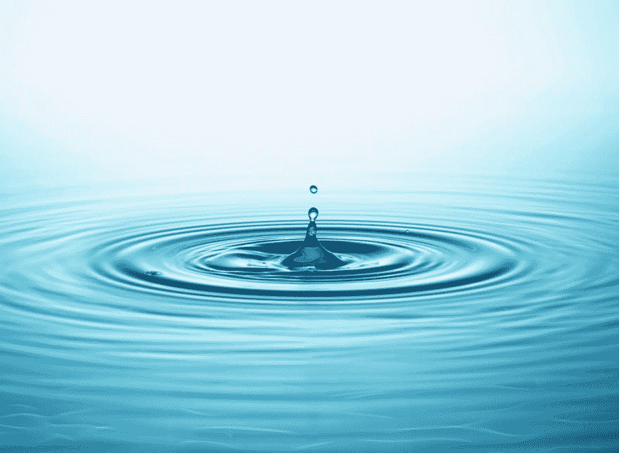
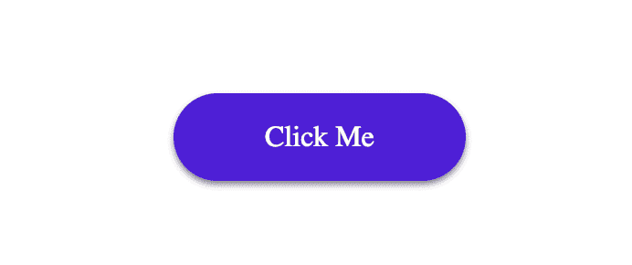

# 反应中的涟漪效应

> 原文：<https://dev.to/dhilipkmr/ripple-effect-in-react-3kl5>

[](https://res.cloudinary.com/practicaldev/image/fetch/s--uFvBNub1--/c_limit%2Cf_auto%2Cfl_progressive%2Cq_auto%2Cw_880/https://thepracticaldev.s3.amazonaws.com/i/n1lzgyw9q0s8u9eannth.png)

重要的事情先来。很高兴我之前的帖子被推特上的 [@thepracticaldev](https://dev.to/thepracticaldev) 分享了。
非常感谢😋对我来说是一个巨大的动力😋
如果你错过了，去[这里](https://dev.to/dhilipkmr/cursor-imitator-2p0j)

近日来，连锁反应正成为一个有趣的话题。虽然有像 [material-ui](https://material-ui.com/) 这样的库来帮助实现这种行为，但是理解我们如何在不依赖外部库的情况下自己实现这一点是很重要的。

## 什么是涟漪效应？

[](https://res.cloudinary.com/practicaldev/image/fetch/s--bYHINCWD--/c_limit%2Cf_auto%2Cfl_progressive%2Cq_66%2Cw_880/https://thepracticaldev.s3.amazonaws.com/i/gt2m0ng7hr7kzrc8km5b.gif)

当我们把一块石头扔进池子里会发生什么？它以一种源于石头与水接触点的**模式【波纹】在水池中制造出**无序**。**

[](https://i.giphy.com/media/L20E2bh3ntSCc/giphy.gif)

类似地，当用户点击或点击按钮、图标、图像等时。的情况下，波纹从相互作用点的**开始，流经整个组件，最终消失。**

## 如何使用 React 组件创建涟漪效果？

首先，我们将在 React 中包含用于呈现按钮的 **boiler plate** 代码。

```
.btn {
  margin: 50px auto;
  border-radius: 25px;
  background-color: #5300e8;
  box-shadow: 0 2px 4px 0 #888888;
  display: inline-block;
  padding: 15px 50px;
  color: #ffffff;
}
.center {
  text-align: center;
} 
```

```
class Ripple extends React.Component {
  initializeState = () => {
    return {
      spanStyles: {},
      count: 0
    }
  }
  state = this.initializeState();
  render() {
    const {children = null, classes="", onClickHandler=null} = this.props;
    return (
      <div className={classes} onClick={this.onClickHandler}>
        {children}
      </div>
    );
  }
}

const App = (
  <div className="center">
    <Ripple classes="btn">Click Me</Ripple>
  </div> );

ReactDOM.render(App, document.getElementById("app")); 
```

### 解释:

### CSS boilerplateripple . CSS

颜色和按钮对齐完成。

### JsRippleBoilerPlate.js

*   `initializeState()`该函数返回一个对象，该对象将第一次设置为某个状态，并在需要复位时返回。
*   这里的`count`指的是在组件清除跨度之前用户连续点击**的次数**，一旦清除，计数器重置为 0。对于每一次点击，我们可能需要根据用户点击的坐标设置新的位置，因此我们将为每一次计数设置一个唯一的 spanStyles 值。
*   JSX `App`呈现在 id 为“app”的元素内。
*   `App`是一个常量，其内部有一个**分量声明(波纹)**。在这里，我们传递您希望添加到 Ripple 呈现的**实际元素**中的类、处理程序和其他属性。
*   `Ripple`是一个**有状态组件**，它通过将它包装在一个 div 中返回子组件。在它的末尾，我们有下面的按钮。

[](https://res.cloudinary.com/practicaldev/image/fetch/s--daOm0uks--/c_limit%2Cf_auto%2Cfl_progressive%2Cq_auto%2Cw_880/https://thepracticaldev.s3.amazonaws.com/i/mchr7z8rjxcu8nu8358a.png)

## 波纹—概述

让我们先来了解一下涟漪 JSX 是什么样子的。

```
<div class="ripple">
  {props.children}
  <div class="rippleContainer">
    <span><span>
  </div>
</div> 
```

*   `{props.children}`渲染我们从`App`经过的`<Ripple></Ripple>`里面的所有孩子。
*   在呈现子元素之后，我们有一个 div ( `rippleContainer`)附加到父元素上。
*   当用户点击按钮时，Span 被创建为`rippleContainer`的子节点。
*   我们在这个跨度中添加了一些 css 类和动画(稍后解释),这样我们将得到一个涟漪效应。
*   最后，在动画完成后，我们**移除**`<span>`。

[](https://i.giphy.com/media/107pNN5KioUJs4/giphy.gif)

## 咱们涟漪:)

更新波纹组件的渲染方法。

```
render() {
    const {children= null, classes = "", onClickHandler = null} = this.props;
    return (
        <div ref="targetElement" className={'ripple ' + classes} onClick={onClickHandler}>
            {children}
            <div className="rippleContainer" onMouseDown={this.showRipple} onMouseUp={this.callCleanUp(this.cleanUp, 2000)}>
                {this.renderRippleSpan()}
            </div>
        </div>
    );
} 
```

```
.ripple {
  position: relative;
  overflow: hidden;
}
.ripple .rippleContainer {
  position: absolute;
  top: 0;
  right: 0;
  bottom: 0;
  left: 0;
} 
```

*   我们将`ripple`类添加到父 div 中，并分配样式，使其成为**相对的和隐藏的溢出**。
*   `rippleContainer` child 被追加到 ripple div，有两个事件`mousedown`(开始涟漪效果)和`mouseup`(触发超时移除`span`)。
*   `this.renderRippleSpan()` -是对**渲染跨度(我们称之为 Ripple :P)** 的函数调用

> ***注意:*** *对于元素的每个新点击，一个新的 span 子元素将被追加到`rippleContainer`中，因此有必要清理 span 以减小 DOM 的大小。*

*   在给`rippleContainer`分配 css 样式时，它**完全覆盖了它的父元素**。所以任何点击都将首先到达 div 的处理程序，然后是它的父类。

点击按钮…

```
.ripple .rippleContainer span {
  transform: scale(0);
  border-radius: 100%;
  position: absolute;
  opacity: 0.75;
  background-color: #ffffff;
  animation: ripple 850ms;
}

@keyframes ripple {
  to {
    opacity: 0;
    transform: scale(2);
  }
} 
```

```
showRipple = (e) => {
    const rippleContainer = e.currentTarget;
    const size = rippleContainer.offsetWidth;
    const pos = rippleContainer.getBoundingClientRect();
    const x = e.pageX - pos.x - (size / 2);
    const y = e.pageY - pos.y - (size / 2);
    const spanStyles = { top: y + 'px', left: x + 'px', height: size + 'px', width: size + 'px' };
    const count = this.state.count + 1;
    this.setState({
      spanStyles: {...this.state.spanStyles, [count] : spanStyles},
      count: count
    });
  }

 renderRippleSpan = () => {
    const {showRipple = false, spanStyles = {}} = this.state;
    const spanArray = Object.keys(spanStyles);
    if (spanArray && spanArray.length > 0) {
      return (
        spanArray.map((key, index) => {
          return <span key={'spanCount_' + index} className="" style={{ ...spanStyles[key]}}></span>
        })
      )
    } else {
      return null;
    }
  } 
```

### showRipple 解释道…

*   当按钮**被点击时，我们调用`showRipple(e)`函数。**
*   `currentTarget`给出了处理程序放置在**上的元素，在本例中是具有`rippleContainer`类的 div。**
*   然后，我们找到`rippleContainer`的**宽度**。
*   `getBoundingClientRect()`是一个内置函数，给出元素在页面中的位置(右、上、下、左、宽、高、x 和 y)
*   `x`和`y`是一个常数，我们用一个数学公式来计算鼠标在按钮内部的交点。`e.pageX`和`e.pageY`给出接触点相对于整个页面的 X 和 Y 坐标。
*   然后我们将上面获得的信息添加到`spanStyles`对象中。我们将使用该样式作为 span 元素的内联样式。
*   由于状态更新在 React 中是**异步的，我们增加了计数器**，并利用它将每次点击的独特风格存储到`spanStyle`属性中。最后，我们正在**设置**和`state`。
*   `renderRippleSpan()` -一个相当简单的函数，我们将为每种风格渲染跨度，这是必要的，因为用户可以同时点击按钮**。**

### css 解释…

*   我们的目标是内部跨度，`transform: scale(0)`放大元素到 0%,我们添加自定义动画效果，并给它一个名字`ripple`

在关键帧中定义`ripple`动画。动画持续 850 毫秒，在 850 毫秒的过程中，跨度的不透明度应该从 0.75 减少到 0(有助于在波纹效果结束时隐藏波纹)，并且**缩放**应该从 0%增加到 200%(使跨度的背景颜色可见)。

## Tadaaaaaa…..！

[](https://res.cloudinary.com/practicaldev/image/fetch/s--rb1WD0uN--/c_limit%2Cf_auto%2Cfl_progressive%2Cq_66%2Cw_880/https://thepracticaldev.s3.amazonaws.com/i/qibsu852xtpdhyu2u399.gif)

现在我们已经有了连锁反应，我们必须**移除已经产生的`span`** 。移除跨度包括将**去抖功能**添加到代码中，因为如果用户在完成前一次点击的过渡之前**连续点击**，我们不应该删除所有跨度，因为这将影响**进程中最后一次点击的跨度。**

所以我们等待一段特定的时间(比如 2000 毫秒)，如果我们没有得到任何点击，我们将继续从 DOM 中删除 span。等待时间应该大于**动画过渡时间。**

```
cleanUp = () => {
  const initialState = this.initializeState();
  this.setState({ ...initialState });
}

callCleanUp = (cleanup, delay) => {
  return function() {
    clearTimeout(this.bounce);
    this.bounce = setTimeout(() => {
      cleanup();
    }, delay);
  }
} 
```

*   我们在`mouseup`启动`callCleanup`。
*   注意: **`callCleanup()`** 返回一个函数。返回的函数在`mouseup`时被调用
*   超时功能，有助于在指定的延迟后移除量程。
*   **去抖。**每当用户持续点击按钮时，我们清除之前设置的超时，这样它就不会影响正在进行的转换，一旦我们没有点击而经过“延迟”毫秒，我们就开始删除 span。
*   `cleanup()` **将**状态重置回原始状态(即无跨度)。

关注我有趣的内容:P

我的[推特](https://twitter.com/dhilipkmr_)

在这里找到一个可用的 CodePen 示例

[](https://i.giphy.com/media/a0Lgc1JvbfS4o/giphy.gif)

## 那都是乡亲们！