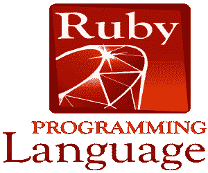

# Ruby:不同类型的迭代器

> 原文：<https://dev.to/yongliang24/ruby-different-types-of-iterators-3n22>

# 概观

当我们有一个数据集合(例如一个数组)时，我们可以使用迭代器来操作该集合的每个成员，并获得我们想要的返回值。让我们来看看 Ruby 中一些常用的迭代器及其返回值。

### 。每个

的。每个迭代器返回它所操作的原始数据结构，尽管我们修改了块中的值。然而，我们可以用另一个变量来保存块内的更改。

[https://repl.it/@YongLiang/EqualScornfulMicroinstruction?lite=true](https://repl.it/@YongLiang/EqualScornfulMicroinstruction?lite=true)

### 。地图或者。收集

的方式。地图或者。收集迭代类似于。但是将返回新的/修改过的数据结构，而不是原来的数据结构。

[https://repl.it/@YongLiang/ExperiencedTruthfulDisassembly?lite=true](https://repl.it/@YongLiang/ExperiencedTruthfulDisassembly?lite=true)

### 。挑选

与。选择迭代器，我们在块中设置一个条件，它返回一个新的数据结构，其值符合该条件。它会过滤掉错误的。

[https://repl.it/@YongLiang/CalculatingMurkyRuby?lite=true](https://repl.it/@YongLiang/CalculatingMurkyRuby?lite=true)

### 。发现

的。查找类似的作品。选择，但是，它会在条件满足时立即返回值/true。

[https://repl.it/@YongLiang/MistyDelightfulModule?lite=true](https://repl.it/@YongLiang/MistyDelightfulModule?lite=true)