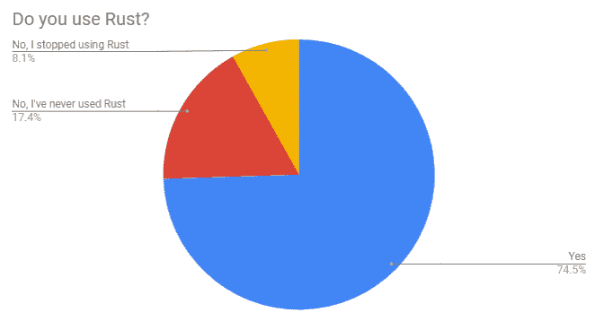

# 铁锈调查 2018 结果

> 原文：<https://dev.to/chenge/rust-survey-2018-results-1oph>

关于铁锈你有什么想说的？

今年学了一点锈。我觉得有点难学，现在我更去关注锈。这是最新的调查。他们的社区是最好的，热情，开放，受欢迎。

> 又一年意味着又一次 Rust 调查，今年是 Rust 的第三次年度调查。今年，该调查首次以多种语言展开。除英语外，总共涵盖了 14 种语言。来自非英语语言的结果占所有回答的 25%,并帮助推动了回答数量达到 5991 个回答的新纪录。在我们开始分析之前，我们只想说声“谢谢！”感谢所有花时间回应并给我们你的想法的人。正是因为有了你的帮助，铁锈才会年复一年的不断进步。

[](https://res.cloudinary.com/practicaldev/image/fetch/s--CacfN4Et--/c_limit%2Cf_auto%2Cfl_progressive%2Cq_auto%2Cw_880/https://blog.rust-lang.oimg/2018-11-RustSurvey/1-Do_you_use_Rust.png)

[链接- >](https://blog.rust-lang.org/2018/11/27/Rust-survey-2018.html)

> 挑战
> 
> 正如我们在过去几年中所做的那样，我们征求您对 Rust 可以改进的地方的意见。今年，我们在反馈中看到了一些熟悉的主题以及一些新的主题。今年的十大主题是:

```
the need for better library support
a more improved IDE experience
the need for broader adoption of Rust generally
a richer ecosystem of tools and support
an improved learning curve
the need for important language features and crates to be stable and supported
support for async programming
support for GUI development
better documentation
improved compile times 
```

> 今年的新需求是支持 GUI 开发，这表明 Rust 不仅在服务器上继续增长，而且人们感到有必要扩展到应用程序开发。