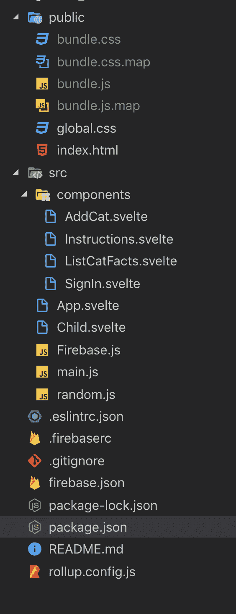

# 使用 Firebase Firestore 和认证的 Svelte 3 中的 RxFire

> 原文：<https://dev.to/codingcatdev/rxfire-in-svelte-3-using-firebase-firestore-and-authentication-pca>

> 原帖:[https://ajonp . com/lessons/rx fire-in-svelte-3-using-firebase-firestore-and-authentic ation/](https://ajonp.com/lessons/rxfire-in-svelte-3-using-firebase-firestore-and-authentication/)

[https://www.youtube.com/embed/ju80EzhnCE8](https://www.youtube.com/embed/ju80EzhnCE8)

# RxFire 在苗条 3 中使用 Firebase Firestore 并认证

RxFire 是由 Firebase 开发者倡导者[大卫·伊斯特](https://twitter.com/_davideast)创建的。虽然 [Firebase 博客](https://firebase.googleblog.com/2018/09/introducing-rxfire-easy-async-firebase.html)在 2018 年 9 月推出了 RxFire。我认为这对于同时使用[svelite 3](https://svelte.dev)和 [Firebase](https://www.firebase.com/) 的初学者来说是一个很好的参考点。

对于那些来自角度背景的人，你可能熟悉 [RxJS](https://github.com/ReactiveX/rxjs) 和 [Angularfire2](https://github.com/angular/angularfire2) 包。根据我的经验，如果你想在任何尺寸的应用中使用 Angular，你*必须*学习 RxJS。这可能是最难学的部分之一，但有几个精彩的教程和网站专门介绍 RxJS 是如何工作的。

我最喜欢的一些

*   [Fireship 的十大 RxJS 概念](https://fireship.io/lessons/rxjs-basic-pro-tips/)
*   [xjs 大理石](https://rxmarbles.com/)

新来的苗条 3 号，请结帐- [苗条教程](https://svelte.dev/tutorial/) - [Rich Harris 反思反应性](https://youtu.be/AdNJ3fydeao) - [Toolsday - 93。苗条](https://pca.st/JyN1)

# 教训

## 举例

在下面的例子中，它展示了一个快速预览 osf 最终的 React 应用程序将如何工作。如您所见，将会发生基本的 4 个步骤。

1.  签到
2.  添加卡特彼勒事实
3.  在列表中显示添加的卡特彼勒事实
4.  退出 <video controls=""><source src="https://res.cloudinary.com/ajonp/video/upload/v1556399505/ajonp-ajonp-com/17-rxfire-react-cats/5.webm" type="video/webm"> <source src="https://res.cloudinary.com/ajonp/video/upload/v1556399505/ajonp-ajonp-com/17-rxfire-react-cats/5.mov" type="video/mp4"></video> ##设置

你将需要与 nodejs 捆绑在一起的 NPM。另外 [npx](https://github.com/zkat/npx) 是最容易使用 git 上提供的模板的。

```
npx degit sveltejs/template rxfire-svelte
cd rxfire/svelte 
```

Enter fullscreen mode Exit fullscreen mode

您还需要创建自己的 Firebase 项目并初始化 Firestore 数据库，请使用严格模式创建。[示例规则](https://github.com/AJONPLLC/rxfire-react-cats/blob/master/firestore.rules)；

## 最终 App 结构

[ ](https://res.cloudinary.com/practicaldev/image/fetch/s--jsR9IVIx--/c_limit%2Cf_auto%2Cfl_progressive%2Cq_auto%2Cw_880/https://res.cloudinary.com/ajonp/image/upload/v1556565487/ajonp-ajonp-com/18-rxfire-svelte-cats/djkgve67f4opo5oh6jqr.png) [ ](https://res.cloudinary.com/practicaldev/image/fetch/s--hBEIY9Zy--/c_limit%2Cf_auto%2Cfl_progressive%2Cq_auto%2Cw_880/https://res.cloudinary.com/ajonp/image/upload/v1556565487/ajonp-ajonp-com/18-rxfire-svelte-cats/pzf7b3rmcfmfmmgicsii.png)

## 安装依赖项

你将需要 [rxfire](https://www.npmjs.com/package/rxfire) 、 [firebase](https://www.npmjs.com/package/firebase) 和 [rxjs](https://www.npmjs.com/package/rxjs)

```
npm i rxfire firebase rxjs 
```

Enter fullscreen mode Exit fullscreen mode

## 创建 Firebase.js

js 将是我们的主要 firebase 文件，并将包含我们的 Firebase 应用程序的工具，包括 Firebase 的实例化。该文件包括用于 auth 和 firestore 助手功能的 rxfire。

Firebase.js

```
import 'firebase/auth';
import 'firebase/firestore';

import firebase from 'firebase/app';
import { authState } from 'rxfire/auth';
import { collectionData } from 'rxfire/firestore';
import { filter } from 'rxjs/operators';

const app = firebase.initializeApp({
/* Place your configuration here */
});

const firestore = firebase.firestore(app); // Initialize firestore
const auth = firebase.auth(app); // Initialize firebase auth
const loggedIn$ = authState(auth).pipe(filter(user => !!user)); // Observable only return when user is logged in.

export { app, auth, firestore, collectionData, loggedIn$ };

export default firebase; 
```

Enter fullscreen mode Exit fullscreen mode

> 如果你已经熟悉 Svelte 3，你可以跳过本课的说明部分。

## 简单的初始组件

### 删除 App.svelte，替换为以下内容

你基本上可以把一个. svelte 文件想象成一个 html 文件。这里需要注意一些事情，默认情况下，任何样式的作用域都是当前组件，为了获得超出当前组件的样式，你可以将它们放在类似于`:global(div.flex-row)`的地方。然而(也许是最佳实践)，我发现将这些从 App.svelte 转移到`/public/global.css`更容易；

App.svelte

```
<script>
    import Instructions from './components/Instructions.svelte';
    import SignIn from './components/Signin.svelte';
    import AddCat from './components/AddCat.svelte';
    import ListCatFacts from './components/ListCatFacts.svelte';
    import {loggedIn$} from './Firebase.js'

    /* Make something more observable */
    const user = loggedIn$;
</script>
<style>
/* :global(div.flex-row){
    display: flex;
    justify-content: center;
    flex-flow: row wrap;
}
:global(div.flex-column){
    display: flex;
    justify-content: center;
    flex-flow: column;
}
.max-800{
    max-width: 800px;
} */
</style>
 <div class="flex-row">
 <div class="flex-column">
     <Instructions />
 </div>
</div> 
```

Enter fullscreen mode Exit fullscreen mode

### 创建说明

这是一个非常简单的组件，不需要任何道具，它只返回简单的 html。

组件/说明.超薄

```
<div class="flex-row">
  <div>
    
  </div>
  <div>
    <p>
      In this example we will use RxFire to Observe the Cat Facts that we add to
      our Firestore Database.
    </p>
    <a href="https://github.com/AJONPLLC/rxfire-react-cats" target="no_index">
      https://github.com/AJONPLLC/rxfire-react-cats
    </a>
    <ol>
      <li>
        Sign In
        <ul>
          <li>Uses Google Auth for Firebase</li>
          <li>Found in App.svelte</li>
        </ul>
      </li>
      <li>
        Add Cat Fact
        <ul>
          <li>This will use an API and Insert the facts into Firestore</li>
          <li>Found in components/AddCat.svelte</li>
        </ul>
      </li>
      <li>
        Firestore collection
        <ul>
          <li>Observing catfacts for changes, heart eyes are your facts</li>
          <li>Found in components/ListCatFacts.svelte</li>
        </ul>
      </li>
      <li>
        Sign Out
        <ul>
          <li>Observe that user is removed</li>
        </ul>
      </li>
    </ol>
  </div>
</div> 
```

Enter fullscreen mode Exit fullscreen mode

## 更新集合 catfacts

### 创建 AddCat.svelte

我们要添加的第一个按钮非常简单，它调用一个 API 并将返回的数据作为一个新文档推入 firestore 集合。我总是喜欢自上而下地工作，所以首先让我们将 AddCat.svelte 导入我们的 App.svelte。

### 更新 App.svelte

App.svelte

```
...
import AddCat from './components/AddCat';
...
 <SignIn user={user} />
... 
```

Enter fullscreen mode Exit fullscreen mode

我们现在将把我们的第一个道具传递给`AddCat`，这很简单，通过声明一个变量并传递它，在我们的例子中，我们将使用`const user = loggedIn$`。这有必要吗，可能没有，但我想展示传递一个道具，我们可以从`Firebase.js`那里得到这个。

记下这个孩子，然后我们可以通过定义`export let user;`来访问这个道具。

`addCatFact`函数调用一个 API，从[https://cat-fact.herokuapp.com](https://cat-fact.herokuapp.com)返回一个随机的猫事实。因为 CORS，我们必须通过代理传递它，但是你会看到我们得到了一个返回值。然后，我们使用 javascript [析构赋值](https://developer.mozilla.org/en-US/docs/Web/JavaScript/Reference/Operators/Destructuring_assignment)来创建一个新对象，方法是将我们的`catFactDate`添加到该对象中。这允许我们以后按降序对列表中的事实进行排序。

我们向 firestore 添加了一个随机的猫事实，并向对象添加了我们的`catFactDate`。这允许我们以后按降序对列表中的事实进行排序。

这里我们需要特别注意的是- #if - [if blocks](https://svelte.dev/docs#If_blocks) 只是一个标准 If，你会期望- $user - [Subscriptions](https://svelte.dev/docs#svelte_store) 如果你来自 angular，这就像异步管道。- on:click={addCatFact - [组件事件](https://svelte.dev/docs#Component_events)这类似于 html 组件中常见的事件，但这里我们只是用 curlys 来传递函数`addCatFact`。

components/AddCat.svelte

```
<script>
  import { firestore } from '../Firebase';
  import catFacts from '../random.js';
  export let user;
  const addCatFact = async () => {
    try {
      /* Gave up on the API working!!! */
      const value = catFacts[Math.floor(Math.random() * catFacts.length)];
      await firestore
        .collection('catfacts')
        .add({ ...value, catFactDate: new Date() });
    } catch (error) {
      console.error(error);
    }
  };
</script>
<div class="flex-column">
  {#if $user}
  <button className="myButton" on:click="{addCatFact}">
    2\. Add Cat Fact
  </button>
  {/if}
</div> 
```

Enter fullscreen mode Exit fullscreen mode

现在，如果你现在尝试这样做，应该会失败，并出现警告 [](https://res.cloudinary.com/practicaldev/image/fetch/s--5033Fw9Q--/c_limit%2Cf_auto%2Cfl_progressive%2Cq_auto%2Cw_880/https://res.cloudinary.com/ajonp/image/upload/f_auto%2Cfl_lossy%2Cq_auto/v1556403260/ajonp-ajonp-com/12-angular-material-from-firestore/pmapculndlkk3c61pa21.jpg)

这是意料之中的，因为我们的 firestore.rules 设置为严格模式，我们将在下一步通过身份验证部分后添加这些规则。

您可能还会在控制台中注意到(在屏幕上，事实会跳进跳出)，firebase 实际上会添加到我们的阵列中，直到后端出现故障。这样做是有目的的，因为它给了我们所期望的快速 UI，同时还保持了数据的完整性。

## 添加 Firebase 认证

### 更新 App.svelte

在`SignIn`组件中，我们将再次使用 props，我们将传递用户状态。

App.svelte

```
<script>
  ...
    import SignIn from './components/Signin.svelte';
  ...
  </script>

  ...
     <SignIn user={user} />
  ... 
```

Enter fullscreen mode Exit fullscreen mode

SignIn.svelte

```
<script>
  import firebase, { app } from '../Firebase';

  /* this is like props */
  export let user;

  const signIn = () => {
    const authProvider = new firebase.auth.GoogleAuthProvider();
    app.auth().signInWithPopup(authProvider);
  };
  const signOut = async () => {
    await firebase.auth().signOut();
  };
</script>
<div class="flex-column">
  {#if $user}
  <h1>
    Welcome {$user.email}
    <button className="myButton" on:click="{signOut}">
      4\. Sign Out
    </button>
  </h1>
  {:else}
  <button className="myButton" on:click="{signIn}">
    1\. Sign In
  </button>
  {/if}
</div> 
```

Enter fullscreen mode Exit fullscreen mode

## 更新 AddCat 以包含用户 uid

### 将用户传递给 AddCat

更新我们的主 app，通过用户道具。

App.svelte

```
<AddCat user={user} /> 
```

Enter fullscreen mode Exit fullscreen mode

现在，我们可以用它来将我们的数据包含到 firestore 中。AddCat.svelte

```
...
.add({ ...value, uid: $user.uid, catFactDate: new Date() })
... 
```

Enter fullscreen mode Exit fullscreen mode

除了是否显示 Add Cat Fact 按钮，我们还检查用户是否存在。此按钮应仅在用户登录时显示。

```
<div class="flex-column">
  {#if $user}
  <button className="myButton" on:click="{addCatFact}">
    2\. Add Cat Fact
  </button>
  {/if}
</div> 
```

Enter fullscreen mode Exit fullscreen mode

## 更新 firestore.rules

```
service cloud.firestore {
  match /databases/{database}/documents {
    // LockDown All
    match /{document=**} {
      allow read: if false;
      allow write: if false;
    }
    // User
    match /users/{userId} {
      allow read: if false;
      allow write: if request.resource.id == request.auth.uid;
    }
    // CatFacts
    match /catfacts/{catFactId} {
      allow read: if true;
      allow write: if request.auth.uid != null && request.resource.data.uid == request.auth.uid;
    }
  }
} 
```

Enter fullscreen mode Exit fullscreen mode

## 创建猫事实列表

### 创建 ListCatFacts

这可能是`RxFire`最重要的部分，它将返回一个可观察值，您可以通过使用函数`collectionData`订阅对集合的所有更改，该函数将集合作为参数以及要创建的选项 id，在我们的例子中，我们传递了`catFactsRef.orderBy('catFactDate', 'desc')`和`'catFactId'`。

现在，我们可以只使用一个 map 来迭代每个 catFact，每当可观察对象更新当前的`catFact`状态时，数组就会更新，我们可以使用`{#each $catFacts as catFact}`显示完整的列表更新，然后如果您是该事实的所有者，则可以使用 if 块获得 catheart eyes。

*   [每个区块](https://svelte.dev/docs#Each_blocks)

ListCatFacts.svelte

```
<script>
  import { collectionData, firestore } from '../Firebase';
  import { startWith } from 'rxjs/operators';
  const catFactsRef = firestore.collection('catfacts');

  export let user;

  const catFacts = collectionData(
    catFactsRef.orderBy('catFactDate', 'desc'),
    'catFactId'
  ).pipe(startWith([]));
</script>
<style>
  .flex-row {
    justify-content: left;
  }
</style>
<div class="flex-column max-800">
  <h3>Firestore Collection "catfacts"</h3>
  <div>
    {#each $catFacts as catFact}
    <div>
      {#if $user && $user.uid === catFact.uid}
      <span role="img" aria-label="fun-cat">
        😻
      </span>
      {:else}
      <span role="img" aria-label="fun-cat">
        😺
      </span>
      {/if}
      <span>{catFact.text}</span>
    </div>
    {/each}
  </div>
</div> 
```

Enter fullscreen mode Exit fullscreen mode