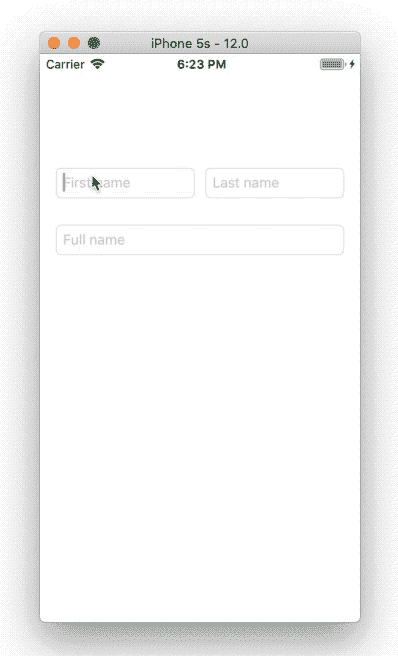

# RxSwift 反向可观测，也称为双向绑定

> 原文：<https://dev.to/vaderdan/rxswift-reverse-observable-aka-two-way-binding-5e5n>

当我们听到反应式编程时，我们通常会想到可观察序列的监听器、转换器和组合数据，以及对变化做出反应。

因此..RxSwift 是关于将数据从业务逻辑传递到视图，对吗？但是如何在两个方向传递事件呢

```
TextField <------> Observable <------> TextField 
```

[](https://res.cloudinary.com/practicaldev/image/fetch/s--NPN3pcM2--/c_limit%2Cf_auto%2Cfl_progressive%2Cq_66%2Cw_880/https://cdn-images-1.medium.com/max/800/1%2AjUoFEq2ZB7u5YcpapuhT_g.gif)

我们将查看以下两个用例:

*   绑定两个文本字段并订阅彼此的`text`控件属性(当改变其中一个的文本时，另一个会自动更新)

*   进入下一个层次，使名/姓/全名的形式，更新如上图所示的文本

我们开始吧！

### 现有的库和方法

在开始编写代码之前，我有时喜欢检查一下我是否重新发明了热水——我们是否有一些现有的库或其他与主题相关的东西。

### RxBiBinding

然后…我找到了这个图书馆

[**rx swift community/RxBiBinding**](https://github.com/RxSwiftCommunity/RxBiBinding)

做得很好。我只需要像这样连接两个文本字段

```
import RxBiBinding

let disposeBag = DisposeBag()

var textFieldFirst = UITextField()
var textFieldSecond = UITextField()

(textFieldFirst.rx.text <-> textFieldSecond.rx.text).disposed(by: disposeBag) 
```

它将监听文本字段中的变化，并双向更新文本字段中的文本。

对于最简单的用例——在`textFieldFirst`和`textFieldSecond`之间发送文本并原样返回，这已经足够好了。 ***本库不提供映射和修改*** `Strings` ***传递序列的方法。***

在现实世界中，我们不会传递可观察到的序列，我们经常映射/转换它(例如:如果我想只传递数字并过滤掉字母……)

### RxSwift 主存储库示例文件夹。

我发现的下一个方法是在 RxSwift 的 examples 文件夹中

[https://github . com/react vex/rx swift/blob/master/rx example/rx example/operators . swift # L17](https://github.com/ReactiveX/RxSwift/blob/master/RxExample/RxExample/Operators.swift#L17)

```
// Two way binding operator between control property and relay, that's all it takes.
infix operator <-> : DefaultPrecedence

func <-> (property: ControlProperty, relay: BehaviorRelay) -> Disposable {
    let bindToUIDisposable = relay.bind(to: property)
    let bindToRelay = property
        .subscribe(onNext: { n in
            relay.accept(n)
        }, onCompleted:  {
            bindToUIDisposable.dispose()
        })

    return Disposables.create(bindToUIDisposable, bindToRelay)
} 
```

它将`BehaviourRelay`属性和`ControlPropery`相互绑定，并按预期向属性双向发送更新。

我担心这会导致循环(因为属性相互绑定)(中继将事件发送给控制属性，控制属性将相同的事件发送给订阅的中继，然后中继将相同的事件发送给控制属性…永远)，但似乎`ControlProperty`有内置的机制，停止事件不会被发射两次

```
-> BehaviourRelay -> ConrolProperty ----> X -----> BehaviourRelay 
```

#### **工作原理**

当在`BehaviourRelay`上发送 send 事件时，`ControlPropery`因为绑定
而更新

```
let bindToUIDisposable = relay.bind(to: property) 
```

当我们在`ControlPropery`发送事件时，`BehaviourRelay`因为订阅
而更新

```
let bindToRelay = property
        .subscribe(onNext: { n in
            relay.accept(n)
        }, onCompleted:  {
            bindToUIDisposable.dispose()
        }) 
```

```
// value flowtrigger the state of control (e.g. `UITextField`) 
-> ControlProperty emits event 
-> value assigned to BehaviourRelay 
-> BehaviourRelay emits event 
-> ControlProperty receives event 
-> value assigned to underlying control property (e.g. `text` for `UITextField`) 
```

所以一个简单的为什么没有循环:

*   一旦某种类型的`UIControlEvent`被触发，来自控件的值就被发出

*   当一个值直接赋给控件属性时，控件不会触发 change 事件，所以没有循环。

这种方法满足了我们的需求，我们可以在订阅`BehaviourRelay`属性之前修改文本。

### 我们的例子

然而，如果我们将两个`BehaviourRelay`绑定在一起，前面的例子就不能很好地工作——它将导致事件循环

```
let textFirst = BehaviorRelay(value: nil)
let textSecond = BehaviorRelay(value: nil)

(textSecond <-> textFirst).disposed(by: disposeBag) 
```

```
-> textFirst BehaviourRelay -> textSecond BehaviourRelay -> textFirst BehaviourRelay -> textSecond BehaviourRelay -> textFirst BehaviourRelay -> textSecond BehaviourRelay ..... 
```

显然，如果`BehaviourRelay`没有内置的方法来停止将相同的事件一遍又一遍地传递给它的订阅者，那么我们将建立这种机制。

#### 以前的可观测值

我做这个小助手是为了获取可观察的序列值

```
extension ObservableType {
  func currentAndPrevious() -> Observable<(current: E, previous: E)> {
    return self.multicast({ () -> PublishSubject in PublishSubject() }) { (values: Observable) -> Observable<(current: E, previous: E)> in
      let pastValues = Observable.merge(values.take(1), values)

      return Observable.combineLatest(values.asObservable(), pastValues) { (current, previous) in
        return (current: current, previous: previous)
      }
    }
  }
} 
```

我需要这个，因为我需要知道哪个`Observable` ( `TextField text`)被更改了

#### 举个例子

我有两个文本字段，我必须从更改的字段中获取值(用旧值！= current)并更新不变的 textfield(旧值== current)

如果我不想导致永久循环，我必须检查字段的当前值是否相等，以停止传播事件(`filter` RxSwift 运算符)

```
infix operator <->

func <-> (lhs: BehaviorRelay, rhs: BehaviorRelay) -> Disposable {
    typealias ItemType = (current: T, previous: T)

    return Observable.combineLatest(lhs.currentAndPrevious(), rhs.currentAndPrevious())
        .filter({ (first: ItemType, second: ItemType) -> Bool in
            return first.current != second.current
        })
        .subscribe(onNext: { (first: ItemType, second: ItemType) in
            if first.current != first.previous {
                rhs.accept(first.current)
            }
            else if (second.current != second.previous) {
                lhs.accept(second.current)
            }
        })
} 
```

然后这样用

```
let textFirst = BehaviorRelay(value: nil)
let textSecond = BehaviorRelay(value: nil)
(textSecond <-> textFirst).disposed(by: disposeBag) 
```

[](https://res.cloudinary.com/practicaldev/image/fetch/s--NPN3pcM2--/c_limit%2Cf_auto%2Cfl_progressive%2Cq_66%2Cw_880/https://cdn-images-1.medium.com/max/800/1%2AjUoFEq2ZB7u5YcpapuhT_g.gif)

### 更复杂的例子

这是名和姓以及全名文本字段之间双向绑定的完整代码(就像顶部的动画 gif)

当我们在`textFirst`和`textSecond`中输入文本时，姓氏字段(`textFull`)会用串联的名字和姓氏文本进行更新。

[](https://res.cloudinary.com/practicaldev/image/fetch/s--29QaLc2F--/c_limit%2Cf_auto%2Cfl_progressive%2Cq_66%2Cw_880/https://cdn-images-1.medium.com/max/800/1%2Ano78U4UR4zE0FLhw8inN2A.gif)T3】

```
let textFull = BehaviorRelay(value: nil)
let textFirst = BehaviorRelay(value: nil)
let textSecond = BehaviorRelay(value: nil)

typealias ItemType = (current: String, previous: String)

Observable.combineLatest(textFirst.map({ $0 ?? "" }).currentAndPrevious(), textSecond.map({ $0 ?? "" }).currentAndPrevious(), textFull.map({ $0 ?? "" }).currentAndPrevious())
      .filter({ (first: ItemType, second: ItemType, full: ItemType) -> Bool in
        return "\(first.current)  \(second.current)" != full.current && "\(first.current)" != full.current
      })
      .subscribe(onNext: { (first: ItemType, second: ItemType, full: ItemType) in
        if first.current != first.previous || second.current != second.previous {
          textFull.accept("\(first.current)  \(second.current)")
        }
        else if (full.current != full.previous) {
          let items = full.current.components(separatedBy: " ")
          let firstName = items.count > 0 ? items[0] : ""
          let lastName = items.count > 1 ? items[1] : ""

          if firstName != first.current {
            textFirst.accept(firstName)
          } else if lastName != second.current {
            textSecond.accept(lastName)
          }
        }
      })
      .disposed(by: disposeBag)

(textFieldFirst.rx.text <-> textFirst).disposed(by: disposeBag)
(textFieldSecond.rx.text <-> textSecond).disposed(by: disposeBag)
(textFieldFull.rx.text <-> textFull).disposed(by: disposeBag) 
```

链接到示例存储库

[https://github.com/vaderdan/Example2WayBinding](https://github.com/vaderdan/Example2WayBinding)