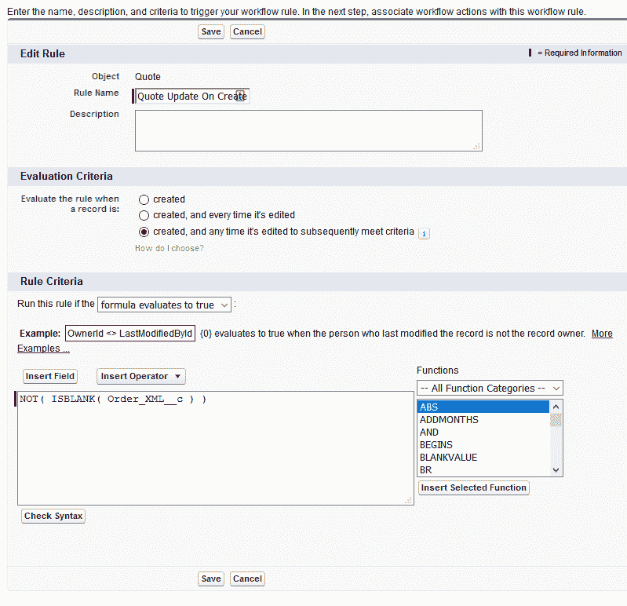
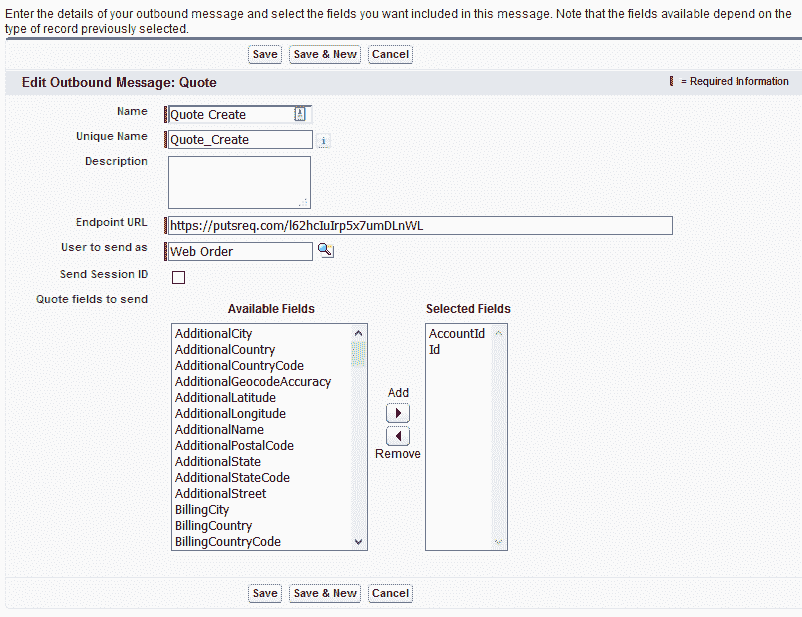
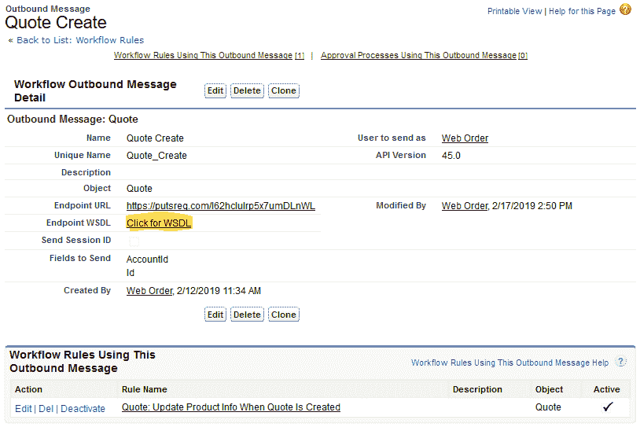
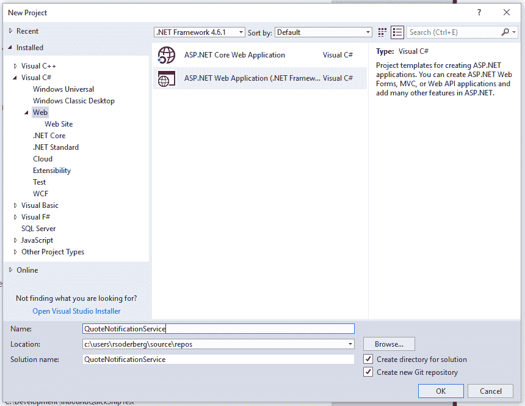
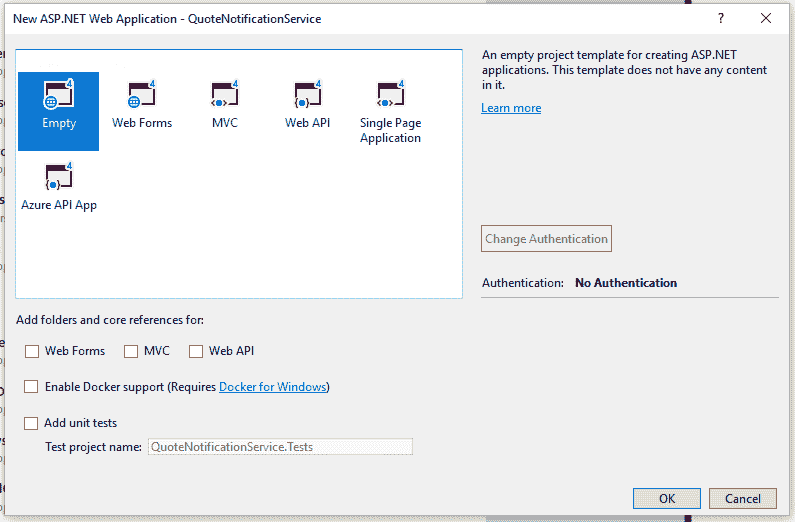
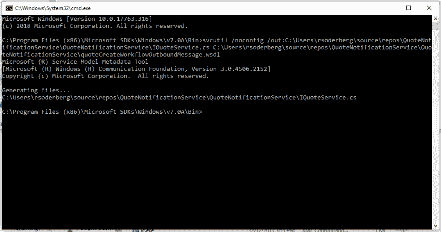
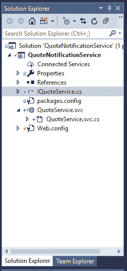
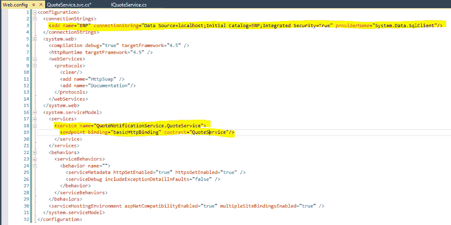
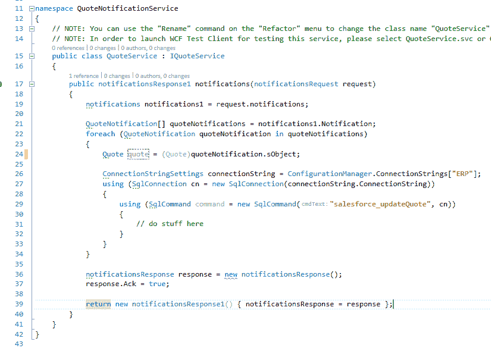

# 在 Visual Studio 2017 中集成 Salesforce 出站消息和 C#

> 原文：<https://dev.to/rachelsoderberg/salesforce-outbound-messages-part-1---integrating-salesforce-workflow-outbound-messages-and-net-visual-studio-2017-1fna>

大多数 Salesforce 系统需要在 Salesforce 和一个或多个后端系统(如数据库、其他 CRM 或 ERP)之间进行某种集成。有几种不同的方式可以完成这种集成，但今天我重点关注使用工作流出站消息和 C#与 Salesforce 集成。NET 在 Visual Studio 2017。

这种集成方法假设:

*   Salesforce 是客户的创建点(不是 ERP)
*   对 Salesforce 中帐户的任何更新都会反映在 ERP 中

**Salesforce 工作流出站消息**
第一个主要步骤是在 Salesforce 中创建工作流规则:

1.  单击右上角的“设置”,然后在左侧的搜索栏中键入“工作流规则”。(设置>构建>创建>工作流和审批>工作流规则)
2.  单击 New 创建新规则，从下拉列表中选择 Quote 对象。给它一个清晰的规则名，比如“创建时报价更新”
3.  将评估标准设置为“已创建”，并随时对其进行编辑以满足标准。这意味着在创建记录时，以及在将记录从不符合规则标准的状态编辑为符合规则标准的状态时，将评估规则。
4.  Set the Rule Criteria to run this rule if the "formula evaluates to true" and include the following function in the field:   

    *NOT(is blank(Order _ XML _ _ c))*

    There are many other functions one could use in this field; some prefer to simply enter "True" as it provides a one-time update when the Quote is created. I chose the function where the Custom Order XML is not blank because this allows for easy updating if you delete this custom field from the Quote and click Save. This action causes the XML to regenerate, and as such, meet the rule criteria and run the rule.
5.  单击“保存并下一步”可重定向至后续步骤。

第二个主要步骤要求您创建一个工作流操作:

1.  单击添加工作流操作，并从下拉列表中选择新建出站消息。
2.  同样，给你的出站消息起一个清晰的名字，比如“报价创建”这将自动填写唯一的名称。
3.  现在提供一个伪端点 URL。www.google.com 应该没事。
4.  选择您要发送的用户——应该是您。
5.  使用添加箭头将任何可用字段添加到“选定字段”列。为了本教程的缘故，我建议只坚持使用一对——我选择了 AccountId 和 Id。
6.  单击“保存”以重定向回已完成的工作流规则，然后单击视图右上角的“完成”。
7.  现在，您已返回到工作流规则页面，请确保单击激活按钮来激活您的工作流！
8.  通过单击包含在“立即工作流操作”下的工作流规则中的超链接，导航至已完成的出站邮件，然后单击“单击 WSDL”超链接。
9.  保存此 WSDL(“文件”>“页面另存为”)，并使用一个清晰的名称。我将我的调用为 quotecreateworkflooutboundmessage . wsdl。

我想提一下，因为您为端点分配了一个虚拟 URL，所以每当创建新报价或删除并重新生成定制订单 XML 字段时，您的出站消息都会被触发并失败。这是意料之中的，不用担心！我们的下一步是构建一个. NET 服务来与它通信。

**WCF Web 服务应用**
从现在开始，根据您的 Visual Studio 版本可能会有所不同。这篇博文是用 Visual Studio 2017 专业版写的；如果您想使用 Visual Studio 2013 Community Edition，请点击此链接访问 Giovanni Modica 的一篇精彩博文(以及您正在阅读的这篇博文的灵感来源): [Salesforce Workflow 出站消息处理于。净与 WCF(VS2013)](http://bloggiovannimodica.azurewebsites.net/post/salesforce-workflow-outbound-messages-handled-in-net-with-wcf#comments)

我们在集成方面的第一组步骤是创建我们的 WCF 应用程序:

1.  启动 Visual Studio 并创建一个新的 C # ASP.NET Web 应用程序。我将我的项目命名为 QuoteNotificationService。
2.  选择一个空项目模板，然后单击确定。
3.  在解决方案资源管理器中右键单击项目名称，将 WCF 服务添加到项目中。添加>新项目> WCF 服务。我把我的命名为 QuoteService。现在，您应该会在您的解决方案中看到三个与我的类似的新文件:IQuoteService.cs、QuoteService.svc 和 QuoteService.svc.cs。

既然我们已经准备好应用程序，我们需要将从 Salesforce 保存的 WSDL 添加到我们的项目中。这可能有点棘手，不要担心，如果你需要几次尝试才能做对:
在 svcutil.exe 的文件夹中打开一个命令提示符窗口——我的文件夹位于 C:\ Program Files(x86)\ Microsoft SDKs \ Windows \ v 7.0a \ Bin，但根据 Visual Studio 在您自己的环境中的位置，您的文件夹可能会有所不同。如果找不到，请运行文件搜索。通过在地址栏中点按并键入“cmd”来打开命令提示符

WCF svcutil 是一个. NET 核心 CLI 工具，它从网络位置上的 WSDL 文件或 web 服务中检索元数据，并生成一个 WCF 类，该类包含访问 web 服务操作的客户端代理方法。网芯。

在命令提示符中输入以下内容:
*svcutil/noconfig/out:C:\..\ iquotenotificationservice . cs C:\..\ quotecreateworkflooutboundmessage . wsdl*T3】注意:必须包含接口类和 wsdl 文件的完整位置路径。

如果成功，该命令将用 Salesforce 中 WSDL 的 web 服务定义替换您的接口类的内容。它会打印出哪些文件已经生成:
 
该命令已经成功替换了你的接口类的内容。

如果 Visual Studio 要求您重新加载编辑器，请单击“全是”。

您的解决方案资源管理器应该类似于这样:

您的 WCF 应用程序现在需要一些收尾工作，才能准备好从 Salesforce 接收数据。从现在起，我使用的任何名称都将反映在我的解决方案资源管理器中。如果你的名字不同，一定要把我的名字改成你项目的名字。打开接口类，进行以下更改:

1.  将整个类放在项目的名称空间中(QuoteNotificationService)。
2.  将接口的名称从 NotificationPort 更改为 IQuoteService。
3.  将 ServiceContractAttribute 的 ConfigurationName 参数从 NotificationPort 更改为 QuoteService。
4.  从 OperationContractAttribute 属性中移除参数 ReplyAction="*"。
5.  从文件末尾移除接口 NotificationPortChannel 和类 NotificationPortClient。这些对于我们的情况是不必要的。

现在打开 QuoteService.svc.cs，删除 DoWork()方法，实现 IQuoteService 接口，方法是在 IQuoteService 继承中单击并选择弹出的“实现缺失成员”提示。这个对话框可能会在灯泡中弹出，或者您可能需要使用 Ctrl+来手动显示它。

接下来打开您的 web.config 文件，并对其进行如下修改:
 
最显著的变化是在连接字符串中添加了 ERP，并添加了服务名。

至此，您应该能够构建没有错误的项目了！

最后，我们的最后一步是编写更新 ERP 的代码。这些代码会因您如何更新 ERP 而有很大的不同，所以我将简单地提供样板代码。在 QuoteService 类中编写以下代码:

确保您的 Ack 变量设置为真实响应；Salesforce 需要此确认才能成功处理出站消息。

* * *

既然您在 Salesforce 上有了一个带有工作流规则的功能性出站消息，并且一个 WCF Web 服务准备好与它对话，下一步将是测试连接并来回发送一些数据！

如果您已经准备好学习 SOAP 请求和测试 Web 服务，下周请加入本系列的第 2 部分。