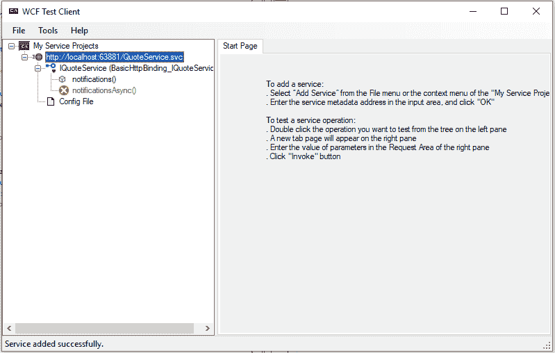
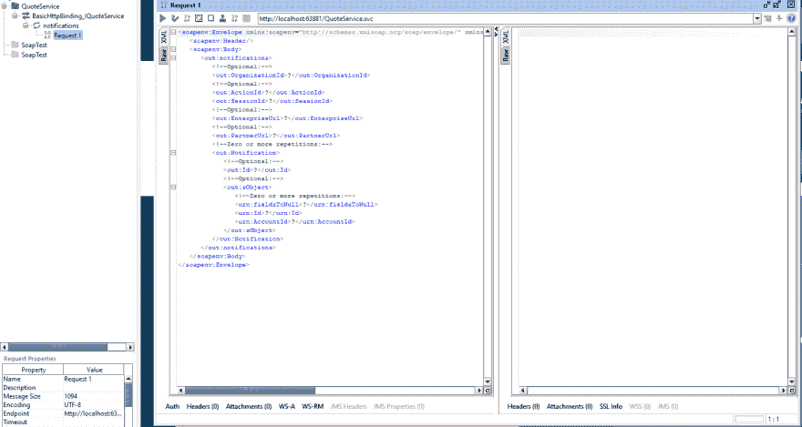
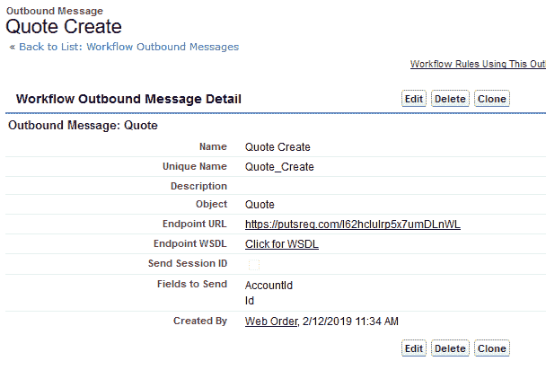
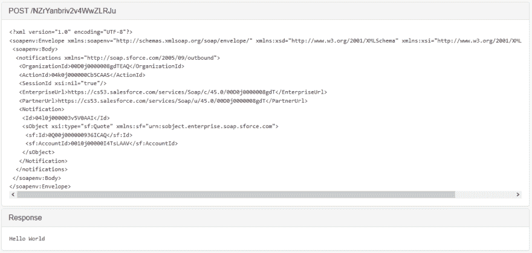
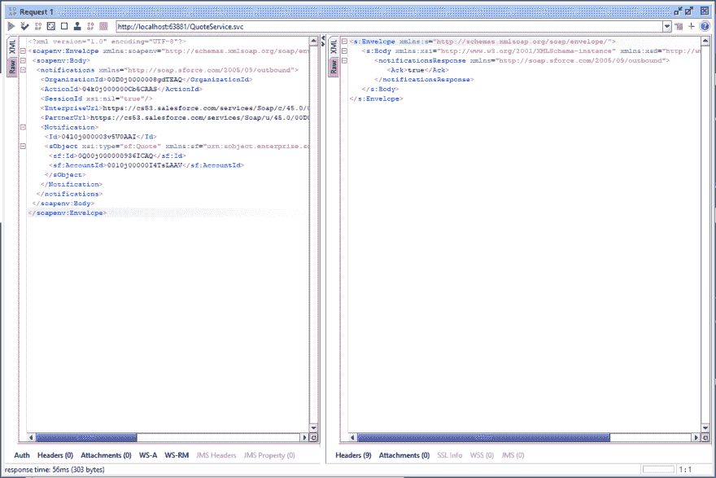

# 测试与 Salesforce 出站消息的 C# Web 服务连接

> 原文：<https://dev.to/rachelsoderberg/salesforce-outbound-messages-part-2---testing-a-net-web-service-connection-with-salesforce-outbound-messages-5a4c>

欢迎来到我的 Salesforce 出站消息系列的第 2 部分！此时，我将假设您在 Salesforce 中有一条出站消息，当您创建新报价和成功编译的 Web 服务时，该消息失败。如果您没有准备好这两个部分，请回到第 1 部分，这样您就可以跟上进度了(不要担心，我们会等您的！): [Salesforce 出站消息第 1 部分](https://dev.to/rachelsoderberg/salesforce-outbound-messages-part-1---integrating-salesforce-workflow-outbound-messages-and-net-visual-studio-2017-1fna)

* * *

连接 Web 服务和出站消息首先需要一个端点——因为我们的服务还没有处理实际的数据，所以从技术上讲，我们需要两个“端点”如果这听起来令人困惑，不要担心，它比你想象的更简单。

首先加载您的 web 服务项目并运行您的服务；在我的例子中，这被称为 QuoteService.svc。如果你做的一切都正确，WCF 测试客户端应该启动。复制类似于[http://localhost:63881/quote service . SVC](http://localhost:63881/QuoteService.svc)的本地主机地址。注意:保持 WCF 测试客户端运行。

启动 SoapUI 并创建一个新的 SOAP 项目，用？wsdl 在最后像这样:[http://localhost:63881/quote service . SVC？wsdl](http://localhost:63881/QuoteService.svc?wsdl)
选中 Create Requests 并点击 OK。您将在导航栏的下几层找到新的 Soap 信封，名为 Request 1。

现在让 Soap 信封保持原样，并导航到[PutsReq.com](https://putsreq.com/)。如果你不熟悉 PutsReq，它是一个让你记录 HTTP 请求和虚假响应，并转发请求的网站。这使我们能够看到从我们的 Salesforce 出站消息传递到我们的 Web 服务的数据，如果它被完全设置的话。创建一个 PutsReq，并在顶部复制提供的 PutsReq URL。将此 URL 粘贴到您的 Salesforce 出站消息端点 URL 中，代替您在第 1 部分中提供的虚拟 URL。注意:如果你点击 PutsReq URL，它会把你带到一个在左上角写着“Hello World”的空白页面。

在 Salesforce 中创建新报价。如果您对工作流规则使用了 NOT( ISBLANK( Order_XML__c))规则标准，请确保将新报价上的 Order XML 字段设置为某个值(我将我的设置为“NOT BLANKVALUE”)。该报价在出站消息传递状态下仍会显示为失败，但是您应该会在 PutsReq 上看到一个新的请求。

除了这个新请求，在 PutsReq 的底部应该有一个 POST 部分，带有一个 Soap 信封:

您可能已经注意到这个 Soap 信封看起来很像几个步骤前在 SoapUI 中生成的那个。你是正确的！复制并粘贴到 SoapUI 中，替换他们的样板代码。

希望您的 WCF 测试客户端仍然在后台运行——如果不是这样，您将得到 Soap 请求的错误，所以再次运行您的 Web 服务。在您的 Soap 请求上单击 submit(小的 Play 按钮),稍等片刻。如果一切都设置正确，您将在右边的面板中收到一个真实的 Ack 通知。

* * *

下一步，我将在本系列的第 3 部分中向您介绍，添加更多的字段，使您的出站消息更加有用。