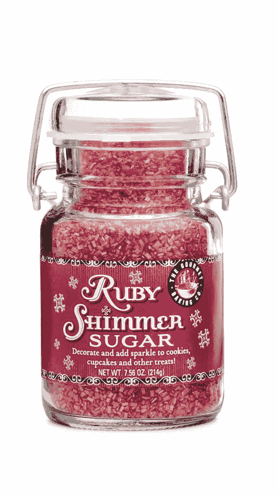
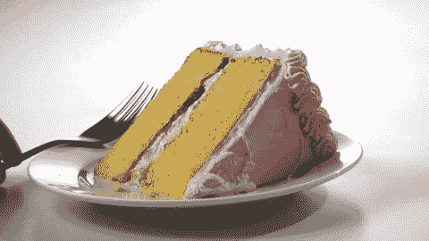
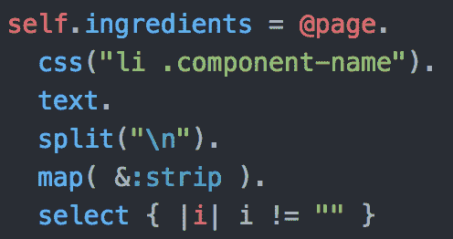

# 用 Nokogiri 刮食谱

> 原文：<https://dev.to/256hz/scraping-recipes-with-nokogiri-29ih>

我正在做一个项目，需要从各种网站的前端刮食谱。不可思议的旅程！我一路上结交的朋友一直都在我身边！

## **NOKOGIRI。**

大多数人可能都知道 Nokogiri 是 Ruby on Rails 安装中的一个点，您可以在这里休息一下，喝点饮料。(为什么 Nokogiri 捆绑了地球上每一种风味的 Rails？我不知道。*它很大，而且很专业。)但现在你已经和一个世界级的网络搜索者打成一片了。想要关注没有 RSS 源的内容吗？从一整类网站中聚合内容？为您最新的 NLP 项目积累训练数据？你来对地方了。

Nokogiri 附带了抓取三种主要格式的工具:CSS、HTML 和 XML。我使用了 HTML 和 CSS 工具的组合。如果你喜欢 Javascript，Nokogiri 对象会给你一个不属于你自己的文档上的`document.querySelectorAll`的等价物。然后你可以在上面加尽可能多的红宝石糖。如果这听起来不好吃，那你就看错博文了。

|  |
| --- |
| *图一。有人要红宝石糖吗？* |

你需要做的第一件事是申请一份页面的副本。我使用了一个名为 HTTParty 的 gem，为此我采取了繁琐的步骤，将`'gem httparty'`添加到我的 gem 文件中。用 HTTParty 请求看起来像这样:

[](https://res.cloudinary.com/practicaldev/image/fetch/s--lJbSyv4G--/c_limit%2Cf_auto%2Cfl_progressive%2Cq_auto%2Cw_880/https://thepracticaldev.s3.amazonaws.com/i/fr8abcco28q0rpft6gu1.png)

棘手。请原谅我:将这个加载到 Noko 对象中有点困难。

[](https://res.cloudinary.com/practicaldev/image/fetch/s--On1trwWD--/c_limit%2Cf_auto%2Cfl_progressive%2Cq_auto%2Cw_880/https://thepracticaldev.s3.amazonaws.com/i/l47rsnn52h56073inu67.png)

哦，等等，这太简单了。为了清楚起见，我们告诉 NG 将 HTTParty 输出解析为 HTML，并将其存储在一个实例变量中。为什么是实例变量？让我们花点时间来思考一下我们的项目设置。

我建议将 scraper 对象从用于存储结果的模型中分离出来。在刮刀中，您可以保持:

*   刮削方法
*   感兴趣的 URL
*   您的 Nokogiri 页面对象
*   您收集的“种子数据”

然后，可以使用种子数据在数据库中生成结果对象。将这些分开意味着您不会在任何一个模型中浪费大量的数据库列，或者为您的结果提供他们永远不会使用的方法。

在我的 scraper DB 对象中，我保存了 Noko 页面、食谱标题、URL、产量/烹饪时间以及用于配料和说明的字符串数组。因为我使用 Postgres，所以设置数组属性是小菜一碟:

> `$ rails g migration add_columns_to_scrapers`

在您的新迁移中:

```
add_column :scrapers, :ingredients, :string, array: true, default: []
add_column :scrapers, :instructions, :string, array: true, default: [] 
```

|  |
| --- |
| *图二。蛋糕。* |

如果您在另一个数据库上，您可能会为这些属性创建连接表，这就没那么有趣了。但是你不用 Postgres 所以。。坚硬的坚果？请注意，我不会吝惜食物的双关语。

总之。现在有趣的部分:刮的方法！

我担心我必须构造巨大的条件正则表达式语句来解析成分列表。幸运的是，我正在使用设计良好的商业应用程序，它们有很好的唯一类名。所以，我用 Nokogiri 的 CSS 方法来抓取我的数据。

在捕获页面之后，设置一个调试器，这样您就可以处理结果了。好，让我们看看整个事情是什么样子的。

> `@page`

|  |
| --- |
| *图 3。请发送帮助。* |

哦。这是我们遇到的第一个“看起来很难”的东西。真的没那么糟糕。你看到的是页面中每个元素和子元素的 Nokogiri 对象版本。这实际上很棒——这意味着你可以很好地控制结果。

食谱标题是我的第一个目标。于是，我打开了 Chrome 的 Inspect 元素，得到了`<h1>`标题的类。

[](https://res.cloudinary.com/practicaldev/image/fetch/s--S5tnbjM6--/c_limit%2Cf_auto%2Cfl_progressive%2Cq_auto%2Cw_880/https://thepracticaldev.s3.amazonaws.com/i/x9rz5o5401buenynvp7j.png)

在那里！这个方便命名为`page-title`。现在我们可以使用`.css`方法:

> `@page.css(".page-title")`

唷。还和我在一起吗？我们将`.`添加到`.page-title`中，告诉 Nokogiri 我们想要搜索这个术语作为类名。原来 Noko 给我们的比我们想要的多一点。以下是该查询的结果:

[](https://res.cloudinary.com/practicaldev/image/fetch/s--9eTXnR9t--/c_limit%2Cf_auto%2Cfl_progressive%2Cq_auto%2Cw_880/https://thepracticaldev.s3.amazonaws.com/i/ypoat9f5ote74gmc154y.png)

幸运的是，我们可以在任何一个上面使用`.text`方法来获取文本。这很像在 JS 中使用`.textContent`。

> `@page.css(".page-title").text`

[](https://res.cloudinary.com/practicaldev/image/fetch/s--RE_spshb--/c_limit%2Cf_auto%2Cfl_progressive%2Cq_auto%2Cw_880/https://thepracticaldev.s3.amazonaws.com/i/sio9buimxtv0vrf95bex.png)

我们越来越接近了！我们需要的只是 Ruby 出色的`.strip`方法，它去掉了空白和换行符。

> `@page.css(".page-title").text.strip`

[](https://res.cloudinary.com/practicaldev/image/fetch/s--j6A_w4AI--/c_limit%2Cf_auto%2Cfl_progressive%2Cq_auto%2Cw_880/https://thepracticaldev.s3.amazonaws.com/i/l3rnpiplhbrazqlw204w.png)

哒哒！你刚刚刮了你好世界。

对于所有像我一样的红宝石烟鬼来说，获得一系列配料是一种享受。

[](https://res.cloudinary.com/practicaldev/image/fetch/s--mGhl51kj--/c_limit%2Cf_auto%2Cfl_progressive%2Cq_auto%2Cw_880/https://thepracticaldev.s3.amazonaws.com/i/n070dspy705dggo6kv4e.png)

这个和上面的差不多。

1.  得到一个 Noko 对象的数组，
2.  我们用`.text`将它转换成一个长字符串。
3.  然后我们`split`换行，
4.  并将`strip`映射到拆分数组中的每个项目上。(如果你觉得这个语法很奇怪，你可以把它写成`.map {|i| i.strip }`。)
5.  这也给了我们一些空字符串，所以我们选择非空的。

结果:

[](https://res.cloudinary.com/practicaldev/image/fetch/s--5vUf4vQr--/c_limit%2Cf_auto%2Cfl_progressive%2Cq_auto%2Cw_880/https://thepracticaldev.s3.amazonaws.com/i/47ivi7zbh297x9nvv86j.png)

赢了。现在，我必须解析配料字符串的数量、尺寸和名称。不过，那完全是另一篇博文。现在，享受你的新技能吧！

|  |
| --- |
| *图 4。蛋糕。* |

感谢阅读。如果有什么需要澄清或补充的，请告诉我。

* *好吧，我谷歌了一下。Rails 包含 Nokogiri，因为它是测试套件`rails-dom-testing`的一个依赖项，我想这是有意义的，因为你会想要解析你的页面进行测试。抱怨抱怨。*