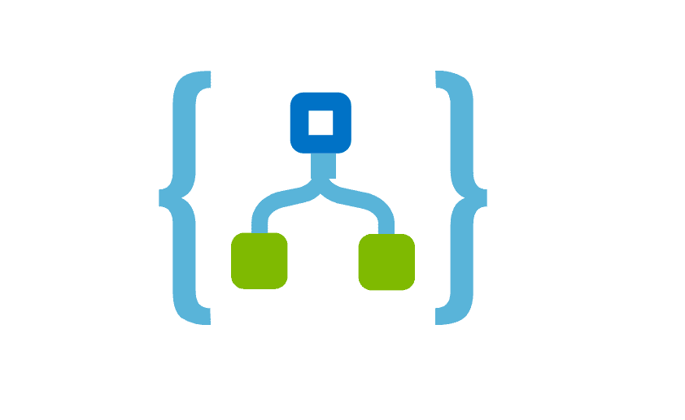
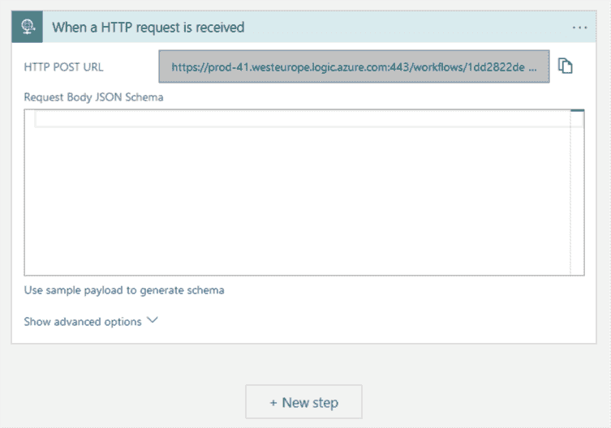
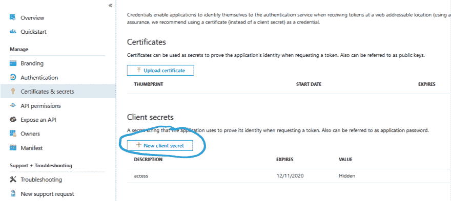
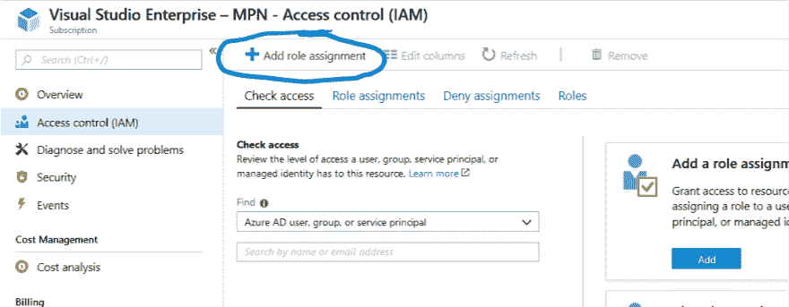
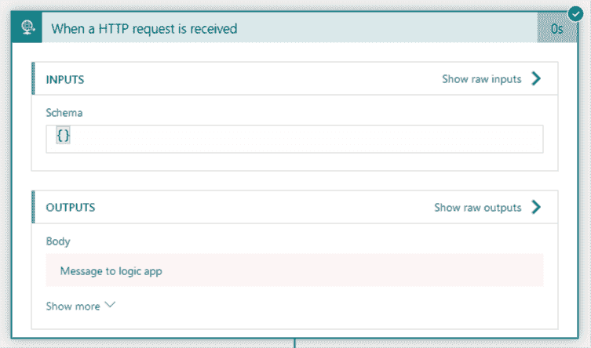

# 保护逻辑应用程序 Http 触发器

> 原文：<https://dev.to/foppenma/securing-logic-app-http-triggers-553d>

[](https://res.cloudinary.com/practicaldev/image/fetch/s--XwID-D0w--/c_limit%2Cf_auto%2Cfl_progressive%2Cq_auto%2Cw_880/https://www.re-mark-able.net/conteimg/2018/12/logicapplogo-2.png)

对于所有使用 logic 应用程序 http 触发器的开发人员，这里有一个简单的解决方案，说明我们如何能够更好地保护 logic 应用程序。

这是一个没有 Azure Api 管理的解决方案，也没有使用代理来隐藏 url 的签名并将其作为标题发布。

在我的情况下，我有一个预定的功能应用程序，它进行一些数据处理，并将结果发布到一个逻辑应用程序。对于此示例，我们将创建一个精简/精简的解决方案。为了实现这一点，我们需要创建以下内容:

*   逻辑应用程序
*   应用程序注册
*   预定功能应用程序

让我们开始创建一个只有 http 触发器的简单逻辑应用程序。

[](https://res.cloudinary.com/practicaldev/image/fetch/s--m-t0SBiF--/c_limit%2Cf_auto%2Cfl_progressive%2Cq_auto%2Cw_880/https://www.re-mark-able.net/conteimg/2018/12/logicapp.png)

保存逻辑应用程序后，将创建一个 url，其外观如下:

```
https://prod-41.westeurope.logic.azure.com:443/workflows/1dd2822de5034e543088be263d4dd412/triggers/manual/paths/invoke?api-version=2016-10-01&sp=%2Ftriggers%2Fmanual%2Frun&sv=1.0&sig=0qwAP5sOqZ6aA4As8eGjZipRiLRYOTuwnHuaMjwEMGb 
```

别担心，这个 http 触发器已经不存在了。

现在任何有这个网址的人都可以触发逻辑应用程序。因此，明智的做法是不要分享或储存它..等等什么？那你该怎么称呼它呢？我们可以从逻辑应用程序资源中检索 url。但是为了做到这一点，我们需要首先创建一个应用程序注册。

### App 注册

为了解决这个问题，我们需要在 Active Directory (AD)上创建一个应用程序注册，并在创建 logic 应用程序的地方进行订阅。这可以通过前往[http://aka.ms/registeredappsprod](http://aka.ms/registeredappsprod)或导航至[https://portal.azure.com](https://portal.azure.com)>Azure Active Directory>App 注册来完成。新建一个没有权限的就行了。重定向 url 也可以留空。在使用它之前，我们需要生成一个新的客户端密码。

[](https://res.cloudinary.com/practicaldev/image/fetch/s--b_6wT_Uz--/c_limit%2Cf_auto%2Cfl_progressive%2Cq_auto%2Cw_880/https://www.re-mark-able.net/conteimg/2018/12/newsecret-1.png)

此外，将此具有“读者”角色的应用程序添加到与您的 logic 应用程序相同的订阅中。为此，您可以转到订阅的“访问控制”并添加新的角色分配

[](https://res.cloudinary.com/practicaldev/image/fetch/s--tQ1cTAH5--/c_limit%2Cf_auto%2Cfl_progressive%2Cq_auto%2Cw_880/https://www.re-mark-able.net/conteimg/2018/12/accesscontrol.png)

### 创建预定功能 app

为了利用刚刚创建的应用程序注册，我们可以创建一个如下所示的预定功能应用程序:

```
[FunctionName("Scheduled_ProcessData")]
public static async Task Run([TimerTrigger("0 */1 * * * *")]TimerInfo myTimer, ILogger log)
{
    // Do something here
} 
```

在本例中，我们使用了一个函数应用程序，但是由于对逻辑应用程序资源的访问只是一个 REST 调用，因此您可以从任何能够执行 REST 调用的解决方案中访问它。

### 稍微安稳一点

现在我们已经完成了基本的准备工作，我们现在可以做的是，从逻辑应用程序(参考资料)中检索 url，而不是从配置或 keyvault 中检索 url！

在下面的代码中，我们将依次执行以下操作:

*   设置执行调用所需的所有值
*   构建我们可以从中检索逻辑应用程序 url 的 url
*   检索逻辑应用程序 url(这不是您在编辑应用程序时在中看到的 url)
*   向这个新 url 发布消息

要使这段代码工作，您需要添加“Microsoft”的 nuget。azure . management . resource manager . fluent；"并插入对它的使用。

```
// Setup 
var tenantId = "6a76fe50-e9d9-477f-9831-e43347c8f9d4";
var clientId = "a66fcb38-c768-4afc-ab79-d544d2e147d0";
var secret = "your app password/secret here";
var subscriptionId = "554395c0-759d-4299-9134-554e608f7f68";
var resourceGroupName = "Your Azure Resource Group here";
var logicAppName = "Your Logic app name here";

// Setup resource client
var creds = new AzureCredentialsFactory().FromServicePrincipal(clientId, secret, tenantId, AzureEnvironment.AzureGlobalCloud);
var restClient = RestClient.Configure()
    .WithEnvironment(AzureEnvironment.AzureGlobalCloud)
    .WithBaseUri("https://management.azure.com/")
    .WithCredentials(creds)
    .Build();

// Construct meesage
var url = $"https://management.azure.com/subscriptions/{subscriptionId}/resourceGroups/{resourceGroupName}/providers/Microsoft.Logic/workflows/{logicAppName}/triggers/manual/listCallbackUrl?api-version=2016-06-01";
var message = new HttpRequestMessage(HttpMethod.Post, url);

// Add authentication headers on message
await restClient.Credentials.ProcessHttpRequestAsync(message, new System.Threading.CancellationToken(false));

// Retrieve logic app url
var httpClient = new HttpClient();
var httpResponse = await httpClient.SendAsync(message);
var apiResponse = await httpResponse.Content.ReadAsStringAsync();

// Send Message to logic app
var authenticatedUrl = (string)JsonConvert.DeserializeObject<dynamic>(apiResponse).value;
await httpClient.PostAsync(authenticatedUrl, new StringContent("Message to logic app")); 
```

让我首先声明，设置中的硬编码值是一个真正的“不去”。如果你想使用这个例子，请从密钥库中获取。这可以通过在 KeyVault 的访问策略中添加托管身份并使用 KeyVault SDK 来实现。为了简单起见，我保留了硬编码的值。更详细的解释可以在[这里](http://www.re-mark-able.net/)找到

现在我只是发送一个 StringContent 到逻辑应用程序，但是当然，你可以发送任何逻辑应用程序能够接收的内容。现在运行这个函数，等待它触发一次运行。执行该功能后，您可以看到我们成功地向逻辑应用程序发布了一条消息。

[](https://res.cloudinary.com/practicaldev/image/fetch/s--4jiU_L-n--/c_limit%2Cf_auto%2Cfl_progressive%2Cq_auto%2Cw_880/https://www.re-mark-able.net/conteimg/2018/12/postedToLogicApp.png)

> 该 url 将保持有效，直到重新生成逻辑应用程序的主访问密钥。

### 把它保护得更远一点

即使调用逻辑应用程序的 url 在运行时被检索并且没有被保存，静态 url 仍然是可用的。我必须承认，该网址泄漏或被暴力破解的可能性非常小。更进一步的限制是每 x 分钟/小时/天重新生成一次。我们可以通过调用相同的代码，但使用不同的 url 来做到这一点，我们需要在帖子中添加一些内容。

将 url 更改为:

```
https://management.azure.com/subscriptions/{subscriptionId}/resourceGroups/{resourceGroupName}/providers/Microsoft.Logic/workflows/{logicAppName}/regenerateAccessKey?api-version=2016-06-01 
```

并添加这一行代码来为您发布的消息添加内容:

```
message.Content = new StringContent(JsonConvert.SerializeObject(new { keyType = "Primary" }), Encoding.UTF8, "application/json"); 
```

“keyType”属性可以设置为“Primary”或“Secondary ”,这将重新生成指定的密钥。这与 azure 门户中的功能相同。

[](https://res.cloudinary.com/practicaldev/image/fetch/s--gmDA2h1g--/c_limit%2Cf_auto%2Cfl_progressive%2Cq_auto%2Cw_880/https://www.re-mark-able.net/conteimg/2018/12/azureportalaccesskeys.png)

一个很好的新增功能是，当更改主键时，所有检索到的逻辑应用程序 URL 将在 10 分钟左右后无效。

> 当更改访问密钥时，请记住您可能需要刷新 azure 门户并等待几分钟。当打开没有门户刷新的逻辑应用程序运行时，会出现多次错误，显示未被授权查看如下内容:

[](https://res.cloudinary.com/practicaldev/image/fetch/s--l0gyWfBj--/c_limit%2Cf_auto%2Cfl_progressive%2Cq_auto%2Cw_880/https://www.re-mark-able.net/conteimg/2018/12/unauthorized.png)

嗯，就是这样！现在，您有了一个针对逻辑应用程序的滚动键解决方案，以及一种无需配置 URL 即可访问逻辑应用程序的方法。当然，你必须现实一点，想知道有人猜测/暴力破解一个 URL 和签名会带来什么变化..那会有点“不寻常”。但是如果你是那种想要尽可能多的安全感的人，那么这个可能适合你:)

感谢阅读！