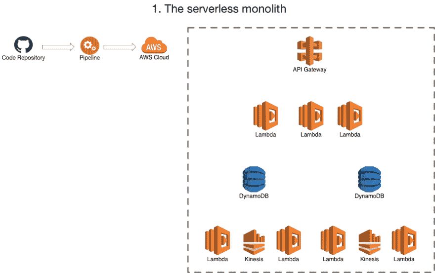
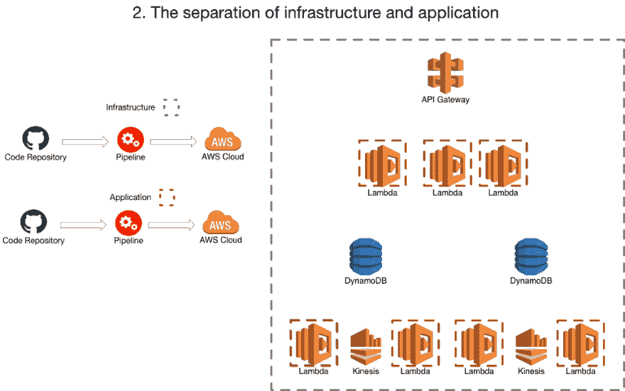
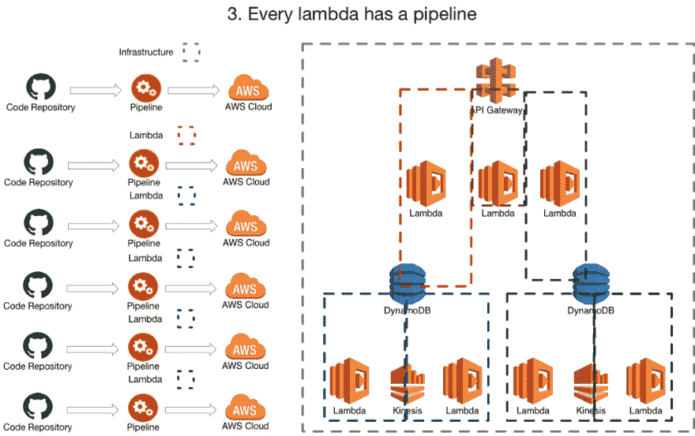
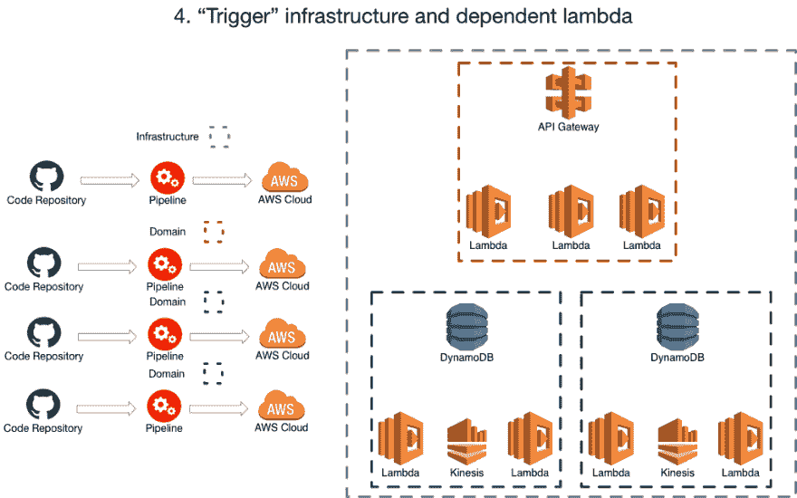
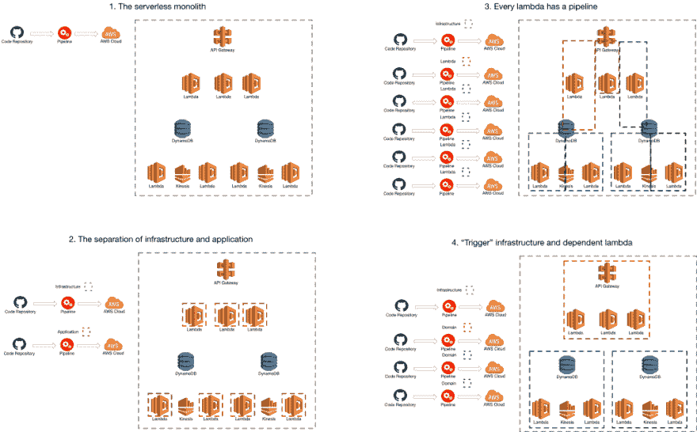

# 无服务器部署模式和技术

> 原文：<https://dev.to/defmyfunc/serverless-deployment-patterns-and-techniques-371b>

随着无服务器的发展壮大，出现了大量的架构模式来支持我们试图解决的问题。强架构模式的关键是理解这些部分是如何分解和部署的。没有这一点，模式是没有用的。我将解释我以前尝试过的模式，以及哪一个是我当前的默认方法。

它非常特定于 AWS，但我认为核心原则可以应用于任何无服务器部署。如果有问题，我很抱歉。

一如既往，欢迎评论、想法和其他方法。

#### 术语

**Pipeline**——管理存储库中的代码移动以供用户运行的东西，通常有以下几个阶段:

*   试验
*   建设
*   部署到 Int
*   部署到现场

### 1。无服务器的整体

其中有一个存储库和一个构建管道！基础设施和应用。我不知道我是否需要谈论这一个中的困难。如果你是从零开始，并想快速学习…正确的方法:)但在某些时候，你可能会想继续前进。

 

<figcaption>示例管道显示所有基础设施和应用程序在一个管道中的部署</figcaption>

### 2。基础设施和应用的分离

其中基础设施(使用 [terraform](https://www.terraform.io/) 或 [cloudformation](https://aws.amazon.com/cloudformation/) )有一个管道，而使用该基础设施的应用程序(很可能是一堆 lambda)有另一个管道。

此时，您可能仍然有一个回购，并且您可能在构建过程中做了一些奇怪的事情，以确保更改仅触发适当的管道，或者您有两个回购，一个包含基础架构，一个包含应用程序。

这可能是最接近传统(非无服务器)的架构。其中基础设施部署负责诸如 API 网关、数据库创建、队列创建、lambda“占位符”之类的事情，而不是 lambda 本身。

这意味着您可以开始从您的基础设施独立部署您的应用程序。通常会有[【时序一致性】](http://connascense.com)的问题，事情需要以特定的顺序通过两条管道，或者某些步骤必须在另一个步骤完成后重新运行。基础设施中的 lambda 占位符是最大的痛苦来源，因为 lambda 经常会以一种奇怪的状态结束，除非您做一些工程来使基础设施管道部署最新版本的 lambda。

虽然应用程序可以独立发布，只要你不改变它所依赖的数据库表/队列等，但它仍然是一个非常痛苦的地方。

 

<figcaption>显示基础设施和应用部署分离的管道示例</figcaption>

### 3。每个 lambda 都有一个管道

其中每个 lambda 都有自己的管道，并同时部署基础设施。这通常伴随着向像[无服务器](https://serverless.com/)这样的框架的转移，以管理 lambdas 所依赖的基础设施。你可能还在使用 terraform 或类似的东西来管理你的基础设施的一些其他部分，但这可以通过使用无服务器来最小化。

这消除了许多你的“时间观念”问题，并能真正帮助加速开发。lambdas 周围的隔离意味着开发人员可以感受到更多的自由。虽然开发速度可以加快，但随着应用程序变得越来越复杂，发布通常会变慢。这是因为单个 lambdas 的隔离隐藏了应用程序间的耦合。在您的众多桶、队列和 lambdas 中管理整个资产会变得很困难。

这通常与整个产业中产生和使用的存储库的数量的增加相一致(默认情况下，每个 lambda 一个)，除非工程努力来挑战这一点。这可能会对“[归属位置](https://connascence.io/locality.html)产生巨大影响，除非管理得当，否则可能会损害系统的健康。

### 4。每个“触发器”基础结构及其依赖的 lambdas 都有一个管道

迁移到无服务器时，我们看到的一个常见模式是拥有一个“触发器”基础架构，即:一个队列、一个数据库，链接到一个或多个 lambda，我认为(尽管我没有这种想法的基础)这是“无服务器框架”背后的一些灵感，以及它如何允许您定义一些与 lambda 相关的基础架构。

这一点很重要，因为“触发器”基础设施和相关的 lambda 通常有隐含的或明确的契约。抛开事件有效负载的 AWS 部分不谈，依赖的 lambda(s)通常理解来自特定基础设施的特定事件有效负载，因此它们通常以非常紧密的耦合结束，因此适合被视为单个部署。

虽然我们意识到这不能被定义为一个硬性的规则…但在某些时候，我们可能需要决定某个事物是否与其触发器或与之通信的事物“更相关”…

我们发现，这种方法通常包含一个“领域”。有时这些域相对较小，有时相对较大，但通过将这种方法作为默认方法，然后考虑我们的选项，我们发现这是一个合理的部署边界。

这可以通过多种方式实现，包括地形、云形成或无服务器，重要的是要正确尝试 lambdas 及其相关基础设施的边界和分组。

### 总结

随着无服务器解决方案变得越来越普遍，将会产生许多在无服务器上设计和部署解决方案的“最佳实践”,有些会持续，有些不会。现在说还为时过早，毫无疑问，在 6 个月内，这个领域的格局将会发生变化，但是，目前我们的团队发现将一个“触发器”基础设施及其相关联的 lamb 分组是一种保持我们系统的架构边界清晰的有用方式，同时使现场发布尽可能地轻松。

 

<figcaption>管道和部署类型对比图</figcaption>