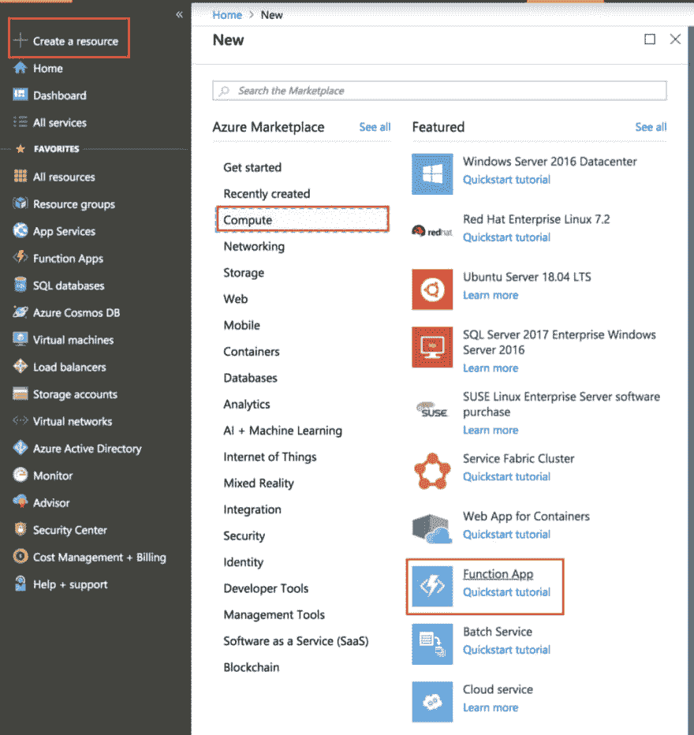
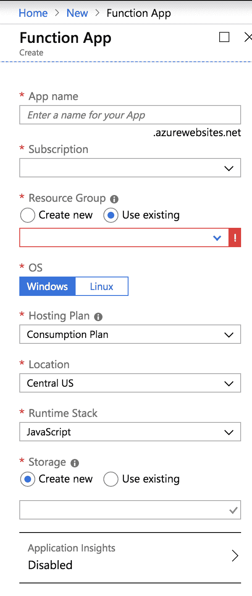
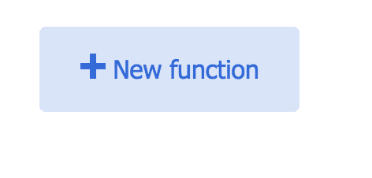
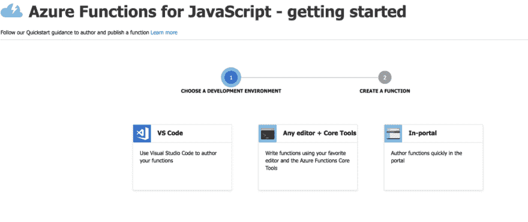
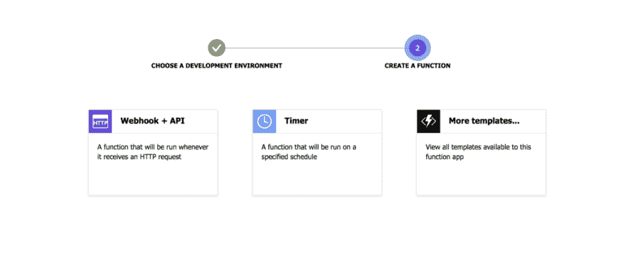
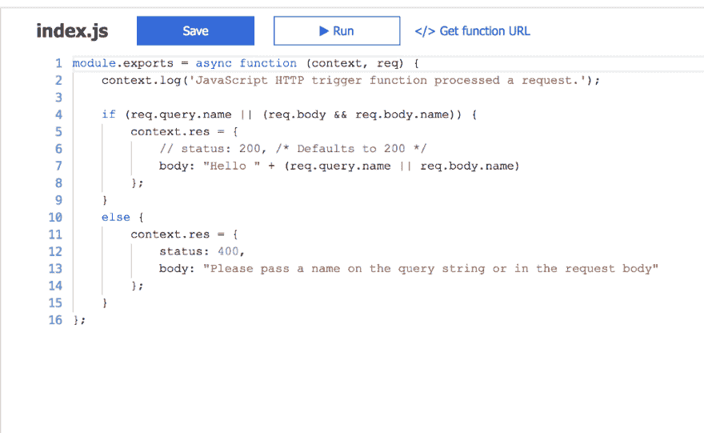
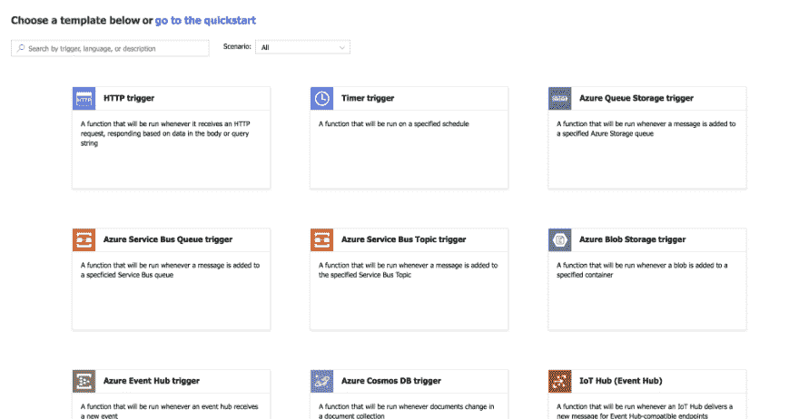
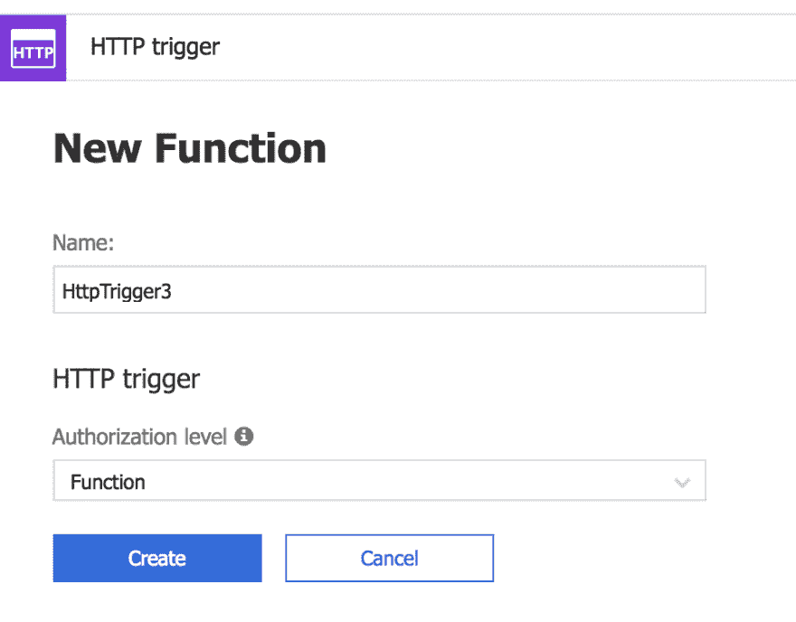

# 无服务器—从一开始，使用 Azure 功能(Azure portal)，第一部分

> 原文：<https://dev.to/azure/serverless-from-the-beginning-using-azure-functions-azure-portal-part-i-28o1>

### 无服务器—从一开始，使用 Azure 功能(Azure portal)，第一部分

在 [Twitter](https://twitter.com/chris_noring) 上关注我，很乐意接受您对主题或改进的建议/Chris

> 无服务器是云计算执行模型，其中云提供商运行服务器，并动态管理机器资源的分配。因此，本质上，您可以专注于编写代码，其余的工作由云提供商来完成

这是本系列的第一部分:

*   无服务器—从一开始，使用 Azure 功能(Azure portal)，第一部分，**你在这里**
*   从一开始，使用 Azure 功能(Azure portal)，第二部分，我们将讲述如何更有效地使用我们的门户 IDE
*   无服务器—从头开始，使用 Azure 函数(VS 代码)，第三部分，进行中
*   无服务器—从头开始，使用 Azure 函数(Azure CLI)，第四部分，进行中

在本文中，我们将涵盖以下内容:

*   **无服务器**，什么是无服务器，为什么它可能是一个好的选择
*   **功能应用**，触发器和绑定
*   **功能**在功能应用中，我们将介绍它支持的语言、创作选择、测试、监控日志和设置授权级别等等

我们已经假设将你的应用程序放在云中是一件既定的事情。我们的意思是，您已经看到了好处，即不必维护硬件，只需为您实际使用的东西付费，等等。

> TLDR；如果你只是想学习如何构建一个 Azure 功能，而不想要长篇大论的理论，那就跳转到标题“创建一个功能 app”吧，以后随时可以看一些 Serverless 和 Azure 理论:)

### 资源

关于这个主题有太多东西需要学习，有一些很棒的文档和学习模块可以帮助你学习:

*   [Azure 功能文档概述](https://docs.microsoft.com/en-us/azure/azure-functions/functions-overview?wt.mc_id=devto-blog-chnoring)

Azure 功能学习模块

*   [创建你的第一个 Azure 函数](https://docs.microsoft.com/en-gb/learn/modules/create-serverless-logic-with-azure-functions/?wt.mc_id=devto-blog-chnoring)
*   [使用触发器执行 Azure 功能](https://docs.microsoft.com/en-gb/learn/modules/execute-azure-function-with-triggers/1-introduction?wt.mc_id=devto-blog-chnoring)
*   [将 Azure 功能链接在一起](https://docs.microsoft.com/en-gb/learn/modules/chain-azure-functions-data-using-bindings/1-introduction?wt.mc_id=devto-blog-chnoring)

### 云中的众多选择

现在，在云中意味着你有选择，事实上有很多选择。您可以在最底层决定您的应用程序可以在什么内存或硬盘类型上运行。然后，您可以在更受管理的级别创建虚拟机，即所谓的 VM，您可以在其中安装所需的操作系统和软件。在这个阶梯上还有更多的步骤，即在应用服务中运行您的应用，您不再需要虚拟机，只需要一个代码驻留的地方，是的，您可以决定在什么操作系统上运行它，但差不多就是这样，这是一个 SaaS，软件即服务平台。但是，在此之上还有一个步骤——无服务器。

### 无服务器简介

那么无服务器是什么意思呢？无服务器是云计算执行模型，其中云提供商运行服务器，并动态管理机器资源的分配。因此，本质上，您可以专注于编写代码，其余的由云提供商完成。

#### FaaS —功能即服务

FaaS，功能即服务是云计算服务的一个类别，是关于提供一个平台来维护基础设施，而你主要担心的是你写的代码。按照上述模型构建的应用程序据说使用了*无服务器架构*

所有优秀的云提供商都有 FaaS 产品:

*   **AWS** ，有 AWS Lambda
*   **谷歌**，有谷歌云功能
*   **IBM/Apache** ，有 OpenWhisk
*   **甲骨文**，有云 Fn
*   **微软**，有微软 Azure 功能

好的，那么它提供什么好处呢？

*   **一切都是函数**，您的业务逻辑作为函数运行
*   **无需手动配置**，您不必手动配置或扩展基础架构。
*   **托管基础设施**，云提供商管理基础设施。
*   **自动缩放**，你的 app 会根据负载自动缩放。

### Azure 上的无服务器

Azure 有两种无服务器架构的方法

*   [Azure Logic Apps，intro](https://azure.microsoft.com/en-gb/services/logic-apps/?wt.mc_id=devto-blog-chnoring) ，Azure Logic Apps 使您能够创建强大的工作流
*   [Azure Functions](https://azure.microsoft.com/en-gb/services/functions/?wt.mc_id=devto-blog-chnoring) ，Azure Functions 是一个无服务器的应用平台。开发人员可以托管无需提供基础设施即可执行的业务逻辑

#### 关于无服务器还有什么需要了解的？

> *都是独角兽和彩虹吗？*

嗯，无服务器肯定很棒，但是我们需要了解一些关于它们的事情，比如:

*   **它们是无状态的**，函数实例按需创建和销毁。如果需要状态，可以将其存储在相关联的存储服务中
*   **它们是事件驱动的**，它们只在响应一个事件(称为“触发器”)时运行，比如接收一个 HTTP 请求，或者一条消息被添加到一个队列中。所以本质上你声明数据从哪里来，到哪里去。你可以用一种叫做绑定的东西来声明性地做这件事，这意味着你不需要编码来与队列、blobs、hub 对话，只需要业务逻辑

**他们确实有缺点**，缺点表现为对*执行时间*和*执行频率*的限制。

*   **超时**，超时为 5 分钟，该超时可配置为最大 10 分钟。如果您的函数需要 10 分钟以上的时间来执行，您可以将它托管在一个虚拟机上。此外，如果您的服务是通过 HTTP 请求启动的，并且您希望该值作为 HTTP 响应，那么超时被进一步限制为 2.5 分钟，但是还有一个名为[持久函数](https://docs.microsoft.com/en-us/azure/azure-functions/durable/durable-functions-overview?wt.mc_id=devto-blog-chnoring)的选项，它允许您在没有任何超时的情况下协调多个函数的执行
*   **执行频率**，如果您希望您的函数被多个客户端连续执行，那么谨慎的做法是估计使用情况并相应地计算使用函数的成本。在虚拟机上托管服务可能更便宜

#### 无服务器与应用服务

很容易认为你在 Azure 中放置应用程序的第一选择是 AppService，这最符合你的思维模式。作为一名开发人员，你想将你的应用程序从内部迁移到云，为此你需要供应数据库，在 App Service 中创建你的服务，对吗？嗯，大多数应用程序很少这么简单，它们往往需要与许多子系统对话，以便登录，或在某处获取一段数据或执行计算。

所有这些次要的东西可能是你的生态系统中不止一个应用程序所关心的，所以将它们转移到单独的服务中是有意义的。然后，您可能会意识到您只需要调用这些服务，很少像创建新用户或有传入请求时那样。此时，您的反应可能是将收到的消息放在队列中，或者在数据库中插入一行，或者创建一个 Slack 通知。

我们在这里说的是，也许我们不需要为一个完整的 AppService 和它给我们的正常运行时间和响应能力付费，而是我们需要一个框架，它可以基于预定义的事件触发一个功能，然后可以执行一个计算，导致一个副作用，比如调用另一个服务/数据库/队列/等等。

现在我们已经到了无服务器的最佳时机，*很少被调用的服务*需要做一些事情来响应某种事件的发生。

简言之

> *无服务器计算通过自动扩大或缩小规模来帮助解决分配问题，并且只有当您的功能正在处理工作时才会向您收费。说到计费，如果您的 FaaS 正在对您调配的存储进行读/写操作，那么您将为功能执行以及该存储付费，因此创作 FaaS 时请记住这一点。*

### 什么是功能 app？

函数托管在一个称为函数应用程序的执行上下文中。这意味着什么？将函数应用程序想象为您托管函数的项目。

#### 先决条件

好的，在我们把我们的功能放到云上之前，有些东西需要存在。这些是:

*   **服务计划**，有两种计划选择*消费服务计划*，CSP 和 *Azure App 服务计划*，ASP CSP 具有自动缩放和在您的功能运行时向您计费，以及可配置的功能执行超时期限。默认情况下，它是 5 分钟，ASP 允许您通过让您函数在您定义的虚拟机上连续运行来避免超时
*   **存储账户**，功能 app 必须链接到一个存储账户。它将此用于内部操作，如记录函数执行和管理执行触发器。此外，功能代码和配置文件也存储在这里

### 创建功能 app

现在有不同的方法来创建功能应用程序，即:

*   **门户**，使用 Azure 门户
*   CLI ，使用 Azure CLI
*   **VS Code** ，用 VS Code 搭建一个 Azure Function app，Azure Functions 使用一些为此目的制作的惊艳插件。

在本文中，我们将重点关注第一个选项，但在此过程中，我们将重点关注一些您需要了解的重要概念，所以请继续关注，因为我们接下来将进行一些编码工作:

[](https://res.cloudinary.com/practicaldev/image/fetch/s--r2Vq2fJ9--/c_limit%2Cf_auto%2Cfl_progressive%2Cq_66%2Cw_880/https://cdn-images-1.medium.com/max/500/0%2AFN7RW_4zk91WGQ9a.gif)

### 选择正确的模板，功能 App

让我们前往门户网站并登录

> *portal.azure.com*

登录后，选择以下选项:

[](https://res.cloudinary.com/practicaldev/image/fetch/s--12GHSfbF--/c_limit%2Cf_auto%2Cfl_progressive%2Cq_auto%2Cw_880/https://cdn-images-1.medium.com/max/1024/0%2AJPDZJqFHpzJtlQPw.png)

因此，首先选择创建资源，然后选择计算，最后选择函数应用程序模板。

### 在模板中做出选择

一旦我们选择了功能应用程序模板，我们需要选择更多的东西。此时，您的用户界面将如下所示:

[](https://res.cloudinary.com/practicaldev/image/fetch/s--MDALD3f3--/c_limit%2Cf_auto%2Cfl_progressive%2Cq_auto%2Cw_880/https://cdn-images-1.medium.com/max/600/0%2AJLy6h_Jk4qqjhczJ.png)

好的，那么需要做出以下选择:

*   **输入应用名称**，应用名称必须是*全球唯一的*，因为它将作为基本 URL 的一部分
*   **选择一个套餐**，我们将为您挑选一个套餐
*   **选择一个资源组**，你可以选择一个已有的资源组或者创建一个新的，由你决定
*   **选择操作系统**，这里的选择是 Windows 或 Linux，我们选择 Windows 是因为我们需要选择一些东西:)
*   **选择托管计划**，这应该是*消费计划*，我们在本文前面提到过消费计划以及为什么它是更好的选择
*   **选择地理位置**，我们将选择离您最近的地区
*   **运行时堆栈**，这是你将要编码的语言，所以我们选择 Javascript
*   **创建一个新的存储帐户**，让我们利用一个现有的或创建一个新的
*   **启用应用洞察**，用于统计和其他类型的应用跟踪

现在点击按钮**创建**

这需要一段时间，比如几分钟。此时喝点咖啡或其他热饮:

[](https://res.cloudinary.com/practicaldev/image/fetch/s--qHW_DTuY--/c_limit%2Cf_auto%2Cfl_progressive%2Cq_66%2Cw_880/https://cdn-images-1.medium.com/max/500/0%2A_PScLnXn4uJSGshs.gif)

### 验证你的应用

检查它是否有公共 URL，并且可以导航到它的默认页面

[](https://res.cloudinary.com/practicaldev/image/fetch/s--d_yY80HY--/c_limit%2Cf_auto%2Cfl_progressive%2Cq_auto%2Cw_880/https://cdn-images-1.medium.com/max/1024/0%2A8vekjnpg1OjFoUbW.png)

好极了，我们有了一个默认页面，现在做什么？好了，是时候给我们的功能 app 增加一个功能了。

### 为您的函数 app 创建函数

这里有两种 UI 行为，这取决于你是否没有向你的功能应用添加功能，所以你是从全新开始，或者第二种选择是你有一个现有的功能应用，其中至少有一个功能。

当您创建一个新函数时，在开始编码之前，您需要做出一些决定，例如:

1.  **触发类型**，这是关于决定什么应该触发你的函数调用，比如 HTTP 调用，或者可能是数据库行的改变或者其他什么
2.  **创作**，有三种方法可以创作你的功能，用 VS 代码，任何编辑器+核心工具或者 In-portal

### 全新开始—尚未添加任何功能

添加第一个功能时，会出现快速启动屏幕。

此时，页面中间会显示以下内容

[](https://res.cloudinary.com/practicaldev/image/fetch/s--7nWKPuvY--/c_limit%2Cf_auto%2Cfl_progressive%2Cq_auto%2Cw_880/https://cdn-images-1.medium.com/max/472/0%2AeQPmtvpq7iBlRXfk.png)

让我们通过点击新函数来创建该函数

#### 选择创作类型

现在，您面临着如何编写函数的选择:

*   **VS Code** ，这是一个很好的选择，很多插件都支持这个选项
*   任何编辑器 +核心工具，一个更不可知的选择，但也绝对是一个好的选择
*   **在门户**中，您将在门户中编写代码

[](https://res.cloudinary.com/practicaldev/image/fetch/s--w6n3_q68--/c_limit%2Cf_auto%2Cfl_progressive%2Cq_auto%2Cw_880/https://cdn-images-1.medium.com/max/1024/0%2Ax2kZ3tdbFZOamZxv.png)

现在，我们将使用门户内选项

#### 选择触发类型

我们现在面临着:

*   **Webhook + API** ，只要点击某个 URL，函数就会运行
*   **定时器**，功能将根据时间表运行
*   更多模板，还有很多模板值得探索

[](https://res.cloudinary.com/practicaldev/image/fetch/s--akEKNsgE--/c_limit%2Cf_auto%2Cfl_progressive%2Cq_auto%2Cw_880/https://cdn-images-1.medium.com/max/1024/0%2A1qEhbpDTelYEgpnq.png)

现在，我们将使用 Webhook + API 选项。

有一长串模板可供选择。还有这么多，你不觉得兴奋吗？:)

#### 瞧，你的功能搭好了

这是我们现在的编码环境:

[](https://res.cloudinary.com/practicaldev/image/fetch/s--j5aNFpk5--/c_limit%2Cf_auto%2Cfl_progressive%2Cq_auto%2Cw_880/https://cdn-images-1.medium.com/max/1024/0%2Am1uDb9-OoDZq6T8L.png)

### 预存功能

在这种情况下，我们的函数应用程序中已经至少有一个函数。您希望在左侧菜单中找到一个显示“功能+开启”的文本，它应该是这样的:

[](https://res.cloudinary.com/practicaldev/image/fetch/s--MxTIhmF5--/c_limit%2Cf_auto%2Cfl_progressive%2Cq_auto%2Cw_880/https://cdn-images-1.medium.com/max/498/0%2ATLiNW62It41HI7Ks.png)

#### 选择触发类型

单击+号将在主字段中显示以下屏幕:

[](https://res.cloudinary.com/practicaldev/image/fetch/s--xa-2jHfv--/c_limit%2Cf_auto%2Cfl_progressive%2Cq_auto%2Cw_880/https://cdn-images-1.medium.com/max/1024/0%2A2Hd2igr8TnqG7uQ6.png)

该屏幕允许您选择触发器类型(HTTP、定时器或数据)和编程语言(C#、JavaScript、F#或 Java)。然后，根据您的选择，Azure 将为您生成功能代码和配置，并提供一些示例代码来显示日志中收到的输入数据

我们选择 **HTTP 触发器**，那么第一个选项。

然后，我们面临命名我们的函数，并在授权级别上进行初始选择(我们可以在以后更改这一部分)

[](https://res.cloudinary.com/practicaldev/image/fetch/s--rv0_GamN--/c_limit%2Cf_auto%2Cfl_progressive%2Cq_auto%2Cw_880/https://cdn-images-1.medium.com/max/960/0%2AUhUEIMBbr2QgUznI.png)

### 带它兜风

我们可以在门户中测试它，或者点击 URL。要获取 URL，我们单击获取函数 URL 并在浏览器中测试它:

[](https://res.cloudinary.com/practicaldev/image/fetch/s--mxWS0mhg--/c_limit%2Cf_auto%2Cfl_progressive%2Cq_auto%2Cw_880/https://cdn-images-1.medium.com/max/1024/0%2Afu7rcHCoFvKfUIxy.png)

在你选择复制 URL 之后，你进入浏览器，输入 URL 并确保添加&name=chris。因为如果你看你的 Javascript 代码，你会看到它要求参数名在主体中或者作为一个 URL 参数。它应该是这样的:

[](https://res.cloudinary.com/practicaldev/image/fetch/s--qKOovFGL--/c_limit%2Cf_auto%2Cfl_progressive%2Cq_auto%2Cw_880/https://cdn-images-1.medium.com/max/1024/0%2A8zk8SjZVB7HzdZpo.png)

### 构建我们的服务

好吧，那我们要不要建一个比 hello world 更有趣的东西？好吧，这不会更有趣，但至少你可以像我的一个同事一样畏缩不前*看，亚当，你已经在博客上发表了，哈哈*。

好的，我们将要建立一个…等等，鼓声，一个*爸爸笑话*服务。你知道那些父母说的非常糟糕的双关语，迫使你否认和他们有任何关系，是的，那些笑话。谷歌是我的朋友，所以让我们开始谷歌一些笑话，并把它们存储在一个列表:

```
var dadJokes = [ 
 "Did you hear about the restaurant on the moon? Great food, no atmosphere.", 
 "What do you call a fake noodle? An Impasta.", 
 "How many apples grow on a tree? All of them.", 
 "Want to hear a joke about paper? Nevermind it's tearable.", 
 "I just watched a program about beavers. It was the best dam program I've ever seen.", 
 "Why did the coffee file a police report? It got mugged.", 
 "How does a penguin build it's house? Igloos it together." 
]; 
```

在那里，如果我看不到，你也看不到；)

好的，下一步是找一些狗的照片，看起来它们在笑，因为互联网是对的；)

```
var punDogs = [ 
 "image1.jpg", 
 "image2.jpg" 
] 
```

什么，我没有给你实际的图片网址，你是一个大开发商，我相信你可以在网上找到狗的图片，或者为什么没有猫；)

现在来选择一个随机的爸爸笑话和随机的图片:

```
var newNumber = Math.floor(Math.random() * dadJokes.length); 
var dogImageUrl = Math.floor(Math.random() * punDogs.length); 
```

最后，让我们用一个 HTML 响应来回答:

```
context.res = { 
 status: 200, 
 headers: { 
 "Content-Type": "text/html" 
 }, 
 body: '<h3>'+dadJokes[newNumber]+'</h3>' + '<br>' }; 
```

让我们保存代码，并确保将授权级别设置为 *Anonymous。*

[](https://res.cloudinary.com/practicaldev/image/fetch/s--m6oS5Rpj--/c_limit%2Cf_auto%2Cfl_progressive%2Cq_auto%2Cw_880/https://cdn-images-1.medium.com/max/1024/1%2AwiekA-NZ5RI9LNbaI9MjgQ.png)

上面我们描述了如何点击左侧菜单中的菜单选项`Integrate`，然后选择`Authorization level`下拉菜单中的`Anyonymous`。

因为我们为什么要限制这个深奥的函数对外界的使用呢？；)

让我们的应用程序转一转，它现在看起来像这样:

[](https://res.cloudinary.com/practicaldev/image/fetch/s--GA7vqSfT--/c_limit%2Cf_auto%2Cfl_progressive%2Cq_auto%2Cw_880/https://cdn-images-1.medium.com/max/800/0%2AiV1lLrHY2JSvvA6F.png)

这次到此为止。我们已经带你构建了你的第一个应用程序，这并不难，是吗？:)

### 总结

关于无服务器的话题还有很多要说的。除了 HTTP 和已经存在的集成之外，我们可以通过许多不同的方式来触发这个功能，等待您去使用它们。但是我们必须为这个系列的未来部分保留一些东西。希望你已经很好地了解了什么是无服务器，什么时候使用它，以及如何创建你的第一个 Azure 函数。

最重要的是，想想过去的做事方式，比如自己处理基础设施，想想负载平衡，这是你几乎不需要考虑的事情。

希望下一部分再见:)

* * *