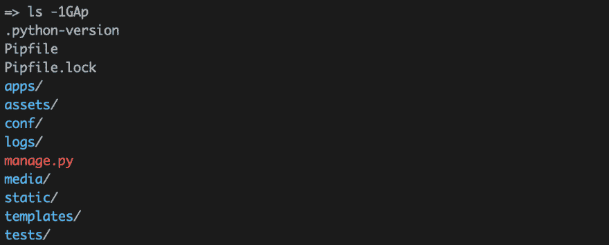
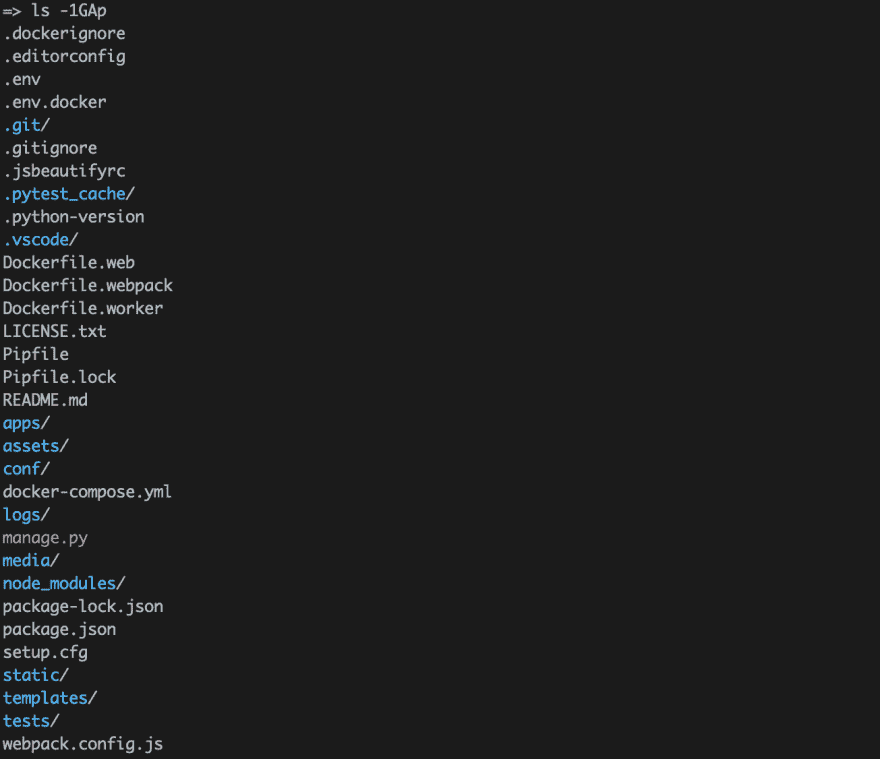

# 像专家一样建立 Django 项目

> 原文：<https://dev.to/fceruti/setting-up-a-django-project-like-a-pro-353>

在本文中，我将向您展示我如何设计一个典型的中等复杂程度的 [django](https://www.djangoproject.com/) 项目，该项目使用 [git](https://git-scm.com/) 进行源代码控制，使用 [pyenv](https://github.com/pyenv/pyenv) 和 [pipenv](https://docs.pipenv.org/en/latest/install/) 处理包，使用 [celery](http://www.celeryproject.org/) 和 [redis](https://redis.io/) 运行任务，使用 [pytest](https://docs.pytest.org/en/latest/) 进行测试，使用 [flake8](http://flake8.pycqa.org/en/latest/) 和[js 美化](https://github.com/beautify-web/js-beautify)进行代码 [docker 编写](https://docs.docker.com/compose/)用于本地服务，而 [postgresql](https://www.postgresql.org/) 用于存储您的数据，所有这些都是在尝试遵循[十二因素](https://12factor.net/)应用配置方法的同时完成的。

如果你喜欢直接跳到结论，看看这个回购，在这里我已经为你准备好了克隆的一切，并立即开始编码你的新项目！

**注意:**我并不声称对此有最终决定权，这是一个不断发展的主题，所以如果您认为我可以做得更好，请告诉我:)

## Python 版本

对于 python 的每个新版本，都会添加、弃用或删除某些特性，因此您需要确保自己知道使用的是哪个版本的 python。最好的方法是使用 [pyenv](https://github.com/pyenv/pyenv) ，这是一个 python 版本管理器，允许您为每个项目安装和指定不同的 python 版本。指定一个版本在你的项目
的根目录下运行

```
pyenv local 3.7.2 
```

Enter fullscreen mode Exit fullscreen mode

将创建一个名为`.python-version`的文件，其中包含文本`3.7.2`。现在，当您键入`python --version`时，您将得到`Python 3.7.2`，如果您修改文件并写入`3.6.8`，相同的命令将输出`Python 3.6.8`。

## 包管理器&虚拟环境

有了对你的解释器版本的信心，我们就可以担心如何下载库以及把它们放在哪里了。如果这是几年前，我会谈论 [pip](https://pypi.org/project/pip/) 、 [virtualenv](https://virtualenv.pypa.io/en/latest/) 甚至是标准库的模块 [venv](https://docs.python.org/3/library/venv.html) ，但是现在镇上最酷的孩子是 [pipenv](https://docs.pipenv.org/en/latest/) ，或者至少 [pypa](https://www.pypa.io/en/latest/) 这么说。Pipenv 处理虚拟环境和包管理。只需运行

```
pipenv install 
```

Enter fullscreen mode Exit fullscreen mode

而 pipenv 会创建一个虚拟环境(vm)和两个文件:`Pipfile`和`Pipfile.lock`。如果你是为了 javascript 而来，这与`package.json`和`package-lock.json`非常相似。要查看 vm 是在哪里创建的，键入`pipenv --venv`，这将为您提供 pipenv 如何工作的线索:它自动将项目目录映射到它们特定的 VM。

因为我们正在创建一个 django 项目，所以我们将下载这个包，并用命令`pipenv install django`将其添加到我们的 vm 中。要访问 vm 的库，您必须在运行的每个命令前加上`pipenv run`。例如，要检查已安装的 django 版本，输入`pipenv run python -c "import django; print(django.__version__)"`。

## 项目布局

在下面的图片中，我展示了我喜欢如何布局我的目录结构。

[](https://res.cloudinary.com/practicaldev/image/fetch/s--WjDSSMIY--/c_limit%2Cf_auto%2Cfl_progressive%2Cq_auto%2Cw_880/https://thepracticaldev.s3.amazonaws.com/i/3qvmak4x5jfv2z8c0ls6.png)

我不喜欢默认的 django 布局，当我们被提示给我们的项目起一个名字，比如 **awesome** ，这也是我们的 repo 的名字，我们最终输入了类似`~/code/awesome/awesome/settings.py`的东西，这简直太糟糕了。对我来说，将所有配置文件放在一个名为`conf`的目录中更有意义。您的项目名称已经是根目录的名称。所以，让我们从
开始我们的项目

```
pipenv run django-admin.py startproject conf .
mkdir {apps,assets,logs,static,media,templates,tests} 
```

Enter fullscreen mode Exit fullscreen mode

在我们输入`pipenv run python manage.py runserver`之后，开发服务器应该可以工作了，它确实可以工作，但是有些地方出了问题，写这个命令非常痛苦。幸运的是，我们可以在我们的`Pipfile`中为 pipenv 创建别名，就像这样

```
[scripts]
server = "python manage.py runserver" 
```

Enter fullscreen mode Exit fullscreen mode

再试一次，这次用`pipenv run server`，好多了吧？

## 源代码控制

现在我们已经准备好了应用程序的框架，这是开始跟踪我们的变化的好地方，确保我们不会跟踪秘密代码、开发介质和日志文件等。用下面的内容创建一个名为`.gitignore`的文件，你就可以安全地初始化你的 repo `git init`，并用`git commit -am "Initialize project"`创建你的第一个提交。

```
# Python bytecode
__pycache__

# Django dynamic directories
logs
media

# Environment variables
.env
.env.*

# Static files
node_modules

# Webpack
assets/webpack-bundle.dev.json
assets/bundles/style-dev-main.css
assets/bundles/style-dev-main.css.map
assets/bundles/script-dev-main.js
assets/bundles/script-dev-main.js.map 
```

Enter fullscreen mode Exit fullscreen mode

## 设置环境变量

你看过[十二因子](https://12factor.net/) app 吗？请继续这样做。太懒？让我为你总结一下，至少是关于[配置](https://12factor.net/config)的部分:你应该将你的连接信息存储到你环境中的外部服务，比如数据库、外部存储、API&凭证。这使得在您的代码将运行的不同环境之间转换变得非常容易，例如开发、登台、ci、测试&生产。

有一个很棒的叫做 [django-environ](https://github.com/joke2k/django-environ) 的软件包可以帮助我们。继续用`pipenv install django-environ`安装它，并修改`conf/settings.py`以从环境
中读取它的所有外部服务配置和秘密值

```
import environ
env = environ.Env()
root_path = environ.Path(__file__) - 2
ENV = env('DJANGO_ENV')
DEBUG = env.bool('DEBUG', default=False)
SECRET_KEY = env('SECRET_KEY')
DATABASES = {'default': env.db('DATABASE_URL')}
... 
```

Enter fullscreen mode Exit fullscreen mode

如果像在这个例子中，我们决定使用 [postgresql](https://www.postgresql.org/) 我们需要确保我们安装一个适配器，像 [psycopg2](https://pypi.org/project/psycopg2-binary/) 与`pipenv install pyscopg2-binary`。

## 测井

日志是一个项目中没人太关注的事情之一，但是当它做得很好并且存在的时候真的很好。让我们从右脚开始，修改我们的`conf/settings.py`文件

```
LOGS_ROOT = env('LOGS_ROOT', default=root_path('logs'))
LOGGING = {
    'version': 1,
    'disable_existing_loggers': False,
    'formatters': {
        'console_format': {
            'format': '%(name)-12s %(levelname)-8s %(message)s'
        },
        'file_format': {
            'format': '%(asctime)s %(name)-12s %(levelname)-8s %(message)s'
        }
    },
    'handlers': {
        'console': {
            'level': 'DEBUG',
            'class': 'logging.StreamHandler',
            'formatter': 'console_format'
        },
        'file': {
            'level': 'INFO',
            'class': 'logging.handlers.RotatingFileHandler',
            'filename': os.path.join(LOGS_ROOT, 'django.log'),
            'maxBytes': 1024 * 1024 * 15,  # 15MB
            'backupCount': 10,
            'formatter': 'file_format',
        },
    },
    'loggers': {
        'django': {
            'level': 'INFO',
            'handlers': ['console', 'file'],
            'propagate': False,
        },
        'apps': {
            'level': 'DEBUG',
            'handlers': ['console', 'file'],
            'propagate': False,
        }
    }
} 
```

Enter fullscreen mode Exit fullscreen mode

我们现在需要做的就是将所需的环境变量添加到我们的`.env`文件
中

```
...
LOGS_ROOT=./logs
USE_SENTRY=on
SENTRY_DSN=https://<project-key>@sentry.io/<project-id> 
```

Enter fullscreen mode Exit fullscreen mode

注意，如果我们决定用`USE_SENTRY=on`打开 sentry，我们首先需要`pipenv install sentry-sdk`并在那里创建一个新项目后从 [sentry.io](https://sentry.io/) 获得我们的秘密 url。

## 测试

测试代码是个好主意。发现了窃听器？进行失败的测试，修复代码，通过测试并提交。通过这种方式，您将永远不必担心特定的错误会再次出现，即使当其他人(很可能是来自未来的您)接触到完全不相关的东西，通过类似 Goldberg 的过程影响到代码的这一部分，并且错误再次出现。如果你写一些测试就不会了。

你可以使用 django 的`TestCase`或其他框架，但我喜欢 [pytest](https://docs.pytest.org/en/latest/) ，我最喜欢的功能之一是[参数化测试](https://docs.pytest.org/en/latest/parametrize.html)。让我们继续前进

```
pipenv install pytest pytest-django --dev 
```

Enter fullscreen mode Exit fullscreen mode

注意`--dev`，它告诉 pipenv 仅在开发时跟踪某些依赖项。

我们可以配置 pytest 的文件名有很多，但我更喜欢使用一个名为`.setup.cfg`的文件名，因为这个文件名可以与其他工具共享，这有助于减少文件数量。以下是一种可能的配置

```
[tool:pytest]
testpaths = tests
addopts = -p no:warnings 
```

Enter fullscreen mode Exit fullscreen mode

现在您可以在`tests`目录中创建测试，并使用
运行它们

```
pipenv run pytest 
```

Enter fullscreen mode Exit fullscreen mode

## 代号林挺

代码林挺是运行软件，以某种方式分析你的代码。我只关注风格一致性工具，但是你应该知道还有很多其他的工具可以考虑，比如微软的 [pyright](https://github.com/microsoft/pyright) 。

我要提到的第一个工具是您的 IDE 本身。无论是 VIM，VSCode，Sublime 还是其他，有一个项目叫做 [EditorConfig](https://editorconfig.org/) ，它是一个标准规范，告诉你的 IDE 你的缩进应该有多大，你更喜欢哪个字符串引号等等。只需在项目的根目录下添加一个名为`.editorconfig`的文件，类似于

```
root = true
[*]
charset = utf-8
end_of_line = lf
indent_style = space
insert_final_newline = true
trim_trailing_whitespace = true

[*.py]
indent_size = 4
combine_as_imports = true
max_line_length = 79
multi_line_output = 4
quote_type = single

[*.js]
indent_size = 2

[*.{sass,scss,less}]
indent_size = 2

[*.yml]
indent_size = 2

[*.html]
indent_size = 2 
```

Enter fullscreen mode Exit fullscreen mode

接下来，我们将添加 [flake8](http://flake8.pycqa.org/en/latest/) 来执行 PEP8 规则，并添加[或](https://github.com/timothycrosley/isort)来拥有一个对进口商品进行分类的标准方法。

```
pipenv install flake8 isort --dev 
```

Enter fullscreen mode Exit fullscreen mode

两者都可以在我们为 pytest 创建的同一个`.setup.cfg`文件中进行配置。这是我喜欢的方式，但你可以选择按照你的意愿配置它

```
[flake8]
exclude = static,assets,logs,media,tests,node_modules,templates,*/migrations/*.py,urls.py,settings.py
max-line-length = 79
ignore =
    E1101  # Instance has not member
    C0111  # Missing class/method docsting
    E1136  # Value is unsubscriptable
    W0703  # Catching too general exception
    C0103  # Variable name doesnt conform to snake_case naming style
    C0330  # Wrong hanging indentation
    W504   # Too few public methods 
[isort]
skip = static,assets,logs,media,tests,node_modules,templates,docs,migrations,node_modules
not_skip = __init__.py
multi_line_output = 4 
```

Enter fullscreen mode Exit fullscreen mode

我们可以分别用`pipenv run flake8`和`pipenv run isort`运行这两个程序。

我们要使用的最后一个工具是[Js beautiier](https://github.com/beautify-web/js-beautify)，它将帮助我们维护 html、Js 和样式表的顺序。对于这一个，你可以选择`pipenv install jbbeautifier`或者只是为你的 IDE 安装一个[插件，让它向你显示错误信息(这就是我怎么做的)。要配置它，在你的项目的根目录下创建一个内容为](https://marketplace.visualstudio.com/items?itemName=HookyQR.beautify)[的`.jsbeautifyrc`文件，就像这个](https://github.com/fceruti/django-starter-project/blob/master/.jsbeautifyrc)(对于这篇文章来说太大了)。

## 静态文件

我们所有的 javascripts、样式表、图像、字体和其他静态文件都存在于`assets`目录中。我们将使用 webpack 将 SASS 样式表编译成 CSS，将 ES6 编译成浏览器 JS (ES5？).Webpack 将选择`assets/index.js`并使用它作为所有静态文件的入口点。从这个文件中，我们将导入所有的 javascript 和样式表，webpack 将编译、最小化并将其打包。我典型的`assets/index.js`长这样

```
import './sass/main.sass'
import './js/main.js' 
```

Enter fullscreen mode Exit fullscreen mode

自然，我们至少需要安装 webpack、babel 和 sass 编译器。我们需要创建一个名为`package.json`的文件，其内容如下

```
{  "scripts":  {  "dev":  "webpack --mode development --watch",  "build":  "webpack --mode production"  },  "devDependencies":  {  "@babel/core":  "^7.4.4",  "@babel/preset-env":  "^7.4.4",  "babel-loader":  "^8.0.6",  "css-loader":  "^2.1.1",  "file-loader":  "^3.0.1",  "mini-css-extract-plugin":  "^0.6.0",  "node-sass":  "^4.12.0",  "sass-loader":  "^7.1.0",  "webpack":  "^4.32.0",  "webpack-bundle-tracker":  "^0.4.2-beta",  "webpack-cli":  "^3.3.2"  }  } 
```

Enter fullscreen mode Exit fullscreen mode

然后运行`npm install`，这会将`package.json`中指定的所有依赖项下载到一个名为`node_modules`的目录中。

是时候配置 Webpack 了。这里有一个我使用的的[配置的链接(对于这篇文章来说太长了)，但长话短说，它定义了一系列当你看到这种文件做这个，为这个做那个。将此配置放在目录根目录下名为`webpack.config.js`的文件中。](https://github.com/fceruti/django-starter-project/blob/master/assets/webpack.config.js)

现在是时候用我找到的最好的工具将 webpack 的输出连接到 django 模板了: [django-webpack-loader](https://github.com/owais/django-webpack-loader) 。你可能已经习惯了，现在我们需要`pipenv install django-webpack-loader`来安装它，然后修改`conf/settings.py`

```
INSTALLED_APPS = [
    ...
    'webpack_loader',
]
filename = f'webpack-bundle.{ENV}.json'
stats_file = os.path.join(root_path('assets/'), filename)
WEBPACK_LOADER = {
    'DEFAULT': {
        'CACHE': not DEBUG,
        'BUNDLE_DIR_NAME': 'bundles/',  # must end with slash
        'STATS_FILE': stats_file,
        'POLL_INTERVAL': 0.1,
        'TIMEOUT': None,
        'IGNORE': ['.+\.hot-update.js', '.+\.map'] 
```

Enter fullscreen mode Exit fullscreen mode

注意，我们正在做的是读取一个文件，该文件包含关于在哪里可以找到 webpack 的编译文件(包)的信息。

我们现在可以使用模板标签
在模板 webpack 中添加编译好的脚本和样式表

```

<!doctype html>
<html lang="en">
  <head>
    <meta charset="utf-8">
    
    <meta name="description" content="">
    
    
  </head>
  <body>
    
    
  </body>
</html> 
```

Enter fullscreen mode Exit fullscreen mode

## 芹菜

芹菜是一个任务队列，可以很方便地卸载不应该阻塞用户请求的工作，比如发送电子邮件。用`pipenv install celery`安装 celery 并添加以下代码

**conf/celery . py**T2】

```
import os
from celery import Celery
os.environ.setdefault('DJANGO_SETTINGS_MODULE', 'conf.settings')
app = Celery('conf')
app.config_from_object('django.conf:settings', namespace='CELERY')
app.autodiscover_tasks() 
```

Enter fullscreen mode Exit fullscreen mode

**conf/settings.py**

```
...
CELERY_BROKER_URL = env('CELERY_BROKER_URL') 
```

Enter fullscreen mode Exit fullscreen mode

**。env**

```
...
CELERY_BROKER_URL=redis://localhost:6379/0 
```

Enter fullscreen mode Exit fullscreen mode

现在可以用`pipenv run celery`开始运行异步代码，它应该可以工作或者告诉你 redis 不可用。不要担心，如果它不是，我们不会使用您的系统的 redis 反正。

## 复合坞站

为了让所有的项目上线，我们必须打开网络服务器，芹菜，redis，postgres & webpack。打开几个终端并键入所有需要的命令可能会很烦人。为了解决这个问题，我们将使用 docker compose，它是一个 [docker 容器](https://docs.docker.com/compose/install/)编排工具。

简而言之，docker 是如何工作的，它将你的代码和所有的需求“编译”成所谓的**映像**。然后为了运行我们的应用程序，我们可以将这个图像实例化为一个**容器**，它是图像的一个运行版本。我们还将把我们的代码挂载到我们的容器中，这样我们就可以在本地机器上进行更改，并在我们的容器中看到它，而不必重新构建映像。

为了构建我们需要的图像，我们将创建一个名为`Dockerfile`的文件，它将作为构建 web 和工人图像的脚本。

**Dockerfile**

```
# Pull base image
FROM python:3.7.2-slim

# Instal system dependencies
RUN apt-get update
RUN apt-get install git -y

# Set environment varibles
ENV PYTHONDONTWRITEBYTECODE 1
ENV PYTHONUNBUFFERED 1

# Create dynamic directories
RUN mkdir /logs /uploads

# Set work directory
WORKDIR /code

# Install pipenv
RUN pip install --upgrade pip
RUN pip install pipenv

# Install project dependencies
COPY Pipfile Pipfile.lock ./
RUN pipenv install --dev --ignore-pipfile --system 
```

Enter fullscreen mode Exit fullscreen mode

现在我们将创建一个名为`docker-compose.yml`的文件，在这里我们将设置项目使用的所有服务

```
version: '3'
services:
  web:
    image: dev_server
    build:
      context: .
      dockerfile: Dockerfile
    volumes:
      - .:/code
      - ./logs/web:/logs
      - ./media:/uploads
    command: python manage.py runserver 0.0.0.0:8000
    ports:
      - 8000:8000
    env_file:
      - .env
      - .env.docker
    environment:
      - BROKER_URL=redis://cache
      - MEDIA_ROOT=/uploads
      - LOGS_ROOT=/logs    
    links:
      - redis:cache
  worker:
    image: dev_worker
    build:
      context: .
      dockerfile: Dockerfile
    volumes:
      - .:/code
      - ./logs/worker:/logs
      - ./media:/uploads
    command: python manage.py celery
    env_file:
      - .env
      - .env.docker
    environment:
      - BROKER_URL=redis://cache
      - MEDIA_ROOT=/uploads
      - LOGS_ROOT=/logs
    links:
      - redis:cache
  redis:
    image: redis
    expose:
      - 6379
  webpack:
    image: dev_webpack
    build:
      context: .
      dockerfile: Dockerfile-webpack
    volumes:
      - ./assets:/code/assets
    command: npm run dev 
```

Enter fullscreen mode Exit fullscreen mode

关于这个配置文件的一些事情

*   注意，我们将三个环境变量文件传递给 web 和 worker 服务。我们这样创建它，以便在 Docker 中运行时可以覆盖某些东西。特别是，我们需要将数据库地址改为指向主机(您的机器)，而不是 localhost(在 docker 容器内)。为此，创建`.env.docker`并添加该行

```
DATABASE_URL=postgres://<user>@host.docker.internal:4321/<db-name> 
```

Enter fullscreen mode Exit fullscreen mode

*   我们将`./media`和`./logs`安装在您的容器中，这样您就可以轻松地阅读日志并检查本地机器中上传的文件。别担心，他们被 git 忽略了。

我们为之奋斗的时刻

```
docker-compose up 
```

Enter fullscreen mode Exit fullscreen mode

耶！在这一点上，一切都应该是在线的，虽然还不是喝啤酒的时候，但你可以开始考虑它。

当我们在机器上修改代码时，服务器会像 Django 的开发服务器一样自动重新加载。但是当我们用`pipenv install`添加一个新的库时，我们需要用
重建图像

```
docker-compose build 
```

Enter fullscreen mode Exit fullscreen mode

最后一件事是，我们将通过忽略一些文件来使我们的图像更明亮，当我们用一个叫做`.dockerignore`的文件挂载我们的代码时，就像这个

```
.env
.env.*
.git
.gitignore
.dockerignore
.editorconfig
.gitignore
.vscode
Dockerfile*
docker-compose*
node_modules
logs
media
static
README.md 
```

Enter fullscreen mode Exit fullscreen mode

## Extra:自定义用户模型

我还在做一个不需要修改 django 内置认证应用的项目，无论是添加/修改字段、添加自定义行为还是重命名 URL。为了让一切尽在我们的指尖，而不是漂浮在 django depency 的深处，我们将创建我们的第一个名为`users`的应用程序，并添加一个自定义用户模型。

**apps/users/models.py**

```
from django.contrib.auth.models import AbstractBaseUser, PermissionsMixin
from django.db import models
from django.utils import timezone
from apps.users.managers import UserManager

class User(AbstractBaseUser, PermissionsMixin):
    email = models.EmailField(unique=True, null=True, db_index=True)
    is_active = models.BooleanField(default=True)
    is_staff = models.BooleanField(default=False)
    date_joined = models.DateTimeField(default=timezone.now)

    REQUIRED_FIELDS = []
    USERNAME_FIELD = 'email'

    objects = UserManager() 
```

Enter fullscreen mode Exit fullscreen mode

**应用/用户/管理者. py**

```
from django.contrib.auth.models import BaseUserManager

class UserManager(BaseUserManager):
    def create_user(self, email, password, **extra_fields):
        if not email:
            raise ValueError('The Email must be set')
        email = self.normalize_email(email)
        user = self.model(email=email, **extra_fields)
        user.set_password(password)
        user.save()
        return user
    def create_superuser(self, email, password, **extra_fields):
        extra_fields.setdefault('is_superuser', True)
        extra_fields.setdefault('is_staff', True)
        extra_fields.setdefault('is_active', True)
        if extra_fields.get('is_superuser') is not True:
            raise ValueError('Superuser must have is_superuser=True.')
        return self.create_user(email, password, **extra_fields) 
```

Enter fullscreen mode Exit fullscreen mode

**apps/users/urls.py**

```
from django.contrib.auth import views as auth_views
from django.urls import path
urlpatterns = [
    path('login/',
         auth_views.LoginView.as_view(),
         name='login'),
    path('logout/',
         auth_views.LogoutView.as_view(),
         name='logout'),
    path('password-change/',
         auth_views.PasswordChangeView.as_view(),
         name='password_change'),
    path('password-change/done/',
         auth_views.PasswordChangeDoneView.as_view(),
         name='password_change_done'),
    path('password-reset/',
         auth_views.PasswordResetView.as_view(),
         name='password_reset'),
    path('password-reset/done/',
         auth_views.PasswordResetDoneView.as_view(),
         name='password_reset_done'),
    path('reset/<uidb64>/<token>/',
         auth_views.PasswordResetConfirmView.as_view(),
         name='password_reset_confirm'),
    path('reset/done/',
         auth_views.PasswordResetCompleteView.as_view(),
         name='password_reset_complete'),
] 
```

Enter fullscreen mode Exit fullscreen mode

**conf/settings.py**

```
AUTH_USER_MODEL = 'users.User'
INSTALLED_APPS = [
    ...
    'apps.users',    
] 
```

Enter fullscreen mode Exit fullscreen mode

**conf/urls.py**

```
from django.contrib import admin
from django.urls import include, path
urlpatterns = [
    path('', include('apps.users.urls')),
    path('admin/', admin.site.urls),
] 
```

Enter fullscreen mode Exit fullscreen mode

有了这些，我们现在可以完全控制用户的认证过程了。如果你想添加注册和自定义模板到混合结帐[我的报告](https://github.com/fceruti/django-starter-project)，在那里我已经设置好一切与[django-registration-redux](https://django-registration-redux.readthedocs.io/en/latest/)一起工作。

## 最后的想法

我希望这本指南对你阅读和我写作一样有帮助。我鼓励你在 github 中克隆我的回购协议，如果你觉得有什么可以做得更好，可以提出拉取请求。

**编码快乐！**

[](https://res.cloudinary.com/practicaldev/image/fetch/s--AiC6dpx3--/c_limit%2Cf_auto%2Cfl_progressive%2Cq_auto%2Cw_880/https://thepracticaldev.s3.amazonaws.com/i/71z0ynb56mgs0n0jyye0.png)

这个帖子最初发布在[媒体](https://medium.com/@fceruti/setting-up-a-django-project-like-a-pro-a847a9867f9d)上。