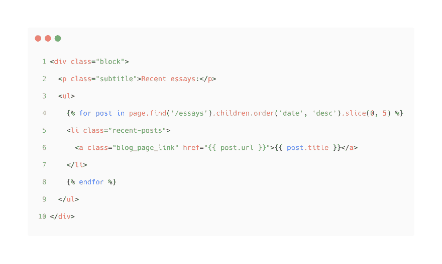

# 使用 Twig 设置“最近的帖子”部分

> 原文：<https://dev.to/gabe/setting-up-a-recent-posts-section-in-twig-4pb1>

我很尴尬的承认，当我最初建立我的 Grav 博客时，我没有太多的远见。我的整个主页被直接编码成所见即所得。这很简单，所以我侥幸逃脱了一段时间。

直到我今天去更新我的“最近的文章”部分，我才意识到我的主页设置得多么糟糕。因此，我加快了我的本地环境，并着手快速修复。

### 自动拉五篇最近的帖子

通过使用我在 Grav 文档中找到的这篇文章，我能够轻松地获取第一个例子并根据我的需要对其进行修改。我想到了以下几点:

有了它，我再也不用担心每次写新博文时都要手动更新主页了。我只是写作，出版，然后就收工了。