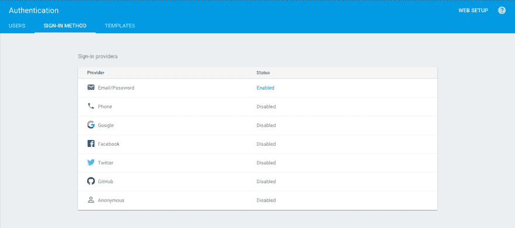
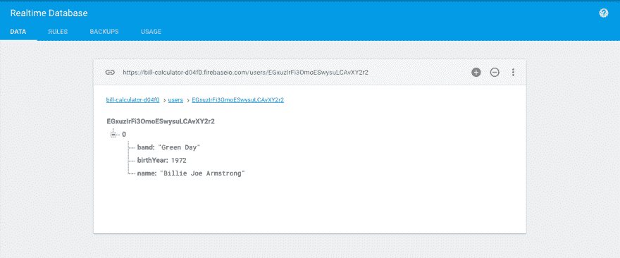

# 使用 Firebase 和 Axios 设置和获取 REST 服务数据

> 原文：<https://dev.to/daveberning/setting-up-and-getting-rest-service-data-with-firebase-and-axios-57lb>

所以……如果你在这个领域工作了几年，你就会知道当你只想让博客简单时，博客有时会过于冗长。这可能是好的，但是如果你正在为某事寻找一个简短的解释，这可能会变得令人沮丧。所以，这里是我试图给你什么，你可能会寻找你的谷歌搜索。对于本文，我假设您知道如何创建一个 Firebase 帐户，一个 Firebase 项目，并且对什么是 REST 服务有一个基本的概念。

## 用 Firebase 设置 REST 服务

首先，让我们用 Firebase 设置一个 REST 服务。毕竟，如果没有 REST 服务，就无法获得数据。如果你还没有，你需要创建一个帐户。对于小团队和项目，是免费的。

登录后，您将看到您的控制台仪表板，如果您还没有创建项目，请继续创建。

## 认证

你不希望任何人在没有必要的情况下访问所有数据。因此，我们需要限制特定用户访问的数据。为了使事情变得简单，我将只讨论 Firebase 的 Web 和“电子邮件/密码”认证。

前往“鉴定”>“登录方法”,并确定“电子邮件/密码”已启用(如果默认情况下没有启用)。接下来，您需要转到“用户”并单击“创建用户”。从这里，您将添加您想要使用的凭证，然后您将看到一个生成的用户 UID(这个 ID 对后面很重要)。

[](https://res.cloudinary.com/practicaldev/image/fetch/s--3PoJwgX5--/c_limit%2Cf_auto%2Cfl_progressive%2Cq_auto%2Cw_880/https://thepracticaldev.s3.amazonaws.com/i/83mgy1kl62imd7nh9rpr.png)

现在我们已经创建了登录方法和用户，让我们修改身份验证规则。Firebase 提供的当前代码片段允许任何登录(经过身份验证)的用户查看所有数据；即使这与他们无关。显然，我们不想那样。因此，我们需要对此进行修改，以便只允许登录的用户只能看到他们自己的数据，而不能看到其他人的数据。

```
{
  "rules": {
    "users": {
      "$uid": {
        ".read": "$uid === auth.uid",
        ".write": "$uid === auth.uid"
      }
    }
  }
} 
```

将上面的代码粘贴进去后，点击“发布”。现在，我们已经拥有了 Firebase 基本 REST 服务所需的一切。现在，让我们向 REST 端点添加一些数据，这样我们就可以在调用它时看到数据返回。

## 向用户的 REST 端点添加伪数据

让我们添加一些虚假数据。最简单的方法是编写一些 json，或者将下面的代码片段复制到一个. JSON 文件中，然后导入它。首先，您需要创建您的端点。对于命名约定，在哪里使用…

[https://PROJECT-NAME.firebaseio.com/users/{uid}](https://PROJECT-NAME.firebaseio.com/users/%7Buid%7D)

注意:您可以在身份验证>用户屏幕上复制您的 UID，并复制 UID 下的值。

```
[
  {
    "name": "Billie Joe Armstrong",
    "birthYear": 1972,
    "band": "Green Day"
  }
] 
```

您应该会看到类似下面的截图。在这一点上，我们已经准备好了我们的 Firebase 帐户和我们的 REST 服务。现在，让我们用 Axios 获取一些数据，并在控制台中看到它的返回，以便我们可以使用它。

[](https://res.cloudinary.com/practicaldev/image/fetch/s--yRg9xh5k--/c_limit%2Cf_auto%2Cfl_progressive%2Cq_auto%2Cw_880/https://thepracticaldev.s3.amazonaws.com/i/6er1g0cdyk92ebrq878v.png)

## 用 Axios 和 GET 方法取数据

现在我们终于进入了整篇文章的主题。我自己最终明白了这一点，但只是在阅读了很多对我并不适用的帖子之后。

为了获取特定用户的数据，我们需要利用 Firebase API 并根据 UID 获取数据。

## 检查 Firebase 用户是否登录

下面的代码片段是您需要添加到应用程序中来检查用户是否登录的内容。如果是这样，firebase.auth()方法将返回一个包含用户信息(包括 uid)的用户对象。

```
firebase.auth().onAuthStateChanged(function (user) {
  if (user) {
    // Your code here
  }
}) 
```

### 用 Axios 获取

要使用 Axios 从 Firebase 获取数据，您需要两样东西，1)用户的 UID 和 2)数据库密码。

如前所述，用户的 UID 与 Firebase auth()函数中的用户对象一起返回。只需在 REST 调用中连接 user.uid。对于数据库密码，您需要生成一个。

为了生成一个，你需要去设置(左上角的概述) >服务帐户>数据库机密。只需点击“添加密码”按钮，复制密码。非常重要的一点是，你永远不要在公开回购或网上任何地方分享你的秘密。这是有原因的秘密。

现在，我们终于拥有了我们需要的一切。现在让我们深入研究一下您的代码，并获得一个 200 响应，以及您可以在应用程序中使用的实际数据。

```
axios.get('https://PROJECT-NAME.firebaseio.com/users/' + user.uid + '.json?auth=DATABASE-SECRET')
.then((response) => {
  console.log(response)
}); 
```

用您的凭证复制 Axios get 方法应该会得到 200 响应。呜！我希望这有助于您更好地理解 web 应用程序的 Firebase。