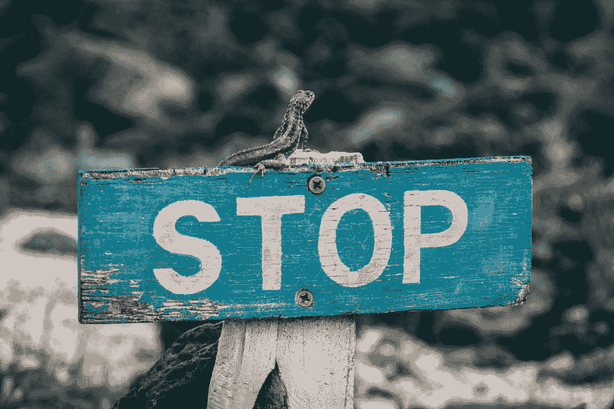
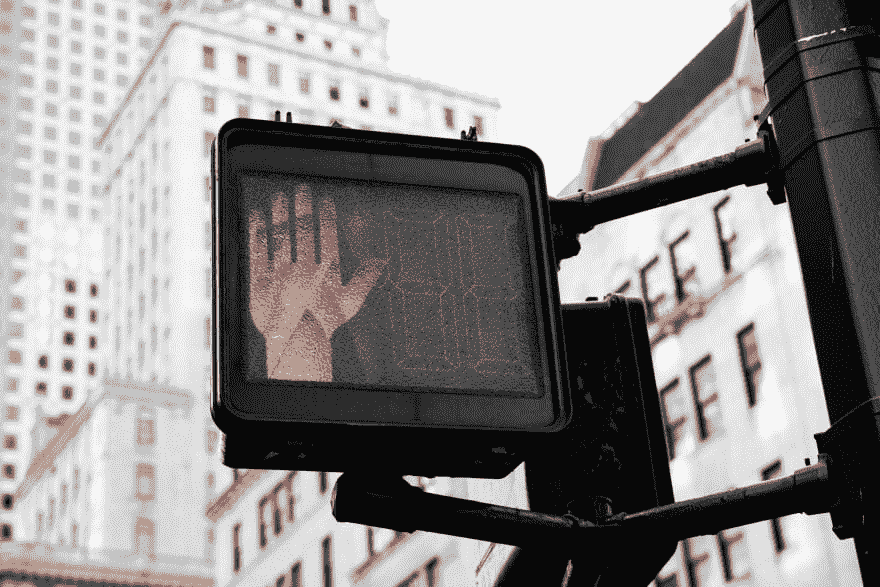

# 在您的 hugo (+netlify)网站上设置 CSP

> 原文：<https://dev.to/rmhogervorst/setting-up-csp-on-your-hugo-netlify-site-2ci6>

最近，我的博客上出现了一个内容安全政策(CSP ),这让我受到了称赞。

但是我不特别，你也可以有一个！

在这篇文章中，我将向你展示我是如何创建这个策略的，你也可以这样做。我正在使用 report-uri.com 服务，它可以自动完成很多工作。这是专门针对使用 netlify 构建 hugo 站点的。我绝对不是专家，所以这主要是对我所做的描述。

简而言之:

*   将 _headers 文件放在“static/”文件夹中
*   用基本的安全头填充这个文件
*   设置报告 uri 或(报告应该到达的源)
*   将内容安全策略(CSP)设置为仅报告
*   等待
*   从报告中了解什么是允许的，什么是不允许的
*   根据您学到的知识设定 CSP
*   将 CSP 设置为阻塞模式

## 基本设置

*   hugo 项目中“/static”文件夹中的所有内容都放在网站的根目录下。
*   如果在你的根目录下有一个名为 _headers 的文件，netlify 会选择它并把它作为标题信息。

因此，如果你在博客文件夹的“/static”文件夹中放置了一个 _headers 文件，那么 netlify 会对其进行处理，并为你创建响应头。

## 我的设置

我使用 github(但是你可以自己托管，使用 gitlab 或者其他任何东西)来建立我的博客。每当有新的博客文章上传，github 就会告诉 netlify，netlify (runshugo 和)就会建立网站。你也可以创建一个头文件，它是 netlify 将为你的网站遵守的规则的集合。[如这里所解释的。](https://www.netlify.com/docs/headers-and-basic-auth/)

[](https://res.cloudinary.com/practicaldev/image/fetch/s--trYC_yKp--/c_limit%2Cf_auto%2Cfl_progressive%2Cq_auto%2Cw_880/https://blog.rmhogervorst.nl/post/2019-03-13-setting-up-csp-on-your-hugo-site_files/nadine-shaabana-1327576-unsplash.jpg)

### 什么是表头？

当你的浏览器与服务器通信时，它们交换包，包中有内容，有一些元信息。你的浏览器告诉服务器它是哪种浏览器，以及它想要接收哪种信息。服务器告诉浏览器它是哪种服务器，什么是允许的，什么是不允许的。我们称这些规则为标题。只是为了让它更容易混淆:网站顶部的元数据被称为头部。我知道……在互联网黑暗的早期，很少有用户研究。

### 那么我的标题里是什么呢？

看我的' _headers '文件[这里](https://github.com/RMHogervorst/blog/blob/master/static/_headers)，但不要盲目抄袭！我有一个更好的方法让你以后建立这些信息。

文件顶部:

```
/*
  X-Frame-Options: DENY
  X-XSS-Protection: 1; mode=block
  X-Content-Type-Options: nosniff 
```

头文件说了什么:

*   `/*`对于 blog.rmhogervorst.nl 上的所有页面
*   `X-frame options`从其他地方禁用 iframes。
*   X-XSS 保护:跨站脚本保护:当检测到跨站脚本时，不允许页面加载
*   X-content-type-options:不太清楚它是做什么的，但是推荐。

但是接下来是 CSP:

[](https://res.cloudinary.com/practicaldev/image/fetch/s--xXiVKScr--/c_limit%2Cf_auto%2Cfl_progressive%2Cq_auto%2Cw_880/https://blog.rmhogervorst.nl/post/2019-03-13-setting-up-csp-on-your-hugo-site_files/jose-aragones-627837-unsplash.jpg)

```
Content-Security-Policy: 
default-src cdnjs.cloudflare.com 'self' blog.rmhogervorst.nl code.jquery.com fonts.googleapis.com.....ETC 
```

这个 CSP 说明了 default-src 可以交付什么内容，可以从哪里加载代码、图像、css 和字体。

我没有手动输入我在网站上使用的所有域名。我没有时间。

我使用一种叫做。你可以从跟随向导
开始，在你的头上添加一些基本的 CSP 东西。您将 CSP 设置为只报告
(因此不阻止任何东西，而只报告)。这使得所有访问
你的网站的浏览器向 report-uri 报告所有的来源。

作为替代使用 Bob Rudis ( [@hrbrmstr](https://dev.to/hrbrmstr) )关于在 AWS s3 上建立一个 report-uriyourself [的帖子。](https://dev.to/hrbrmstr/collecting-content-security-policy-violation-reports-in-s3-effortlesslyfreely-36od)

我不知道，report-uri 也可以，所以选择你想要的。

[](https://res.cloudinary.com/practicaldev/image/fetch/s--WtH1ownj--/c_limit%2Cf_auto%2Cfl_progressive%2Cq_auto%2Cw_880/https://blog.rmhogervorst.nl/post/2019-03-13-setting-up-csp-on-your-hugo-site_files/kai-pilger-395931-unsplash.jpg)

现在所有的报告都传到了 report-uri 网站，你可以稍后查看(取决于流量)报告的来源。在 report-uri 网站上，您可以说哪些源应该被允许，哪些应该被阻止，最后您会得到一个 CSP，您可以将它复制到头文件中。

所以 TL；博士；医生

*   将 in _headers 文件放在“static/”中
*   用基本安全标题填充
*   设置一个报告 uri(报告应该到达的源)
*   将 CSP 设置为仅报告
*   等待
*   从报告中了解什么是允许的，什么是不允许的
*   根据您学到的知识设定 CSP
*   将 CSP 设置为阻塞模式

# 图片来源

*   [来自 unsplash 的 jair-lazaro 的注射器](https://unsplash.com/photos/D3UqzqwtdRw)
*   [https://unsplash.com/photos/1k3vsv7iIIc](https://unsplash.com/photos/1k3vsv7iIIc)
*   [https://un flash . com/photos/81 qkoopgahy](https://unsplash.com/photos/81QkOoPGahY)
*   [https://un flash . com/photos/drzymae-va](https://unsplash.com/photos/DRzYMtae-vA)