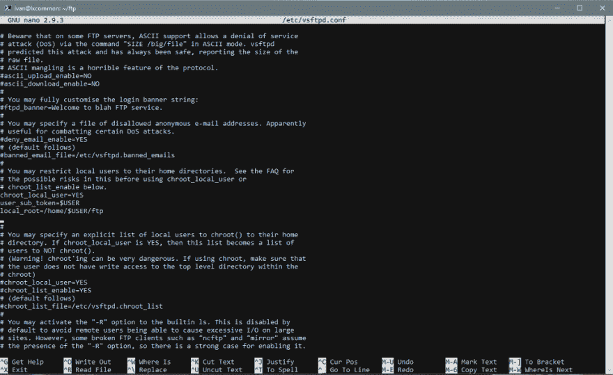

# 在 Microsoft Azure 上设置 FTP 服务器

> 原文：<https://dev.to/aloneguid/setting-up-ftp-server-on-microsoft-azure-2npb>

微软 Azure 没有托管 FTP 服务，我今天需要它来模拟与遗留系统的集成。但是，自己设置真的很容易。你所需要做的就是创建一个 Ubuntu VM，甚至一个 0 实例就足够了，而且每月花费大约 8 英镑。如果你像我一样便宜，你甚至可以在虚拟机上运行更多的东西来证明其成本。

显然，您可以做的第一件事是创建虚拟机。

[](https://res.cloudinary.com/practicaldev/image/fetch/s--nTNuZ0-V--/c_limit%2Cf_auto%2Cfl_progressive%2Cq_auto%2Cw_880/https://isolineltd.azureedge.net/blog/2019/02/18/001.png)

你会得到一个 IP 地址，但我喜欢给我的机器的 DNS 标签，所以如果 IP 改变，我可以不关心它。这可以在虚拟机的配置选项卡中进行更改:

[![Dashboard  Resource groups    Configuration  Public IP  p Search  Overview  Activity log  Access control IAM  Tags  Settings  Configuration  Propert  Locks  Automation script  Support  troubleshooting  New support request   Configuration  X Discard  Assignment   Dynamic C Static  IP address O  51144163203  Idle timeout minutes O  DNS name label optiona  Alias record sets  Want to closely track this Public IP address Create an alias record in Azure ONS Learn more   Create alias record  SUBSCRIPTION  No results  x  westeuropecloudappazurecom ](img/fca66bfa0b0b3b4a88e7c036adcd60a8.png)](https://res.cloudinary.com/practicaldev/image/fetch/s--R3aS3Qfe--/c_limit%2Cf_auto%2Cfl_progressive%2Cq_auto%2Cw_880/https://isolineltd.azureedge.net/blog/2019/02/18/002.png)

除此之外，您需要在 FTP 服务的网络安全组配置中打开防火墙端口，这些端口如下:

*   21 -命令端口
*   20 -数据端口
*   10000-10010 -用于 FTP 被动模式。我随机选择了这些号码，你可以定制成不同的号码。

一旦完成，SSH 到您的虚拟机，运行
将是一个好主意

```
sudo apt update
sudo apt upgrade 
```

在安装任何东西之前。然后只需安装 [vsftpd](https://security.appspot.com/vsftpd.html) (代表非常安全的 FTP 守护进程):

```
$ sudo apt install vsftpd 
```

安装后，您需要更改它的配置，因为默认情况下，在 Linux 中什么都不能工作- `sudo nano /etc/vsftpd.conf`

取消对以下内容的注释:

*   允许本地用户登录:`local_enable=YES`
*   允许写入 FTP: `write_enable=YES`

现在我们希望允许这台机器的用户访问他们的主目录，因此搜索 chroot_local_user 并确保它看起来像这样:

```
chroot_local_user=YES
user_sub_token=$USER
local_root=/home/$USER/ftp 
```

[](https://res.cloudinary.com/practicaldev/image/fetch/s--0q6FYxRr--/c_limit%2Cf_auto%2Cfl_progressive%2Cq_auto%2Cw_880/https://isolineltd.azureedge.net/blog/2019/02/18/003.png)

它本质上说，本地用户被允许登录，他们的主文件夹将被称为 **ftp** 。因此，您需要从您的个人文件夹中创建一个- `mkdir ftp`。

接下来，通过在配置文件中的任意位置插入这些行来启用被动模式:

```
pasv_enable=YES
pasv_min_port=10000
pasv_max_port=10010 
```

还要加上`seccomp_sandbox=NO`，因为在一些 linux 发行版中有一个罕见的“特性”解决方法。并允许用户的个人文件夹可写- `allow_writeable_chroot=YES`

整个自定义部分应该如下所示:

```
pasv_enable=YES
pasv_min_port=10000
pasv_max_port=10010
seccomp_sandbox=NO
allow_writeable_chroot=YES 
```

**pasv** 设置启用 FTP 被动模式并指定允许的端口范围，这些端口应该是您在 NSG 打开的端口:

[![FTP  txcommonnsg  Save X Discard   Source O  Any   Source port ranges O   Destination O  Any   Destination ort ran es O  2021 000010014  x  Basic  Delete  GNU nano 293  Example config file etcvsftpd  conf  etcvsft  The default compiled in settings are fairly paranoid This sample file  loosens things up a bit to make the ftp daemon more usable  Please see vsftpdconfS for all compiled in defaults  READ THIS This example file is NOT an exhaustive list of vsftpd options  Please read the vsftpdconf5 manual page to get a full idea of vsftpds  capabilities   Run standalone vsftpd can run either from an inetd or as a standalone  daemon started from an initscript  listenNO  pasv enableVFS   Protocol  Any   Action  Allow   priority O   Name  Description  UDP  Deny ](img/3f297f8be8bfffb42636365822197fc8.png)](https://res.cloudinary.com/practicaldev/image/fetch/s--PERSOtGR--/c_limit%2Cf_auto%2Cfl_progressive%2Cq_auto%2Cw_880/https://isolineltd.azureedge.net/blog/2019/02/18/004.png)

一旦全部完成，只需重启 vsftpd - `sudo systemctl restart vsftpd`。

你现在可以用一个喜欢的 ftp 客户端连接到你的 FTP 服务器，比如 [WinSCP](https://winscp.net/eng/index.php) 。

## 提示

如果在配置过程中，您不知怎么搞砸了配置文件，并且想要恢复原始配置，您可以通过发出命令`sudo apt remove vsftpd --purge`卸载 vsftpd。注意`purge`标志很重要——默认情况下，Ubuntu 包管理器不会删除配置。

**本文原载于 2019 年 2 月 18 日[isolineltd.com](https://www.isolineltd.com/blog/setting-up-ftp-server-on-microsoft-azure.html)。**