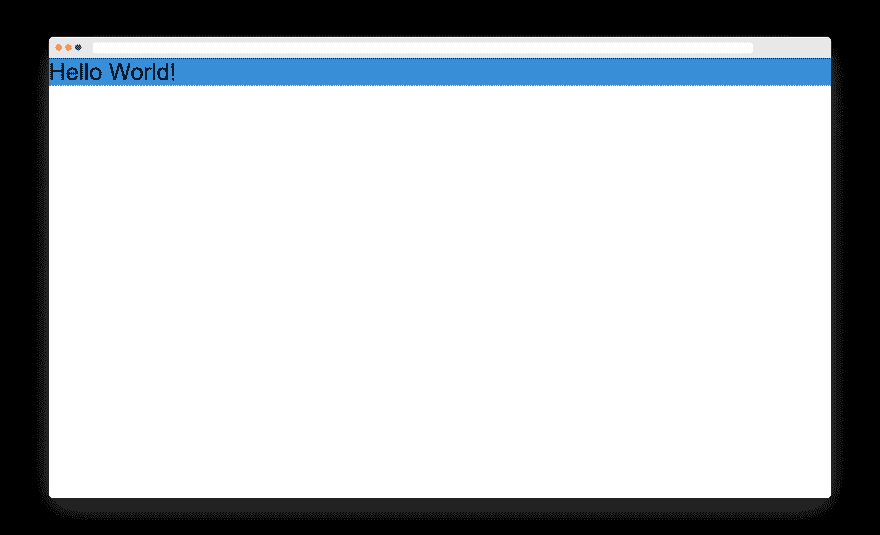

# 使用顺风 CSS 设置创建-反应-应用程序

> 原文：<https://dev.to/nards_paragas/setup-create-react-app-with-tailwind-css-394e>

最近，我一直在享受使用*实用优先* CSS 框架编写前端代码的乐趣，而不是像 [Bootstrap](https://getbootstrap.com/) 和[布尔玛](https://bulma.io/)这样成熟的工具包。它帮助我立即构建和定制我的页面组件，而不必从头开始编写自己的 CSS。在看到 [Tailwind CSS](https://tailwindcss.com/docs/what-is-tailwind/) 受到不同社区和平台的关注后，我决定在我的一个个人项目中尝试一下。它使设计页面更加有趣，因为它非常容易使用，文档也非常直观。

因为它是组件友好的，所以我试着在我接下来的 create-react-app 项目中使用它，以了解它与单页面应用程序的匹配程度。😎

现在，我将帮助你用 Tailwind CSS 建立你自己的 create-react-app 项目。我们开始吧！

首先，让我们用 create-react-app 创建一个新的 ReactJS 项目。

```
npx create-react-app your-app-name 
```

Enter fullscreen mode Exit fullscreen mode

接下来，我们可以轻松地在新的 create-react-app 项目上安装 Tailwind CSS 模块，而不必接触实际的脚手架。只需在 npm 上运行以下命令:

```
npm install tailwindcss --save-dev 
```

Enter fullscreen mode Exit fullscreen mode

在安装了 Tailwind CSS 之后，我们将不得不使用这个命令:
来生成我们的 javascript 格式的配置文件

```
npx tailwind init tailwind.js 
```

Enter fullscreen mode Exit fullscreen mode

您可以使用您喜欢的任何文件名，但是将它命名为`tailwind.js`作为缺省值是文档中的一个建议，通常很容易遵循。

然后，正如文档所建议的，我们将把 Tailwind 作为一个 [PostCSS](https://postcss.org/) 插件添加到我们的构建链中。通过
安装这些对等依赖项

```
npm install postcss-cli autoprefixer --save-dev 
```

Enter fullscreen mode Exit fullscreen mode

之后，我们必须创建一个`postcss.config.js`文件，通过传递路径将 Tailwind 添加为一个插件。

```
var tailwindcss = require('tailwindcss');

module.exports = {
  plugins: [
    tailwindcss('./path/to/your/tailwind.js'),
    require('autoprefixer'),
  ]
} 
```

Enter fullscreen mode Exit fullscreen mode

您的`tailwind.js`和`postcss.config.js`配置文件可以包含在您的目录的任何部分，但是现在，我只是将它放在我的项目的根级别中。

接下来，我们必须创建一个*入口点*，这样我们就可以在 CSS 中使用 Tailwind。在这种情况下，我总是使用文档中的[建议](https://tailwindcss.com/docs/installation#3-use-tailwind-in-your-css)。

只需将下面的代码复制并粘贴到一个名为`tailwind.css`的新文件中，该文件位于您项目的`/src`目录或另一个自定义文件夹中，以将您的静态和自定义样式与生成的样式分开。在我的例子中，我创建了一个定制的`/styles`目录:

```
/**
 * This injects Tailwind's base styles, which is a combination of
 * Normalize.css and some additional base styles.
 *
 * You can see the styles here:
 * https://github.com/tailwindcss/tailwindcss/blob/master/css/preflight.css
 *
 * If using `postcss-import`, use this import instead:
 *
 * @import "tailwindcss/base";
 */
@tailwind base;

/**
 * This injects any component classes registered by plugins.
 *
 * If using `postcss-import`, use this import instead:
 *
 * @import "tailwindcss/components";
 */
@tailwind components;

/**
 * Here you would add any of your custom component classes; stuff that you'd
 * want loaded *before* the utilities so that the utilities could still
 * override them.
 *
 * Example:
 *
 * .btn { ... }
 * .form-input { ... }
 *
 * Or if using a preprocessor or `postcss-import`:
 *
 * @import "components/buttons";
 * @import "components/forms";
 */

/**
 * This injects all of Tailwind's utility classes, generated based on your
 * config file.
 *
 * If using `postcss-import`, use this import instead:
 *
 * @import "tailwindcss/utilities";
 */
@tailwind utilities;

/**
 * Here you would add any custom utilities you need that don't come out of the
 * box with Tailwind.
 *
 * Example :
 *
 * .bg-pattern-graph-paper { ... }
 * .skew-45 { ... }
 *
 * Or if using a preprocessor or `postcss-import`:
 *
 * @import "utilities/background-patterns";
 * @import "utilities/skew-transforms";
 */ 
```

Enter fullscreen mode Exit fullscreen mode

粘贴代码并保存文件后，我们现在将安装`npm-run-all`作为工具，以并行或顺序运行我们的 npm 脚本。这不是一个实际的需求，但是我强烈推荐它，特别是对 Windows 用户。这个 CLI 工具有助于我们跨平台运行脚本。

```
npm install npm-run-all --save-dev 
```

Enter fullscreen mode Exit fullscreen mode

接下来，我们必须配置我们的`package.json`文件来构建我们的 CSS 并启动我们的本地 create-react-app 服务器。`scripts`部分现在看起来类似于这个:

```
"scripts":  {  "start":  "npm-run-all --parallel watch:css start:react",  "build":  "npm-run-all build:css build:react",  "build:css":  "postcss src/styles/tailwind.css -o src/index.css",  "watch:css":  "postcss src/styles/tailwind.css -o src/index.css -w",  "start:react":  "react-scripts start",  "build:react":  "react-scripts build",  "test":  "react-scripts test",  "eject":  "react-scripts eject"  }, 
```

Enter fullscreen mode Exit fullscreen mode

我们现在将能够在 npm 中运行`npm start`脚本来构建我们的文件并启动我们的服务器。

```
npm start 
```

Enter fullscreen mode Exit fullscreen mode

最后，为了测试 Tailwind CSS 是否在您的组件中工作，我们只需导入生成的`index.css`文件，并在我们的 JSX 中添加一个来自 Tailwind 文档的实用程序类，如下所示:

```
import React from "react";
import ReactDOM from "react-dom";
import "./index.css";

const App = () => {
  return <div className="bg-blue-100">Hello World!</div> };

ReactDOM.render(<App />, document.querySelector("#root")); 
```

Enter fullscreen mode Exit fullscreen mode

这是它在浏览器上的样子！

<figure>

[](https://res.cloudinary.com/practicaldev/image/fetch/s--NiCLI71B--/c_limit%2Cf_auto%2Cfl_progressive%2Cq_auto%2Cw_880/https://i.imgur.com/GKXoFFh.png)

<figcaption>This is a screenshot in 300% zoom made with [Screely](https://www.screely.com/).</figcaption>

</figure>

* * *

这是一个总结！感谢阅读，我希望我能够正确地介绍这个设置。😄