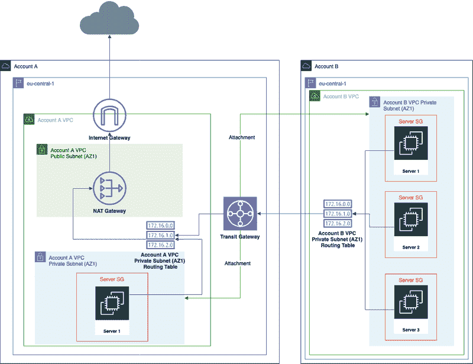

# 通过 TGW 共享一个 NAT-GW

> 原文：<https://dev.to/aws-builders/share-a-nat-gw-through-tgw-31hn>

每当您需要管理基础架构时，云中的复杂性都会与日俱增。也许您已经在构建一些很棒的无服务器应用程序，但是现在，您仍然需要关注 AWS 上的基础设施。没问题！中转网关就是你要找的！这项出色的 AWS 服务现已在许多 AWS 地区推出，更多服务即将推出。所以让我们直接进入正题吧！NAT 网关是一个很好的解决方案，可以为位于私有子网中的 AWS 资源提供互联网连接，这些资源不需要或不想暴露在互联网可访问的流量中，这意味着正常的设置涉及到每个帐户都有一个 NAT 网关，即使您在同一地区有几个 AWS 帐户，以在逻辑上分隔 AWS 资源和环境(正如 AWS 建议的那样，以遵循最佳实践)，仅 NAT 网关的大量成本就分散在不同的帐户中，并且每年在这些方面花费相对较高的金额。(I)通常，NAT 网关每小时的价格(不包括流量)因地区而异，从 0.045 美元/小时到 0.093 美元/小时不等。总的来说，运行 1x NAT Gateway 一整年后，我们的费用不低于 394.2 美元，如果您在自己的 AWS 帐户中运行生产+测试+开发环境，所有这一切相当于每年 1182.6 美元。
因此，该解决方案肯定会创建或利用现有的 AWS 中转网关，这意味着通过 TGW，您可以连接不同帐户中的不同 VPC，管理所有这些 VPC 共用的单个路由表，或者如果您希望或需要对进出 VPC 的流量进行精细控制，为每个 VPC(路由域)提供独立的路由表。就是这样！就这么简单，让我们为您描述解决方案并列出所需的资源，这样我们就可以深入了解细节了。

*通过共享资源省钱*

## 概述

在我们的示例中，我们使用一个转接网关与其他 VPC 共享一个 NAT 网关，以便为位于专用子网中的实例实现与互联网的通信。

## 组件

### NAT 网关

NAT 网关是 AWS 提供的虚拟私有云(VPC)解决方案的组成部分。作为一个重要的组件，NAT 网关有能力并且主要集中于为与 NAT 网关相关联或路由到 NAT 网关的资源提供仅出口的互联网连接。

**NAT 网关可以发挥作用的一些情况:**

*   部署期间安装/下载服务器所需的软件工具(例如油灰、RSAT、安装文件等)；
*   降低资源(EC2 实例)如何与其他 AWS 服务(系统管理器、秘密管理器、安全令牌服务等)通信的复杂性；
*   使用需要互联网接入的 AWS SystemsManager 文档；(例如，可以使用 AWS 提供的“DomainJoin”文档来将现有服务器加入到 Microsft Windows 域*中，目前 AWS 目录服务不支持 AWS PrivateLink，因此无法通过 VPC 端点使用 SSM 自动化)；

### 中转网关

中转网关支持来自/去往同一区域中的 VPC 和 VPN 连接的附件，并在它们之间路由流量。每个 VPC 或 VPN 连接都与一个路由表相关联。路由表决定来自该资源附件的流量的下一跳。中转网关内的路由表允许 IPv4 或 IPv6 CIDR 和目标。目标是 VPC 和 VPN 连接。当在转接网关上附加 VPC 或创建 VPN 连接时，该附件与转接网关的默认路由表相关联。

### RAM

AWS 资源访问管理器使您能够与任何 AWS 帐户或通过 AWS 组织共享您的资源。如果您有多个 AWS 帐户，您可以集中创建资源，并使用 AWS RAM 与其他帐户共享这些资源。