# 绵羊笔记:在 Unity 中制作和使用动画

> 原文：<https://dev.to/capital_eks/sheep-notes-making-and-using-an-animation-in-unity-1fl3>

Unity 动画系统相当野兽，设置起来感觉很不透明。大多数教程选择一次解释所有的事情。虽然信息丰富，但这并不是一个很好的“入门”体验。所以，我将把这篇笔记的重点放在创建和操作动画上。

# 虚空

让我们从一个空项目开始。

[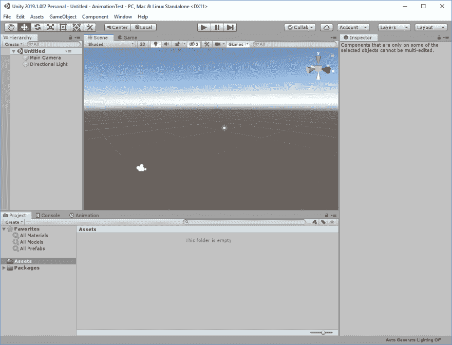](https://res.cloudinary.com/practicaldev/image/fetch/s--RYImZt2U--/c_limit%2Cf_auto%2Cfl_progressive%2Cq_auto%2Cw_880/https://thepracticaldev.s3.amazonaws.com/i/mid5oieolpmxzquobi9z.png)

现在，让我们添加一个动画对象。简单的东西，比如立方体。

[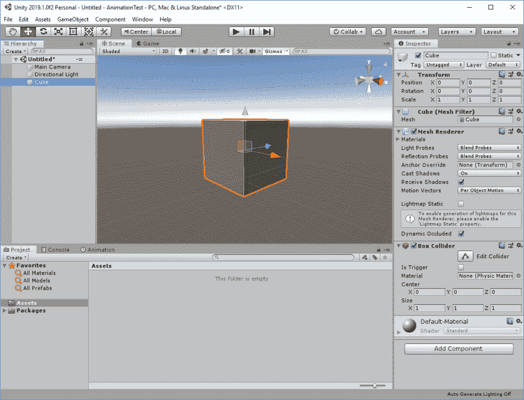](https://res.cloudinary.com/practicaldev/image/fetch/s--IdWZ4Ohg--/c_limit%2Cf_auto%2Cfl_progressive%2Cq_auto%2Cw_880/https://thepracticaldev.s3.amazonaws.com/i/zzz5f6jf6cvm76tz82w9.png)

这样，我们就可以开始制作动画了。

# 动画迷宫

在 Unity 中制作动画是一个多步骤的过程。一个游戏对象需要一个动画组件。Animator 组件需要动画状态。动画状态需要转换到其他状态。另外，动画状态需要动画剪辑。

## 动画师组件

首先，我们的游戏对象需要一个 Animator 组件。该组件可以在如下所示的`Add Component → Miscellaneous → Animator`中找到。
[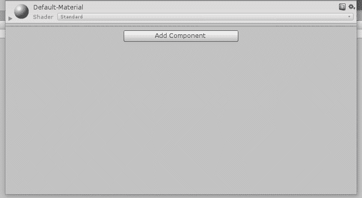](https://res.cloudinary.com/practicaldev/image/fetch/s--OjP03wpc--/c_limit%2Cf_auto%2Cfl_progressive%2Cq_66%2Cw_880/https://thepracticaldev.s3.amazonaws.com/i/zuqbc9yo18nk72lb0x8z.gif)

现在，一个动画组件需要一个动画控制器资产。该资产可在`Assets → Create → Animator Controller`下找到

[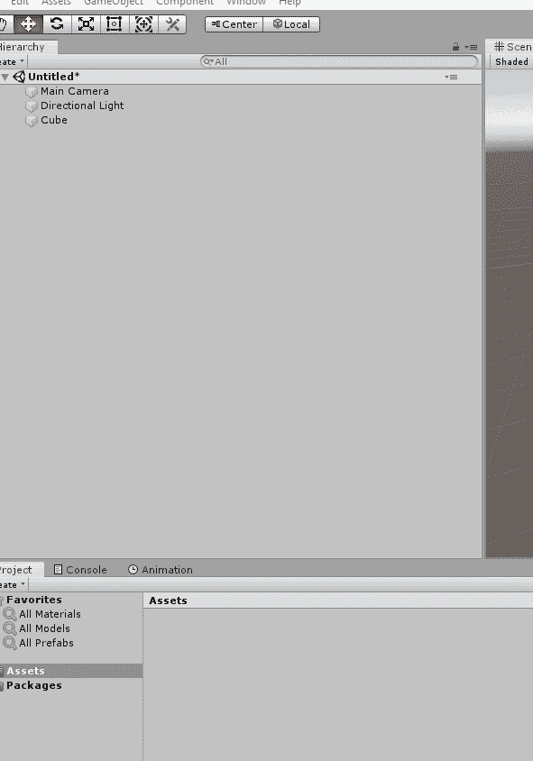](https://res.cloudinary.com/practicaldev/image/fetch/s--6jB5TmyD--/c_limit%2Cf_auto%2Cfl_progressive%2Cq_66%2Cw_880/https://thepracticaldev.s3.amazonaws.com/i/04epa35pl69lc747n5k7.gif)

接下来，我们将控制器添加到组件中。

[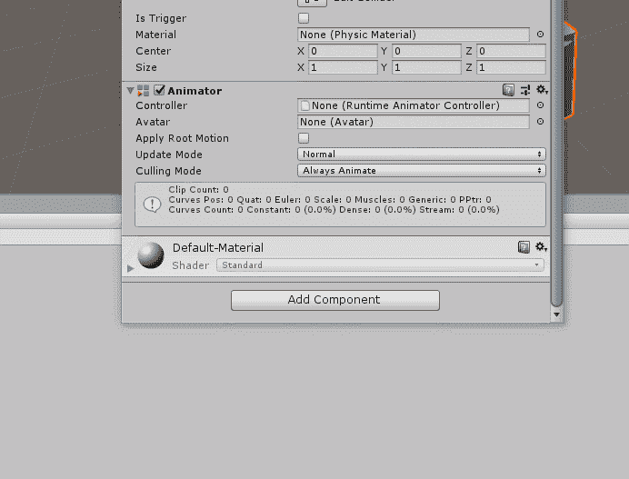](https://res.cloudinary.com/practicaldev/image/fetch/s--xf7ISulM--/c_limit%2Cf_auto%2Cfl_progressive%2Cq_66%2Cw_880/https://thepracticaldev.s3.amazonaws.com/i/3syt1le7qha5su446296.gif)

动画师控制器存储一系列有限状态机，分成不同的层。每个节点代表一种不同的动画状态。每个节点可以有一系列连接。并且，每个连接定义了从一个动画到下一个动画的过渡。更多信息可以在 Unity 手册的[动画师控制器资产部分找到。但是，如果没有动画剪辑，这个组件是没有意义的。](https://docs.unity3d.com/Manual/Animator.html)

## 动画片段

<figure>

动画剪辑存储动画的所有关键帧。要创建一个，我们首先需要打开动画窗口。这可以通过选择`Window → Animation → Animation`来完成。

<figcaption>Alternatively, you can use ctrl+6</figcaption>

</figure>


打开动画窗口，选择我们要制作动画的对象。然后，在动画窗口中点击`Create`。命名并保存动画文件。这将创建一个空白动画。

[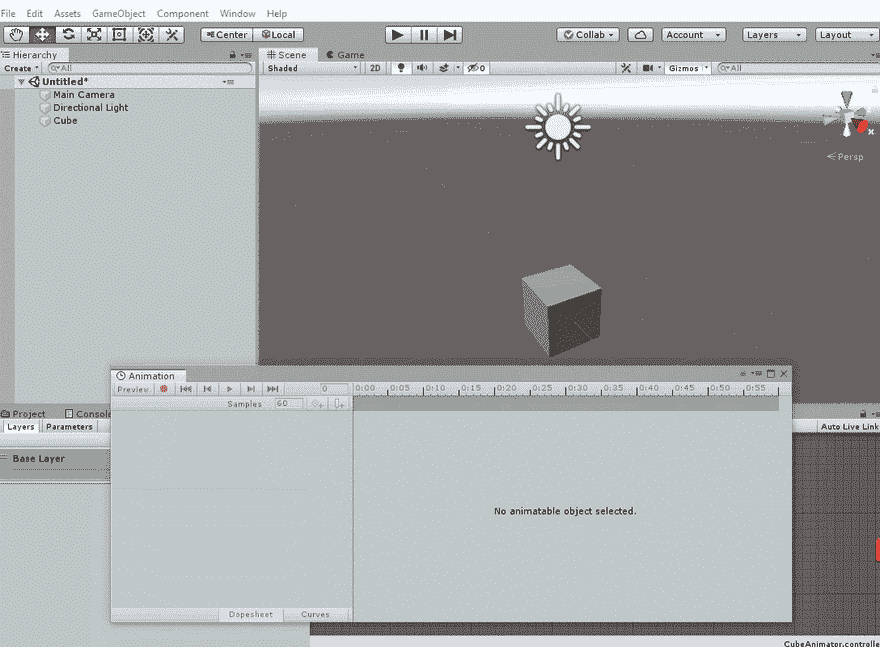](https://res.cloudinary.com/practicaldev/image/fetch/s--0LKSdIK---/c_limit%2Cf_auto%2Cfl_progressive%2Cq_66%2Cw_880/https://thepracticaldev.s3.amazonaws.com/i/1oe4lmwlv4pobi93k9t8.gif)

非常方便的是，新的动画会自动添加到 Animator 控制器中。

[](https://res.cloudinary.com/practicaldev/image/fetch/s--NBi0oqSa--/c_limit%2Cf_auto%2Cfl_progressive%2Cq_auto%2Cw_880/https://thepracticaldev.s3.amazonaws.com/i/ppem372ur0yl0yte03vk.PNG)

接下来点击`Add Property`，然后我们可以选择我们想要动画的属性。

[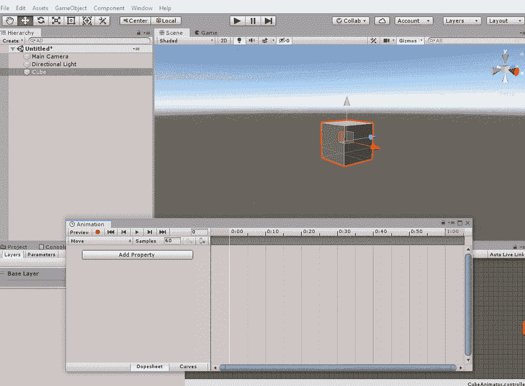](https://res.cloudinary.com/practicaldev/image/fetch/s--cqXVUi9X--/c_limit%2Cf_auto%2Cfl_progressive%2Cq_66%2Cw_880/https://thepracticaldev.s3.amazonaws.com/i/casbqfqnz7n844dg3ycl.gif)

点按“录制”按钮，并使用 Unity 编辑器处理选定的属性。
[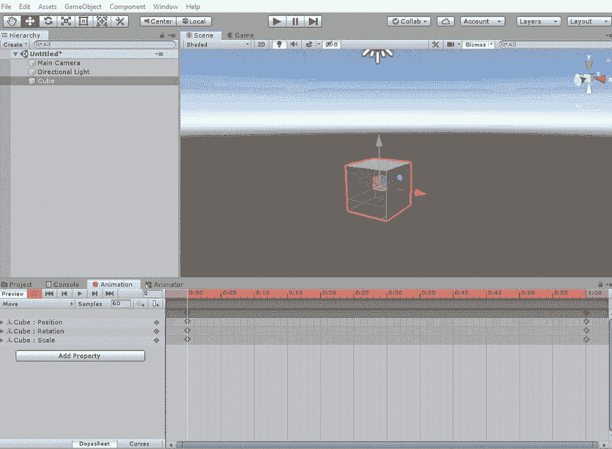T3】](https://res.cloudinary.com/practicaldev/image/fetch/s--eBzhBX-v--/c_limit%2Cf_auto%2Cfl_progressive%2Cq_66%2Cw_880/https://thepracticaldev.s3.amazonaws.com/i/ti6ofwj1qrdal7w6xn24.gif)

<figure>

按下动画窗口中的播放按钮，查看我们的动画效果。

<figcaption>Fun fact: Dev.to will allow uploads over 6MB, but won't embed them! I learn this through a frustrating amount of trial and error!!</figcaption>

</figure>


让我们通过在动画窗口中单击动画名称的位置来添加另一个动画。此外，让这个动画重置立方体到它的静止位置。

[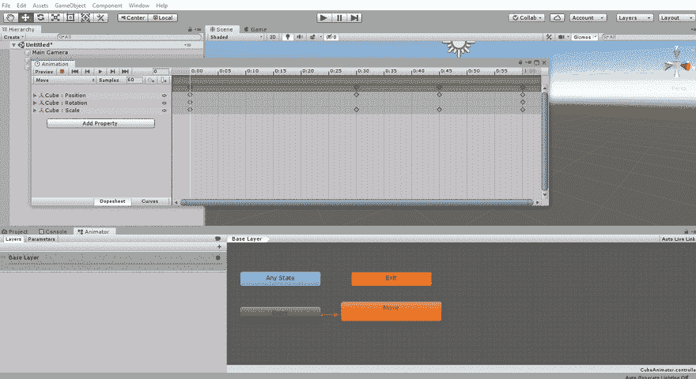](https://res.cloudinary.com/practicaldev/image/fetch/s--uGob1-dH--/c_limit%2Cf_auto%2Cfl_progressive%2Cq_66%2Cw_880/https://thepracticaldev.s3.amazonaws.com/i/mhrnboyulfsm5bys4iew.gif)

如果我们按原样运行场景，立方体会自动开始播放移动动画。因此，为了控制这个动画，我们必须改变过渡。

## 连接节点

每个节点都可以连接到其他状态。入口节点是状态机的起点。动画控制器将自动播放连接到入口节点的第一个动画。此外，默认情况下，我们创建的第一个动画将连接到入口节点。

所以，我们把`Entry ⇒ Move`改成`Entry ⇒ Idle`。首先，我们必须删除“移动”节点，因为 Unity 只会在删除它时改变它。
T3T5】

接下来，我们再补充一遍。这是一个相当迂回的方法。首先，我们在项目窗口中选择动画。然后，我们返回到动画窗口。最后，在动画窗口中，我们`Right Click → Create State → Create From Selected`
[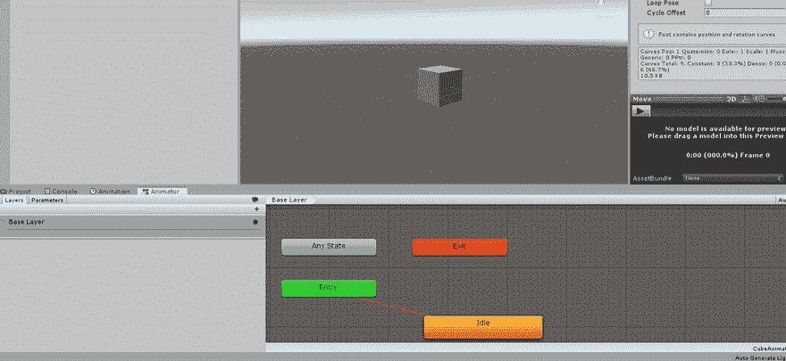](https://res.cloudinary.com/practicaldev/image/fetch/s--AfwhvQuI--/c_limit%2Cf_auto%2Cfl_progressive%2Cq_66%2Cw_880/https://thepracticaldev.s3.amazonaws.com/i/oulefgv8lkt4okoj3wkl.gif)

现在，我们来连线`Move ⇒ Idle`。
[](https://res.cloudinary.com/practicaldev/image/fetch/s--2E-vCjJv--/c_limit%2Cf_auto%2Cfl_progressive%2Cq_66%2Cw_880/https://thepracticaldev.s3.amazonaws.com/i/f42dxc5hikyd8zs3m5b3.gif)

# C# API

对于这最后一部分，我们将编写代码来按下按钮，禁用按钮，让立方体移动，并在动画结束时重新启用按钮。但是首先，我们需要一个按钮。

## GUI 侧钻

在开始编写脚本之前，让我们添加一个按钮来触发动画脚本动作。我们需要去`GameObject → UI → Button`。让我们把按钮重新定位在屏幕的中央。
[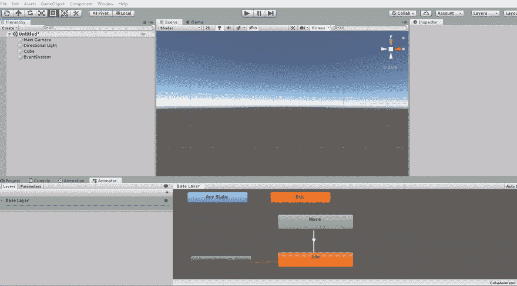](https://res.cloudinary.com/practicaldev/image/fetch/s--8yRTsPRg--/c_limit%2Cf_auto%2Cfl_progressive%2Cq_66%2Cw_880/https://thepracticaldev.s3.amazonaws.com/i/5puu3wt70asoxlx97rcj.gif)

现在，我们向按钮添加一个脚本组件。姑且称之为`ButtonAction.cs`。
[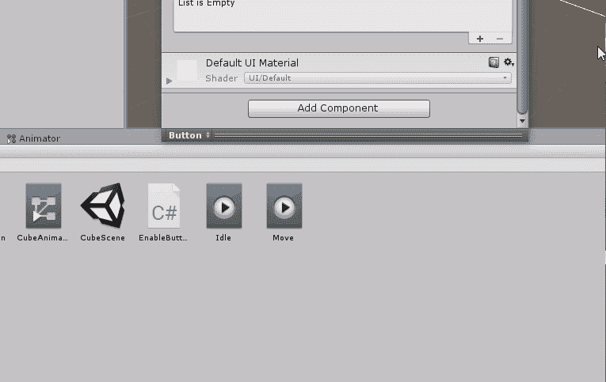](https://res.cloudinary.com/practicaldev/image/fetch/s--GDia8SC---/c_limit%2Cf_auto%2Cfl_progressive%2Cq_66%2Cw_880/https://thepracticaldev.s3.amazonaws.com/i/mc7zjuwna19jnnpcf9eh.gif)

此外，原来*立方体*也需要一个脚本。姑且称之为`CubeAction.cs`。
[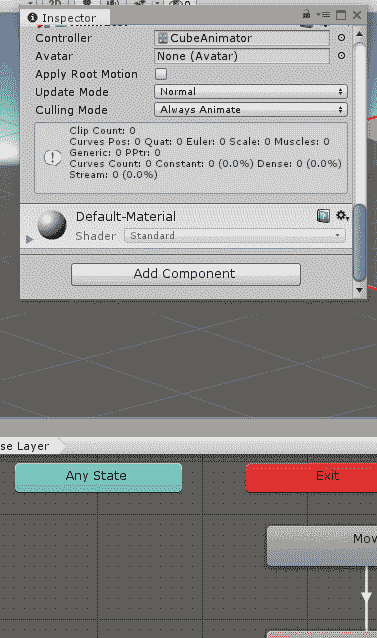T6】](https://res.cloudinary.com/practicaldev/image/fetch/s--JbBhtl_y--/c_limit%2Cf_auto%2Cfl_progressive%2Cq_66%2Cw_880/https://thepracticaldev.s3.amazonaws.com/i/1trfxwi75heui71z3nsx.gif)

我们稍后会看到原因...

但是，有了它，我们终于可以深入了解 C#了。

## 回脚本

下面是 Unity 在`ButtonAction.cs`文件中默认为我们生成的内容:

```
using System.Collections;
using System.Collections.Generic;
using UnityEngine;

public class ButtonAction : MonoBehaviour
{
    // Start is called before the first frame update
    void Start()
    {

    }

    // Update is called once per frame
    void Update()
    {

    }
} 
```

首先，让我们将下面的字段和导入添加到`ButtonAction.cs`(同样，`...`表示前面例子中省略的代码):

```
...
using UnityEngine.UI;

public class ButtonAction : MonoBehaviour
{
    // Button to control animation
    [SerializeField]
    private Button button;

    // animator to control
    [SerializeField]
    private Animator animator;

    ...
} 
```

`button`字段用于在按钮对象上添加回调。`animator`字段用于向移动动画剪辑添加回调。使用 Unity inspector 窗口，将字段设置为指向所需的按钮游戏对象和动画游戏对象。
T3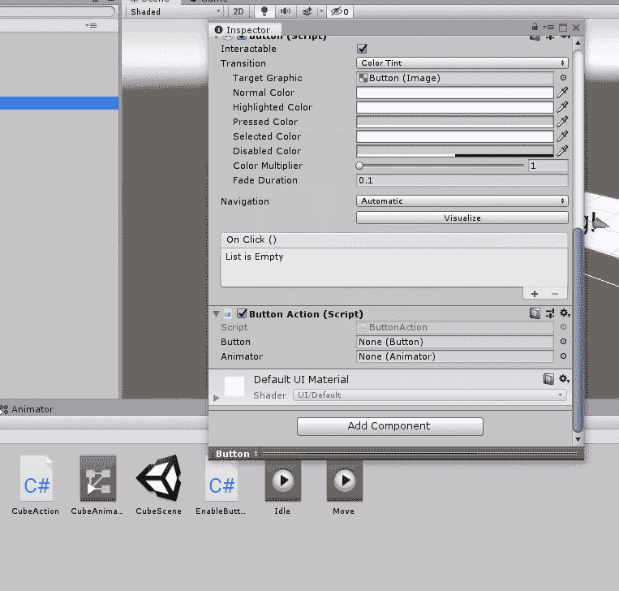T5】

所有的动画剪辑都存储在一个数组中，你可以通过下面的代码在运行时使用:

```
...
public class ButtonAction : MonoBehaviour
{
    ...
    void Start()
    {
        // Store the Move animation clip into a variable
        AnimationClip moveClip = animator.runtimeAnimatorController.animationClips[1];
    }
    ...
} 
```

数组`animationClips`是我们的移动动画剪辑所在的位置。索引号基于剪辑添加到 Animator 控制器的顺序。因为“移动”是第二个动画，所以它位于数组索引`1`中。现在，我们有了动画剪辑，我们可以向动画剪辑添加动画事件。

```
...
public class ButtonAction : MonoBehaviour
{
    ...
    void Start()
    {
        AnimationClip moveClip = animator.runtimeAnimatorController.animationClips[1];
        moveClip.AddEvent(new AnimationEvent()
        {
            // Wait until the clip is over
            time = moveClip.length,
            functionName = "EnableButton"
        });
    }
    ...
} 
```

动画事件可以用来调用游戏对象中的方法。但是，它有一个限制。动画事件只能从拥有其动画制作人的游戏对象中调用方法。换句话说，`EnableButton`将被定义在`CubeAction.cs`和**而不是** `ButtonAction.cs`中。目前，`CubeAction.cs`看起来是这样的:

```
using System.Collections;
using System.Collections.Generic;
using UnityEngine;

public class CubeAction : MonoBehaviour
{
    // Start is called before the first frame update
    void Start()
    {

    }

    // Update is called once per frame
    void Update()
    {

    }
} 
```

所以首先，我们需要为按钮添加一个字段。这将允许我们在动画结束后启用按钮。

```
...

using UnityEngine.UI;

public class CubeAction : MonoBehaviour
{
    [SerializeField]
    private Button button;

    ...
} 
```

像以前一样，我们可以使用检查器来设置按钮的字段。
[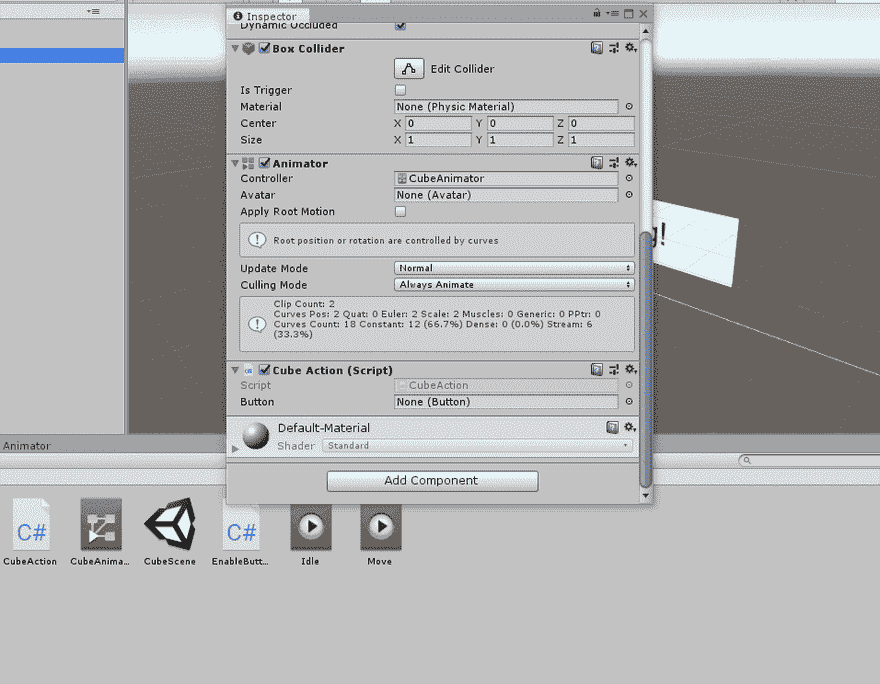T3】](https://res.cloudinary.com/practicaldev/image/fetch/s--M-mVxMUh--/c_limit%2Cf_auto%2Cfl_progressive%2Cq_66%2Cw_880/https://thepracticaldev.s3.amazonaws.com/i/3q0llcptecvqutv05lq1.gif)

然后，我们可以添加`EnableButton()`方法。

```
...
public class CubeAction : MonoBehaviour
{
    ...
    void EnableButton()
    {
        button.enabled = true;
    }
} 
```

最后，回到`ButtonAction.cs`，我们需要给按钮添加一个事件监听器。

```
...
public class ButtonAction : MonoBehaviour
{
    ...
    void Start()
    {
        ...
        button.onClick.AddListener(OnClick);
    }

    void OnClick()
    {
        animator.Play("Move");
        button.enabled = false;
    }
    ...
} 
```

这就是`ButtonAction.cs`的样子:

```
using System.Collections;
using System.Collections.Generic;
using UnityEngine;
using UnityEngine.UI;

public class ButtonAction : MonoBehaviour
{
    // Button to control animation
    [SerializeField]
    private Button button;

    // animator to control
    [SerializeField]
    private Animator animator;

    void Start()
    {
        AnimationClip moveClip = animator.runtimeAnimatorController.animationClips[1];
        moveClip.AddEvent(new AnimationEvent()
        {
            time = moveClip.length,
            functionName = "EnableButton"
        });
        button.onClick.AddListener(OnClick);
    }

    void OnClick()
    {
        animator.Play("Move");
        button.enabled = false;
    }
} 
```

这是`CubeAction.cs`的样子:

```
using System.Collections;
using System.Collections.Generic;
using UnityEngine;
using UnityEngine.UI;

public class CubeAction : MonoBehaviour
{
    [SerializeField]
    private Button button;

    void EnableButton()
    {
        button.enabled = true;
    }
} 
```

# 鳍

有了所有这些，运行项目应该会产生一个触发“移动”动画的按钮。此外，在动画结束之前，不能再次按下该按钮。
[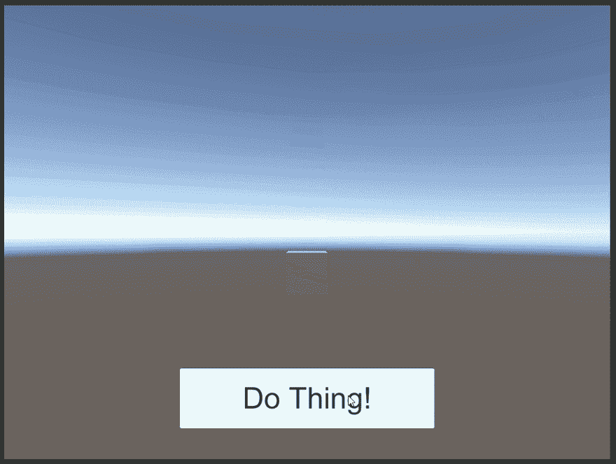T3】](https://res.cloudinary.com/practicaldev/image/fetch/s--EtetIgbb--/c_limit%2Cf_auto%2Cfl_progressive%2Cq_66%2Cw_880/https://thepracticaldev.s3.amazonaws.com/i/ezx55jlvb38zuksm8l3f.gif)

与我在 Godot 中习惯使用的系统相比，这感觉像是一个非常长的方法，有一个笨拙的工作流程。但是，至少我终于知道如何制作动画了。