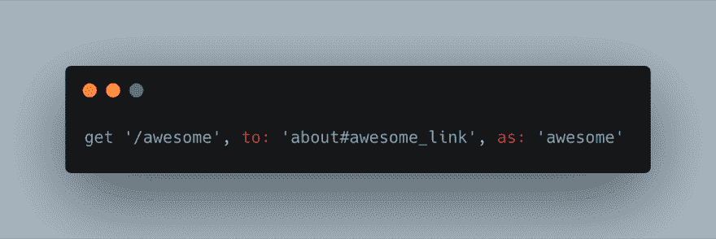

# 简单工作代码>工作代码

> 原文：<https://dev.to/aritdeveloper/simple-working-code-working-code-48oc>

最近，我的任务是创建一个重定向，从我公司的 Rails 应用程序重定向到一个具有相当长的 URL 的外部网页。

首先，我在页面的控制器中创建了一个动作:

接下来，我为所述动作添加了一条路线:

然后我在页面中调用路线:

在审查代码时，我的队友建议我创建一个返回 URL 的*助手方法，然后在视图中调用助手:*

* * *

管制员的行动是不必要的，多余的，麻烦的。实现 helper 方法是如此简单、整洁和直接。
一些代码可以工作，但这并不能免除对这些代码的改进。