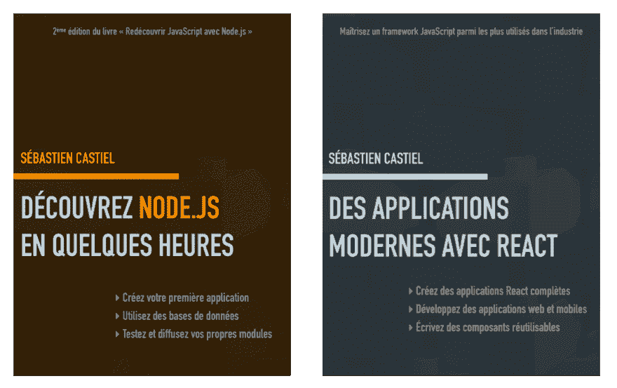
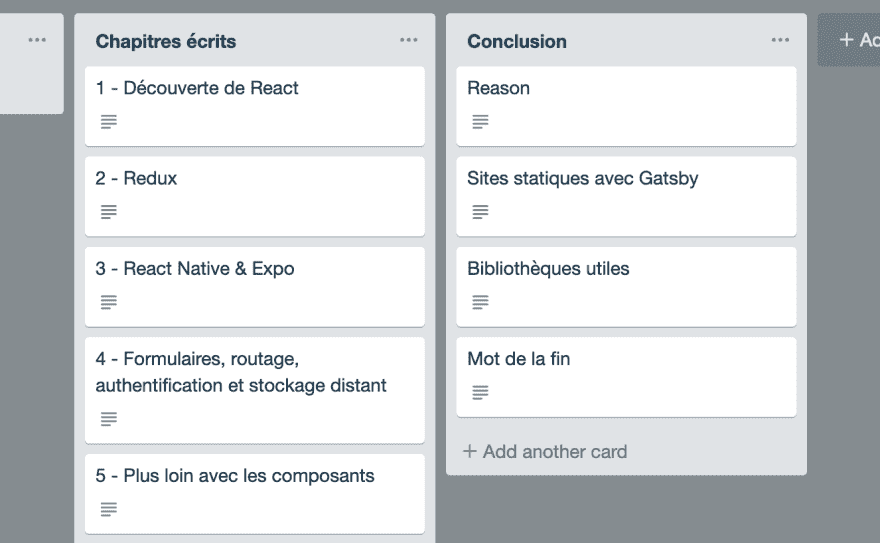
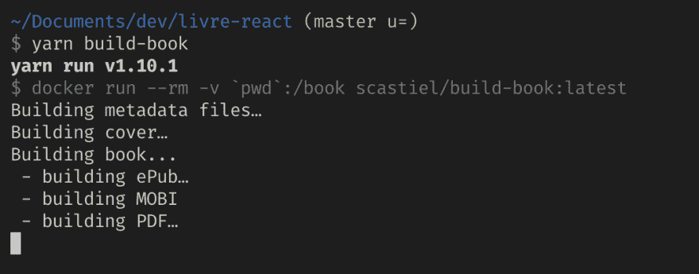
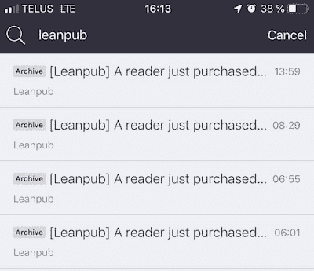

# 所以我写了一本技术书😁

> 原文：<https://dev.to/scastiel/so-i-wrote-a-technical-book--1hpa>

对我来说重要的一周:我完成了用法语写的关于 React 的电子书，我感到无比自豪。八个月，很不容易，但很值得。在这篇文章中，我想揭示一些关于当你写一本技术书籍时会发生什么的想法。

## 为什么？从构思到动笔

实际上这不是我的第一本电子书，几年前我已经写过一本关于 Node.js 的了。但它要小得多，我决定在这个新项目上投入更多的精力。

 

<figure>

<figcaption>我的第一本电子书(左)和新的一本(右)。

<figure>

<figcaption>
</figcaption>

</figure>

我趁机做了类似的封面！</figcaption>

T13】</figure>

我喜欢写技术文章(在[我的博客](https://blog.castiel.me)或 Dev.to 等其他平台上)，我一直想再写一本书。几年来，React 一直是我最喜欢的技术，幸运的是，几乎没有关于它的法语书籍。我知道每一个(法语)开发者都不一定精通英语，所以我确信拥有法语书籍和文章也是很重要的。

所以这个选择并不难做出:一本关于 React 的书可能真的在某个地方被某个人需要！

## 发布进行中的内容

从一开始，我就想一章一章地把我写好的内容发表出来。我认为这是一个好机会:

*   获得读者的反馈；
*   被阅读你的作品并信任你的人所激励。

出于这些原因，我选择了 LeanPub 平台，因为它将这一理念融入了其核心。我不能说我收到了很多读者的反馈，但是只有少数人信任你并购买你未完成的书，这是一个巨大的动力和能量来源🙂

## 该谈些什么？

开始时，这个问题很容易回答:我想写第一章关于 React *基础知识*(组件、状态、JSX 等)。)，第二个关于 Redux，第三个关于 React Native 和 Expo。但是接下来的就没那么容易了。

我不想展示可能在几个月后被弃用的库，或者只需要一个快速教程就可以使用的库。我想写一些有用的实践，供大量 React 开发人员使用。

 

<figure>

<figcaption>Trello 揭示了自己是一个组织内容思想的优秀工具。

<figcaption>
</figcaption>

</figcaption>

T10】</figure>

例如，我可以写一章关于 GraphQL 的内容，那将会有很多内容可以讨论。或者也许盖茨比写静态网站。我更喜欢在第四章中讨论在很多应用程序中都能找到的几个概念:表单、路由、认证和访问远程 API。当然，我必须选择库(分别是 Formik、React-Router 和 Firebase)，但是我真的希望我描述的实践可以应用到其他库或服务中。

## 视觉方面的重要性

LeanPub 提供了一个很好的工作流程来出版一本书。基本上你可以使用 Markdown 编写，推送到 Git 库，ePub，PDF 和 MOBI 文件会自动生成。我开始用这个工作流程写作，但是很快我发现自己对内容的视觉方面要求很高，尤其是 PDF。

 

<figure>

<figcaption>一个非常定制和优化的工作流程。

<figcaption>
</figcaption>

</figcaption>

T10】</figure>

所以我创建了自己的工作流程来将 Markdown 文件转换成 ePub 和 PDF，多亏了 [Pandoc](https://pandoc.org/) 我对结果非常自豪。这不是一件容易的事，也需要时间，但我知道我将能够在未来的潜在书籍中重复使用一切。也许我会写一篇关于这个工作流程的完整文章，这样其他技术作者也可以从中受益。

## 那么现在呢？

现在我的书可以在 LeanPub 和亚马逊上买到了，我在第一个 coupe of days 上卖了几本，太棒了！我在等一些评论，评论，建议…

 

<figure>

<figcaption>这几天我最喜欢的邮件！

<figcaption>
</figcaption>

</figcaption>

T10】</figure>

我还用法语开了一个博客， [MasterReact.io](https://www.masterreact.io) ，这将是对这本书的一个很好的补充:所有编程水平的教程，新特性等。甚至还有书中的一些摘录。

我的目标是继续在那里张贴文章，也许为第二版写新的材料。React 变化非常快，我真的想知道一个新的 React 介绍(我的第一章)是否可以从一开始就集成钩子，而不是类组件。

如果有一天你考虑写一本技术书籍，我真的很乐意回答你的问题(当然你应该，特别是如果你喜欢写技术文章)。请随时在评论中提问😉

*这篇文章最初发表在我的博客上。谢尔盖·佐尔金在 Unsplash 拍摄的照片。*