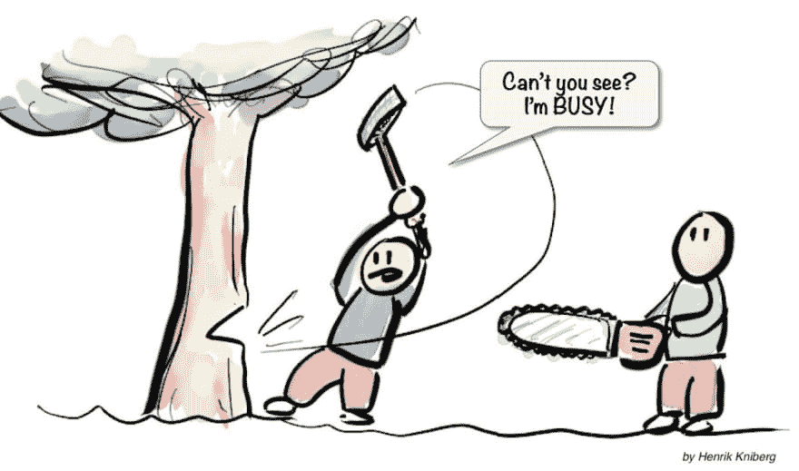

# 软件开发人员的效率:如何评价和提高？

> 原文：<https://dev.to/riter/software-developer-s-efficiency-how-to-evaluate-and-improve-5332>

我知道我现在是在向唱诗班说教，但是好的程序员和坏的程序员的区别在于效率。当我们听到“效率”这个词时，首先想到的是在实现特定功能上花费的时间。例如，当一个开发人员在三天内做了一件事，而另一个开发人员在六天内做了一件事，那么少量的算术计算就会发现，第一个开发人员的效率是第二个开发人员的两倍，不是吗？

不要！这个标准只有在短期内是正确的，在长期发展中是完全错误的。

测试开发人员表现的正确方法是看他如何处理几个典型的(重复的)任务。相同类型的每个下一个任务必须花费越来越少的时间。您可以尝试推导出减少下一个任务执行时间的特定公式，并使用它来评估和比较您团队中开发人员的效率。所谓开发者的效率比。嗯，举个例子，下一个相同类型的任务应该比前一个少花两倍的时间。当然，直到某一天。

## 变得更加高效

我们可以谈论很多关于如何实现效率收益和加速开发过程的问题。这一次，我们将为您提供几个类比，供您思考。

你还记得关于磨利斧头和砍伐森林的习语吗？一个抽象的开发者没有时间磨斧子，因为他忙着砍柴。

问题是显而易见的，但解决方案并不总是那么简单。这里有一个反面——过早磨利斧头。当磨利斧头的成本显然会因砍伐森林的速度而得到回报时，斧头就需要磨利了。

要查看它，您需要:

1.  用一把钝斧子找出砍伐森林的速度。为此，在进行任何优化之前，您需要至少执行一次该任务。在此之前，不需要实现单独的库和引入额外的抽象。

2.  了解斧头的特性，知道磨快后会发生什么。最初编写的内联解决方案，构建在当前的架构中，将完全清楚地说明您以后可以替换和重构的内容和位置。

3.  知道下次你需要磨斧子的时候。不可能一下子把所有的代码都完全打磨好，但也从来没有必要。重构时，每次只关注特定的任务要好得多。你的目标是下次缩短这个特定任务的开发时间，比如说，两次。

还有另一个类似的流行的习语。它是这样说的:“花一整天的时间造一架能在五分钟内飞到目的地的飞机，比花一整天的时间试图跑到那里要好。”但是“斧子”和“飞机”这两个成语描述的是不同的情况。“ax 习语”讲述的是同一类型的不同任务，而“飞机习语”——讲述的是同一任务中的常规流程。

最初发表于 [Riter 敏捷博客](https://riter.co/blog)。